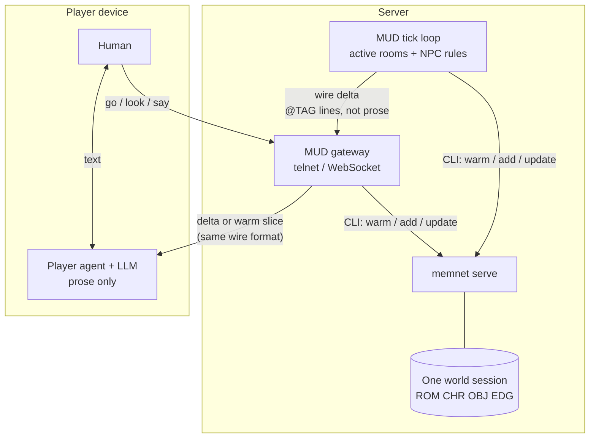
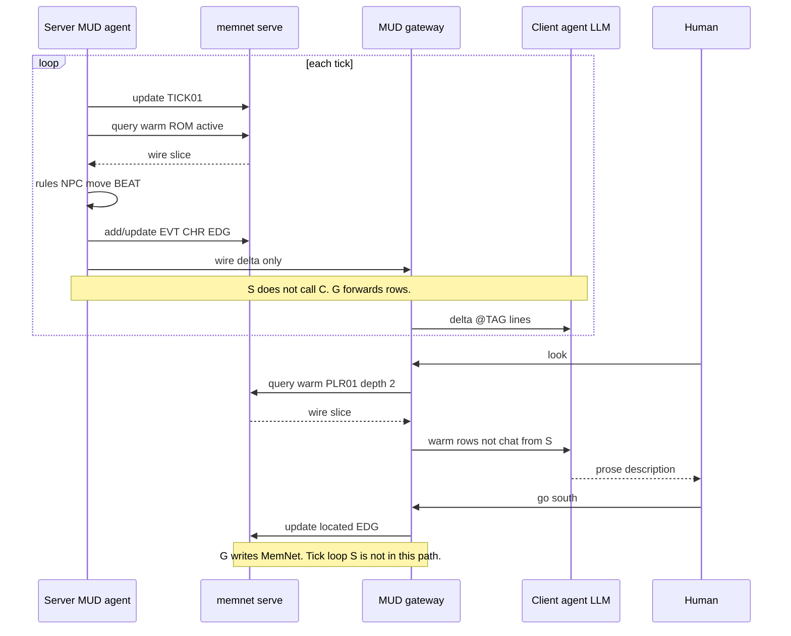

# LLM MUD — A MemNet Application Note

**Application example (documentation only).** This file is a self-contained *pattern* for a **multiplayer text MUD** backed by MemNet — not part of the engine. It uses **Lewis Carroll's *Alice's Adventures in Wonderland*** (1865, public domain) as the sample world: riverbank, White Rabbit, rabbit-hole, hall of doors, *Drink Me* bottle.

**MemNet (engine)** — holds the **shared world graph** on the server (`memnet serve`). Every `query warm` prepends `@LAW:` rows and returns a **local subgraph** from the anchor. Row count can grow large (100k–1M atomised nodes + EDGs); warm stays small if you anchor on the player's current `@ROM`.

**This example (application)** — **two orchestrators**:

| Side | Job | LLM? |
|------|-----|------|
| **Server MUD agent** | Monitor **active rooms**, run ticks, NPC movement, combat maths, quest state | Optional (usually **rules only**) |
| **Client player agent** | `query warm` (or receive **delta**), **generate room prose** for one human | **Yes** (user-side) |

Use **“MUD tick loop”** on the server when you want to avoid implying an LLM peer — it is a **process** that calls MemNet, same as the gateway, not a conversational partner for the player agent.

**No sentences in graph rows** (`LAW-ATOM01`). Room descriptions, NPC dialogue, and *look* output are generated **on the client** from warm wire data. The server stores keys, codes, attrs, and EDG wiring only.

**Document map:** § Split architecture → tiered atomisation → **Part A** schema → **Part B** Wonderland seed → **Part C** server + client commands → **Part D** worked beats (deterministic `go`, client `look`, server tick) → scale & load test → pitfalls → quick-start → diagrams.

---

## Split architecture (server graph, client prose)

**They do not talk agent-to-agent.** The diagram shows **two separate callers** of the same `memnet serve` process, plus a **gateway** that moves **wire rows** (commands in, deltas out). The server tick loop is rules + MemNet I/O — not an LLM chatting with the player LLM.



| What you might think | What actually happens |
|----------------------|------------------------|
| Server agent → player agent message | **No.** Server pushes **graph deltas** (`@CHR` status change, `@EDG` move, new `@EVT`). |
| Player agent → server agent message | **No.** Player sends **verbs**; gateway writes **MemNet rows** (`located`, `held_by`, `@CMD`). |
| Shared truth | **MemNet graph** — both sides read/write via `memnet serve`, never each other's LLM context. |
| Player prose | **Client LLM only** — converts warm/delta rows into text the human reads. |

**Three processes, one graph:**

1. **`memnet serve`** — holds the world; serialises writes per session.
2. **MUD tick loop** (server) — finds active `@ROM`, calls MemNet, emits **deltas** to the gateway. Usually **no LLM**.
3. **MUD gateway** — accepts player connections; forwards commands to MemNet; fans out deltas to clients in the same room; may proxy `query warm` or let clients call MemNet through a tunnel.
4. **Player agent** (client) — runs LLM on **warm stdout or delta** for `look` / flavour; optional for `go` / `get`.

There is **no** arrow labelled “orchestrator asks player agent” or vice versa — only **MemNet wire data** through the gateway.

---

## Tiered atomisation (static world vs live beat)

Atomising everything to `@EVT` / `@COST` / extra FACT rows **inflates row count** (a 40k-room map can reach ~1M rows). **`query warm` still works** — it only traverses the anchor neighbourhood — but RAM and snapshots grow.

| Layer | Atomise? | Typical rows | Example |
|-------|----------|--------------|---------|
| **Static map** | **Minimal** | ~2–4 per `@ROM` | `@ROM` + `exit` EDGs + optional `contains` OBJ |
| **Persistent NPC / item** | **Medium** | ~3–6 each | `@CHR` + `located` / `inventory` EDGs |
| **Live beat** (fight, riddle, chase) | **Full** | ~15–30 transient | `@BEAT` + `@EVT` + `@COST` + EDG web; `delete_on_settle` when done |

**Static room (lean — copy this pattern for the map bulk):**

```text
@ROM: ROM04|hall_of_doors|underground|lit|persistent
@EDG: E40|ROM04|exit|west|ROM03||persistent
@EDG: E41|ROM04|exit|east|ROM05||persistent
@EDG: E42|ROM04|contains|OBJ01||persistent
```

**Live beat (rich — only while something is happening):**

```text
@BEAT: BT01|rabbit_chase|flee|delete_on_settle
@EVT: EVT01|flee|NPC02|ROM01|late|delete_on_settle
@EDG: E50|ROM01|active|BT01||delete_on_settle
@EDG: E51|BT01|features|NPC02||delete_on_settle
```

---

## The two loops

### Server loop (world simulation)

Not the novel-writer 6-step pipeline — shorter and **no prose**:

1. **Select active anchors** — rooms with at least one `@CHR` `located` edge, or an unsettled `@BEAT`.
2. **Read** — `query warm --anchor ROMxx --depth 2` per active room (or batch by `@REG` zone).
3. **Decide** — deterministic rules (movement tables, timers, combat). Optional small server LLM for NPC dialogue only.
4. **Persist** — `add`/`update` wire lines; settle finished `@BEAT` / `@EVT` rows.
5. **Notify** — send changed row ids + fields to clients in that room (delta channel).
6. **Sleep** — tick interval (e.g. 1s); repeat.

Track tick position with a persistent `@TICK` row: `@TICK: TICK01|42|ROM01|persistent` (`n` = tick count, `focus` = last primary room processed).

### Client loop (one player)

| Command kind | Server | Client LLM |
|--------------|--------|------------|
| `go east` | Move `located` EDG after validating `exit` | Optional one-line confirm |
| `get bottle` | Update `contains` / inventory EDGs | No |
| `look` | No (or re-warm) | **Yes** — expand warm slice to prose |
| `say hello rabbit` | Record `@CMD` or `@BEAT` if dialogue state machine | **Yes** — NPC reply text |
| After server delta | — | **Yes** — "You notice the White Rabbit hurry past…" |

---

## Part A: Schema (user tag map)

```text
@REG: id|key|phase|recycle
@ROM: id|key|zone|flags|recycle
@LORE: id|name|kind|code|recycle
@RULE: id|name|scope|code|recycle
@CHR: id|name|role|attr|status|recycle
@OBJ: id|name|kind|state|recycle
@QUEST: id|key|stage|goal|progress|status|recycle
@BEAT: id|key|phase|recycle
@CMD: id|actor|verb|target|code|recycle
@TICK: id|n|focus|recycle
@EVT: id|type|actor|focus|code|recycle
@COST: id|subject|kind|site|recycle
@BOND: id|left|right|delta|code|recycle
```

| Tag | Role |
|-----|------|
| `REG` | Zone shard (`surface`, `underground`) for tick scoping |
| `ROM` | Room marker: `key` + `zone` + `flags` (`lit`, `dark`, `active`) — **no description text** |
| `CHR` | Player (`role=plr`) or NPC (`role=npc`); `attr` holds Curiosity, Size, etc. |
| `OBJ` | Items; `state` = `idle`, `held`, `empty`, … |
| `BEAT` | Transient scene beat (chase, riddle, shrink/grow trial) |
| `CMD` | Last parsed command record (audit / NPC reactivity) |
| `TICK` | Server tick counter + focus room |
| `EVT` / `COST` / `BOND` | Outcome atoms for live beats |
| `LORE` / `RULE` / `QUEST` | Canon facts and quest keys (codes only) |

**Domain LAW rows (seed with the world):**

```text
@LAW: LAW-ATOM01|*|on_add|no_sentences|break_to_nodes_edges
@LAW: LAW-MUD01|ROM|on_turn|anchor|warm_anchor_rom_or_plr
@LAW: LAW-MUD02|*|on_add|no_prose|client_generates_descriptions
@LAW: LAW-MUD03|CHR|on_move|validate|exit_edg_must_exist
```

`LAW-MUD02` reminds **both** agents: prose is never stored in `@ROM` / `@CHR` fields.

EDG relations in this note: `exit`, `located`, `contains`, `held_by`, `set_in`, `features`, `active`, `caused`, `applies_to`, `governs`, `reg_in`.

---

## Part B: Initial seed (*Wonderland* — opening region)

Five rooms, Alice, White Rabbit, *Drink Me* bottle, hall-of-doors quest hook. Static topology is **lean**; no beat atoms until something happens.

After `session open` with the Part A map:

```text
@LAW: LAW01|EDG|on_context|hide|settled_edg_unless_anchor
@LAW: LAW02|*|on_add|unique|one_id_add_then_update
@LAW: LAW03|EDG|on_add|validate|src_dist_exist_first
@LAW: LAW04|*|on_add|use_backslash|backslash_pipe_not_bare
@LAW: LAW-ATOM01|*|on_add|no_sentences|break_to_nodes_edges
@LAW: LAW-MUD01|ROM|on_turn|anchor|warm_anchor_rom_or_plr
@LAW: LAW-MUD02|*|on_add|no_prose|client_generates_descriptions
@LAW: LAW-MUD03|CHR|on_move|validate|exit_edg_must_exist

@TICK: TICK01|0|ROM01|persistent

@REG: REG01|surface|day|persistent
@REG: REG02|underground|fall|persistent

@LORE: LO01|wonderland|logic|size_matter|persistent
@LORE: LO02|bottle|label|drink_me|persistent
@LORE: LO03|garden|door|tiny_key|persistent

@RULE: RULE01|carroll|tone|whimsical_not_cute|persistent
@RULE: RULE02|size|mechanic|drink_shrink_eat_grow|persistent

@QUEST: QST01|garden|1|reach_garden|hall_doors|active|persistent

@ROM: ROM01|riverbank|surface|lit|persistent
@ROM: ROM02|rabbit_hole|surface|dark|persistent
@ROM: ROM03|fall_shaft|underground|dark|persistent
@ROM: ROM04|hall_of_doors|underground|lit|persistent
@ROM: ROM05|garden_door|underground|lit|persistent

@CHR: PLR01|Alice|plr|Cur:10|Size:norm|idle|persistent
@CHR: NPC02|White_Rabbit|npc|Cur:8|Size:norm|hurried|persistent

@OBJ: OBJ01|drink_me|bottle|full|persistent
@OBJ: OBJ02|eat_me|cake|whole|persistent
@OBJ: OBJ03|tiny_key|key|idle|persistent

@EDG: R01|ROM01|reg_in|REG01||persistent
@EDG: R02|ROM03|reg_in|REG02||persistent
@EDG: R03|ROM04|reg_in|REG02||persistent
@EDG: E01|ROM01|exit|south|ROM02||persistent
@EDG: E02|ROM02|exit|down|ROM03||persistent
@EDG: E03|ROM03|exit|down|ROM04||persistent
@EDG: E04|ROM04|exit|west|ROM03||persistent
@EDG: E05|ROM04|exit|east|ROM05||persistent
@EDG: E06|ROM04|contains|OBJ01||persistent
@EDG: E07|ROM04|contains|OBJ02||persistent
@EDG: E10|PLR01|located|ROM01||persistent
@EDG: E11|NPC02|located|ROM01||persistent
@EDG: E12|ROM04|set_in|LO03||persistent
@EDG: E13|OBJ01|set_in|LO02||persistent
@EDG: E14|PLR01|governs|RULE01||persistent
@EDG: E15|ROM04|governs|RULE02||persistent
@EDG: E16|QST01|features|ROM05||persistent
```

*MemNet IO: **~520 tok** stdin · ~45 rows · one-time seed.*

Alice starts on the **riverbank** (`PLR01` → `ROM01`); White Rabbit is in the same room.

---

## Part C: Orchestrator command-level view

### Server MUD agent (beside `memnet serve`)

```powershell
# Every tick: advance counter, pick an active room
memnet update --stdin @"
@TICK: TICK01|1|ROM01|persistent
"@
memnet query warm --anchor ROM01 --depth 2 --max-rows 40
# ... rules decide NPC move, new BEAT, etc. ...
memnet update --stdin @"
@CHR: NPC02|White_Rabbit|npc|Cur:8|Size:norm|fled|persistent
@EDG: E11|NPC02|located|ROM02||persistent
"@
# Push delta (E11, NPC02 status) to clients in ROM01 and ROM02
```

*MemNet IO per active room per tick: **~10 tok** stdin (TICK) · **~280–380 tok** stdout (warm, ~18–25 rows · incl. **~140 tok** LAW).*

**Active room discovery (orchestrator logic, not MemNet):** maintain a set of `ROM` ids where at least one `located` CHR edge exists, plus any room with an unsettled `@BEAT`. Do **not** scan all 1M rows with `read list --where` each tick — update the set when players move or beats start/end.

### Client player agent

```powershell
# After login: where am I?
memnet query warm --anchor PLR01 --depth 2 --max-rows 30
# Or anchor ROM from gateway cache: ROM01
```

Warm returns LAW + Alice's CHR + riverbank ROM + exits + White Rabbit + LORE/RULE if EDG-linked.

**Client LLM prompt (conceptual):** "Convert these `@TAG:` rows into a second-person *look* description. Do not invent ids or objects not in the slice. Tone: RULE01 `whimsical_not_cute`."

**Deterministic move (server gateway — no LLM):**

```powershell
# Player typed: go south  (ROM01 → ROM02)
memnet update --stdin @"
@CMD: CMD01|PLR01|go|south|ROM02|delete_on_settle
@EDG: E10|PLR01|located|ROM02||persistent
@CHR: PLR01|Alice|plr|Cur:10|Size:norm|idle|persistent
"@
```

*MemNet IO: **~25 tok** stdin · orchestrator only.*

---

## Part D: Worked beats

### Beat 1 — Player `go south` (deterministic)

Alice follows the White Rabbit toward the hole. **No client LLM required.**

**Before:** `PLR01` `located` → `ROM01`.

**Server validates:** `E01|ROM01|exit|south|ROM02` exists.

**Persist:**

```text
@CMD: CMD01|PLR01|go|south|ROM02|delete_on_settle
@EDG: E10|PLR01|located|ROM02||persistent
```

**Client optional:** print `You go south.` or run a short LLM blurb from warm.

---

### Beat 2 — Player `look` (client agent + warm)

**Client:**

```powershell
memnet query warm --anchor ROM02 --depth 2 --max-rows 30
```

**Warm excerpt (abbreviated):**

```text
@LAW: LAW-MUD02|*|on_add|no_prose|client_generates_descriptions
@ROM: ROM02|rabbit_hole|surface|dark|persistent
@CHR: PLR01|Alice|plr|Cur:10|Size:norm|idle|persistent
@EDG: E01|ROM01|exit|south|ROM02||persistent
@EDG: E02|ROM02|exit|down|ROM03||persistent
@EDG: E10|PLR01|located|ROM02||persistent
```

*MemNet IO: **~300 tok** stdout (~15 rows + LAW).*

**Client LLM output (human reads this; not stored in MemNet):**

> The rabbit-hole goes straight on like a tunnel, then dips suddenly down. The sides are lined with cupboards and book-shelves; maps and pictures hang on pegs. You are still close enough to the riverbank that a patch of daylight falls behind you. The way **down** is open.

---

### Beat 3 — Server tick: White Rabbit flees (active MUD action)

Alice is in `ROM02`; Rabbit was in `ROM01`. Server tick processes **ROM01** (still active because Rabbit was there — or Rabbit still listed until moved).

**Server warm on ROM01:**

```powershell
memnet query warm --anchor ROM01 --depth 2
```

**Rules output:** NPC02 status `hurried` → `fled`; move `located` to `ROM02` (same as Alice — chase beat).

**Persist:**

```text
@BEAT: BT01|rabbit_chase|pursuit|delete_on_settle
@EVT: EVT01|flee|NPC02|ROM01|late|delete_on_settle
@CHR: NPC02|White_Rabbit|npc|Cur:8|Size:norm|fled|persistent
@EDG: E11|NPC02|located|ROM02||persistent
@EDG: E50|ROM01|active|BT01||delete_on_settle
@EDG: E51|BT01|caused|EVT01||delete_on_settle
@EDG: E52|BT01|features|NPC02||delete_on_settle
```

*MemNet IO: **~35 tok** stdin (update batch) · not sent to client LLM as prose.*

**Delta to clients in ROM01 / ROM02:** `{ "EVT01", "NPC02", "E11", "BT01" }`.

**Client agent for Alice (in ROM02):** receives delta → LLM:

> A waistcoat-pocket flash of white — the White Rabbit bursts into the tunnel mouth behind you, muttering about lateness. He does not seem to notice you yet.

Alice did not type anything; the **server agent** changed the graph; the **client agent** narrated it.

---

### Beat 4 — Player `get drink_me` in hall of doors (graph + optional LLM)

Alice in `ROM04`; `OBJ01` on table via `contains`.

**Server:**

```text
@CMD: CMD02|PLR01|get|OBJ01|held|delete_on_settle
@OBJ: OBJ01|drink_me|bottle|held|persistent
@EDG: E20|PLR01|held_by|OBJ01||persistent
@EDG: E06|ROM04|contains|OBJ01||delete_on_settle
```

Per `RULE02`, a later beat may add `@COST` / `@CHR` `Size:shrunk` when consumed — full atomisation only at **live beat**, not in static seed.

---

## Scale, capacity, and load test

| Topic | Guidance |
|-------|----------|
| **Row cap** | Default `MEMNET_MAX_ROWS=5000` is too low for large maps. Set e.g. `$env:MEMNET_MAX_ROWS = "2000000"` on the server. |
| **RAM** | ~1M atomised rows ≈ **~3 GB** (order of magnitude); warm reads stay local. |
| **Players** | One world = **one session**; shared lock on `memnet serve`. |
| **Load test** | `python scripts/load_test_mud.py` — see results below. |

**Sample results** (`scripts/load_test_mud.py`):

| Scenario | Throughput | Warm p95 | Hint |
|----------|------------|----------|------|
| 1k rooms, 20 workers, burst | ~5,900 ops/s | ~7 ms | Lock saturates before RAM |
| 5k rooms, 50 workers, burst | ~1,700 ops/s | ~149 ms | Contention rises |
| 20 workers, **3 s think** | ~9 ops/s | <1 ms | **~20 casual players** comfortable |

Raise player count with **region sharding** (`@REG` → separate sessions) or when read/write locking improves.

---

## Pipeline-aware pitfalls

- **Storing room descriptions on `@ROM`** → 1M-row bloat + token disaster. Fix: `LAW-MUD02`; client LLM only.
- **Server generating prose** → doubles cost; breaks client-personalised voice. Fix: server emits deltas; clients narrate.
- **Full atomisation on static map** → row count explodes. Fix: tiered model (Part B lean `ROM` pattern).
- **Global `read list --where` each tick** → O(all rows). Fix: track active room set in the gateway.
- **Skipping warm on client `look`** → hallucinated furniture. Fix: always anchor `ROM` or `PLR` depth 2.
- **Two players, one `located` EDG** → last write wins. Fix: one EDG per CHR; server serialises moves.
- **Forgetting to settle `@BEAT` / `@CMD`** → stale warm clutter. Fix: `delete_on_settle` when beat ends.
- **Client `add` prose blobs** → corrupts graph. Fix: client sends **commands** only; server validates and writes codes.
- **Reusing seed EDG ids** → `id_exists`. Fix: mint `E20+` / `E50+` for runtime wiring (Part D).

---

## Quick-start

```powershell
# Terminal 1 — world server
$env:MEMNET_MAX_ROWS = "100000"
memnet serve

# Terminal 2 — open world session
@'
@REG: id|key|phase|recycle
@ROM: id|key|zone|flags|recycle
@LORE: id|name|kind|code|recycle
@RULE: id|name|scope|code|recycle
@CHR: id|name|role|attr|status|recycle
@OBJ: id|name|kind|state|recycle
@QUEST: id|key|stage|goal|progress|status|recycle
@BEAT: id|key|phase|recycle
@CMD: id|actor|verb|target|code|recycle
@TICK: id|n|focus|recycle
@EVT: id|type|actor|focus|code|recycle
@COST: id|subject|kind|site|recycle
@BOND: id|left|right|delta|code|recycle
'@ | Out-File -Encoding utf8 $env:TEMP\wonderland.map.txt

memnet session open --map-file $env:TEMP\wonderland.map.txt
# set MEMNET_SESSION from stderr

# Paste Part B seed via memnet add --stdin @" ... "@

# Server tick loop (your MUD agent) — warm active rooms, update, push deltas
memnet query warm --anchor ROM01 --depth 2

# Client — player look (run LLM locally on the warm stdout)
memnet query warm --anchor PLR01 --depth 2
```

---

## Diagram — Server tick + client narration



---

**This file is one documented application example.** Use it as a template for LLM-flavoured MUDs on MemNet: shared world on the server, prose on the client, server agent for active rooms and ticks. For the single-player novel pipeline see `application-notes/llm-novel-writer.md`; for engine behaviour see `LLM-GUIDE.md`.
