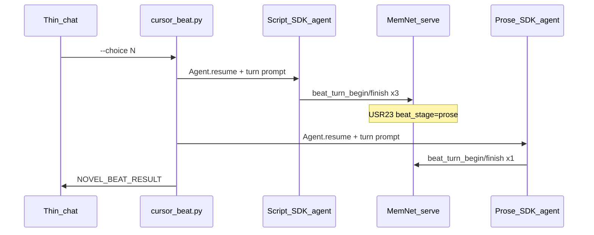

# MemNet novel — Cursor SDK dual-loop runner

Operator SSOT for interactive play. Graph / LAW reference: [`llm-novel-writer.md`](llm-novel-writer.md). Chat rule: [`.cursor/rules/novel-writer.mdc`](../.cursor/rules/novel-writer.mdc).

## Dual-loop architecture

Each player input runs **one** `cursor_beat.py` invocation with **two independent, persistent** Cursor SDK agents:

| Agent | Role | Pipeline stages | Persists in |
|-------|------|-----------------|-------------|
| **Script** | 編劇 — graph wires | `oln` → `sbd` → `scr` | `novel-output/<slug>/agents/script_agent_id.txt` |
| **Prose** | 作者 — player text | `prose` only | `novel-output/<slug>/agents/prose_agent_id.txt` |



**Handoff contract:** MemNet graph only — `USR23|beat_stage|prose|` and committed `@SCR`. Agents do not pass story state to each other directly.

**LAW-G11 (`db_before_prose`):** Prose agent runs only after script agent commits wires.

## Prerequisites

1. `pip install -e ".[mcp,novel-mcp]"`
2. `pip install -r applications/novel_cursor/requirements.txt`
3. `memnet serve` (`127.0.0.1:18765`)
4. `$env:CURSOR_API_KEY`
5. Cursor model: **kimi-k2.5**

## Persistent SDK sessions

| Rule | Detail |
|------|--------|
| First beat / `--reset-agents` | `Agent.create` + role primer → save id |
| Later beats | `Agent.resume(id)` + turn prompt only |
| MCP on resume | Re-pass `inline_mcp_servers(memnet_session)` every time |
| Never | `Agent.create` both agents on every beat when id files exist |

## Per-beat flow (orchestrator)

1. `script_beat_prepare(session, choice|steering|continue)`
2. Script agent: run until `USR23=prose` (retry once on handoff failure → exit 4)
3. `prose_beat_prepare(session)` — gate: must be `prose`
4. Prose agent: one prose finish → fenced JSON
5. `NOVEL_BEAT_RESULT` + `last_beat.json`

## CLI

```powershell
python applications/novel_cursor/cursor_beat.py --app <slug> [--session ID] (--choice N | --steering TEXT | --continue) [flags]
```

| Flag | Effect |
|------|--------|
| `--choice N` | Options 1–6; script then prose |
| `--steering TEXT` | Free steering |
| `--continue` | Mid-beat: `sbd`/`scr` → script from stage; `prose` → prose only |
| `--script-only` | Script phase only |
| `--prose-only` | Prose phase only (`USR23=prose`) |
| `--reset-agents` | Delete agent id files; recreate on next run |
| `--stream` | SDK stderr stream |

### Exit codes

| Code | Meaning |
|------|---------|
| 0 | Success |
| 1 | Serve down / SDK error |
| 2 | Bad args / prepare gate |
| 3 | Prose JSON unparseable |
| 4 | Script handoff failed |

### Output

```text
NOVEL_BEAT_RESULT	{"exit_code":0,"session":"mn_…","app_id":"…","prose":"…","options":[…],"hud":"…","snapshot_saved":true,"snapshot_file":"…","beat_stage":"oln"}
```

## MCP tools (debug)

| Tool | Phase |
|------|-------|
| `script_beat_prepare` | Before script agent |
| `prose_beat_prepare` | After handoff |
| `player_beat_prepare` | Deprecated alias for script prepare |
| `beat_turn_begin` / `beat_turn_finish` | Called by SDK agents, not chat |

## Chat contract

- Shell **one** `cursor_beat.py` per player input
- Display prose agent result only (【劇情】+ 選項 + HUD)
- Lifecycle: `serve_status`, `session_load`, `session_save`, `read_get`, `update`

## 新開局 checklist (no rollback)

1. `python scripts/novel_bootstrap.py application-notes/novel-<slug>-initial-state.md`
2. Write `novel-output/<slug>/session_id.txt`
3. Optional: archive old `novel-output/<slug>/`
4. First beat: `--reset-agents --choice N`
5. Name gate if `USR03` 未定

Do **not** repair old snapshots or drifted chapters.

## Troubleshooting

| Symptom | Fix |
|---------|-----|
| Exit 4 handoff | Re-run; check script agent stderr `--stream`; verify `USR23` |
| Stale agent id | `--reset-agents` |
| Plot drift | Script turn must honour `continuation_anchor` from chapter file |
| Slow | Two SDK resumes per beat (~bridge startup); agents avoid full recreate |
| `CURSOR_API_KEY` missing | Cursor dashboard → Integrations |

## Related

- [`applications/novel_cursor/README.md`](../applications/novel_cursor/README.md)
- [`applications/shenjia_caifa/README.md`](../applications/shenjia_caifa/README.md)
