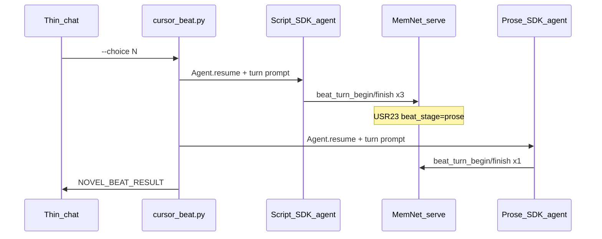

# MemNet novel — Cursor SDK dual-loop runner

Operator SSOT for interactive play. Graph / LAW reference: [`llm-novel-writer.md`](llm-novel-writer.md). SEED rules: [`novel-seed-spec.md`](novel-seed-spec.md). Chat rule: [`.cursor/rules/novel-writer.mdc`](../.cursor/rules/novel-writer.mdc).

## Dual-loop architecture

Each player input runs **one** `cursor_beat.py` invocation with **two independent, persistent** Cursor SDK agents:

| Agent | Role | Pipeline stages | Persists in |
|-------|------|-----------------|-------------|
| **Script** | 編劇 — graph wires | `oln` → `sbd` → `scr` | `novel-output/<slug>/agents/script_agent_id.txt` |
| **Prose** | 作者 — player text | `prose` only | `novel-output/<slug>/agents/prose_agent_id.txt` |



**Handoff contract:** MemNet graph only — `USR23|beat_stage|prose|` and committed `@SCR`. Agents do not pass story state to each other directly.

**LAW-G11 (`db_before_prose`):** Prose agent runs only after script agent commits wires.

## Shared session (one graph, many consumers)

`memnet serve` holds **one session id = one graph**. It is shared — not forked per MCP or per agent.

| Consumer | Same `session` id |
|----------|-------------------|
| `memnet-mcp` | `session_*`, `read_get`, ad-hoc `add`/`update` **between** beats |
| `novel-mcp` | `beat_turn_begin` / `beat_turn_finish` (canonical per-beat read + commit) |
| `cursor_beat.py` | `run_memnet` in-process (no second graph) |
| SDK agents | `inline_mcp_servers(memnet_session)` on every `Agent.resume` |

| Handle | Role |
|--------|------|
| `novel-output/<slug>/session_id.txt` | **Pointer** to the shared session — not the graph itself |
| `@USR15` in graph | Snapshot path for `session_load(..., keep_id=true)` |
| Chat threads / agent ids | Voice memory only — **not** plot SSOT |

**Rules:**

- Pass the **same** id to memnet-mcp and novel-mcp; never `session open` a second graph for “novel only”.
- One story instance → one session; different stories → different ids on the same serve process.
- **Same beat turn:** no memnet `query warm` alongside `beat_turn_begin`; no memnet `add`/`update` after `begin` and before `finish`.
- Optional: `MEMNET_SESSION` in `mcp.json` to pin id across MCP restarts ([`llm-build-on-memnet.md`](llm-build-on-memnet.md) §8).

## Prerequisites

1. `pip install -e ".[mcp,novel-mcp]"`
2. `pip install -r applications/novel_cursor/requirements.txt`
3. `memnet serve` (`127.0.0.1:18765`)
4. `$env:CURSOR_API_KEY`
5. Cursor model: **kimi-k2.5**

## Persistent SDK sessions

| Rule | Detail |
|------|--------|
| First beat / `--reset-agents` | `Agent.create` + role primer → save id |
| Later beats | `Agent.resume(id)` + turn prompt only |
| MCP on resume | Re-pass `inline_mcp_servers(memnet_session)` every time |
| Never | `Agent.create` both agents on every beat when id files exist |

## Per-beat flow (orchestrator)

1. `script_beat_prepare(session, choice|steering|continue)`
2. Script agent: run until `USR23=prose` (retry once on handoff failure → exit 4)
3. `prose_beat_prepare(session)` — gate: must be `prose`
4. Prose agent: one prose finish → fenced JSON
5. `NOVEL_BEAT_RESULT` + `last_beat.json`

## CLI

```powershell
python applications/novel_cursor/cursor_beat.py --app <slug> [--session ID] (--choice N | --steering TEXT | --continue) [flags]
```

| Flag | Effect |
|------|--------|
| `--choice N` | Options 1–6; script then prose |
| `--steering TEXT` | Free steering |
| `--continue` | Mid-beat: `sbd`/`scr` → script from stage; `prose` → prose only |
| `--script-only` | Script phase only |
| `--prose-only` | Prose phase only (`USR23=prose`) |
| `--reset-agents` | Delete agent id files; recreate on next run |
| `--stream` | SDK stderr stream |

### Exit codes

| Code | Meaning |
|------|---------|
| 0 | Success |
| 1 | Serve down / SDK error |
| 2 | Bad args / prepare gate |
| 3 | Prose JSON unparseable |
| 4 | Script handoff failed |

### Output

```text
NOVEL_BEAT_RESULT	{"exit_code":0,"session":"mn_…","app_id":"…","prose":"…","options":[…],"hud":"…","snapshot_saved":true,"snapshot_file":"…","beat_stage":"oln"}
```

## MCP tools (system test / SDK agents only)

Not for operator chat play — use `cursor_beat.py` instead.

| Tool | Phase |
|------|-------|
| `script_beat_prepare` | Before script SDK agent (`cursor_beat` orchestrator) |
| `prose_beat_prepare` | After script handoff (`cursor_beat` orchestrator) |
| `player_beat_prepare` | Deprecated alias for script prepare |
| `beat_turn_begin` / `beat_turn_finish` | Called by SDK agents inside `cursor_beat.py`, or CI/system tests |

Warm reads use `max_rows=150` (`NOVEL_WARM_MAX_ROWS`) so truncated warm does not drop `USR21` prose advisory.

## Chat contract

- Shell **one** `cursor_beat.py` per player input — **never** hand-commit beats via MCP from chat
- Display prose agent result only (【劇情】+ 選項 + HUD)
- Lifecycle on the **shared** session: `serve_status`, `session_load`, `session_save`, `read_get`, `update` (e.g. name gate)
- `query_warm` only for resume/display — not in the same beat turn as `beat_turn_begin`

## 新開局 checklist (no rollback)

1. `python scripts/novel_bootstrap.py --app <slug>` → `session_id` + `player_setup`
   - Optional LLM expand: `--expand-catalog` or instance `expand_catalog: true`
   - `--expand-target 80` `--expand-seed 42` `--no-expand-catalog` to override json
2. Id written to `novel-output/<slug>/session_id.txt`
3. **God-realm setup (chat):** each turn `read_player_setup` → follow `setup_guidance.next_action`; `commit_player_profile` + `commit_opening_pick` ×3
4. **CI shortcut:** `cursor_beat.py --app <slug> --setup --name … --gender 男|女 --arts ART01,ART02,ART04`
5. When `setup_complete` → first beat: `cursor_beat.py --app <slug> --choice 1`

Do **not** repair old snapshots. Do **not** open a second MemNet session for the same story.

### `read_player_setup` / `next_action`

| `next_action` | Chat |
|---------------|------|
| `narrate_open` | 【神域】開場（USR64 例句） |
| `commit_player_profile` | 玩家已給名+性別 → MCP commit |
| `narrate_library` | 靈魂圖書館帶過（不可選） |
| `pick_neigong` / `pick_martial` / `pick_qinggong` | 神域三幕 + catalog 選項 |
| `commit_opening_pick` | 玩家選 ART → MCP commit |
| `narrate_transmigration` | 魂穿收束 |
| `start_play` | `--choice 1` 進匠坊【劇情】 |

## Troubleshooting

| Symptom | Fix |
|---------|-----|
| Exit 4 handoff | Re-run; check script agent stderr `--stream`; verify `USR23` |
| Stale agent id | `--reset-agents` |
| Plot drift | Script turn must honour `continuation_anchor` from chapter file |
| Two sessions / desync | One bootstrap id everywhere; reload snapshot with `keep_id=true` |
| Slow | Two SDK resumes per beat (~bridge startup); agents avoid full recreate |
| `CURSOR_API_KEY` missing | Cursor dashboard → Integrations |

## Related

- [`application-notes/novel-seed-spec.md`](novel-seed-spec.md)
- [`applications/novel_cursor/README.md`](../applications/novel_cursor/README.md)
- [`applications/shenjia_caifa/README.md`](../applications/shenjia_caifa/README.md)
