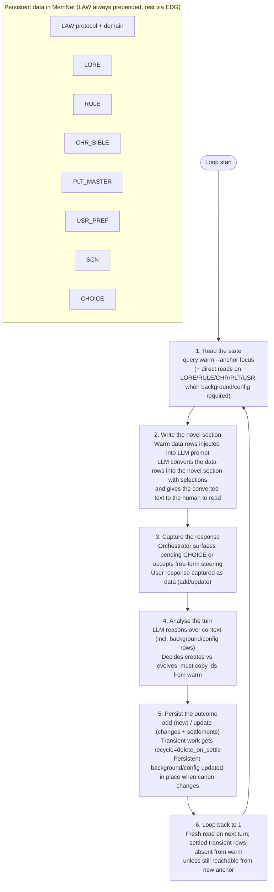

# LLM Novel-Style RPG — A MemNet Application Note

**Application example (documentation only).** This file is a self-contained *pattern* for one domain — interactive novel-style RPGs — not part of the MemNet engine. It shows how you might combine MemNet primitives (`query warm`, fixed **LAW** / **EDG**, user-defined tags, `add`/`update`, settlement) with an orchestrator and an LLM. Copy or adapt the schema; other projects may use different tags and outputs.

**MemNet (engine)** — always provides `@LAW:` and `@EDG:`, prepends all LAW rows on every warm read, and stores whatever tags you declare in your map.

**This example (application)** — declares `@LORE`, `@RULE`, `@CHR`, `@ITEM`, `@QUEST`, `@PLT`, `@USR`, `@SCN`, `@CHOICE`. In step 2 the orchestrator injects the warm data rows into the LLM prompt; the LLM converts those data rows into the novel section with selections (reader-facing narrative prose in novel style + the choice/selection description the player sees and picks from) and the orchestrator gives the converted text to the human to read. Structural outcomes (the rows that will feed future conversions — updated character attributes, consumed or gained items, quest progress, companion relationships, new scenes) are recorded in the graph in step 5.

The human experiences the game as reading (and choosing inside) a living novel. The prose is rich, immersive, and literary. Underneath, the graph is the single source of truth for the RPG state: your character's attributes and skills, inventory, active quests, companion bonds, and world facts are many small rows. Most state enters warm only when the current scene or choice reaches it via EDG or direct anchor. **All `@LAW:` rows are always prepended**, so the LLM cannot miss the pipeline discipline or project constraints.

No external character sheets, no hidden system prompts, no "the model will remember the numbers." The graph is the character sheet and the world model. The session can be snapshotted and resumed with `session save` / `session load`.

**At a glance (for skimming or partial LLM reads)**

- The 6-step pipeline used by the orchestrator + LLM in *this* example, plus the role of LAW rows as the always-prepended machine-readable contract.
- Schema you declare in your map (Part A) and the LAW vs RULE vs USR distinction (do not confuse them).
- Complete starting seed block (Part B) — copy this after `session open`.
- What the orchestrator must do (command-level view).
- Three worked turns showing the full cycle: in step 2 the orchestrator injects the warm data rows; the LLM converts those data rows into the novel section with selections and gives it to the human to read → human responds (selection or steering) → orchestrator records the outcome in the graph (step 5) so future warm reads have the memory. (Harry Potter / Philosopher's Stone era, novel-style RPG.)
- Snapshot / resume, pipeline-aware pitfalls, copy-paste quick-start, and a Mermaid diagram of the loop.

## The 6-Step Pipeline (this example's repeating loop)

This is the orchestrator + LLM loop **used in this application note**. The worked turns below follow these steps. Other application notes (e.g. SysML modeling) reuse the same MemNet mechanics with different tags and deliverables.

1. **Read the state** — selective `query warm --anchor <focus>` (in this example: current SCN/CHR/CHOICE/QUEST, or direct anchors on LORE/RULE/CHR/ITEM/PLT/USR when background, inventory or quest state is required). Use `--depth` and EDG links to pull only connected reference material. Never rely on prior chat messages for facts or numbers.

2. **Write the novel section** — the orchestrator takes the `query warm` output (the data rows: always-prepended LAW rows + whatever the anchor and EDGs reach: LORE, RULE, CHR with its current attr and status, ITEMs, QUEST progress, SCN, CHOICE, EDG, etc.) and **injects those data rows into the LLM prompt** together with user steering. In this example, **in step 2 the LLM converts the data rows into the novel section with selections** that is given to the human to read: reader-facing narrative prose in novel style (immersive, literary, describing the situation, your attempted action, the narrated outcome, the emotional and mechanical cost, and the new situation) plus, when the beat reaches a decision point, the choice/selection description (the prompt text and the list of numbered options the player sees and can pick from). The warm data rows are the source of truth (your current Courage 3, Charms 2, the Wiggenweld potion still in your pocket, Hermione's relationship at "wary"); the LLM turns them into the readable novel page the human consumes right now. The orchestrator records the structural outcome of the turn (updated @CHR attr or status, @ITEM count reduced, @QUEST progress advanced, new/updated @SCN and @CHOICE rows, settlements, wiring) later in step 5 so the next warm read carries the updated character sheet and world. MemNet itself does not generate prose or selections; the orchestrator + LLM do the conversion using the warm data rows as input.

3. **Capture the response** — the human has just read the novel section (narrative prose + choice/selection description) produced in step 2. The orchestrator surfaces any pending **CHOICE** or accepts free-form steering from the human in response to what they read. The user's input or selection is recorded as first-class data (usually by `add` or `update` of a choice/decision row).

4. **Analyse the turn** — after the human's selection or steering has been captured as first-class data in step 3 (e.g. a chosen option on a CHOICE row, or free-form prompt), the orchestrator performs **additional targeted reads** from the memStore. Typical reads in this phase: re-anchor on the now-resolved CHOICE (to see the exact player words), anchor on the primary CHR that will be affected, on the RULEs that govern costs or behaviour, on the QUEST, on any ITEMs or other state the choice touches. The LLM uses these reads (plus the original context) to determine precisely **how the player's specific input interacts with the current rows** — what state changes are licensed, what mechanical costs or relationship shifts occur, what new transient records (new SCN, updated status, settlements) are required, and what must be left untouched. Only after this read-heavy analysis does it emit a precise plan of *row mutations*. The analysis phase itself does not write; it is the determination step. Step 5 is where the memStore is actually updated.

5. **Persist the outcome** — this is the phase that actually mutates the graph. The orchestrator emits the node and edge operations determined in step 4, using MemNet's graph language (the wire format of `@TAG:` rows for nodes and `@EDG:` rows for directed named edges). New nodes are created with `add`; existing nodes and edges are changed with `update`. Transient nodes/edges (SCN, CHOICE, most active wiring) are settled with `recycle=delete_on_settle`. Persistent nodes (CHR with its attr, ITEM counts, QUEST progress, RULE, LORE) are only mutated when the player's actions legitimately change the world model. Step 5 speaks the graph language to the memStore.

6. **Loop** — return to step 1. The next turn begins with a fresh read. Settled transient rows disappear from `query warm` (unless still connected to the new anchor).

### LAW as the pipeline contract (for the LLM)

The six steps above describe the **orchestrator loop** (CLI calls, user I/O, ingest). **LAW rows** are the complementary piece: the **always-on reasoning contract** the LLM sees in every warm read — procedure and graph discipline encoded in the graph itself, not buried in chat history or a hidden system prompt.

| Role | Who runs it | What it does |
|------|-------------|--------------|
| **Orchestrator** | Your script or agent | Executes steps 1–6: `query warm`, surfaces user input, runs `add`/`update`, optional prune |
| **LAW rows** | MemNet prepends them | Tells the LLM **how** to reason and which wire-line rules to obey when emitting changes |
| **Warm slice** | MemNet + anchor/EDG | Supplies **what** is true this turn (SCN, LORE, RULE, …) |

**How the core LAWs map to the pipeline:**

| Step | LAW support |
|------|-------------|
| 1 Read | **LAW02** — ids in warm output are authoritative; never invent ids from chat |
| 2 Write | Engine prepends **all** LAW rows; orchestrator injects the data rows (warm output) into the LLM prompt. In this example, **in step 2 the LLM converts those data rows into the novel section with selections** and gives it to the human to read. |
| 3 Respond | Orchestrator records steering as rows (e.g. CHOICE); optional domain LAW can require "record human choice as data, not prose only" |
| 4 Analyse | Additional targeted reads on the captured player input (the chosen CHOICE, affected CHR, relevant RULEs, QUEST, etc.) to determine exactly how the selection interacts with the graph; produce the mutation plan; domain LAWs still apply |
| 5 Persist | Emit the actual graph mutations (nodes + edges) in wire format; **LAW02** (add vs update), **LAW03** (edge endpoints), **LAW04** (escaping); domain LAWs still constrain what is legal to write |
| 6 Loop | **LAW01** — settled transient EDGs/rows drop from warm unless anchor touches an endpoint |

**Domain LAW rows** extend the same pattern for project-specific procedure that must never be skipped — e.g. `LAW-HP01` for "when resolving a skill challenge or spell in year 1, the consequence text and any new CHOICE must explicitly reference the acting character's relevant attr or skill value from the governing CHR row; do not invent success chances or numeric outcomes not licensed by the warm context". You may add explicit turn-discipline rows if the model drifts off the loop:

```text
@LAW: LAW-PIPE01|turn_loop|on_turn|read_warm|anchor current SCN or CHOICE; cite only ids from warm output; emit add/update wire lines not prose-only state|persistent
```

Keep LAW rows **short and procedural**. Story voice belongs in **RULE**; operator knobs in **USR**. This note's markdown pipeline is documentation for humans; **LAW is the machine-readable contract the LLM actually receives every turn.**

After heavy settlement, optionally run `housekeep prune recyclable --apply` to physically remove settled rows and free cap space. Reference material (LORE facts, RULE constraints, focused CHR bibles/facets, master PLT, USR prefs) is never settled away.

**Persistent vs transient (quick legend)**

- **Persistent** (survives settlements): LORE, RULE, CHR, PLT, USR, domain LAW rows. Most appear in warm **only when the anchor or EDG reaches them** — except **LAW (all rows), which are always prepended with no EDG required**. Other persistent types typically need EDG (or a direct anchor) to enter warm.
- **Transient** (settle with `delete_on_settle` when done): SCN, CHOICE, active beat work, and most transient EDGs.

## Part A: Schema (the user tag map)

This is the map you feed to `memnet session open --map-file`. It defines only the *user* tags for this domain. Fixed tags **EDG** and **LAW** are always present and do not appear here. See **LAW vs RULE vs USR** below for how LAW (fixed) differs from RULE (your schema).

```text
@LORE: id|name|kind|text|recycle
@RULE: id|name|scope|text|recycle
@CHR: id|name|role|attr|backstory|status|recycle
@ITEM: id|name|kind|uses|text|recycle
@QUEST: id|title|stage|goal|progress|status|recycle
@PLT: id|title|phase|summary|status|recycle
@USR: id|key|value|recycle
@SCN: id|title|summary|text|recycle
@CHOICE: id|scn|prompt|options|chosen|recycle
```

## LAW vs RULE vs USR (do not confuse them)

Both LAW and RULE are “rules” in plain English. In this note they are **different tags with different jobs**.

| | **LAW** (fixed tag) | **RULE** (your schema) | **USR** (your schema) |
|--|---------------------|------------------------|------------------------|
| **Governs** | The **graph** and **how rows may exist** (ids, edges, wire format) + **hard project structure** (e.g. "when resolving a challenge, cite the acting skill value from the CHR row") | The **story**: voice, magic, pacing, world logic | **Your preferences** as the operator: length, POV style |
| **In every `query warm`?** | **Yes** — engine prepends **all** LAW rows | **No** — only if EDG-linked or you anchor on it | **No** — same as RULE |
| **Needs EDG to appear in warm?** | **No** — engine prepends all LAW rows | **Yes** — EDG-linked or direct anchor | **Yes** — same as RULE |
| **Optional EDG (bookkeeping)** | `@EDG: LAW-HP01\|governs\|SCN01` (audit which scenes obeyed the stat-cite rule) | `@EDG: CHR01\|governs\|RULE02` | `@EDG: SCN01\|influences\|USR01` |
| **Engine enforcement** | Partly (e.g. LAW02 duplicate id on `add`) | Prompt discipline only | Prompt discipline only |
| **Example** | LAW02: one id per row; LAW-HP01: year-1 challenges must cite the acting attr/skill from CHR | RULE01: choices define the wizard | USR01: `scene_length=spare` |

**Decision guide — which tag?**

1. If breaking it would corrupt **ids, EDGs, or ingest** → **LAW** (and consider a domain LAW if the model must see it **every turn** before `add`).
2. If it is **how the story should read or how the world (or magic) works in fiction** → **RULE**, wire with EDG from scenes/characters that need it.
3. If it is **your steering preference** (not in-universe canon) → **USR**, not RULE.

**Why not put story craft in LAW?** You could, but every LAW row lands in **every** warm read forever — token cost adds up. RULE stays out of context until a linked scene or character needs it.

**Why LAW-HP01 is not a RULE:** the "cite acting skill/attr from CHR on every year-1 challenge resolution" rule must be visible **before every skill test or spell** in year 1; the engine does not enforce it. LAW guarantees the constraint is never skipped — **no EDG required**.

**LAW rows need no EDG.** The `@LAW:` row alone is enough; every `query warm` prepends it. Optional `constrains` (or similar) EDGs are for **graph bookkeeping** — listing which nodes were minted under a domain LAW, auditing, or traversing from LAW → instances. They do **not** control whether the LAW text appears in context.

EDG relations used in this example (seed a few at start or use `--allow-new-relation` when genuinely new): `set_in`, `features`, `governs`, `constrains`, `continues`, `resolves`, `costs`, `influences`.

**EDG rows — the explicit wiring for selective context**

EDG is a *fixed, built-in tag* (always available; never declared in your map). It models directed, named links between any rows:

```
@EDG: E99|SRC_ID|relation|DST_ID|optional_attrs|recycle
```

**Core function in the pipeline:**
- They are how you declare "this scene is *set_in* this lore", "this character *features* here", "this rule *governs* that character", "this beat *costs* this person". Optionally, "this domain LAW *constrains* this NPC" — for audit and traversal only; the LAW row is already in every warm read without that link.
- `query warm --anchor <focus> --depth N` traverses EDG links to pull in *only* the connected persistent background, bibles and rules the current focus needs. Without the right EDGs, anchoring on a SCN or CHOICE would return almost nothing but the prepended LAW rows (core invariants plus any domain constraints such as id rules) + the anchor itself.
- LAW01 (`edge_recycle`) keeps the warm slice clean: most transient EDGs (and the rows they point to) are hidden from context unless the anchor is at src or dist.
- You manage them with the same `add`/`update` discipline as nodes (copy ids from warm; use `--allow-new-relation` only for genuinely new relation verbs). They are first-class data, not implicit "the LLM will remember the connection".

In short: EDG is the mechanism that makes "read only what the anchor can reach" reliable and deterministic for long-running work.

**LAW rows — protocol and structural constraints (always on)**

LAW is a *fixed, built-in tag* (not in your map). **Every** `query warm` prepends **all** LAW rows before the anchored slice. They are not optional background.

```
@LAW: id|name|cycle|mechanism|constraint
```

The four **core** LAWs (MemNet engine — seed in every project):

```text
@LAW: LAW01|edge_recycle|on_context|hide|delete_on_expire and delete_on_settle EDG unless anchor touches src or dist
@LAW: LAW02|node_id|on_add|unique|one row per global id use add then update same tag only
@LAW: LAW03|edge_endpoints|on_add|validate|prefer src and dist to reference existing node ids before settle
@LAW: LAW04|field_escape|on_add|use_backslash|pipe inside one field value is backslash pipe not bare pipe
```

**Core function in the pipeline:**

See **LAW as the pipeline contract (for the LLM)** above for the orchestrator vs LAW split and step mapping. In brief:

- LAW02 (`node_id`) is the reason you must read first, copy the exact id, and use `add` only for truly new things (or `update` for existing). It is enforced at ingest.
- LAW01 (`edge_recycle`) and LAW03 (`edge_endpoints`) work with EDG to keep warm slices clean and wiring sound.
- LAW04 protects the wire format itself.

**Domain LAW rows (project-specific, still always prepended)**

Beyond LAW01–04, add **domain** LAW rows for constraints that must govern **how you create rows** and must never be missed — e.g. required references or "when resolving a year-1 challenge, cite the acting character's skill/attr value from the CHR row in the consequence text". They use the same `@LAW:` tag and appear in **every** warm read, same as the core four.

Example in this note: in year 1, when you (the player character) face a skill test or spell, the new SCN or CHOICE text must explicitly name the relevant value from your CHR row (e.g. "your Charms 2") and the narrated outcome must feel consistent with it. We seed a persistent domain LAW row (`LAW-HP01`) that states the rule — that alone ensures the constraint is in **every** warm read. When you reach the final door, the analysis step reads the prepended LAW-HP01 and ensures the prose and the choice options cite your current Charms (or Courage, or the Wiggenweld boost) rather than inventing a free success. The row (and any EDG) is added in the same disciplined batch as any other work for the turn.

**Optional:** you may also wire a `constrains` or `governs` EDG from the LAW row to the specific scene or to the friend who is named.

```
@EDG: E06|LAW-HP01|governs|SCN01||persistent
```

(The src is the LAW-HP01 row; dist is the scene that obeys it; the edge is persistent so the link survives settlement.)

If you add these links, they help with:
- `query warm --anchor LAW-HP01 --depth 1` surfacing the scenes that obeyed the rule
- Traversing from a scene back to the governing LAW for audit
- Keeping "this constraint applied here" as first-class graph data rather than only in the LLM's head

Skip the EDG entirely if you only need the rule text every turn and do not care about traversable instance lists.

In short: **LAW** = “how nodes are allowed to exist in the graph” (always visible, no EDG needed). **Optional EDG** = which specific scenes or characters were created under a domain LAW.

**RULE rows — story craft (on demand only)**

RULE is a *user tag* from your map. Each row is one **narrative** constraint: voice, magic rules, pacing, tone. RULE rows are **not** prepended globally — they enter warm only when:

- an **EDG** links them from the current anchor (e.g. `CHR01|governs|RULE02`), or
- you **anchor directly** on the RULE (as Turn 3 does on `RULE02`).

```
@RULE: id|name|scope|text|recycle
```

Examples from the seed: grim tone (`voice`), power costs (`magic`), scene economy (`pacing`). **Do not** put operator prefs here — use **USR** (`USR01|scene_length|concise`). **Do not** put id format or graph mechanics here — use **LAW**.

When canon changes (Turn 3), **update** the existing RULE row in place; cite its id from warm output.

**Background is many small pieces, referred only when needed**

Because persistent material is many small rows, the warm slice for each turn contains only what the focus needs — **plus all LAW rows**. In the seed you see LORE01/LORE02, three RULE rows, four core LAWs + LAW-HP01, the player CHR with its current attr, a starting ITEM, the active QUEST, etc. RULE01 appears in Turn 1 because `CHR01|governs|RULE01` is wired; RULE03 may stay out until a scene links it. Anchor directly on a RULE (Turn 3) when you need to edit canon without traversing from a scene.

## Part B: Initial Seed (complete starting state)

Copy the block below (or extract it via heredoc) and feed it to `memnet add --stdin` after opening the session with the schema above. This populates the graph with *all* initial data as many small pieces: the LORE facts, RULE constraints, the core LAWs plus domain LAW constraints (the "cite acting attr/skill from CHR on year-1 challenges"), the player CHR with starting attributes, companion CHRs, a starting consumable ITEM, the active QUEST, PLT arc, USR prefs, the opening scene, *and the EDG links that wire the scene (and later scenes) to only the reference rows they need*. Persistent rows use `persistent` (or omit the field); the opening scene (and its transient links) are marked for settlement so they drop out of warm once resolved.

```text
@LAW: LAW01|edge_recycle|on_context|hide|delete_on_expire and delete_on_settle EDG unless anchor touches src or dist
@LAW: LAW02|node_id|on_add|unique|one row per global id use add then update same tag only
@LAW: LAW03|edge_endpoints|on_add|validate|prefer src and dist to reference existing node ids before settle
@LAW: LAW04|field_escape|on_add|use_backslash|pipe inside one field value is backslash pipe not bare pipe
@LAW: LAW-HP01|year1_challenges|on_turn|stat_cite|In year 1, when a challenge or spell is resolved, the new SCN text or CHOICE prompt must explicitly name the acting character's relevant attr or skill value from the governing CHR row (e.g. "your Charms 2") and the outcome must be consistent with that value. Do not invent success chances or numeric outcomes not licensed by warm context.|persistent

@LORE: LORE01|Philosopher's Stone|artifact|The only known source of the Elixir of Life. Nicolas Flamel's creation. If Voldemort obtains it he can return to full power this year.|persistent
@LORE: LORE02|Voldemort's servant|threat|Professor Quirrell is possessed. He is in the castle and closing in on the Stone.|persistent

@RULE: RULE01|Choices define the wizard|theme|"It is our choices, Harry, that show what we truly are, far more than our abilities." — Albus Dumbledore|persistent
@RULE: RULE02|Magic has a toll|risk|When the acting skill is low the prose must show risk, backlash or a personal cost even on a narrated 'success'. The lower the number, the more the scene should feel precarious.|persistent
@RULE: RULE03|One clear change|structure|One irreversible change of state, knowledge, item or relationship per scene. End on consequence or a decision that matters.|persistent

@CHR: CHR01|You|protagonist|Courage:3|Wit:4|Charms:2|Stealth:3|You are a first-year who arrived at Hogwarts hoping to belong. Your wandwork is shaky under pressure. You have a small circle of friends and a fierce desire to prove you are not just 'the new one'.|unhurt|persistent
@CHR: CHR02|Harry Potter|ally|brave|scarred|The Boy Who Lived. Parents murdered by Voldemort. First year. Wants a family more than anything. The Mirror shows him what he has lost. Trusts you more than he lets on.|persistent
@CHR: CHR03|Hermione Granger|ally|brilliant|loyal|Your brilliant friend this year. Values rules and professors. Would rather go to Dumbledore than risk everything alone. Will help — but she remembers when you lean on her.|persistent

@ITEM: ITM01|Wiggenweld potion|consumable|1|A small vial of healing draught. Steadying when drunk before a risky spell or confrontation.|persistent

@QUEST: QST01|The Stone Before He Claims It|1|Reach the Philosopher's Stone and stop Quirrell before he can use it this year.|At the final warded door with Harry and Hermione. Quirrell is on the other side.|active|persistent

@PLT: PLT01|The Stone This Year|year-1|Voldemort must not get the Philosopher's Stone. If he does, he returns in force before any of you have the strength or knowledge to stop him.|active|persistent

@USR: USR01|scene_length|spare|persistent
@USR: USR02|voice|close-second-wonder|persistent

@SCN: SCN01|The Final Door|You, Harry and Hermione stand before the last protective enchantment between you and the chamber that holds the Stone. Quirrell's voice is a low mutter on the other side. The ward on the door reacts badly to poor wandwork.|You grip your wand. Harry is tense beside you; Hermione's hand hovers near her own. The door is old oak banded with iron, and a faint silver tracery of the locking ward pulses across it. One clean unlocking charm should open it without noise. Fail, and the ward may spark, cry out, or bite the caster. Your Charms is still only 2. The Wiggenweld in your pocket could steady a shaking hand. Hermione would do it perfectly if asked. You have seconds before the servant inside notices something is wrong.|delete_on_settle

@EDG: E01|SCN01|set_in|LORE01||persistent
@EDG: E02|SCN01|features|CHR01||persistent
@EDG: E03|SCN01|features|CHR02||persistent
@EDG: E04|SCN01|features|CHR03||persistent
@EDG: E05|CHR01|governs|RULE01||persistent
@EDG: E06|SCN01|features|ITM01||persistent
```

## The 6-Step Pipeline (command-level view, this example)

**Orchestrator responsibilities (the harness around the LLM in this novel-style RPG pattern):**
- Always begin the turn with a read (step 1).
- Inject exactly the warm data rows (plus user steering) as the LLM context (step 2). In this example, **in step 2 the LLM converts the data rows into the novel section with selections** (narrative prose in novel style + choice/selection description) and gives that text to the human to read.
- Step 5 is where the graph is mutated in graph language: the orchestrator sends the exact node rows (`@CHR:`, `@SCN:`, `@RULE:`, `@ITEM:`, `@QUEST:`, etc.) and edge rows (`@EDG:`) that step 4 decided must exist or change. This is the only place the in-memory graph (nodes + directed named edges) is written to.
- Capture the human's response after they read the novel section (step 3).
- In step 4 (analyse), after capture, issue further targeted reads on the player's input (the chosen CHOICE row, the CHR(s) it affects, the RULEs that govern the interaction, QUEST progress, etc.). Use these reads to let the LLM determine exactly how this specific selection/prompt should affect the graph (which nodes change, which edges must be added or settled).
- In step 5, emit the graph operations (node and edge mutations) in MemNet's wire language. The commands sent (`memnet add --stdin`, `memnet update --stdin`) are statements that create or modify nodes (`@CHR:`, `@SCN:`, `@RULE:`, etc.) and edges (`@EDG:`). Step 5 is where the graph itself is updated.
- After settlement, optionally prune; always start the next turn with a fresh read.

The LLM never "remembers" ids or facts across turns. It only ever sees what step 1 + 2 put in front of it.

## Part D: Worked Turns (the pipeline in action)

Three compact turns. Each is shown strictly as the six numbered steps. Warm output excerpts include the prepended `@LAW:` rows (core invariants plus any domain constraints). All ids are copied from the warm/context output. Transient rows are settled with `delete_on_settle` when their work is done. One turn demonstrates a legitimate update to a persistent RULE when the story changes the world's "canon." Turn 1 also demonstrates obeying a domain LAW constraint (LAW-HP01) when resolving a year-1 challenge — the prose and choices must cite the acting attr/skill from the player CHR; it **optionally** adds a `governs` EDG from LAW-HP01 to SCN01 for graph bookkeeping (the LAW row itself needs no link to appear in warm). The example is a novel-style RPG: the human reads immersive prose that feels like a book page; the graph holds the character sheet, inventory, quests and relationships as first-class rows.

### Turn 1 — The First Hard Choice

**Human steering (feeds step 2 + 3):** "You, Harry and Hermione are at the final warded door. Quirrell is close on the other side. Give the player a real, costly choice that respects the current Charms 2 and the Wiggenweld in inventory. Do not resolve it yet."

**Step 1 — Read the state**
```
memnet query warm --anchor SCN01 --depth 2 --max-rows 30
```

**Step 2 — Write the novel section**
```
@LAW: LAW01 edge_recycle on_context hide delete_on_expire and delete_on_settle EDG unless anchor touches src or dist
@LAW: LAW02 node_id on_add unique one row per global id use add then update same tag only
@LAW: LAW03 edge_endpoints on_add validate prefer src and dist to reference existing node ids before settle
@LAW: LAW04 field_escape on_add use_backslash pipe inside one field value is backslash pipe not bare pipe
@LAW: LAW-HP01 year1_challenges on_turn stat_cite...
@LORE: LORE01|Philosopher's Stone|artifact|...
@LORE: LORE02|Voldemort's servant|threat|...
@RULE: RULE01|Choices define the wizard|theme|...
@RULE: RULE02|Magic has a toll|risk|...
@RULE: RULE03|One clear change|structure|...
@CHR: CHR01|You|protagonist|Courage:3|Wit:4|Charms:2|Stealth:3|...|unhurt|persistent
@CHR: CHR02|Harry Potter|ally|brave|...|persistent
@CHR: CHR03|Hermione Granger|ally|brilliant|...|persistent
@ITEM: ITM01|Wiggenweld potion|consumable|1|...|persistent
@QUEST: QST01|The Stone Before He Claims It|1|...|active|persistent
@SCN: SCN01|The Final Door|You, Harry and Hermione stand before the last protective enchantment...|...|delete_on_settle
@EDG: E01|SCN01|set_in|LORE01||persistent
@EDG: E02|SCN01|features|CHR01||persistent
@EDG: E03|SCN01|features|CHR02||persistent
@EDG: E04|SCN01|features|CHR03||persistent
@EDG: E05|CHR01|governs|RULE01||persistent
@EDG: E06|SCN01|features|ITM01||persistent
```

**Novel section given to the human (what the reader/player reads right now)**

> You stand with Harry and Hermione before the warded door. The silver tracery pulses like a slow heartbeat. On the other side Quirrell's voice is a cold thread of sound. Your wand feels too light in your hand. You know your Charms is only 2 — under pressure the charm can sputter, the ward can bite, the noise can bring the servant running before you are ready.
>
> Hermione's fingers hover near her own wand. Harry's eyes flick to the small vial in your pocket and back to your face. He gives the smallest of nods.
>
> What do you do?
>
> 1. Attempt the unlocking charm yourself (your Charms is 2; the prose will show the risk and any backlash or shaky partial success).
> 2. Ask Hermione to cast it (she will almost certainly succeed cleanly, but it will cost trust — she will remember that you asked her to take the risk for you).
> 3. Drink the Wiggenweld first to steady your hand and nerves (consume the item; the prose will show the brief steadiness it lends your Charms 2 attempt).

**Remark:** In step 2 the LLM converts the warm data rows shown above (plus the steering) into this novel section with selections. The blockquoted text is what the human is given to read. The data rows are the input (your current Charms 2, the single Wiggenweld, Hermione's relationship state, the active quest, the warded door); the readable novel page + choice description is the output the human consumes at this point in the turn. No graph update has happened yet.

**Human selects (step 3 — concrete example)**

"I choose 1."  (or "1. Attempt the unlocking charm yourself..." or the full text)

The orchestrator captures the human's exact words ("I choose 1.") as the user input. In this turn's step 5 the selection is resolved against the numbered options and stored on the CHOICE node (with the full chosen text plus a short consequence note). The graph mutations that follow from the choice (CHR status, new outcome scene node, cost/relationship edges, settlement of the prior door scene and the choice itself) are also applied in this turn's Step 5 using node and edge rows in the wire format. The consequence novel section the human reads (the shaky cast, the bite, the yield, the personal price) is produced by a step 2 that uses the recorded choice as steering — either in the same cycle (once the selection is known) or the immediate follow-on cycle.

**Step 3 — Capture the response (detailed)**
The human has just read the novel section above. That section was produced in step 2 by the LLM converting the preceding warm data rows into reader-facing novel prose plus the three numbered selection options that respect the RPG state (your Charms 2, the item, the companion relationship).

The orchestrator records the human's exact selection (the number "1", resolved to the full option text) as first-class data on the CHOICE node. In this example the choice row is resolved (chosen value + consequence note) and the downstream graph mutations (node and edge updates) are applied in this same turn's Step 5. The human's words also become part of the steering for the step 2 that produces the reader-facing consequence prose (the novel section the human actually reads).

**Step 4 — Analyse the turn**
"Warm (ids + current values copied exactly):
- CHR01: Courage:3|Wit:4|Charms:2|Stealth:3|...|unhurt
- ITM01: uses=1 (Wiggenweld)
- QST01: stage=1, status=active
- SCN01, RULE02 (toll on low skill), LAW-HP01 (must cite acting value)
- Companions CHR02/03 present via features EDGs.

Row mutations (no prose outcome written here):
- CHOICE01: add, resolves=SCN01, prompt=..., options=[1. cast self (cite Charms 2 + risk), 2. ask Hermione (trust cost), 3. drink ITM01 (consume uses, boost for Charms 2)], chosen=null, recycle=delete_on_settle
- EDG E06: add (src=LAW-HP01, governs, dist=SCN01) — audit only
- (If item used in chosen path later: ITM01 uses-- in step 5 of next turn)
- No settlement yet (choice open for human).

All new ids and values taken from this warm output or generated under LAW discipline. Ready for step 5 (the graph update that will mutate nodes and edges via the wire format)."

**Step 5 — Persist the outcome (graph update in graph language)**

The human has selected "1. Attempt the unlocking charm yourself (your Charms is 2...)".

Step 4 (with its additional targeted reads anchored on the pending CHOICE01, CHR01, RULE02, LAW-HP01, etc.) has determined exactly how this selection interacts with the current rows: the player acted on their own Charms 2, the ward bites, the door yields, a personal cost is recorded on the protagonist, the scene advances, the prior door scene and the choice itself are settled.

Step 5 is the step that actually mutates the graph. We send node rows and edge rows (the wire format) to the memStore:

```
memnet update --stdin @"
@CHOICE: CHOICE01|SCN01|You stand with Harry and Hermione before the warded door. Quirrell is close. Your Charms is 2. What do you do?|1. Attempt the unlocking charm yourself (your Charms is 2; risk of backlash or noise) / 2. Ask Hermione to cast it (high chance, costs trust) / 3. Drink the Wiggenweld first (consume the item; brief steadiness for your Charms 2)|1. Attempt the unlocking charm yourself (your Charms is 2; risk of backlash or noise)|The charm left your wand in a shaky blue spark. The silver tracery on the door flared, bit back, and then — with a sound like a breath held too long — the lock yielded. A thin line of red opened across the back of your wand hand where the ward had kissed you. The door moved a handspan, enough to slip through. Harry gave you a quick, fierce look; Hermione's mouth tightened. You had done it yourself. The cost was small, and it was yours.|delete_on_settle
@CHR: CHR01|You|protagonist|Courage:3|Wit:4|Charms:2|Stealth:3|You are a first-year who arrived at Hogwarts hoping to belong. Your wandwork is shaky under pressure. Tonight the ward bit you for trying on your own Charms 2, but the door opened. The mark on you is a thin red line across the back of your wand hand and the knowledge that you did not ask someone else to take the risk.|shaken (wand hand)|persistent
@SCN: SCN02|02|The Threshold|You force the final door with your own shaky charm. The ward bites; the door yields. You, Harry and Hermione slip inside. Quirrell's voice is closer now. The Stone is in the chamber beyond.|The silver tracery spat a thin red line across the back of your hand as the lock gave. Harry slid through first, wand up. Hermione followed without a word, but her eyes flicked to your hand and away. The chamber on the other side is colder and the air tastes of old stone and something sweeter, like rotting lilies. Your hand stings. The quest has moved one room closer to the Stone, and you carry a small, personal price for having insisted on doing it yourself.|delete_on_settle
@EDG: E07|SCN02|set_in|LORE02||persistent
@EDG: E08|SCN02|features|CHR01||persistent
@EDG: E09|SCN02|costs|CHR01||persistent
"@
```

This is the graph update for the player's choice:
- The CHOICE node is updated with the exact `chosen` value and a short consequence note (so later warm reads or audits can see what the human picked and why it mattered).
- CHR01 is updated (status changes to "shaken (wand hand)").
- A new scene node SCN02 is added describing the outcome location and the personal cost.
- Three new edges are added (set_in, features, costs).
- The prior transient rows (the door SCN01 and the choice itself) will be settled via their recycle=delete_on_settle (the orchestrator can issue the settlement commands or rely on the memStore's settlement pass).

All of this is expressed directly in MemNet's graph language (the `@TAG:` wire lines for nodes and `@EDG:` lines for edges) and sent via `update` / `add`.

**Step 6 — Loop**
Next turn will start with a fresh `query warm --anchor SCN02 --depth 2`. The new scene is now the live focus. The settled choice and prior door scene are gone (or pruned). CHR01 carries the updated status forward. Future challenges will still be governed by LAW-HP01 (always prepended) and will continue to cite the acting attr/skill value in prose and options.

The optional EDG from LAW-HP01 to SCN01 (or the new SCN) is only needed if you want to audit which scenes obeyed the "cite the acting value" rule.

(After this turn the orchestrator may run a settlement/prune pass if other settled rows existed, but here the graph remains small.)

### Follow-on cycle — Consequence prose given to the human

**Context:** The human selected "I choose 1." in the prior turn. That selection was recorded on the CHOICE node, and the full graph mutations (CHR status, new outcome scene SCN02, cost edges, settlements) were applied in that turn's Step 5 (the block of node + edge updates shown above).

This cycle illustrates the reader-facing consequence prose that the human actually reads (the shaky cast, the bite on the hand, the door yielding, the small personal price, the companions' reactions). The prose is produced in a step 2 that uses the now-updated warm context (the recorded choice + the mutated state). The analysis and any re-verification of the mutations can happen here, but the substantive node/edge changes were already emitted in graph language in the selection turn's Step 5.

**Step 1 — Read the state**
```
memnet query warm --anchor CHOICE01 --depth 2 --max-rows 30
```

**Step 2 — Write the novel section**
Warm now includes the pending CHOICE01 (with the human's prior selection), the still-live SCN01, your CHR01 (Charms 2), the companions, the active QUEST, relevant LORE/RULE, and the prepended LAW rows.

**Novel section given to the human (what the reader/player reads right now)**

> The charm left your wand in a shaky blue spark. The silver tracery on the door flared, bit back, and then — with a sound like a breath held too long — the lock yielded. A thin line of red opened across the back of your wand hand where the ward had kissed you. The door moved a handspan, enough to slip through.
>
> Harry slid through first, wand up, and gave you a quick, fierce look. Hermione followed without a word, but her eyes flicked to your hand and away. The chamber on the other side is colder; the air tastes of old stone and something sweeter, like rotting lilies. Your hand stings. The quest has moved one room closer to the Stone, and you carry a small, personal price for having insisted on doing it yourself.

**Remark:** In this turn's step 2 the LLM converts the warm data rows (the recorded choice "1", your current Charms 2 from CHR01, the item still unused, the companions' presence, the warded door scene, RULE02 on tolls for low skill, LAW-HP01 requiring the cite, etc.) into the above novel section. The blockquoted text is what the human is given to read right now — the lived experience of the choice. No graph rows have been mutated yet. The structural record of "what this cost and where we are now" is produced later in step 5 so future warm reads remember the shaken hand, the new location, and the settled choice.

**Step 3 — Capture the response**
The human has just read the consequence page above. That page was the output of step 2. The selection itself was already captured in the previous turn (when the CHOICE01 row was first created). This turn the human may add further steering ("make the cost sting more next time", "Hermione is a bit cross", etc.) or simply continue. Any new steering becomes part of the context for step 4/5.

**Step 4 — Analyse the turn (row-mutation focused)**

To determine how the player's concrete selection ("1. Attempt the unlocking charm yourself (your Charms is 2...)") interacts with the live graph, the orchestrator issues additional targeted reads now that the choice is known:

```
memnet query warm --anchor CHOICE01 --depth 1
memnet query warm --anchor CHR01 --depth 1
memnet query warm --anchor RULE02 --depth 1
memnet query warm --anchor QST01 --depth 1
# (these reads surface the exact chosen text, your current attr/status, the toll rule that must be honoured because skill is low, and the quest that may advance or gain a consequence tag)
```

From these reads the interaction is modelled:

"Warm values (from the extra reads + prior context, ids and live fields copied exactly):
- CHOICE01 now carries the human's exact words for option 1; it is still open (needs chosen + consequence note + settlement).
- CHR01: Charms:2, status=unhurt → the choice was 'cast yourself', so per RULE02 (low skill) a visible personal cost must be recorded; the most direct row mutation is status → shaken (wand hand). The numeric attrs themselves are not changed by this single action (no earned improvement yet).
- RULE02 requires that when skill is low the prose (already given to the human in step 2) shows risk/cost, and the graph must remember a lingering effect (status or relationship). The choice to act on own Charms 2 rather than delegate creates a small relationship micro-shift (Hermione's regard).
- QST01 stage=1 active; the successful (if costly) passage of the door logically advances the quest one room and can be reflected by a short progress note or by the new SCN becoming the new 'where we are'.
- No ITEM was consumed on this path.

Row mutations determined by the interaction analysis (no new reader prose here — only the structural consequences of the player's decision):
- CHOICE01: update chosen= the exact selected text, add short consequence note (mechanical outcome + the cost that was shown), recycle=delete_on_settle
- CHR01: update status=shaken (wand hand)   [Courage/Wit/Charms/Stealth values stay exactly as read]
- SCN02: add (new id) — the 'memory' of having passed the door at this cost; text must cite the acting Charms 2 + the bite + the companion reaction (so future warm reads see it); recycle=delete_on_settle
- EDG E07: add SCN02 set_in LORE02
- EDG E08: add SCN02 features CHR01
- EDG E09: add SCN02 costs CHR01   (the personal price link)
- Settle the previous transient pair: SCN01 + CHOICE01

All of the above is derived from reading the actual current rows after the human chose. Ready for step 5 to execute these exact mutations against the memStore."

**Step 5 — Persist the outcome (or verify)**
The graph mutations that result from the player's choice (the CHOICE node carrying the exact selection + consequence note, the CHR01 status update, the new SCN02, the three EDGs, and settlement of the prior transients) were already emitted in graph language in the selection turn's Step 5 (the concrete `memnet update` block shown in the previous section).

In this cycle the orchestrator may choose to re-issue the same mutations (idempotent for the memStore), run a settlement pass, or simply treat step 5 as a no-op / verification step because the substantive node and edge changes have already been applied. The important thing the human experiences in this cycle is the reader-facing consequence prose produced in step 2.

**Step 6 — Loop**
Next read (e.g. `query warm --anchor SCN02 --depth 2`) will surface the new scene, the updated CHR01 status, the active quest, relevant LORE/RULE (including the prepended LAWs), and the companion links. The settled CHOICE01 and prior SCN01 will drop out of warm unless explicitly anchored. Future step 2 calls will convert this updated state into the next page of novel the human reads.

### Turn 3 — A Canon Touch and a Quiet Cost

**User prompt/steering:** "The toll when a low skill is pushed should be steeper in the rule, and show the PC feeling both the sting and a small, earned pride in the quiet after. Hermione softens a fraction."

**Step 1 — Read the state**
```
memnet query warm --anchor RULE02 --depth 1
# (direct anchor on the persistent rule; also read current SCN for context)
memnet query warm --anchor SCN02 --depth 1 --max-rows 20
```

**Step 2 — Write the novel section**
Warm on RULE02 surfaces the current (old) text plus linked LORE/CHR. Warm on SCN02 surfaces the recent scene + its connections. LAW rows are prepended in both.

**Novel section given to the human (what the reader/player reads right now)**

> A few minutes inside the colder chamber. Your hand still throbs where the ward kissed it. You flex the fingers and the sting answers at once — a reminder that Charms 2 is not a number on a page but a live edge you just pressed against. Harry is already moving toward the next arch, eyes on the dark. Hermione lingers a half-step. She looks at your hand, then at your face.
>
> "You didn't have to do that alone," she says, very low. It is not quite forgiveness, but it is not the closed look she wore at the door. The choice you made — to risk your own shaky skill rather than spend hers — has landed on both of you.
>
> The quest has not changed. The Stone is still ahead. But something small and real has shifted between the three of you, and the toll of pushing a low skill under pressure is no longer just a line in a book.

**Remark:** In step 2 the LLM converts the warm data rows (the updated RULE02 plus the current SCN, linked LORE/CHR/ITEM/QUEST, prepended LAWs, etc.) into this novel section. The blockquoted text is the readable story the human receives. The canon change to RULE02 (steeper toll when low skill is pushed) is also produced in this turn so that future conversions will turn the stricter understanding into consistent prose and costs. A small, legitimate progression (the relationship softening, the memory of the cost) is recorded for the next warm reads.

**Step 3 — Capture the response**
The human has just read the new beat. The steering is treated as a request to revise the persistent RULE and continue; the orchestrator will persist the RULE update, a small CHR touch or QUEST note, and the new SCN (or update) in step 5.

**Step 4 — Analyse the turn**

After the previous consequence, the user gives new steering that affects canon (the toll rule) and asks for a quiet follow-on beat showing the sting + earned pride + Hermione softening. To decide the exact row interaction, additional reads are performed:

```
memnet query warm --anchor RULE02 --depth 1
memnet query warm --anchor SCN02 --depth 1
memnet query warm --anchor CHR01 --depth 1
memnet query warm --anchor CHR03 --depth 1
# (these let us see the current wording of the rule we are about to tighten, the scene that will be settled or continued from, the player's current status after the door, and Hermione's current regard so we can model the small positive shift)
```

"Warm (ids + live values copied from the reads above):
- RULE02 current text (the previous version of the toll rule)
- SCN02 (current consequence scene), CHR01 (now status=shaken (wand hand), Charms still 2), CHR03 (Hermione), QST01 stage=1, LORE02

Row mutations (precise deltas, derived from how the new steering + prior choice interact with the rows):
- RULE02: update in place — strengthen the 'low skill → visible ongoing cost or relationship shift' clause; keep scope=risk
- SCN03: add (or update the prior SCN) with text that shows the physical sting + small earned pride + Hermione's micro-softening; recycle=delete_on_settle
- EDG E10: add SCN03 set_in LORE02 (or reuse)
- EDG E11: add SCN03 costs CHR01
- EDG E12: add SCN03 features CHR03   (to surface the relationship beat)
- (Optional) small note on QST01 progress or CHR01 memory if the beat warrants a persistent facet; otherwise no change to attrs themselves

Copy every id and the exact current RULE text from this warm read. The analysis phase used the extra reads to model the interaction; step 5 will be the writes.

**Step 5 — Persist the outcome**
Step 5 updates the graph itself in graph language. We send the node rows (`@RULE:`, `@SCN:`) and the edge rows (`@EDG:`) that the step-4 analysis decided must exist because of the player's steering and the prior choice.

```
memnet update --stdin @"
@RULE: RULE02|Magic has a toll|risk|When the acting skill is low the prose must show risk, backlash or a personal cost even on a narrated 'success'. The lower the number, the more the scene should feel precarious — and the cost may linger as a status or a changed relationship until it is addressed.|persistent
@SCN: SCN03|03|A Small, Earned Sting|A quiet minute after the door. Your hand throbs. Hermione's look has softened by a fraction because you insisted on using your own Charms 2 rather than spending hers. The quest is one room closer. The toll is now part of the rule and part of you.|The sting in your wand hand is a bright, private line. Harry has already moved on, but Hermione stays a half-step behind you for three breaths. "Next time," she says, not quite looking at you, "you can still ask." It is not quite forgiveness. It is something smaller and more useful: the beginning of trust that you will carry your own risks when you can. Your Charms has not improved on paper yet, but the night has written a new line under the old 2.|delete_on_settle
@EDG: E10|SCN03|set_in|LORE02||persistent
@EDG: E11|SCN03|costs|CHR01||persistent
@EDG: E12|SCN03|features|CHR03||persistent
"@
```

**Step 6 — Loop**
Next turn begins with `query warm --anchor SCN03`. RULE02 (updated) remains visible when needed because it is persistent and connected. SCN02 is now absent from warm unless explicitly reached. The small shift in CHR03's regard and the physical reminder on CHR01 are now part of the persistent state the next warm read can surface when the anchor or an EDG reaches them.

## Snapshot (full project state)

At any point you can capture *everything* — current story plus all background, configs, bibles, rules, and user prefs:

```powershell
memnet session save --file my-novel.snap
```

Later (new machine, new terminal, after a break):

```powershell
memnet session load --file my-novel.snap
# or --keep-id if you want the old session id
```

The resulting session contains the complete novel project as many small rows. Warm reads prepend **all LAW rows**, then surface fragments the current anchor (plus EDG links) can reach.

## Pipeline-Aware Pitfalls (and how the design helps)

- **Skipping the read (step 1)** and "remembering" that the PC has a trait, attr value or memory from earlier chat → you invent a new fact, a higher skill, or the wrong cost. Fix: every turn starts with `query warm --anchor ...`; copy ids, attr values and facts from the output you actually received.
- **Treating background as external notes or "the model knows"** → LORE/RULE/CHR live only in the graph. If warm does not reach them this turn, they are not in context (**LAW rows are the exception** — always prepended). Fix: anchor or EDG when you need a row; never skip step 1.
- **Using `add` for something that already exists** → `id_exists` (good). Fix: read first, then `update` with the exact id from warm.
- **Forgetting to settle transient work** → `query warm` keeps showing old scenes and choices. Fix: when a scene or choice is done, `update` it with the appropriate `delete_on_settle` (and usually a status change).
- **Mutating a RULE or CHR bible without reading it first in the turn** → you may contradict the current text or use a stale version. Fix: read the row (direct warm anchor or via links), then update.
- **Putting story craft or prefs in LAW** → every warm read bloats; use **RULE** (craft) or **USR** (prefs) with EDG instead.
- **Putting a required stat-cite or challenge rule in RULE** → model may miss it when writing the scene; use a **domain LAW** (e.g. LAW-HP01).
- **Confusing LAW and RULE** → both say “rule” in English; check the tag: `@LAW:` = always on + graph/structure, `@RULE:` = story + on demand.
- **Thinking LAW needs an EDG to appear** → it does not; only RULE/LORE/CHR/etc. need wiring. Optional `constrains` from LAW is for instance bookkeeping, not visibility.
- **Anchoring only on a settled transient id** → warm returns mostly LAW and feels "empty." Fix: move the anchor to the new live SCN/CHR/CHOICE after settlement.
- **Generating "new context" in prose instead of reading rows** → the story drifts from the recorded canon. Fix: the only context that matters is what step 1 + 2 put in the prompt.

## Quick-Start (copy-paste these commands)

```powershell
# Terminal 1
memnet serve
# note the MEMNET_SERVE address if it is not the default

# Terminal 2 (client)
# 1. Extract the schema block (Part A above, the @LORE: ... lines only) to a temp map file.
# PowerShell example:
@'
@LORE: id|name|kind|text|recycle
@RULE: id|name|scope|text|recycle
@CHR: id|name|role|attr|backstory|status|recycle
@ITEM: id|name|kind|uses|text|recycle
@QUEST: id|title|stage|goal|progress|status|recycle
@PLT: id|title|phase|summary|status|recycle
@USR: id|key|value|recycle
@SCN: id|title|summary|text|recycle
@CHOICE: id|scn|prompt|options|chosen|recycle
'@ | Out-File -Encoding utf8 $env:TEMP\novel.map.txt

memnet session open --map-file $env:TEMP\novel.map.txt
# stderr will print something like: MEMNET_SESSION=mn_3f8a2c1d
$env:MEMNET_SESSION = "mn_3f8a2c1d"

# 2. Add the initial seed (Part B block, the @LAW: ... through the final @EDG: wiring lines). The LAWs (core + domain constraints) and EDGs are what let the first warm surface the right background, rules and id discipline for SCN01.
# Again using a heredoc for clarity; in practice you can also use --file.
memnet add --stdin @"
@LAW: LAW01|edge_recycle|on_context|hide|delete_on_expire and delete_on_settle EDG unless anchor touches src or dist
@LAW: LAW02|node_id|on_add|unique|one row per global id use add then update same tag only
@LAW: LAW03|edge_endpoints|on_add|validate|prefer src and dist to reference existing node ids before settle
@LAW: LAW04|field_escape|on_add|use_backslash|pipe inside one field value is backslash pipe not bare pipe
@LAW: LAW-HP01|year1_challenges|on_turn|stat_cite|In year 1, when a challenge or spell is resolved, the new SCN text or CHOICE prompt must explicitly name the acting character's relevant attr or skill value from the governing CHR row (e.g. "your Charms 2") and the outcome must be consistent with that value. Do not invent success chances or numeric outcomes not licensed by warm context.|persistent
@LORE: LORE01|Philosopher's Stone|artifact|The only known source of the Elixir of Life. Nicolas Flamel's creation. If Voldemort obtains it he can return to full power this year.|persistent
@LORE: LORE02|Voldemort's servant|threat|Professor Quirrell is possessed. He is in the castle and closing in on the Stone.|persistent
@RULE: RULE01|Choices define the wizard|theme|"It is our choices, Harry, that show what we truly are, far more than our abilities." — Albus Dumbledore|persistent
@RULE: RULE02|Magic has a toll|risk|When the acting skill is low the prose must show risk, backlash or a personal cost even on a narrated 'success'. The lower the number, the more the scene should feel precarious.|persistent
@RULE: RULE03|One clear change|structure|One irreversible change of state, knowledge, item or relationship per scene. End on consequence or a decision that matters.|persistent
@CHR: CHR01|You|protagonist|Courage:3|Wit:4|Charms:2|Stealth:3|You are a first-year who arrived at Hogwarts hoping to belong. Your wandwork is shaky under pressure. You have a small circle of friends and a fierce desire to prove you are not just 'the new one'.|unhurt|persistent
@CHR: CHR02|Harry Potter|ally|brave|scarred|The Boy Who Lived. Parents murdered by Voldemort. First year. Wants a family more than anything. The Mirror shows him what he has lost. Trusts you more than he lets on.|persistent
@CHR: CHR03|Hermione Granger|ally|brilliant|loyal|Your brilliant friend this year. Values rules and professors. Would rather go to Dumbledore than risk everything alone. Will help — but she remembers when you lean on her.|persistent
@ITEM: ITM01|Wiggenweld potion|consumable|1|A small vial of healing draught. Steadying when drunk before a risky spell or confrontation.|persistent
@QUEST: QST01|The Stone Before He Claims It|1|Reach the Philosopher's Stone and stop Quirrell before he can use it this year.|At the final warded door with Harry and Hermione. Quirrell is on the other side.|active|persistent
@PLT: PLT01|The Stone This Year|year-1|Voldemort must not get the Philosopher's Stone. If he does, he returns in force before any of you have the strength or knowledge to stop him.|active|persistent
@USR: USR01|scene_length|spare|persistent
@USR: USR02|voice|close-second-wonder|persistent
@SCN: SCN01|The Final Door|You, Harry and Hermione stand before the last protective enchantment between you and the chamber that holds the Stone. Quirrell's voice is a low mutter on the other side. The ward on the door reacts badly to poor wandwork.|You grip your wand. Harry is tense beside you; Hermione's hand hovers near her own. The door is old oak banded with iron, and a faint silver tracery of the locking ward pulses across it. One clean unlocking charm should open it without noise. Fail, and the ward may spark, cry out, or bite the caster. Your Charms is still only 2. The Wiggenweld in your pocket could steady a shaking hand. Hermione would do it perfectly if asked. You have seconds before the servant inside notices something is wrong.|delete_on_settle
@EDG: E01|SCN01|set_in|LORE01||persistent
@EDG: E02|SCN01|features|CHR01||persistent
@EDG: E03|SCN01|features|CHR02||persistent
@EDG: E04|SCN01|features|CHR03||persistent
@EDG: E05|CHR01|governs|RULE01||persistent
@EDG: E06|SCN01|features|ITM01||persistent
"@

# 3. First read (start of your first pipeline cycle)
memnet query warm --anchor SCN01 --depth 2 --max-rows 30

# 4. Now follow the 6 steps for real. Example first read of Turn 1:
# memnet query warm --anchor SCN01 --depth 2 --max-rows 30
# ... think ...
# memnet add --allow-new-relation --stdin @" ... @CHOICE ... "@
# (then wait for user choice, then continue the loop)
```

Bash users: use `cat <<'EOF' > /tmp/novel.map.txt` and `memnet add --stdin <<'EOF' ... EOF`.

## Diagram — The 6-Step Pipeline as a Loop



**Persistent vs transient (legend for the diagram above)**

- **Persistent:** LORE, RULE, CHR, PLT, USR, domain LAW — survive settlement. **LAW (all rows): always prepended.** Other persistent rows: only when anchor/EDG reaches them.
- **Transient:** SCN, CHOICE, active beat work — settle with `delete_on_settle`.

---

**This file is one documented application example.** Use it as a template for novel-style RPG projects on MemNet: schema, seed, loop, and id/recycle discipline. Voice, plot, theme, and the RPG systems (attributes, items, quests, relationships) are whatever you put into the rows. For engine behaviour see `LLM-GUIDE.md`; for another domain see `application-notes/llm-sysml-v2-modeling.md`.