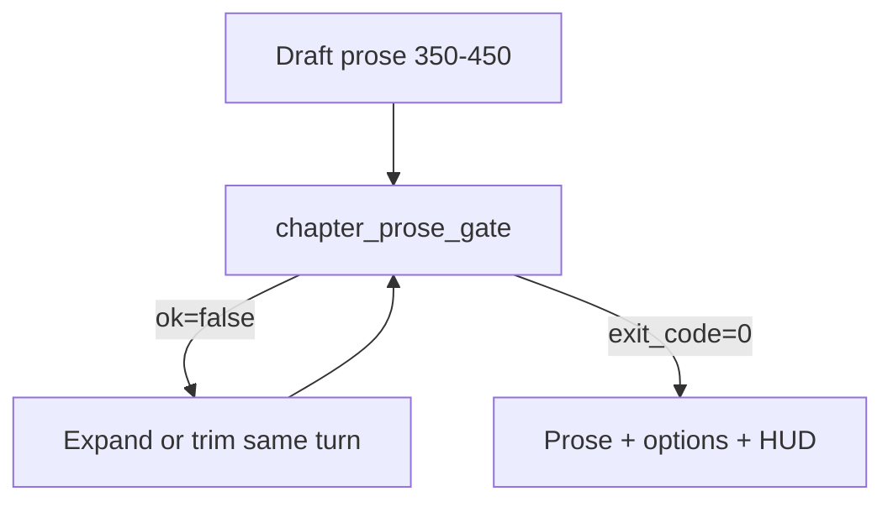
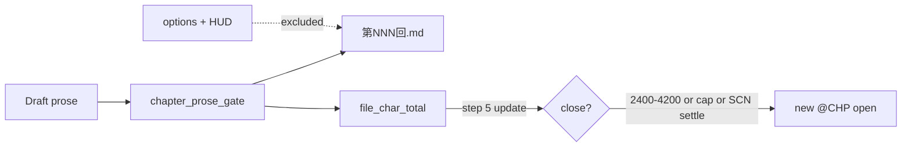
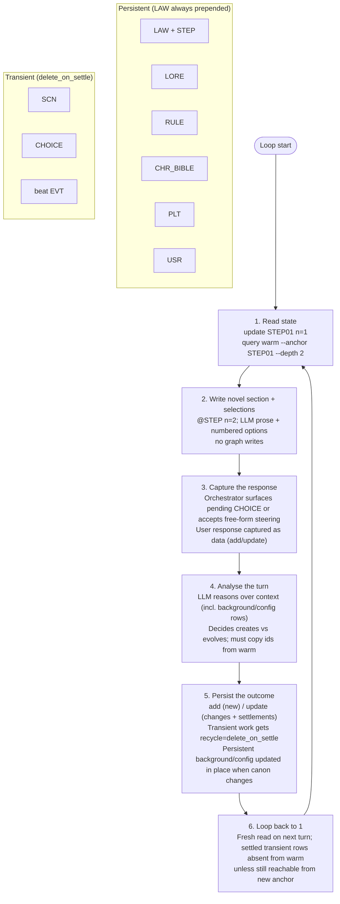

# LLM Novel-Style RPG — A MemNet Application Note

**Application example (documentation only).** This file is a self-contained *pattern* for one domain — interactive novel-style RPGs — not part of the MemNet engine. It shows how you might combine MemNet primitives (`query warm`, fixed **LAW** / **EDG**, user-defined tags, `add`/`update`, settlement) with an orchestrator and an LLM. Copy or adapt the schema; other projects may use different tags and outputs.

**MemNet (engine)** — always provides `@LAW:` and `@EDG:`, prepends all LAW rows on every warm read, and stores whatever tags you declare in your map. Your orchestrator can also keep a tiny `@STEP` row (updated each transition) so the LLM always knows which pipeline step it is on.

**This example (application)** — declares `@LORE`, `@RULE`, `@CHR`, `@ITEM`, `@QUEST`, `@PLT`, `@USR`, `@SCN`, `@CHOICE`, `@STEP`, `@EVT`, `@COST`, `@BOND`. In step 2 the orchestrator injects warm data rows into the LLM prompt; the LLM converts them into the **novel section with selections** (immersive prose + numbered options). Structural outcomes are recorded in step 5 as code-only rows and `@EDG` wiring.

The human experiences the game as reading (and choosing inside) a living novel. The prose is rich, immersive, and literary. Underneath, the graph is the single source of truth for the RPG state: your character's attributes and skills, inventory, active quests, companion bonds, and world facts are many small rows. Most state enters warm only when the current scene or choice reaches it via EDG or direct anchor. **All `@LAW:` rows are always prepended**, so the LLM cannot miss the pipeline discipline or project constraints.

No external character sheets, no hidden system prompts, no "the model will remember the numbers." The graph is the character sheet and the world model. The session can be snapshotted and resumed with `session save` / `session load`.

**At a glance (for skimming or partial LLM reads)**

- The 6-step pipeline used by the orchestrator + LLM in *this* example, plus the role of LAW rows as the always-prepended machine-readable contract and an optional `@STEP` row so the model always knows which step it is on.
- Schema you declare in your map (Part A) and the LAW vs RULE vs USR distinction (do not confuse them).
- Complete starting seed block (Part B) — copy this after `session open`.
- What the orchestrator must do (command-level view).
- Three worked turns showing the full cycle: in step 2 the orchestrator injects the warm data rows; the LLM converts those data rows into the novel section with selections and gives it to the human to read → human responds (selection or steering) → orchestrator records the outcome in the graph (step 5) so future warm reads have the memory. (Harry Potter / Philosopher's Stone era, novel-style RPG.)
- Snapshot / resume, pipeline-aware pitfalls, copy-paste quick-start, and a Mermaid diagram of the loop.

**Document map:** § Pipeline + LAW/STEP contract → **Part A** schema → **Part B** seed → **Part C** orchestrator commands → **Part D** worked turns (Turn 1 → follow-on cycle → Turn 3) → **Play in Cursor chat** → **Chapter merge (LAW-OUT01/02)** → pitfalls → quick-start → diagram.

## The 6-Step Pipeline (this example's repeating loop)

This is the orchestrator + LLM loop **used in this application note**. The worked turns below follow these steps. Other application notes (e.g. SysML modeling) reuse the same MemNet mechanics with different tags and deliverables.

1. **Read the state** — selective `query warm --anchor <focus>` (in this example: current SCN/CHR/CHOICE/QUEST, or direct anchors on LORE/RULE/CHR/ITEM/PLT/USR when background, inventory or quest state is required). Use `--depth` and EDG links to pull only connected reference material. Never rely on prior chat messages for facts or numbers.

2. **Write the novel section** — the orchestrator takes the `query warm` output (the data rows: always-prepended LAW rows + whatever the anchor and EDGs reach: LORE, RULE, CHR with its current attr and status, ITEMs, QUEST progress, SCN, CHOICE, EDG, etc.) and **injects those data rows into the LLM prompt** together with user steering. In this example, **in step 2 the LLM converts the data rows into the novel section with selections** that is given to the human to read: reader-facing narrative prose in novel style (immersive, literary, describing the situation, your attempted action, the narrated outcome, the emotional and mechanical cost, and the new situation) plus, when the beat reaches a decision point, the choice/selection description (the prompt text and the list of numbered options the player sees and can pick from). The warm data rows are the source of truth (your current Courage 3, Charms 2, the Wiggenweld potion still in your pocket, Hermione's relationship at "wary"); the LLM turns them into the readable novel page the human consumes right now. The orchestrator records the structural outcome of the turn (updated @CHR attr or status, @ITEM count reduced, @QUEST progress advanced, new/updated @SCN and @CHOICE rows, settlements, wiring) later in step 5 so the next warm read carries the updated character sheet and world. MemNet itself does not generate prose or selections; the orchestrator + LLM do the conversion using the warm data rows as input.

3. **Capture the response** — the human has just read the novel section (narrative prose + choice/selection description) produced in step 2. The orchestrator surfaces any pending **CHOICE** or accepts free-form steering from the human in response to what they read. The user's input or selection is recorded as first-class data (usually by `add` or `update` of a choice/decision row).

4. **Analyse the turn** — after the human's selection or steering has been captured as first-class data in step 3 (e.g. a chosen option on a CHOICE row, or free-form prompt), the orchestrator performs **additional targeted reads** from the memStore. Typical reads in this phase: re-anchor on the now-resolved CHOICE (to see the exact player words), anchor on the primary CHR that will be affected, on the RULEs that govern costs or behaviour, on the QUEST, on any ITEMs or other state the choice touches. The LLM uses these reads (plus the original context) to determine precisely **how the player's specific input interacts with the current rows** — what state changes are licensed, what mechanical costs or relationship shifts occur, what new transient records (new SCN, updated status, settlements) are required, and what must be left untouched. Only after this read-heavy analysis does it emit a precise plan of *row mutations*. The analysis phase itself does not write; it is the determination step. Step 5 is where the memStore is actually updated.

5. **Persist the outcome** — this is the phase that actually mutates the graph. The orchestrator emits the node and edge operations determined in step 4, using MemNet's graph language (the wire format of `@TAG:` rows for nodes and `@EDG:` rows for directed named edges). New nodes are created with `add`; existing nodes and edges are changed with `update`. Transient nodes/edges (SCN, CHOICE, most active wiring) are settled with `recycle=delete_on_settle`. Persistent nodes (CHR with its attr, ITEM counts, QUEST progress, RULE, LORE) are only mutated when the player's actions legitimately change the world model. Step 5 speaks the graph language to the memStore.

6. **Loop** — return to step 1. The next turn begins with a fresh read. Settled transient rows disappear from `query warm` (unless still connected to the new anchor).

### LAW as the pipeline contract (for the LLM)

The six steps above describe the **orchestrator loop** (CLI calls, user I/O, ingest). **LAW rows** are the complementary piece: the **always-on reasoning contract** the LLM sees in every warm read — procedure and graph discipline encoded in the graph itself, not buried in chat history or a hidden system prompt.

| Role | Who runs it | What it does |
|------|-------------|--------------|
| **Orchestrator** | Your script or agent | Executes steps 1–6: `query warm`, surfaces user input, runs `add`/`update`, optional prune |
| **LAW rows** | MemNet prepends them | Tells the LLM **how** to reason and which wire-line rules to obey when emitting changes |
| **Warm slice** | MemNet + anchor/EDG | Supplies **what** is true this turn (SCN, LORE, RULE, …) |

**How the core LAWs map to the pipeline:**

| Step | LAW support |
|------|-------------|
| 1 Read | **LAW02** — ids in warm output are authoritative; **`@STEP.n`** — orchestrator sets `1` before this read |
| 2 Write | Prepended LAW rows + **`@STEP: …|2|…`** — LLM converts warm rows to novel section; no graph writes |
| 3 Respond | Orchestrator records steering as rows (e.g. CHOICE); optional domain LAW can require "record human choice as data, not prose only" |
| 4 Analyse | Additional targeted reads on the captured player input (the chosen CHOICE, affected CHR, relevant RULEs, QUEST, etc.) to determine exactly how the selection interacts with the graph; produce the mutation plan; domain LAWs still apply |
| 5 Persist | Emit the actual graph mutations (nodes + edges) in wire format; **LAW02** (add vs update), **LAW03** (edge endpoints), **LAW04** (escaping); **LAW-ATOM01** (no sentence in fields — break the sentence into nodes and edges; only ids/keys/codes/phases in row fields); domain LAWs still constrain what is legal to write |
| 6 Loop | **LAW01** — settled transient EDGs/rows drop from warm unless anchor touches an endpoint |

**Domain LAW rows** extend the same pattern. The **`name` field = governed tag** (`CHR`, `SCN`, `*`, …); put the rule in `cycle|mechanism|constraint` as short codes only — e.g. `LAW-HP01|CHR|…|cite_chr_attr_step2` and `LAW-ATOM01|*|…|break_to_nodes_edges`. Optional turn-discipline row:

```text
@LAW: LAW-PIPE01|SCN|on_turn|read_warm|anchor_scn_or_choice_cite_warm_ids
@LAW: LAW-PIPE02|STEP|on_turn|obey_n|read_step_row_each_llm_call
@LAW: LAW-ATOM01|*|on_add|no_sentences|break_to_nodes_edges
```

Keep LAW rows **short and procedural**. Story voice belongs in **RULE**; operator knobs in **USR**. This note's markdown pipeline is documentation for humans; **LAW is the machine-readable contract the LLM actually receives every turn.**

### Which pipeline step am I on?

Chat history is unreliable — the model forgets whether it already read warm, whether the human has answered, or whether it is allowed to `add` yet. MemNet fixes that with a **persistent `@STEP` row** the orchestrator updates at every transition:

```text
@STEP: id|n|focus|recycle
```

| Field | Meaning |
|-------|---------|
| `n` | Current pipeline step (`1`–`6`) |
| `focus` | Id of the live anchor for this step (`SCN01`, `CHOICE01`, …) |

Example: `@STEP: STEP01|2|SCN01|persistent` means *step 2 (write)* with story focus on `SCN01`.

**Orchestrator pattern (recommended):**

1. Before each LLM call, **`update` STEP01** so `n` matches the phase you are about to run.
2. **`query warm --anchor STEP01 --depth 2`** (with `@EDG: ES01|STEP01|focus|SCN01` wired in the seed) so warm returns the STEP row, the prepended LAW rows, and the focused beat.
3. Paste that slice into the prompt. The LLM sees both **what** is true (warm rows) and **where** it is in the loop (`@STEP: …|2|…`).

Typical `n` values:

| `n` | Orchestrator just did / LLM should do |
|-----|----------------------------------------|
| 1 | Ran `query warm`; LLM may plan reads or hand off to step 2 |
| 2 | Warm injected; LLM writes novel section + selections (no graph writes) |
| 3 | Human read prose; LLM/orchestrator records CHOICE / steering |
| 4 | Choice captured; LLM analyses + plans row mutations (no writes yet) |
| 5 | Plan ready; orchestrator emits `add`/`update` wire lines |
| 6 | Persist done; orchestrator sets `n=1` and picks the next anchor |

`LAW-PIPE02|STEP|on_turn|obey_n|read_step_row_each_llm_call` reminds the model that `@STEP.n` overrides chat assumptions. STEP is tiny (three fields); it costs almost nothing next to the always-prepended LAW block.

After heavy settlement, optionally run `housekeep prune recyclable --apply` to physically remove settled rows and free cap space. Reference material (LORE facts, RULE constraints, focused CHR bibles/facets, master PLT, USR prefs) is never settled away.

**Persistent vs transient (quick legend)**

- **Persistent** (survives settlements): LORE, RULE, CHR, PLT, USR, domain LAW rows. Most appear in warm **only when the anchor or EDG reaches them** — except **LAW (all rows), which are always prepended with no EDG required**. Other persistent types typically need EDG (or a direct anchor) to enter warm.
- **Transient** (settle with `delete_on_settle` when done): SCN, CHOICE, most beat-local EVT rows, and most transient EDGs. **Persistent:** STEP (orchestrator updates `n`/`focus` each transition), LORE, RULE, CHR, PLT, USR, most COST/BOND until explicitly settled.

## Part A: Schema (the user tag map)

This is the map you feed to `memnet session open --map-file`. It defines only the *user* tags for this domain. Fixed tags **EDG** and **LAW** are always present and do not appear here. See **LAW vs RULE vs USR** below for how LAW (fixed) differs from RULE (your schema).

```text
@LORE: id|name|kind|code|recycle
@RULE: id|name|scope|code|recycle
@CHR: id|name|role|attr|facet|status|recycle
@ITEM: id|name|kind|uses|effect|recycle
@QUEST: id|key|stage|goal|progress|status|recycle
@PLT: id|key|phase|arc|status|recycle
@USR: id|key|value|recycle
@SCN: id|key|phase|recycle
@CHOICE: id|resolves|chosen|recycle
@STEP: id|n|focus|recycle
@EVT: id|type|actor|focus|code|recycle
@COST: id|subject|kind|site|recycle
@BOND: id|left|right|delta|code|recycle
```

**Important for token efficiency (this pattern):** Enforced by `LAW-ATOM01` (always prepended): **no sentence in any field, on any tag** — break meaning into more nodes and edges. Every field on every row (`@LAW` constraint codes included) holds only ids, keys, phases, short codes, or numeric attr values. No `text`, `backstory`, or prose blobs. If a fact needs several ideas, split it into multiple `@LORE` / `@RULE` / `@EVT` rows and wire them with `@EDG`. Reader-facing novel text is generated only in step 2 from this skeleton + the prepended LAW codes.

| Tag | Role in this example |
|-----|----------------------|
| `LORE` | Atomic world fact (`code` field) |
| `RULE` | Story constraint (`code`); on demand via EDG |
| `CHR` | Character sheet: `attr` values + `facet`/`status` codes |
| `ITEM` / `QUEST` / `PLT` | Inventory, mission, arc keys |
| `USR` | Operator prefs (not in-universe) |
| `SCN` | Beat marker: `key` + `phase` only |
| `CHOICE` | Decision record: `resolves` + `chosen` key |
| `STEP` | Pipeline position: `n` (1–6) + `focus` id |
| `EVT` / `COST` / `BOND` | Per-beat outcome atoms + relation targets |
| `EDG` | Named wiring (fixed tag; always available) |
| `LAW` | Always-prepended protocol + domain codes (fixed tag) |

## LAW vs RULE vs USR (do not confuse them)

Both LAW and RULE are “rules” in plain English. In this note they are **different tags with different jobs**.

| | **LAW** (fixed tag) | **RULE** (your schema) | **USR** (your schema) |
|--|---------------------|------------------------|------------------------|
| **Governs** | The **graph** and **how rows may exist** (ids, edges, wire format) + **hard project structure** (e.g. "when resolving a challenge, cite the acting skill value from the CHR row") | The **story**: voice, magic, pacing, world logic | **Your preferences** as the operator: length, POV style |
| **In every `query warm`?** | **Yes** — engine prepends **all** LAW rows | **No** — only if EDG-linked or you anchor on it | **No** — same as RULE |
| **Needs EDG to appear in warm?** | **No** — engine prepends all LAW rows | **Yes** — EDG-linked or direct anchor | **Yes** — same as RULE |
| **Optional EDG (bookkeeping)** | `@EDG: LAW-HP01\|governs\|SCN01` (audit which scenes obeyed the stat-cite rule) | `@EDG: CHR01\|governs\|RULE02` | `@EDG: SCN01\|influences\|USR01` |
| **Engine enforcement** | Partly (e.g. LAW02 duplicate id on `add`) | Prompt discipline only | Prompt discipline only |
| **Example** | LAW02 (`*|on_add`): one id per row; LAW-HP01 (`CHR|on_turn`): cite acting attr from CHR in step 2 | RULE01: `cite_choices_not_ability` | USR01: `scene_length=spare` |

**Decision guide — which tag?**

1. If breaking it would corrupt **ids, EDGs, or ingest** → **LAW** (and consider a domain LAW if the model must see it **every turn** before `add`).
2. If it is **how the story should read or how the world (or magic) works in fiction** → **RULE**, wire with EDG from scenes/characters that need it.
3. If it is **your steering preference** (not in-universe canon) → **USR**, not RULE.

**Why not put story craft in LAW?** You could, but every LAW row lands in **every** warm read forever — token cost adds up. RULE stays out of context until a linked scene or character needs it.

**Why LAW-HP01 is not a RULE:** the "cite acting skill/attr from CHR on every year-1 challenge resolution" rule must be visible **before every skill test or spell** in year 1; the engine does not enforce it. LAW guarantees the constraint is never skipped — **no EDG required**.

**LAW rows need no EDG.** The `@LAW:` row alone is enough; every `query warm` prepends it. Optional `constrains` (or similar) EDGs are for **graph bookkeeping** — listing which nodes were minted under a domain LAW, auditing, or traversing from LAW → instances. They do **not** control whether the LAW text appears in context.

EDG relations used in this example (seed a few at start or use `--allow-new-relation` when genuinely new): `set_in`, `features`, `governs`, `constrains`, `continues`, `resolves`, `costs`, `influences`, `risk_if`, `seeks`, `targets`, `caused`, `suffered_by`, `imposed`, `carries`, `changed`, `between`, `applies_to`, `potential_for`.

**EDG rows — the explicit wiring for selective context**

EDG is a *fixed, built-in tag* (always available; never declared in your map). It models directed, named links between any rows:

```
@EDG: E99|SRC_ID|relation|DST_ID|optional_attrs|recycle
```

**Core function in the pipeline:**
- They are how you declare "this scene is *set_in* this lore", "this character *features* here", "this rule *governs* that character", "this beat *costs* this person". Optionally, "this domain LAW *constrains* this NPC" — for audit and traversal only; the LAW row is already in every warm read without that link.
- `query warm --anchor <focus> --depth N` traverses EDG links to pull in *only* the connected persistent background, bibles and rules the current focus needs. Without the right EDGs, anchoring on a SCN or CHOICE would return almost nothing but the prepended LAW rows (core invariants plus any domain constraints such as id rules) + the anchor itself.
- LAW01 (`EDG|on_context|hide`) keeps the warm slice clean: most transient EDGs (and the rows they point to) are hidden from context unless the anchor is at src or dist.
- You manage them with the same `add`/`update` discipline as nodes (copy ids from warm; use `--allow-new-relation` only for genuinely new relation verbs). They are first-class data, not implicit "the LLM will remember the connection".

In short: EDG is the mechanism that makes "read only what the anchor can reach" reliable and deterministic for long-running work.

**LAW rows — protocol and structural constraints (always on)**

LAW is a *fixed, built-in tag* (not in your map). **Every** `query warm` prepends **all** LAW rows before the anchored slice. They are not optional background.

```
@LAW: id|name|cycle|mechanism|constraint
```

MemNet names the second field `name` in the wire format; in this note we treat it as the **governed tag** — which `@TAG:` (or `EDG`, or `*` for all node tags) the law applies to. The last three fields are short codes only (`cycle`, `mechanism`, `constraint`); never sentences. LAW has no `recycle` field — LAW rows are always prepended and are not settled away.

| Field (wire) | Role in this note |
|--------------|-------------------|
| `id` | LAW row id (`LAW01`, `LAW-ATOM01`, …) |
| `name` | **Governed tag** — `EDG`, `CHR`, `LORE`, `SCN`, `*` (all node tags), etc. |
| `cycle` | When it applies (`on_context`, `on_add`, `on_turn`, …) |
| `mechanism` | How (`hide`, `unique`, `no_sentences`, …) |
| `constraint` | What (`settled_edg_unless_anchor`, `break_to_nodes_edges`, …) |

The four **core** LAWs (MemNet engine — seed in every project):

```text
@LAW: LAW01|EDG|on_context|hide|settled_edg_unless_anchor
@LAW: LAW02|*|on_add|unique|one_id_add_then_update
@LAW: LAW03|EDG|on_add|validate|src_dist_exist_first
@LAW: LAW04|*|on_add|use_backslash|backslash_pipe_not_bare
```

**Core function in the pipeline:**

See **LAW as the pipeline contract (for the LLM)** above for the orchestrator vs LAW split and step mapping. In brief:

- LAW02 (`*|on_add|unique`) is the reason you must read first, copy the exact id, and use `add` only for truly new things (or `update` for existing). It is enforced at ingest.
- LAW01 (`EDG|on_context|hide`) and LAW03 (`EDG|on_add|validate`) work with EDG to keep warm slices clean and wiring sound.
- LAW04 (`*|on_add|use_backslash`) protects the wire format itself.

**Domain LAW rows (project-specific, still always prepended)**

Beyond LAW01–04, add **domain** LAW rows. Put the **governed tag** in the `name` field (`CHR`, `SCN`, `*`, …) and the rule in the three code fields. They appear in **every** warm read, same as the core four.

Example in this note: `LAW-HP01|CHR|on_turn|stat_cite|cite_chr_attr_step2` — when step 2 generates year-1 challenge prose, cite the acting attr/skill from the warm CHR row (e.g. Charms 2). SCN and CHOICE rows stay minimal; the LAW names `CHR` as the tag whose values must be cited. Optional audit EDG:

```
@EDG: E06|LAW-HP01|governs|SCN01||persistent
```

(The src is the LAW-HP01 row; dist is the scene that obeys it; the edge is persistent so the link survives settlement.)

If you add these links, they help with:
- `query warm --anchor LAW-HP01 --depth 1` surfacing the scenes that obeyed the rule
- Traversing from a scene back to the governing LAW for audit
- Keeping "this constraint applied here" as first-class graph data rather than only in the LLM's head

Skip the EDG entirely if you only need the rule text every turn and do not care about traversable instance lists.

In short: **LAW** = “how nodes are allowed to exist in the graph” (always visible, no EDG needed). **Optional EDG** = which specific scenes or characters were created under a domain LAW.

**RULE rows — story craft (on demand only)**

RULE is a *user tag* from your map. Each row is one **narrative** constraint: voice, magic rules, pacing, tone. RULE rows are **not** prepended globally — they enter warm only when:

- an **EDG** links them from the current anchor (e.g. `CHR01|governs|RULE02`), or
- you **anchor directly** on the RULE (as Turn 3 does on `RULE02`).

```
@RULE: id|name|scope|code|recycle
```

Examples from the seed: `cite_choices_not_ability` (theme), `low_skill_visible_cost` (risk), `one_state_delta_per_beat` (structure). Each is a single short code — not a sentence. **Do not** put operator prefs here — use **USR** (`USR01|scene_length|spare`). **Do not** put id format or graph mechanics here — use **LAW**.

When canon changes (Turn 3), **update** the existing RULE row's `code` field in place (e.g. `low_skill_visible_cost` → `low_skill_lingering_cost`); cite its id from warm output.

**Background is many small pieces, referred only when needed**

Because persistent material is many small rows, the warm slice for each turn contains only what the focus needs — **plus all LAW rows**. SCN and CHOICE are deliberately tiny (key/phase or resolves+chosen); per-turn outcomes are recorded as atomic @EVT / @COST / @BOND nodes (fields are only ids + short codes) wired by many EDG relations. In the seed you see LORE01/LORE02, initial EVT00 + COST00 for the door risk, three RULE rows, four core LAWs + LAW-HP01, the player CHR with its current attr, a starting ITEM, the active QUEST (short progress key), etc. RULE01 appears in Turn 1 because `CHR01|governs|RULE01` is wired; RULE03 may stay out until a scene links it. Anchor directly on a RULE (Turn 3) when you need to edit canon without traversing from a scene. This keeps every warm read token-efficient.

## Part B: Initial Seed (complete starting state)

Copy the block below (or extract it via heredoc) and feed it to `memnet add --stdin` after opening the session with the schema above. This populates the graph with *all* initial data as many small pieces: LORE facts, RULE codes, core LAWs plus domain LAWs (`LAW-ATOM01|*|…`, `LAW-HP01|CHR|…`), player and companion CHRs, ITEM, QUEST, PLT, USR, opening SCN, and EDG wiring. Persistent rows use `persistent` (or omit recycle); opening SCN and its transient links use `delete_on_settle`.

```text
@LAW: LAW01|EDG|on_context|hide|settled_edg_unless_anchor
@LAW: LAW02|*|on_add|unique|one_id_add_then_update
@LAW: LAW03|EDG|on_add|validate|src_dist_exist_first
@LAW: LAW04|*|on_add|use_backslash|backslash_pipe_not_bare
@LAW: LAW-ATOM01|*|on_add|no_sentences|break_to_nodes_edges
@LAW: LAW-HP01|CHR|on_turn|stat_cite|cite_chr_attr_step2
@LAW: LAW-PIPE02|STEP|on_turn|obey_n|read_step_row_each_llm_call

@STEP: STEP01|1|SCN01|persistent

@LORE: LORE01|philosophers_stone|artifact|elixir_source|persistent
@LORE: LORE02|philosophers_stone|artifact|voldemort_power_y1|persistent
@LORE: LORE03|quirrell|threat|possessed|persistent
@LORE: LORE04|quirrell|threat|closing_stone|persistent

@RULE: RULE01|choices_wizard|theme|cite_choices_not_ability|persistent
@RULE: RULE02|magic_toll|risk|low_skill_visible_cost|persistent
@RULE: RULE03|one_change|structure|one_state_delta_per_beat|persistent

@CHR: CHR01|You|protagonist|Courage:3 Wit:4 Charms:2 Stealth:3|firstyear_belong|unhurt|persistent
@CHR: CHR02|Harry|ally|brave|scarred|boy_who_lived|persistent
@CHR: CHR03|Hermione|ally|brilliant|loyal|rules_first_help_wary|persistent

@ITEM: ITM01|wiggenweld|consumable|1|steady_spell|persistent

@QUEST: QST01|stone_y1|1|stop_quirrell|final_door_ward|active|persistent

@PLT: PLT01|stone_y1|year-1|stone_not_voldemort|active|persistent

@USR: USR01|scene_length|spare|persistent
@USR: USR02|voice|close-second-wonder|persistent

@SCN: SCN01|final_door|warded|delete_on_settle

@EVT: EVT00|risk|door|charms|bite|persistent
@COST: CST00|CHR01|potential_mark|hand|persistent

@EDG: ES01|STEP01|focus|SCN01||persistent
@EDG: E01|SCN01|set_in|LORE01||persistent
@EDG: L01|LORE01|risk_if|LORE02||persistent
@EDG: L02|LORE03|seeks|LORE01||persistent
@EDG: L03|LORE04|targets|LORE01||persistent
@EDG: E02|SCN01|features|CHR01||persistent
@EDG: E03|SCN01|features|CHR02||persistent
@EDG: E04|SCN01|features|CHR03||persistent
@EDG: E05|CHR01|governs|RULE01||persistent
@EDG: E06|SCN01|features|ITM01||persistent
@EDG: E07|SCN01|features|EVT00||persistent
@EDG: E08|SCN01|features|CST00||persistent
@EDG: E09|EVT00|applies_to|CHR01||persistent
@EDG: E10|CST00|potential_for|CHR01||persistent
```

*MemNet IO: **~676 tok** stdin · 40 rows · one-time seed (not re-sent each LLM turn).*

## Part C: Orchestrator command-level view

**Token estimates** on IO examples below: wire-format size only (not step-2 novel prose). Rule of thumb: **chars / 3.2** for pipe-heavy `@TAG:` lines (±15% by tokenizer). Every `query warm` prepends **~126 tok** of LAW (7 rows). Recompute with `scripts/estimate_novel_io_tokens.py`.

**Orchestrator responsibilities (the harness around the LLM in this novel-style RPG pattern):**
- Always begin the turn with a read (step 1). Prefer `query warm --anchor STEP01 --depth 2` so the slice includes `@STEP` (current `n`) plus the focused beat via `STEP01|focus|…` EDG.
- **`update` STEP01** whenever the orchestrator advances the pipeline (`n` = 1–6; `focus` = live SCN/CHOICE id).
- Inject exactly the warm data rows (plus user steering) as the LLM context (step 2). In this example, **in step 2 the LLM converts the data rows into the novel section with selections** (narrative prose in novel style + choice/selection description) and gives that text to the human to read.
- Step 5 is where the graph is mutated in graph language: the orchestrator sends the exact node rows (`@CHR:`, `@SCN:`, `@RULE:`, `@ITEM:`, `@QUEST:`, etc.) and edge rows (`@EDG:`) that step 4 decided must exist or change. This is the only place the in-memory graph (nodes + directed named edges) is written to.
- Capture the human's response after they read the novel section (step 3).
- In step 4 (analyse), after capture, issue further targeted reads on the player's input (the chosen CHOICE row, the CHR(s) it affects, the RULEs that govern the interaction, QUEST progress, etc.). Use these reads to let the LLM determine exactly how this specific selection/prompt should affect the graph (which nodes change, which edges must be added or settled).
- In step 5, emit the graph operations (node and edge mutations) in MemNet's wire language. The commands sent (`memnet add --stdin`, `memnet update --stdin`) are statements that create or modify nodes (`@CHR:`, `@SCN:`, `@RULE:`, etc.) and edges (`@EDG:`). Step 5 is where the graph itself is updated.
- After settlement, optionally prune; always start the next turn with a fresh read.

The LLM never "remembers" ids or facts across turns. It only ever sees what step 1 + 2 put in front of it.

## Part D: Worked Turns (the pipeline in action)

Three worked beats: **Turn 1** (door choice — full steps 1–6), a **follow-on cycle** (consequence prose + next selection after Turn 1's persist), and **Turn 3** (RULE canon update + quiet beat). Every step-2 blockquote ends with **What do you do?** and numbered options when the beat stops on a decision. Warm excerpts include prepended `@LAW:` rows. Ids are copied from warm output; transient rows use `delete_on_settle`.

### Turn 1 — The First Hard Choice

**Human steering (feeds step 2 + 3):** "You, Harry and Hermione are at the final warded door. Quirrell is close on the other side. Give the player a real, costly choice that respects the current Charms 2 and the Wiggenweld in inventory. Do not resolve it yet."

**Step 1 — Read the state**
```
memnet update --stdin @"
@STEP: STEP01|1|SCN01|persistent
"@
memnet query warm --anchor STEP01 --depth 2 --max-rows 30
```

*MemNet IO: **~10 tok** stdin (`update STEP`) · **~586 tok** stdout (`warm`, 34 rows · incl. **~126 tok** LAW).*

**Step 2 — Write the novel section with selections**
```
@LAW: LAW01|EDG|on_context|hide|settled_edg_unless_anchor
@LAW: LAW02|*|on_add|unique|one_id_add_then_update
@LAW: LAW03|EDG|on_add|validate|src_dist_exist_first
@LAW: LAW04|*|on_add|use_backslash|backslash_pipe_not_bare
@LAW: LAW-ATOM01|*|on_add|no_sentences|break_to_nodes_edges...
@LAW: LAW-HP01|CHR|on_turn|stat_cite|cite_chr_attr_step2...
@STEP: STEP01|2|SCN01|persistent
@LORE: LORE01|philosophers_stone|artifact|elixir_source|persistent
@LORE: LORE02|philosophers_stone|artifact|voldemort_power_y1|persistent
@LORE: LORE03|quirrell|threat|possessed|persistent
@LORE: LORE04|quirrell|threat|closing_stone|persistent
@RULE: RULE01|choices_wizard|theme|cite_choices_not_ability|persistent
@RULE: RULE02|magic_toll|risk|low_skill_visible_cost|persistent
@RULE: RULE03|one_change|structure|one_state_delta_per_beat|persistent
@CHR: CHR01|You|protagonist|Courage:3 Wit:4 Charms:2 Stealth:3|firstyear_belong|unhurt|persistent
@CHR: CHR02|Harry|ally|brave|scarred|boy_who_lived|persistent
@CHR: CHR03|Hermione|ally|brilliant|loyal|rules_first_help_wary|persistent
@ITEM: ITM01|wiggenweld|consumable|1|steady_spell|persistent
@QUEST: QST01|stone_y1|1|stop_quirrell|final_door_ward|active|persistent
@SCN: SCN01|final_door|warded|delete_on_settle
@EVT: EVT00|risk|door|charms|bite|persistent
@COST: CST00|CHR01|potential_mark|hand|persistent
@EDG: E01|SCN01|set_in|LORE01||persistent
@EDG: E02|SCN01|features|CHR01||persistent
@EDG: E03|SCN01|features|CHR02||persistent
@EDG: E04|SCN01|features|CHR03||persistent
@EDG: E05|CHR01|governs|RULE01||persistent
@EDG: E06|SCN01|features|ITM01||persistent
@EDG: E07|SCN01|features|EVT00||persistent
@EDG: E08|SCN01|features|CST00||persistent
@EDG: E09|EVT00|applies_to|CHR01||persistent
@EDG: E10|CST00|potential_for|CHR01||persistent
```

*MemNet IO: **~586 tok** stdout (excerpt abbreviated with `…`; full warm matches step 1 · incl. **~126 tok** LAW).*

**Novel section given to the human (what the reader/player reads right now)**

> You stand with Harry and Hermione before the warded door. The silver tracery pulses like a slow heartbeat. On the other side Quirrell's voice is a cold thread of sound. Your wand feels too light in your hand. You know your Charms is only 2 — under pressure the charm can sputter, the ward can bite, the noise can bring the servant running before you are ready.
>
> Hermione's fingers hover near her own wand. Harry's eyes flick to the small vial in your pocket and back to your face. He gives the smallest of nods.
>
> What do you do?
>
> 1. Attempt the unlocking charm yourself (your Charms is 2; the prose will show the risk and any backlash or shaky partial success).
> 2. Ask Hermione to cast it (she will almost certainly succeed cleanly, but it will cost trust — she will remember that you asked her to take the risk for you).
> 3. Drink the Wiggenweld first to steady your hand and nerves (consume the item; the prose will show the brief steadiness it lends your Charms 2 attempt).

**Remark:** Step 2 sets `@STEP: STEP01|2|SCN01`. Output is prose + selections only — no graph writes in this phase.

**Step 3 — Capture the response**

"I choose 1." (or the full text of option 1)

The orchestrator sets `@STEP: STEP01|3|SCN01`, records the pick as data (not prose), and passes it to step 4. The human has read the novel section above; the graph still reflects the pre-choice state until step 5.

**Step 4 — Analyse the turn**
" Warm (ids + current values copied exactly):
- CHR01: Courage:3|Wit:4|Charms:2|Stealth:3|...|unhurt
- ITM01: uses=1 (Wiggenweld)
- QST01: stage=1, status=active , progress=final_door_ward
- SCN01 (minimal key/phase), RULE02 (`low_skill_visible_cost`), LAW-HP01 (`cite_chr_attr_step2`)
- EVT00 / CST00 (door risk facts) via EDGs from SCN01
- Companions CHR02/03 present via features EDGs.

Row mutations (pure atomic nodes + edges only; no sentences or phrases in any row):
- CHOICE01: add, resolves=SCN01, chosen=1|self , recycle=delete_on_settle
- SCN02: add, key=threshold , phase=breach , recycle=delete_on_settle
- EVT01: add, type=yield , actor=CHR01 , focus=door , code=charms2_self
- COST01: add, subject=CHR01 , kind=mark , site=hand
- BOND01: add, left=CHR03 , right=CHR01 , delta=up , code=self_risk
- EDG E10: LAW-HP01 governs SCN01 (audit)
- Multiple EDG from SCN02 / EVT01 / COST01 / BOND01 to CHR01, LORE02, each other (caused, suffered, changed, records, applies_to, etc.)
- Settle prior transient pair SCN01 + CHOICE01

All ids and short codes copied from warm or generated under LAW discipline (including LAW-ATOM01: no sentence in fields). The rich wording lives only in the generated novel section. Ready for step 5 (graph update in wire format)."

**Step 5 — Persist the outcome (graph update in graph language)**

Orchestrator sets `@STEP: STEP01|5|SCN01`. Step 4 has determined the row mutations for choice `1|self`. Step 5 emits wire lines only — no prose.

```
memnet add --stdin @"
@CHOICE: CHOICE01|SCN01|1|self|delete_on_settle
"@
memnet update --stdin @"
@STEP: STEP01|6|SCN02|persistent
@CHR: CHR01|You|protagonist|Courage:3|Wit:4|Charms:2|Stealth:3|firstyear_belong|shaken_hand|persistent
@SCN: SCN01|final_door|warded|delete_on_settle
@SCN: SCN02|threshold|breach|delete_on_settle
@EVT: EVT01|yield|CHR01|door|charms2_self|delete_on_settle
@COST: COST01|CHR01|mark|hand|persistent
@BOND: BOND01|CHR03|CHR01|up|self_risk|persistent
@EDG: E20|SCN02|set_in|LORE02||persistent
@EDG: E21|SCN02|features|CHR01||persistent
@EDG: E22|SCN02|costs|CHR01||persistent
@EDG: E23|SCN02|caused|EVT01||persistent
@EDG: E24|EVT01|suffered_by|CHR01||persistent
@EDG: E25|SCN02|imposed|COST01||persistent
@EDG: E26|CHR01|carries|COST01||persistent
@EDG: E27|SCN02|changed|BOND01||persistent
@EDG: E28|BOND01|between|CHR03|CHR01
@EDG: E29|EVT01|used|charms2||persistent
@EDG: ES02|STEP01|focus|SCN02||persistent
"@
```

*MemNet IO: **~15 tok** stdin (`add` CHOICE01) · **~262 tok** stdin (`update` batch, 18 rows) · not pasted to LLM.*

This Step 5 update:
- CHOICE01: minimal record (`1|self`); SCN01 settled.
- CHR01: status → `shaken_hand`; STEP01 focus → SCN02 via ES02.
- SCN02 + EVT01/COST01/BOND01: atomic outcome nodes + EDG web (ids E20–E29 — do not reuse seed E01–E10).

The human has **not** read the consequence prose yet — that is the **follow-on cycle's step 2**, generated from this new skeleton.

**Step 6 — Loop**
Next cycle: `@STEP: STEP01|1|SCN02`, then `query warm --anchor STEP01 --depth 2`. SCN01 and CHOICE01 drop from warm after settlement. CHR01, COST01, and SCN02 carry forward.

### Follow-on cycle — Consequence prose + next selection

**Context:** Turn 1 Step 5 persisted the door choice (`1|self`) and the atomic outcome graph. SCN01 is settled. This cycle's step 2 is where the human **first reads** the narrated consequence and receives the **next** numbered options.

**Step 1 — Read the state**
```
memnet update --stdin @"
@STEP: STEP01|1|SCN02|persistent
"@
memnet query warm --anchor STEP01 --depth 2 --max-rows 30
```

*MemNet IO: **~10 tok** stdin · **~390 tok** stdout (22 rows · post-breach slice).*

**Step 2 — Write the novel section with selections**
Orchestrator sets `@STEP: STEP01|2|SCN02` before the LLM call. Warm includes SCN02, CHR01 (`shaken_hand`, Charms 2), EVT/COST/BOND web, companions, QUEST, LORE/RULE, prepended LAWs.

**Novel section given to the human (what the reader/player reads right now)**

> The charm left your wand in a shaky blue spark. The silver tracery on the door flared, bit back, and then — with a sound like a breath held too long — the lock yielded. A thin line of red opened across the back of your wand hand where the ward had kissed you. The door moved a handspan, enough to slip through.
>
> Harry slid through first, wand up, and gave you a quick, fierce look. Hermione followed without a word, but her eyes flicked to your hand and away. The chamber on the other side is colder; the air tastes of old stone and something sweeter, like rotting lilies. Your hand stings where Charms 2 barely held. The quest has moved one room closer to the Stone, and you carry a small, personal price for having insisted on doing it yourself.
>
> Harry is already angling toward the next arch. Hermione hangs back half a step, watching you.
>
> What do you do?
>
> 1. Press on with Harry toward the next arch now (your hand will throb; Courage 3 keeps you moving despite the sting).
> 2. Bind the ward-cut with a basic healing charm before anyone goes deeper (Charms 2 again — steady partial success or a visible fumble under RULE02's lingering toll).
> 3. Ask Hermione to take point while you recover (she leads cleanly; BOND shifts — she remembers you leaned on her after insisting on the door alone).

**Remark:** In step 2 the orchestrator sets `@STEP: STEP01|2|SCN02`. The LLM converts the warm skeleton into **consequence prose plus numbered selections** — not prose alone. Door-choice graph mutations were already written in Turn 1 Step 5; this beat narrates their outcome and opens the next decision. No sentences on SCN/CHOICE rows.

**Step 3 — Capture the response**
The human has just read the consequence page and the three numbered options above. Example: `"I choose 2."` The orchestrator records the selection on a new CHOICE row (`resolves=SCN02`, `chosen=2|bind_hand`) as first-class data — no option text on the row. Optional free-form steering ("make Hermione sound less cross") is captured separately for step 4.

**Step 4 — Analyse the turn (row-mutation focused)**

To determine how the player's selection interacts with the live graph, the orchestrator issues additional targeted reads:

```
memnet query warm --anchor SCN02 --depth 1
memnet query warm --anchor CHR01 --depth 1
memnet query warm --anchor RULE02 --depth 1
memnet query warm --anchor QST01 --depth 1
```

*MemNet IO: **~646 tok** stdout total (4 reads · ~146–171 tok each · each incl. **~126 tok** LAW).*

From these reads the interaction is modelled:

"Warm values (from the extra reads + prior context, ids and live fields copied exactly):
- SCN02 (minimal breach marker), CHR01: Charms:2 , status=shaken_hand , COST01 on hand via EDG.
- RULE02 (toll), LAW-HP01, QST01 progress key, EVT01/COST01/BOND01 web reachable from SCN02.
- ITM01 unused unless a later beat consumes it.

Row mutations (pure atomic nodes + edges; no sentences):
- CHOICE02: add, resolves=SCN02, chosen=2|bind_hand , recycle=delete_on_settle
- (Further SCN/EVT/COST updates for the bind-hand attempt land in this turn's Step 5 or the next cycle, depending on orchestrator split.)

Ready for step 5 (graph update in wire format)."

**Step 5 — Persist the outcome**
At minimum: `add` CHOICE02 with the chosen key. Settle SCN02 when the beat closes. Any mechanical outcome of option 2 (second Charms attempt, lingering toll under RULE02) is recorded as atomic EVT/COST nodes + EDGs — same discipline as Turn 1 Step 5.

**Step 6 — Loop**
Next read (`query warm --anchor STEP01 --depth 2` with `@STEP: …|1|…`) surfaces SCN02 or its successor, pending CHOICE02 if not yet settled, CHR01 + COST01, and prepended LAWs. Step 2 again emits **prose + selections** when the beat reaches a decision point.

### Turn 3 — A Canon Touch and a Quiet Cost

**User prompt/steering:** "The toll when a low skill is pushed should be steeper in the rule, and show the PC feeling both the sting and a small, earned pride in the quiet after. Hermione softens a fraction."

**Step 1 — Read the state**
```
memnet update --stdin @"
@STEP: STEP01|1|SCN02|persistent
"@
memnet query warm --anchor STEP01 --depth 2 --max-rows 20
memnet query warm --anchor RULE02 --depth 1
```

*MemNet IO: **~10 tok** stdin · **~390 tok** stdout (depth 2) · **~146 tok** stdout (RULE02 depth 1).*

Operator steering (steeper toll, quiet beat) is injected into the step-2 prompt; it is not stored as a sentence on any row.

**Step 2 — Write the novel section with selections**
Orchestrator sets `@STEP: STEP01|2|SCN02`. Warm surfaces RULE02 code, SCN02 + outcome web, CHR status, companions, prepended LAWs.

**Novel section given to the human (what the reader/player reads right now)**

> A few minutes inside the colder chamber. Your hand still throbs where the ward kissed it. You flex the fingers and the sting answers at once — a reminder that Charms 2 is not a number on a page but a live edge you just pressed against. Harry is already moving toward the next arch, eyes on the dark. Hermione lingers a half-step. She looks at your hand, then at your face.
>
> "You didn't have to do that alone," she says, very low. It is not quite forgiveness, but it is not the closed look she wore at the door. The choice you made — to risk your own shaky skill rather than spend hers — has landed on both of you.
>
> The quest has not changed. The Stone is still ahead. But something small and real has shifted between the three of you, and the toll of pushing a low skill under pressure is no longer just a line in a book.
>
> Harry pauses at the arch and glances back. The way forward is narrow and unlit.
>
> What do you do?
>
> 1. Follow Harry into the next arch immediately (Courage 3; keep momentum before Quirrell hears you).
> 2. Pause to tell Hermione why you tried the door yourself (Wit 4; deepen the softening — step 5 will record BOND02).
> 3. Check the corridor for traps before anyone moves (Stealth 3; cautious advance — slower, but safer under lingering toll from RULE02).

**Remark:** Step 2 output is always **prose + selections** when the beat stops on a decision — not prose alone. The LLM converts warm rows (RULE02, SCN02/SCN03 skeleton, EVT/COST/BOND, CHR status, companions, LAWs) into readable text and numbered options citing attrs from CHR (LAW-HP01). Rich wording stays in step 2; the graph keeps codes only.

**Step 3 — Capture the response**
Example: `"I choose 3."` Orchestrator sets `@STEP: STEP01|3|SCN02`. Player pick → `chosen=3|check_traps` (stored in step 5 on CHOICE03).

**Step 4 — Analyse the turn**

Additional reads after capture:

```
memnet query warm --anchor RULE02 --depth 1
memnet query warm --anchor SCN02 --depth 1
memnet query warm --anchor CHR01 --depth 1
memnet query warm --anchor CHR03 --depth 1
```

*MemNet IO: **~620 tok** stdout total (4 depth-1 reads · ~146–171 tok each).*

"Warm (ids + live values copied from the reads above):
- RULE02 code: `low_skill_visible_cost` (about to tighten)
- SCN02, CHR01 (`shaken_hand`, Charms 2), CHR03, QST01, LORE02 + prior EVT/COST/BOND

Row mutations (structural only):
- RULE02: update code → `low_skill_lingering_cost`
- SCN03: add, key=quiet_after , phase=sting_pride_softening , recycle=delete_on_settle
- CHOICE03: add, resolves=SCN02, chosen=3|check_traps , recycle=delete_on_settle
- EVT02, COST02, BOND02: quiet-beat atomic nodes + EDGs (E30+)

Ready for step 5."

**Step 5 — Persist the outcome**
Orchestrator sets `@STEP: STEP01|5|SCN02`.

```
memnet update --stdin @"
@RULE: RULE02|magic_toll|risk|low_skill_lingering_cost|persistent
@STEP: STEP01|6|SCN03|persistent
@SCN: SCN03|quiet_after|sting_pride_softening|delete_on_settle
@CHOICE: CHOICE03|SCN02|3|check_traps|delete_on_settle
@EVT: EVT02|quiet_sting|CHR01|self|pride|delete_on_settle
@COST: COST02|CHR01|lingering|hand|persistent
@BOND: BOND02|CHR03|CHR01|up|soften|persistent
@EDG: E30|SCN03|set_in|LORE02||persistent
@EDG: E31|SCN03|costs|CHR01||persistent
@EDG: E32|SCN03|features|CHR03||persistent
@EDG: E33|SCN03|caused|EVT02||persistent
@EDG: E34|SCN03|imposed|COST02||persistent
@EDG: E35|SCN03|changed|BOND02||persistent
@EDG: E36|CHR01|carries|COST02||persistent
@EDG: E37|BOND02|between|CHR03|CHR01
@EDG: E38|EVT02|suffered_by|CHR01||persistent
@EDG: ES03|STEP01|focus|SCN03||persistent
"@
```

*MemNet IO: **~246 tok** stdin (17 rows · orchestrator only).*

**Step 6 — Loop**
Next cycle: `@STEP: STEP01|1|SCN03`, `query warm --anchor STEP01 --depth 2`. Updated RULE02 code reachable when EDG-linked. SCN02 settled when the beat closes.

## Snapshot (full project state)

At any point you can capture *everything* — current story plus all background, configs, bibles, rules, and user prefs:

```powershell
memnet session save --file my-novel.snap
```

Later (new machine, new terminal, after a break):

```powershell
memnet session load --file my-novel.snap
# or --keep-id if you want the old session id
```

The resulting session contains the complete novel project as many small rows. Warm reads prepend **all LAW rows**, then surface fragments the current anchor (plus EDG links) can reach.

## Pipeline-Aware Pitfalls (and how the design helps)

- **Skipping the read (step 1)** and "remembering" that the PC has a trait, attr value or memory from earlier chat → you invent a new fact, a higher skill, or the wrong cost. Fix: every turn starts with `query warm --anchor ...`; copy ids, attr values and facts from the output you actually received.
- **Treating background as external notes or "the model knows"** → LORE/RULE/CHR live only in the graph. If warm does not reach them this turn, they are not in context (**LAW rows are the exception** — always prepended). Fix: anchor or EDG when you need a row; never skip step 1.
- **Using `add` for something that already exists** → `id_exists` (good). Fix: read first, then `update` with the exact id from warm.
- **Forgetting to settle transient work** → `query warm` keeps showing old scenes and choices. Fix: when a scene or choice is done, `update` it with the appropriate `delete_on_settle` (and usually a status change).
- **Mutating a RULE or CHR bible without reading it first in the turn** → you may contradict the current text or use a stale version. Fix: read the row (direct warm anchor or via links), then update.
- **Putting story craft or prefs in LAW** → every warm read bloats; use **RULE** (craft) or **USR** (prefs) with EDG instead.
- **Putting a required stat-cite or challenge rule in RULE** → model may miss it when writing the scene; use a **domain LAW** (e.g. LAW-HP01).
- **Confusing LAW and RULE** → both say “rule” in English; check the tag: `@LAW:` = always on + graph/structure, `@RULE:` = story + on demand.
- **Thinking LAW needs an EDG to appear** → it does not; only RULE/LORE/CHR/etc. need wiring. Optional `constrains` from LAW is for instance bookkeeping, not visibility.
- **Anchoring only on a settled transient id** → warm returns mostly LAW and feels "empty." Fix: move the anchor to the new live SCN/CHR/CHOICE after settlement.
- **Generating "new context" in prose instead of reading rows** → the story drifts from the recorded canon. Fix: the only context that matters is what step 1 + 2 put in the prompt.
- **Putting sentences in any row field** → warm bloats every round. Fix: `LAW-ATOM01|*|on_add|no_sentences|break_to_nodes_edges` applies to every tag. Fields = ids/keys/codes only. Split multi-idea facts into more nodes + `@EDG`. Prose lives only in step 2 output for the human.
- **Reusing seed EDG ids (E01–E10) for new beats** → collisions on `add`. Fix: mint new ids (E20+, E30+, …) for post-seed wiring; copy the pattern from Part D.
- **Using a prose label in LAW `name`** → `name` must be the **governed tag** (`CHR`, `EDG`, `*`, …), not a topic phrase like `year1_challenges` or `atomic_fields`.
- **Step 2 without selections** at a decision beat → player has nothing to click/type. Fix: every step-2 blockquote that ends a beat includes **What do you do?** + numbered options citing CHR attrs (LAW-HP01).
- **Writing consequence prose in Turn 1 step 5** → prose belongs in the **next cycle's step 2** after the graph is updated.
- **Stale `@STEP.n`** → model writes prose during step 5 or mutates during step 2. Fix: **`update` STEP01** before every LLM call; warm-anchor on `STEP01`.
- **Appending chapter prose without `prose_metrics`** → model writes ~150 字 fragments and pads with many small appends until `@CHP.char_total` looks right (e.g. 第001回 with 19 paragraphs of 94–249 字 each). Fix: **LAW-PROSE04** — `prose_metrics` then `chapter_prose_append` only after `ok=true`; one paragraph per turn; use MCP `file_char_total` for `@CHP`.

## Play in Cursor chat — 《晚明財閥傳》

Interactive play uses **Cursor chat + MemNet MCP** (no Python orchestrator). Bootstrap and full seed: [`novel-initial-state.md`](novel-initial-state.md). Cursor rule: [`.cursor/rules/novel-writer.mdc`](../.cursor/rules/novel-writer.mdc).

1. Run `memnet serve` in a terminal.
2. `pip install memnet-llm[mcp]`; copy [`.cursor/mcp.json.example`](../.cursor/mcp.json.example) to `.cursor/mcp.json` and enable MCP.
3. Select **kimi-k2.5** in the Cursor model picker (default). Optionally **gpt-5.4-nano** for cheaper turns if prose quality is acceptable — **do not use gpt-5.4-mini**.
4. Edit [`novel-initial-state.md`](novel-initial-state.md) before a **new** story if needed.
5. Chat: @novel-writer or「開始《晚明財閥傳》」→ agent runs `session_open(allow_new_relation=true)` → name gate → SCN01 beats.
6. Save snapshot (CLI, separate terminal): `memnet session save --file novel.snap` with `$env:MEMNET_SESSION` set.

Each story beat: **300–600 字** prose + **5 options** + HUD in chat; graph updates via MCP step 5 only.

**Who writes prose:** MemNet holds state; the **orchestrator LLM** (**kimi-k2.5** default in Cursor) writes step-2 prose from **`query warm` wire rows** — all `@LAW:` rows are **always prepended**; `@RULE` / `@CHR` enter when EDG-linked. Style gates (**LAW-PROSE02/04–06**, **RULE08/19–25**) must live in the graph seed, not only in `.cursor/rules/novel-writer.mdc`. **Default register: 白話口語**（晚明鐵匠巷），金庸僅作節奏參考，禁止套句仿寫。

### MCP servers (graph vs prose)

**MemNet MCP** (`memnet-mcp`) — graph / session only. **Novel-writer MCP** (`novel-mcp`) — chapter files and RULE09 length gates. Enable **both** in Cursor (see [`.cursor/mcp.json.example`](../.cursor/mcp.json.example)).

### Novel-writer MCP tools (LAW-PROSE04)

Do not guess character counts in chat. Use the **novel-writer** server (not memnet):

| Tool | Purpose |
|------|---------|
| **`chapter_prose_gate(prose, chapter_dir, chp_num, …)`** | **Preferred step 2:** metrics + append in **one** call. Returns `ok`, `count`, `file_char_total`, `path`. Fails without writing if too short/long. |
| `prose_metrics(prose, min_chars=300, max_chars=600)` | Dry-run count only; returns `ok`, `short_by`, `long_by`, `hint`. No file I/O. |
| `chapter_prose_append(…)` | Alias of `chapter_prose_gate` (backward compatible). |
| `chapter_prose_gate(..., replace_last_paragraph=true)` | RULE09 fix — replace the last beat block only. |
| `python scripts/novel_beat.py --prose-file …` | Shell fallback when novel-writer MCP unavailable — **max one** subprocess per beat. |

### MemNet MCP (session / graph — step 1 & 5)

| Tool | Purpose |
|------|---------|
| `session_load(file, keep_id=true)` | Restore snapshot before `query_warm` when resuming mid-story |
| `session_save(file, session=id)` | Persist graph after step 5 |
| `query_warm`, `add`, `update`, … | See MemNet MCP docs |

### Prose register & dialogue (LAW-PROSE02/05/06, RULE08/19–25, LORE18)

| Row | code field | Orchestrator → step-2 LLM |
|-----|------------|---------------------------|
| `@LAW: LAW-PROSE02\|*\|on_turn\|register\|step2_colloquial_plain_not_pastiche` | always prepended | **白話口語**，勿仿金庸文白套句 |
| `@LAW: LAW-PROSE06\|*\|on_turn\|plain\|short_sentences_oral_narration` | always prepended | 短句、口語旁白，能念出聲 |
| `@LORE: LORE18\|prose\|style\|colloquial_wanli_smithy` | warm via EDG | 萬曆小縣鐵匠巷白描 |
| `@RULE: RULE08\|prose\|tone\|colloquial_baseline_not_jinyong_copy` | warm via USR02 | 金庸=節奏參考，非文風模板 |
| `@RULE: RULE24\|prose\|register\|colloquial_plain_ming_town` | warm via LORE18 | 說/看/怕/成不成；少用「竟」「似…一般」 |
| `@RULE: RULE25\|prose\|ban\|no_ai_pastiche_ops_poetry` | warm via USR02 | 禁 AI 流水帳+假昇華句 |

### Prose dialogue & voice (LAW-PROSE05, RULE19–23, LAW-CHR05, TR01–TR15)

| Row | code field | Orchestrator → step-2 LLM |
|-----|------------|---------------------------|
| `@LAW: LAW-PROSE05\|*\|on_turn\|dialogue\|step2_min35pct_speech_not_ops_log` | always prepended | ≥35% 對白+當下自白；窯火/打鐵寫戲劇不寫流水帳 |
| `@LAW: LAW-CHR05\|CHR\|on_turn\|voice_sheet\|lock_dialogue_to_chr_trait_rule` | always prepended | 有台詞者必對照 warm 語氣表，禁千人一面 |
| `@RULE: RULE19\|prose\|dialogue\|min35pct_3lines_end_on_speech` | warm via EDG | 姊妹在場 ≥3 句對白；段末落在台詞/選擇/內心一擊 |
| `@RULE: RULE20\|prose\|voice\|cite_warm_chr_trait_rule_per_speaker` | warm via PLT01 | 每位說話者對照 `@CHR` + `@TRAIT` + RULE21–23 |
| `@RULE: RULE21\|CHR01\|voice\|short_instruct_soul_inner_forbid_xindao` | warm via CHR01 | 北見肖：短句務實；識海引句；禁「心道/他知道」 |
| `@RULE: RULE22\|CHR02\|voice\|soft_worry_duty_neighbor_fire_fear` | warm via CHR02 | 鐵蘭：柔軟擔心、責任、鄰里生計、怕走火缺銀 |
| `@RULE: RULE23\|CHR03\|voice\|exclaim_money_mimic_shy_blurt` | warm via CHR03 | 鐵心：驚嘆數錢、學大人說錯、羞怯後脫口 |

**`@TRAIT` (TR01–TR12):** per-character atomic voice (`speak` / `inner` / `drive` / `taboo` / `tone` / `fear`); reach warm via `CHRxx|has_trait|TRxx`. Full glossary: [`novel-initial-state.md`](novel-initial-state.md) voice sheet table.

Pair with **LAW-CHR02** (`cite_looks_speak_personality_step2`) — `@CHR.speak` and `@CHR.personality` are the summary fields; TRAIT rows are the enforceable breakdown.

**Step 2 sub-flow:** draft **350–450** 字 → `chapter_prose_gate` → expand/trim if needed (max 2 retries) → show player. Step 5 sets `@CHP.char_total` from returned `file_char_total`. Do **not** loop Shell/`python -c` for metrics on Windows.



## Chapter merge — LAW-OUT01 / LAW-OUT02

Beats are **not** one file per beat. Multiple beats merge into traditional **章回** files under `novel-output/wanming_caifa_zhuan/chapters/`, filename `第{chp:03d}回.md` (`@CHP.chp_num`, not `@TIME.beat`).

### Word-count basis

| Reference | Scale | Implication for this project |
|-----------|-------|------------------------------|
| Jin Yong collected novels (e.g. 射雕 ~120万字 / 40回) | ~**3000 字/回** average | Chapters need a complete mini-arc, not one beat per file |
| Newspaper serial segments | often **1000–1400 字/期** | Below this feels fragmentary; each beat is already 300–600 字 |
| Jin Yong on 飛狐外傳 pacing | **8000 字/段** “absolutely bad” | Upper bound per chapter should stay moderate |
| **This project beat** | **300–600 字/turn** | **Merge 5–7 beats → 2400–4200 字/chapter** |

**Sweet spot:** **2800–3800 字/chapter** (~5–6 beats).

### Two-layer word budget

| Layer | Content | Count |
|-------|---------|-------|
| **Beat (step 2)** | Prose only | 300–600 字 |
| **Chapter file** | Merged prose from many beats | 2400–4200 字 (USR07) |

Options and HUD appear in chat only — **never** written to chapter files (RULE17).

### Merge flow



1. **Step 2:** `chapter_prose_gate` to the open `@CHP` file (`# 第N回` on first segment; blank line between beat paragraphs). **One paragraph per turn.**
2. **Step 5:** `update @CHP` — set `char_total` from MCP `file_char_total`; set `start_beat` / `end_beat` as needed.
3. **Close chapter** when any of:
   - `char_total` ∈ **[2400, 4200]** and natural paragraph end;
   - `char_total` ≥ **4500** (hard cap);
   - focus `@SCN` settles (`delete_on_settle`) **and** `char_total` ≥ **1800**;
   - do **not** close below **2200** without scene settle (anti-fragment).
4. On close: `CHP.status=closed`; next beat opens new `@CHP` with `chp_num+1`.

**Exception:** option 5 (`ind_ledger`) — no append, no beat advance (LAW-OPT02 / LAW-TIME01).

**Resume:** continue the open `@CHP` and existing closed files; do not reset `chp_num`.

### Wire tags (chapter export)

```text
@CHP: id|chp_num|start_beat|end_beat|char_total|status|recycle
@USR: USR06|chapter_out|novel-output/wanming_caifa_zhuan/chapters|persistent
@USR: USR07|chapter_target|2400_4200_zh|persistent
@LAW: LAW-OUT01|*|on_turn|chapter_file|append_prose_only_after_step2
@LAW: LAW-OUT02|CHP|on_turn|chapter_merge|close_on_target_or_cap_or_scn
@LAW: LAW-PROSE04|*|on_turn|length_gate|call_prose_metrics_before_append
@LAW: LAW-PROSE02|*|on_turn|register|step2_colloquial_plain_not_pastiche
@LAW: LAW-PROSE05|*|on_turn|dialogue|step2_min35pct_speech_not_ops_log
@LAW: LAW-PROSE06|*|on_turn|plain|short_sentences_oral_narration
@LAW: LAW-CHR05|CHR|on_turn|voice_sheet|lock_dialogue_to_chr_trait_rule
@RULE: RULE08|prose|tone|colloquial_baseline_not_jinyong_copy|persistent
@RULE: RULE24|prose|register|colloquial_plain_ming_town|persistent
@RULE: RULE25|prose|ban|no_ai_pastiche_ops_poetry|persistent
@RULE: RULE17|out|chapter|filename_chp3_prose_only_no_options|persistent
@RULE: RULE18|out|chapter|merge_beats_2400_4200_zh|persistent
@RULE: RULE19|prose|dialogue|min35pct_3lines_end_on_speech|persistent
@RULE: RULE20|prose|voice|cite_warm_chr_trait_rule_per_speaker|persistent
@RULE: RULE21|CHR01|voice|short_instruct_soul_inner_forbid_xindao|persistent
@RULE: RULE22|CHR02|voice|soft_worry_duty_neighbor_fire_fear|persistent
@RULE: RULE23|CHR03|voice|exclaim_money_mimic_shy_blurt|persistent
@TRAIT: TR01|CHR01|speak|short_instruct_no_flourish|persistent
```

Opening seed: `@CHP: CHP01|1|0|0|0|open|persistent` — see [`novel-initial-state.md`](novel-initial-state.md).

## Quick-Start (copy-paste these commands)

Bundled wire files (same content as Part A / Part B below):

- `src/memnet/examples/schema.novel.example.txt` — tag map
- `src/memnet/examples/workflow.novel.example.txt` — LAW rows + initial seed

```powershell
# Terminal 1
memnet serve

# Terminal 2 (client)
memnet session open --map-file src/memnet/examples/schema.novel.example.txt
# stderr will print something like: MEMNET_SESSION=mn_3f8a2c1d
$env:MEMNET_SESSION = "mn_3f8a2c1d"

memnet add --file src/memnet/examples/workflow.novel.example.txt --allow-new-relation

# First read — MemNet is the state machine: @STEP + focus EDG drive the loop
memnet query warm --anchor STEP01 --depth 2 --max-rows 30

# Follow the 6 steps. Update STEP01 before each LLM phase; anchor warm on STEP01.
# Step 2 output = novel prose + "What do you do?" + numbered options (see Part D).
```

*MemNet IO: **~676 tok** stdin (seed `add`) · **~586 tok** stdout (first `query warm`, 34 rows).*

<details>
<summary>Manual setup (extract schema / seed to temp files)</summary>

```powershell
@'
@LORE: id|name|kind|code|recycle
@RULE: id|name|scope|code|recycle
@CHR: id|name|role|attr|facet|status|recycle
@ITEM: id|name|kind|uses|effect|recycle
@QUEST: id|key|stage|goal|progress|status|recycle
@PLT: id|key|phase|arc|status|recycle
@USR: id|key|value|recycle
@SCN: id|key|phase|recycle
@CHOICE: id|resolves|chosen|recycle
@STEP: id|n|focus|recycle
@EVT: id|type|actor|focus|code|recycle
@COST: id|subject|kind|site|recycle
@BOND: id|left|right|delta|code|recycle
'@ | Out-File -Encoding utf8 $env:TEMP\novel.map.txt

memnet session open --map-file $env:TEMP\novel.map.txt
# stderr will print something like: MEMNET_SESSION=mn_3f8a2c1d
$env:MEMNET_SESSION = "mn_3f8a2c1d"

# 2. Add the initial seed (Part B block, the @LAW: ... through the final @EDG: wiring lines). Domain LAWs use the governed tag in the `name` field (`LAW-ATOM01|*|…`, `LAW-HP01|CHR|…`).
# Again using a heredoc for clarity; in practice you can also use --file.
memnet add --stdin @"
@LAW: LAW01|EDG|on_context|hide|settled_edg_unless_anchor
@LAW: LAW02|*|on_add|unique|one_id_add_then_update
@LAW: LAW03|EDG|on_add|validate|src_dist_exist_first
@LAW: LAW04|*|on_add|use_backslash|backslash_pipe_not_bare
@LAW: LAW-ATOM01|*|on_add|no_sentences|break_to_nodes_edges
@LAW: LAW-HP01|CHR|on_turn|stat_cite|cite_chr_attr_step2
@LAW: LAW-PIPE02|STEP|on_turn|obey_n|read_step_row_each_llm_call
@STEP: STEP01|1|SCN01|persistent
@LORE: LORE01|philosophers_stone|artifact|elixir_source|persistent
@LORE: LORE02|philosophers_stone|artifact|voldemort_power_y1|persistent
@LORE: LORE03|quirrell|threat|possessed|persistent
@LORE: LORE04|quirrell|threat|closing_stone|persistent
@RULE: RULE01|choices_wizard|theme|cite_choices_not_ability|persistent
@RULE: RULE02|magic_toll|risk|low_skill_visible_cost|persistent
@RULE: RULE03|one_change|structure|one_state_delta_per_beat|persistent
@CHR: CHR01|You|protagonist|Courage:3 Wit:4 Charms:2 Stealth:3|firstyear_belong|unhurt|persistent
@CHR: CHR02|Harry|ally|brave|scarred|boy_who_lived|persistent
@CHR: CHR03|Hermione|ally|brilliant|loyal|rules_first_help_wary|persistent
@ITEM: ITM01|wiggenweld|consumable|1|steady_spell|persistent
@QUEST: QST01|stone_y1|1|stop_quirrell|final_door_ward|active|persistent
@PLT: PLT01|stone_y1|year-1|stone_not_voldemort|active|persistent
@USR: USR01|scene_length|spare|persistent
@USR: USR02|voice|close-second-wonder|persistent
@SCN: SCN01|final_door|warded|delete_on_settle
@EVT: EVT00|risk|door|charms|bite|persistent
@COST: CST00|CHR01|potential_mark|hand|persistent
@EDG: ES01|STEP01|focus|SCN01||persistent
@EDG: E01|SCN01|set_in|LORE01||persistent
@EDG: L01|LORE01|risk_if|LORE02||persistent
@EDG: L02|LORE03|seeks|LORE01||persistent
@EDG: L03|LORE04|targets|LORE01||persistent
@EDG: E02|SCN01|features|CHR01||persistent
@EDG: E03|SCN01|features|CHR02||persistent
@EDG: E04|SCN01|features|CHR03||persistent
@EDG: E05|CHR01|governs|RULE01||persistent
@EDG: E06|SCN01|features|ITM01||persistent
@EDG: E07|SCN01|features|EVT00||persistent
@EDG: E08|SCN01|features|CST00||persistent
@EDG: E09|EVT00|applies_to|CHR01||persistent
@EDG: E10|CST00|potential_for|CHR01||persistent
"@

# 3. First read (start of your first pipeline cycle)
memnet query warm --anchor STEP01 --depth 2 --max-rows 30
```

Bash users: use `cat <<'EOF' > /tmp/novel.map.txt` and `memnet add --stdin <<'EOF' ... EOF`.

</details>

## Diagram — The 6-Step Pipeline as a Loop



**Persistent vs transient (legend for the diagram above)**

- **Persistent:** LORE, RULE, CHR, PLT, USR, STEP, most COST/BOND. **LAW:** always prepended.
- **Transient:** SCN, CHOICE, most per-beat EVT rows — `delete_on_settle` when done.

---

**This file is one documented application example.** Use it as a template for novel-style RPG projects on MemNet: schema, seed, loop, and id/recycle discipline. Voice, plot, theme, and the RPG systems (attributes, items, quests, relationships) are whatever you put into the rows. For engine behaviour see `LLM-GUIDE.md`; for another domain see `application-notes/llm-sysml-v2-modeling.md`.