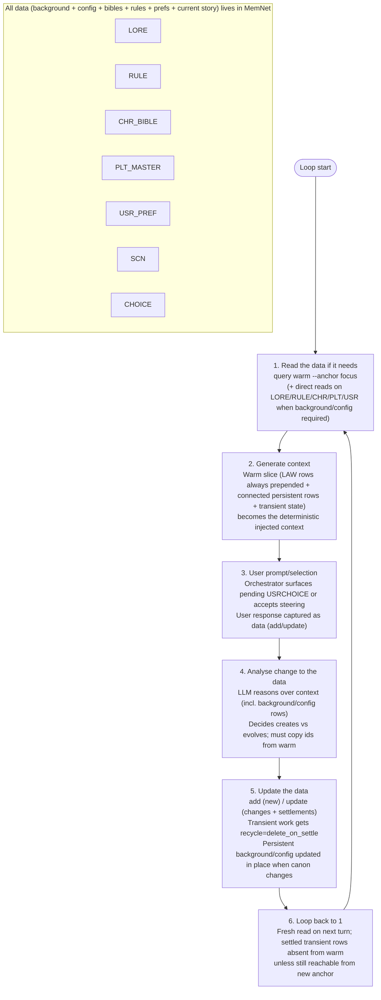

# LLM Novel Writer — A MemNet Application Note

**Single-file document example.** This file is self-contained. It demonstrates how to drive a long-form, user-steered novel writing session where *every* piece of data lives in MemNet.

Background, rules, characters, constraints and preferences are **not** kept as monolithic bibles or external files. They are broken into many small, independent rows:

- LORE — individual world facts, places, events, artefacts (one row per focused piece)
- RULE — single style, tone, mechanical or project constraints (one rule per row)
- CHR — character bibles and backstories (one character or focused facet per row)
- PLT — high-level arcs and volume structure (one arc/phase per row)
- USR — user writing preferences for *this* project (one key per row)
- LAW — core engine invariants (always prepended) plus domain constraints that act on other nodes, e.g. limiting NPC CHR ids to the N01-N99 range (one invariant per row)
- SCN / CHOICE — current scenes, beats and in-flight decisions (transient, settled when done)

A given piece of background is only pulled into the LLM's context for a turn when it is needed — either by anchoring directly on it or (more commonly) when an EDG link from the current live focus (scene, choice, etc.) reaches it. The rest stays out of the warm slice.

No external lore files, no hidden system prompts, no "the model will remember." The graph is the single source of truth. The session can be snapshotted and resumed with `session save` / `session load`.

## The 6-Step Pipeline (the repeating loop)

This is the disciplined loop the orchestrator + LLM follow on every turn. The document's worked examples are structured strictly around these steps.

1. **Read the data if it needs** — selective `query warm --anchor <focus>` (current SCN/CHR/CHOICE, or direct anchors on LORE/RULE/CHR_BIBLE/PLT_MASTER/USR_PREF when background or configuration is required). Use `--depth` and EDG links (the explicit wiring rows) to pull only the connected reference material. Never rely on prior chat messages for facts.

2. **Generate context** — the warm result (LAW rows — core invariants plus domain constraints such as NPC id ranges — are *always* prepended, plus connected persistent reference rows + current transient state) becomes the deterministic context injected into the LLM prompt. This is external memory, not hallucinated lore.

3. **User prompt/selection** — the orchestrator surfaces any pending USRCHOICE or accepts free-form steering from the human. The user's input or selection is recorded as first-class data (usually by `add` or `update` of a choice/decision row).

4. **Analyse change to the data** — the LLM reasons over the injected context (explicitly referencing persistent background/configuration rows by id, e.g. "per RULE03", "as described in LORE01", "per LAW-CHRID for the next NPC id"). It decides what must be created or evolved and *must* copy ids from the warm output.

5. **Update the data** — execute `add` for brand-new entities and `update` for changes/settlements/resolutions. Transient creative work (scenes, choices, active beats) is settled with `recycle=delete_on_settle` (or `delete_on_expire`) once resolved. Persistent background/configuration rows are updated in place *only* when the story legitimately changes the canon.

6. **Loop** — return to step 1. The next turn begins with a fresh read. Settled transient rows disappear from `query warm` (unless still connected to the new anchor).

After heavy settlement, optionally run `housekeep prune recyclable --apply` to physically remove settled rows and free cap space. Reference material (LORE facts, RULE constraints, focused CHR bibles/facets, master PLT, USR prefs) is never settled away.

**Persistent vs transient (quick legend)**

- Persistent (survives settlements, visible when anchored or reached via EDG links): many small LORE facts, individual RULEs, LAW rows (core + domain constraints on other nodes, e.g. NPC id ranges), focused CHR bibles/facets, PLT/ARC master arcs, USR prefs. Each is its own row and is only injected when the current anchor reaches it.
- Transient (created/updated during the current writing, settled with `delete_on_settle` once done): SCN (current/draft scenes), CHOICE (pending decisions), active chapter/beat work.

## Part A: Schema (the user tag map)

This is the map you feed to `memnet session open --map-file`. It defines only the *user* tags for this domain. Fixed tags (EDG and LAW) are always present and do not appear here. LAW rows carry the four core engine invariants (node uniqueness, edge recycle, endpoint validation, escaping) plus any domain constraints you seed (e.g. id ranges or format rules that govern creation of CHR, SCN and other rows); they are prepended to every warm output and are therefore impossible to ignore when minting or wiring new nodes.

```text
@LORE: id|name|kind|text|recycle
@RULE: id|name|scope|text|recycle
@CHR: id|name|role|traits|backstory|status|recycle
@PLT: id|title|phase|summary|status|recycle
@USR: id|key|value|recycle
@SCN: id|ch|title|summary|text|recycle
@CHOICE: id|scn|prompt|options|chosen|recycle
```

EDG relations used in this example (seed a few at start or use `--allow-new-relation` when genuinely new): `set_in`, `features`, `governs`, `continues`, `resolves`, `costs`, `influences`.

**EDG rows — the explicit wiring for selective context**

EDG is a *fixed, built-in tag* (always available; never declared in your map). It models directed, named links between any rows:

```
@EDG: E99|SRC_ID|relation|DST_ID|optional_attrs|recycle
```

**Core function in the pipeline:**
- They are how you declare "this scene is *set_in* this lore", "this character *features* here", "this rule *governs* that character", "this beat *costs* this person".
- `query warm --anchor <focus> --depth N` traverses EDG links to pull in *only* the connected persistent background, bibles and rules the current focus needs. Without the right EDGs, anchoring on a SCN or CHOICE would return almost nothing but the prepended LAW rows (core invariants plus any domain constraints such as id rules) + the anchor itself.
- LAW01 (`edge_recycle`) keeps the warm slice clean: most transient EDGs (and the rows they point to) are hidden from context unless the anchor is at src or dist.
- You manage them with the same `add`/`update` discipline as nodes (copy ids from warm; use `--allow-new-relation` only for genuinely new relation verbs). They are first-class data, not implicit "the LLM will remember the connection".

In short: EDG is the mechanism that makes "read only what the anchor can reach" reliable and deterministic for long-running work.

**LAW rows — the always-present constraints that govern other nodes**

LAW is a *fixed, built-in tag* (always available; never declared in your map). The engine guarantees that the core LAW rows are prepended to every `query warm` result. Their fields describe invariants the orchestrator and LLM must respect on every add or update:

```
@LAW: id|name|cycle|mechanism|constraint
```

The four core LAWs (seeded at the start of every project) are:

```text
@LAW: LAW01|edge_recycle|on_context|hide|delete_on_expire and delete_on_settle EDG unless anchor touches src or dist
@LAW: LAW02|node_id|on_add|unique|one row per global id use add then update same tag only
@LAW: LAW03|edge_endpoints|on_add|validate|prefer src and dist to reference existing node ids before settle
@LAW: LAW04|field_escape|on_add|use_backslash|pipe inside one field value is backslash pipe not bare pipe
```

**Core function in the pipeline:**

- LAW02 (`node_id`) is the reason you must read first, copy the exact id, and use `add` only for truly new things (or `update` for existing). It is enforced at ingest.
- LAW01 (`edge_recycle`) and LAW03 (`edge_endpoints`) work with EDG to keep warm slices clean and wiring sound.
- LAW04 protects the wire format itself.

**LAW rows as constraints on other nodes (the useful pattern here)**

Beyond the engine invariants, LAW rows are the natural and visible place to declare *domain* constraints that must govern how you create or evolve other rows (CHR, SCN, etc.). Because every warm output begins with the LAW rows, the LLM literally cannot miss them when it reasons about minting a new id or adding a link.

Example in this note: supporting NPCs are represented by CHR rows whose ids are restricted to the N01-N99 range (main viewpoint characters keep the CHRxx style for clarity). We seed a persistent domain LAW row that states the rule. When the writer needs a new villager, witness or minor figure, the analysis step reads the prepended LAW-CHRID and chooses the next free id in range (e.g. N03). The new CHR is added in the same disciplined batch as any other work for the turn. The constraint row itself stays in the graph (persistent) and will appear at the top of every future warm.

In short: treat LAW rows (core plus your project ones) as the single source of truth for "how nodes of this kind are allowed to exist." EDG wires *which* instances are relevant; LAW tells you the rules for creating and naming the instances in the first place.

**Background is many small pieces, referred only when needed**

Because the persistent material itself is stored as many small rows rather than one giant bible, the warm slice for any turn contains only the fragments the current focus actually needs. In the seed you see separate LORE01/LORE02, four RULE rows, the four core LAWs plus LAW-CHRID (the domain constraint on NPC CHR ids), individual CHR entries, etc. When you later need a specific rule, lore fact or constraint in isolation you can anchor directly on it (as Turn 3 does with RULE02). Most of the time the relevant pieces arrive automatically because earlier turns wired them with EDG from the scenes or choices that depend on them (and the LAW rows are prepended unconditionally). Unrelated background stays out of context and out of the way.

## Part B: Initial Seed (complete starting state)

Copy the block below (or extract it via heredoc) and feed it to `memnet add --stdin` after opening the session with the schema above. This populates the graph with *all* initial data as many small pieces: the LORE facts, RULE constraints, the core LAWs plus domain LAW constraints (such as the NPC id range), CHR bibles, PLT arc, USR prefs, the opening scene, *and the EDG links that wire the scene (and later scenes) to only the reference rows they need*. Persistent rows use `persistent` (or omit the field); the opening scene (and its transient links) are marked for settlement so they drop out of warm once resolved.

```text
@LAW: LAW01|edge_recycle|on_context|hide|delete_on_expire and delete_on_settle EDG unless anchor touches src or dist
@LAW: LAW02|node_id|on_add|unique|one row per global id use add then update same tag only
@LAW: LAW03|edge_endpoints|on_add|validate|prefer src and dist to reference existing node ids before settle
@LAW: LAW04|field_escape|on_add|use_backslash|pipe inside one field value is backslash pipe not bare pipe
@LAW: LAW-CHRID|npc_chr_id|on_add|N[0-9]{2}|CHR rows for NPCs (supporting non-protagonist figures) must use ids N01-N99 sequential; never reuse or exceed the range. Viewpoint characters keep CHRxx. Hard project constraint, visible on every turn.|persistent

@LORE: LORE01|The Ashen Marches|region|A blasted frontier where the Ashblight creeps nightly. Ash is both dust and hunger. Villages survive by flame-runes and hard bargains.|persistent
@LORE: LORE02|Ashblight|malady|Living dust that devours crops, breath, and memory. Only certain relics and prices can turn it.|persistent

@RULE: RULE01|Grim tone|voice|Close third, spare prose, no heroic fanfare. Hope is earned and usually costs.|persistent
@RULE: RULE02|Power costs|magic|Every working of power demands a personal, lasting price. No clean victories.|persistent
@RULE: RULE03|Scene economy|pacing|One clear change of state or knowledge per scene. End on consequence or decision.|persistent
@RULE: RULE04|User prefs|project|Keep scenes concise. Favour internal cost over spectacle. When in doubt, tighten.|persistent

@CHR: CHR01|Kael Voss|protagonist|stoic|scarred ex-warder|Once broke an oath to save a town; the guilt still governs him. Fears becoming the thing he fought.|haunted|persistent
@CHR: CHR02|Elder Sira|mentor|pragmatic|village elder|Will sacrifice anything to keep the last families alive. Sees Kael as the last usable weapon.|persistent

@PLT: PLT01|The Ash Crown|volume-1|Kael must decide what (and who) he is willing to burn to stop the blight from reaching the last safe valley.|active|persistent

@USR: USR01|scene_length|concise|persistent
@USR: USR02|voice|close-third-cost|persistent

@SCN: SCN01|01|The Last Hearth|Kael arrives at the last unblighted village as the Ash wind rises. Elder Sira waits with a relic and a price.|The hearth is the only light for miles. Sira offers the Crown-ash relic: it can turn the blight, but using it will mark the bearer with an ever-hungrier hunger. Three paths are possible: burn the relic and the village with it, bargain with the Ash directly, or flee with the sick and abandon the rest. The choice will change Kael and the land.|delete_on_settle

@EDG: E01|SCN01|set_in|LORE01||persistent
@EDG: E02|SCN01|features|CHR01||persistent
@EDG: E03|SCN01|features|CHR02||persistent
@EDG: E04|CHR01|governs|RULE02||persistent
```

## The 6-Step Pipeline (command-level view)

**Orchestrator responsibilities (the harness around the LLM):**
- Always begin the turn with a read (step 1).
- Inject exactly the warm output (plus any directly read background) as the context (step 2).
- Surface choices or steering to the human and turn the response into data rows (step 3).
- Execute only the `add`/`update` commands the LLM emits in step 5 (after validation / dry-run if nervous).
- After settlement, optionally prune; always start the next turn with a fresh read.

The LLM never "remembers" ids or facts across turns. It only ever sees what step 1 + 2 put in front of it.

## Part D: Worked Turns (the pipeline in action)

Three compact turns. Each is shown strictly as the six numbered steps. Warm output excerpts include the prepended `@LAW:` rows (core invariants plus any domain constraints). All ids are copied from the warm/context output. Transient rows are settled with `delete_on_settle` when their work is done. One turn demonstrates a legitimate update to a persistent RULE when the story changes the world's "canon." Turn 1 also demonstrates obeying a domain LAW constraint (LAW-CHRID) when minting a supporting NPC CHR id in the N01-N99 range.

### Turn 1 — The First Hard Choice

**User prompt/steering:** "Kael reaches the village. The elder offers the relic. Give the player a real, costly choice. Do not resolve it yet."

**Step 1 — Read the data if it needs**
```
memnet query warm --anchor SCN01 --depth 2 --max-rows 30
```

**Step 2 — Generate context (warm output excerpt)**
```
@LAW: LAW01 edge_recycle on_context hide delete_on_expire and delete_on_settle EDG unless anchor touches src or dist
@LAW: LAW02 node_id on_add unique one row per global id use add then update same tag only
@LAW: LAW03 edge_endpoints on_add validate prefer src and dist to reference existing node ids before settle
@LAW: LAW04 field_escape on_add use_backslash pipe inside one field value is backslash pipe not bare pipe
@LAW: LAW-CHRID npc_chr_id on_add N[0-9]{2} CHR rows for NPCs (supporting non-protagonist figures) must use ids N01-N99 sequential; never reuse or exceed the range. Viewpoint characters keep CHRxx. Hard project constraint, visible on every turn.
@LORE: LORE01|The Ashen Marches|region|...
@LORE: LORE02|Ashblight|malady|...
@RULE: RULE01|Grim tone|voice|...
@RULE: RULE02|Power costs|magic|Every working of power demands a personal, lasting price...
@RULE: RULE03|Scene economy|pacing|...
@CHR: CHR01|Kael Voss|protagonist|stoic|...|haunted|persistent
@CHR: CHR02|Elder Sira|mentor|pragmatic|...|persistent
@SCN: SCN01|01|The Last Hearth|Kael arrives...|...|delete_on_settle
@EDG: E01|SCN01|set_in|LORE01||persistent
@EDG: E02|SCN01|features|CHR01||persistent
@EDG: E03|SCN01|features|CHR02||persistent
```

**Step 3 — User prompt/selection**
The user prompt above is the steering. The agent will surface the dilemma as a pending choice row rather than resolving it in prose. (The human will pick later.)

**Step 4 — Analyse change to the data**
"Context gives me LORE01/02, RULE02 (power costs), CHR01 (Kael's guilt), and the current SCN01. Per RULE03 we end on a decision. I will not write the choice in the scene text; instead I add a CHOICE row so the human decides. I will copy ids exactly: SCN01, CHR01, RULE02, LORE01. New id for the choice: CHOICE01. Relation `resolves` is new here; I will use `--allow-new-relation` once.

LAW-CHRID is visible (prepended, as all LAW rows are). For the supporting NPC who can speak to the relic's local reputation in the choice prompt I will mint a compliant id: N03 (next in N01-N99). Add CHR N03 (persistent, so the character stays in the world model) and a features EDG from SCN01 (persistent link, same pattern as CHR01/02). New edge id: E05."

**Step 5 — Update the data**
```
memnet add --allow-new-relation --stdin @"
@CHR: N03|Jory|witness|apprentice|soot-stained mill hand|Saw his family taken by the blight last moon; trusts the relic more than any stranger from the Marches.|frightened|persistent
@EDG: E05|SCN01|features|N03||persistent
@CHOICE: CHOICE01|SCN01|The elder offers the Crown-ash relic. Using it will mark the bearer with an ever-hungrier hunger. Three paths: burn the relic and the village with it; bargain with the Ash directly through the relic; flee with the sick and abandon the rest. What does Kael do?|Burn the relic / Bargain with the Ash / Flee with the sick||delete_on_settle
"@
```

**Step 6 — Loop**
Next turn will start with a fresh `query warm --anchor CHOICE01` (or SCN01). The choice row is now the live focus. SCN01 remains visible while the choice is unresolved. The new N03 (NPC CHR) and its persistent features link from SCN01 will be reachable from anchors that touch the village scene or that explicitly reach N03; per LAW-CHRID any future supporting NPCs will continue the Nxx sequence.

(After this turn the orchestrator might optionally prune if other settled rows existed, but here the graph is still small.)

### Turn 2 — The Human Chooses; Consequence Is Written

**User prompt/selection:** "I choose 'Bargain with the Ash'. Kael accepts the mark to save the village. Show the immediate cost and move to the next scene."

**Step 1 — Read the data if it needs**
```
memnet query warm --anchor CHOICE01 --depth 2 --max-rows 30
```

**Step 2 — Generate context**
Warm now surfaces the pending CHOICE01, the still-active SCN01, linked LORE/RULE/CHR, and the prepended LAW rows (not repeated here for brevity).

**Step 3 — User prompt/selection**
The human's choice text is captured. The orchestrator will turn it into an update of CHOICE01 and a new scene.

**Step 4 — Analyse change to the data**
"CHOICE01 is still open. Per RULE02 the bargain must cost Kael something permanent. I will:
- update CHOICE01 with chosen and a short consequence note
- update CHR01 status to reflect the new hunger/mark (canon change to character)
- add SCN02 for the immediate aftermath
- settle CHOICE01 and SCN01 with delete_on_settle
- add one EDG from SCN02 to CHR01 (features) and one to LORE02 (set_in)
I will copy every id from the current warm output. No new ids for existing people."

**Step 5 — Update the data**
```
memnet update --stdin @"
@CHOICE: CHOICE01|SCN01|The elder offers the Crown-ash relic...|Burn the relic / Bargain with the Ash / Flee with the sick|Bargain with the Ash|Kael accepts the Ash mark to spare the village. The hunger now lives in him.|delete_on_settle
@CHR: CHR01|Kael Voss|protagonist|stoic|scarred ex-warder|Once broke an oath... Now carries the Ash hunger as a living brand. The mark answers when he is weak.|marked|persistent
@SCN: SCN02|02|The Mark Settles|The bargain is struck at the hearth. Ash coils into Kael's scar and does not leave. The village is spared for now; the debt has a name.|Kael's breath frosts black at the edges. He can feel the blight listening. Sira watches with relief and horror. The relic is quiet, but something else is awake inside the man.|delete_on_settle
@EDG: E05|SCN02|set_in|LORE02||persistent
@EDG: E06|SCN02|features|CHR01||persistent
"@
```

**Step 6 — Loop**
Next read (e.g. `query warm --anchor SCN02`) will not show the settled CHOICE01 or SCN01 unless they remain directly connected to the new anchor. CHR01 (persistent) and the LORE/RULE rows remain available.

### Turn 3 — A Canon Change to a Persistent Rule

**User prompt/steering:** "The hunger is worse than we said. Update the world's rule about power costs to make the price steeper and more personal. Then show Kael feeling the new cost in the next quiet moment."

**Step 1 — Read the data if it needs**
```
memnet query warm --anchor RULE02 --depth 1
# (direct anchor on the persistent rule; also read current SCN for context)
memnet query warm --anchor SCN02 --depth 1 --max-rows 20
```

**Step 2 — Generate context**
Warm on RULE02 surfaces the current (old) text plus linked LORE/CHR. Warm on SCN02 surfaces the recent scene + its connections. LAW rows are prepended in both.

**Step 3 — User prompt/selection**
The steering is a direct request to change a persistent world rule. The orchestrator treats this as an update to RULE02 (canon revision) plus a follow-on scene.

**Step 4 — Analyse change to the data**
"User wants a steeper, more personal cost in RULE02. I must read the current text first (done), then update the row in place because this is a legitimate canon change. I will also add a short follow-on beat (SCN03) showing Kael experiencing the harsher price, settle SCN02, and link the new scene. Copy ids: RULE02, SCN02, CHR01, LORE02."

**Step 5 — Update the data**
```
memnet update --stdin @"
@RULE: RULE02|Power costs|magic|Every working of power demands a personal, lasting price — and the price now grows with use. The Ash remembers what you gave and asks for more next time. There is no ceiling.|persistent
@SCN: SCN03|03|The Hunger Answers|A quiet hour after the bargain. Kael tries to warm a dying child with a spark of will. The Ash answers — and takes a memory he did not mean to offer.|Kael's spark saves the child, but when he wakes the next morning he cannot remember the name of his first dog. The hunger is not satisfied; it is awake and counting.|delete_on_settle
@EDG: E07|SCN03|set_in|LORE02||persistent
@EDG: E08|SCN03|costs|CHR01||persistent
"@
```

**Step 6 — Loop**
Next turn begins with `query warm --anchor SCN03`. RULE02 (updated) remains visible when needed because it is persistent and connected. SCN02 is now absent from warm unless explicitly reached.

## Snapshot (full project state)

At any point you can capture *everything* — current story plus all background, configs, bibles, rules, and user prefs:

```powershell
memnet session save --file my-novel.snap
```

Later (new machine, new terminal, after a break):

```powershell
memnet session load --file my-novel.snap
# or --keep-id if you want the old session id
```

The resulting session contains the complete novel project as many small rows. Warm reads surface only the fragments the current anchor (plus its EDG links) can reach — including whichever persistent reference pieces are relevant this turn.

## Pipeline-Aware Pitfalls (and how the design helps)

- **Skipping the read (step 1)** and "remembering" that Kael has trait X from earlier chat → you invent a new CHR id or use the wrong status. Fix: every turn starts with `query warm --anchor ...`; copy ids from the output you actually received.
- **Treating background as external notes or "the model knows"** → LORE/RULE/CHR bibles live only in the graph. If you do not read them this turn, they are not in context. Fix: anchor on them or ensure EDG links when you need them.
- **Using `add` for something that already exists** → `id_exists` (good). Fix: read first, then `update` with the exact id from warm.
- **Forgetting to settle transient work** → `query warm` keeps showing old scenes and choices. Fix: when a scene or choice is done, `update` it with the appropriate `delete_on_settle` (and usually a status change).
- **Mutating a RULE or CHR bible without reading it first in the turn** → you may contradict the current text or use a stale version. Fix: read the row (direct warm anchor or via links), then update.
- **Ignoring a domain LAW constraint when creating nodes** (e.g. minting a new NPC CHR as C17, CHR-foo or reusing N01 for a different villager) → the world model fractures; later slices cannot find the character reliably and traceability via EDG or direct anchor breaks. Fix: LAW rows (core + domain) are prepended at the top of every warm; read LAW-CHRID (or whichever applies), then choose a fresh compliant id and `add`.
- **Anchoring only on a settled transient id** → warm returns mostly LAW and feels "empty." Fix: move the anchor to the new live SCN/CHR/CHOICE after settlement.
- **Generating "new context" in prose instead of reading rows** → the story drifts from the recorded canon. Fix: the only context that matters is what step 1 + 2 put in the prompt.

## Quick-Start (copy-paste these commands)

```powershell
# Terminal 1
memnet serve
# note the MEMNET_SERVE address if it is not the default

# Terminal 2 (client)
# 1. Extract the schema block (Part A above, the @LORE: ... lines only) to a temp map file.
# PowerShell example:
@'
@LORE: id|name|kind|text|recycle
@RULE: id|name|scope|text|recycle
@CHR: id|name|role|traits|backstory|status|recycle
@PLT: id|title|phase|summary|status|recycle
@USR: id|key|value|recycle
@SCN: id|ch|title|summary|text|recycle
@CHOICE: id|scn|prompt|options|chosen|recycle
'@ | Out-File -Encoding utf8 $env:TEMP\novel.map.txt

memnet session open --map-file $env:TEMP\novel.map.txt
# stderr will print something like: MEMNET_SESSION=mn_3f8a2c1d
$env:MEMNET_SESSION = "mn_3f8a2c1d"

# 2. Add the initial seed (Part B block, the @LAW: ... through the final @EDG: wiring lines). The LAWs (core + domain constraints) and EDGs are what let the first warm surface the right background, rules and id discipline for SCN01.
# Again using a heredoc for clarity; in practice you can also use --file.
memnet add --stdin @"
@LAW: LAW01|edge_recycle|on_context|hide|delete_on_expire and delete_on_settle EDG unless anchor touches src or dist
@LAW: LAW02|node_id|on_add|unique|one row per global id use add then update same tag only
@LAW: LAW03|edge_endpoints|on_add|validate|prefer src and dist to reference existing node ids before settle
@LAW: LAW04|field_escape|on_add|use_backslash|pipe inside one field value is backslash pipe not bare pipe
@LAW: LAW-CHRID|npc_chr_id|on_add|N[0-9]{2}|CHR rows for NPCs (supporting non-protagonist figures) must use ids N01-N99 sequential; never reuse or exceed the range. Viewpoint characters keep CHRxx. Hard project constraint, visible on every turn.|persistent
@LORE: LORE01|The Ashen Marches|region|A blasted frontier where the Ashblight creeps nightly. Ash is both dust and hunger. Villages survive by flame-runes and hard bargains.|persistent
@LORE: LORE02|Ashblight|malady|Living dust that devours crops, breath, and memory. Only certain relics and prices can turn it.|persistent
@RULE: RULE01|Grim tone|voice|Close third, spare prose, no heroic fanfare. Hope is earned and usually costs.|persistent
@RULE: RULE02|Power costs|magic|Every working of power demands a personal, lasting price. No clean victories.|persistent
@RULE: RULE03|Scene economy|pacing|One clear change of state or knowledge per scene. End on consequence or decision.|persistent
@RULE: RULE04|User prefs|project|Keep scenes concise. Favour internal cost over spectacle. When in doubt, tighten.|persistent
@CHR: CHR01|Kael Voss|protagonist|stoic|scarred ex-warder|Once broke an oath to save a town; the guilt still governs him. Fears becoming the thing he fought.|haunted|persistent
@CHR: CHR02|Elder Sira|mentor|pragmatic|village elder|Will sacrifice anything to keep the last families alive. Sees Kael as the last usable weapon.|persistent
@PLT: PLT01|The Ash Crown|volume-1|Kael must decide what (and who) he is willing to burn to stop the blight from reaching the last safe valley.|active|persistent
@USR: USR01|scene_length|concise|persistent
@USR: USR02|voice|close-third-cost|persistent
@SCN: SCN01|01|The Last Hearth|Kael arrives at the last unblighted village as the Ash wind rises. Elder Sira waits with a relic and a price.|The hearth is the only light for miles. Sira offers the Crown-ash relic: it can turn the blight, but using it will mark the bearer with an ever-hungrier hunger. Three paths are possible: burn the relic and the village with it, bargain with the Ash directly, or flee with the sick and abandon the rest. The choice will change Kael and the land.|delete_on_settle
@EDG: E01|SCN01|set_in|LORE01||persistent
@EDG: E02|SCN01|features|CHR01||persistent
@EDG: E03|SCN01|features|CHR02||persistent
@EDG: E04|CHR01|governs|RULE02||persistent
"@

# 3. First read (start of your first pipeline cycle)
memnet query warm --anchor SCN01 --depth 2 --max-rows 30

# 4. Now follow the 6 steps for real. Example first read of Turn 1:
# memnet query warm --anchor SCN01 --depth 2 --max-rows 30
# ... think ...
# memnet add --allow-new-relation --stdin @" ... @CHOICE ... "@
# (then wait for user choice, then continue the loop)
```

Bash users: use `cat <<'EOF' > /tmp/novel.map.txt` and `memnet add --stdin <<'EOF' ... EOF`.

## Diagram — The 6-Step Pipeline as a Loop



**Persistent vs transient (legend for the diagram above)**

- Persistent (stays across settlements, visible when anchored or reached via EDG links): many small LORE facts, individual RULEs, LAW rows (core engine invariants plus domain constraints such as NPC id ranges), focused CHR bibles/facets, PLT/ARC master arcs, USR prefs. Each piece is its own row and appears only when needed.
- Transient (created/updated during writing, settled with `delete_on_settle` once done): SCN (current scenes), CHOICE (pending decisions), active chapter/beat work.

---

**Read this file at the start of any novel-writing project that uses MemNet.** The schema, the seed pattern, the 6-step loop, and the id + recycle discipline are the whole game. Everything else (voice, plot, theme) is just what you put into the rows.