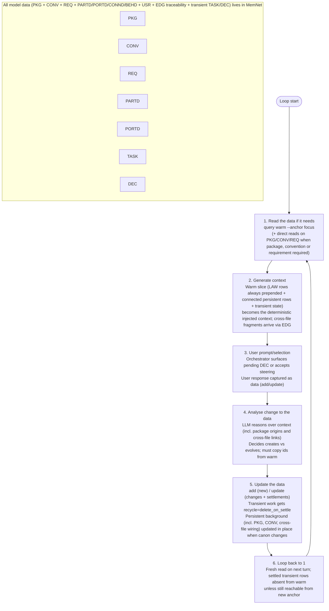

# LLM SysML v2 Modeling — A MemNet Application Note

**Single-file document example.** This file is self-contained. It demonstrates how to drive a long-form, user-steered SysML v2 textual modeling session where *every* piece of data lives in MemNet.

Background, conventions, requirements, model elements (parts, ports, connections, behaviours), traceability links, user preferences, current focus tasks and open decisions are **not** kept as monolithic bibles, external files, or scattered chat state. They are broken into many small, independent rows:

- PKG — logical source files / packages in the split .sysml project (one row per major file or package, with path; enables cross-file unification)
- CONV — cross-cutting modeling conventions, naming rules, attribute styles, traceability rules (one rule per row)
- USR — per-project modeller preferences (one key per row)
- REQ — individual requirements (one per row, with reqId for traceability)
- PARTD / PORTD / CONND / BEHD — core SysML element definitions (one focused element, usage or facet per row)
- TASK / DEC / ISSUE — transient current focus, open decisions and issues (settled with delete_on_settle when resolved)

A given piece of background or model element (including a definition whose authoritative text lives in a different .sysml file on disk) is only pulled into the LLM's context for a turn when it is needed — either by anchoring directly on it or (more commonly) when an EDG link from the current live focus (task, part, port, decision, etc.) reaches it. Cross-file references are first-class: elements carry a declaredIn EDG to their logical @PKG row; warm + EDG traversal pulls only the needed fragments from other packages without the agent opening multiple files or remembering locations. The rest stays out of the warm slice.

The graph is the single place where elements from different source files are referred to together. No external model bibles for the agent, no hidden system prompts, no "the model will remember the other file." The graph is the single source of truth for the modeling session. The session can be snapshotted and resumed with `session save` / `session load`. This note itself can hold and "deploy" the whole (unified) model as rows for quick reference or as a canonical starting state, even though the real project splits the authoritative SysML v2 text across multiple .sysml files.

## The 6-Step Pipeline (the repeating loop)

This is the disciplined loop the orchestrator + LLM follow on every turn. The document's worked examples are structured strictly around these steps.

1. **Read the data if it needs** — selective `query warm --anchor <focus>` (current TASK/DEC/PARTD/PORTD or direct anchors on CONV/REQ/PKG when a convention, requirement or package origin is required). Use `--depth` and EDG links (the explicit wiring rows, including declaredIn and cross-package links) to pull only the connected reference material. Never rely on prior chat messages or "the other .sysml file" for facts.

2. **Generate context** — the warm result (LAW rows are *always* prepended, plus connected persistent reference rows + current transient state) becomes the deterministic context injected into the LLM prompt. This is external memory, not hallucinated model or "I remember the library package."

3. **User prompt/selection** — the orchestrator surfaces any pending DEC or accepts free-form steering from the human modeller. The user's input or selection is recorded as first-class data (usually by `add` or `update` of a decision or task row).

4. **Analyse change to the data** — the LLM reasons over the injected context (explicitly referencing persistent background, conventions, requirements and package origins by id, e.g. "per CONV03", "as described in PKG-LIB", "satisfies REQ-05 via E22"). It decides what must be created or evolved and *must* copy ids from the warm output.

5. **Update the data** — execute `add` for brand-new elements and `update` for changes/settlements/resolutions. Transient modeling work (tasks, decisions, in-flight edits) is settled with `recycle=delete_on_settle` (or `delete_on_expire`) once resolved. Persistent background, conventions, requirements, element defs and package origins are updated in place *only* when the model legitimately changes the canon. Cross-file wiring (declaredIn, typedBy from another package, satisfies spanning packages) is emitted explicitly.

6. **Loop** — return to step 1. The next turn begins with a fresh read. Settled transient rows disappear from `query warm` (unless still connected to the new anchor).

After heavy settlement, optionally run `housekeep prune recyclable --apply` to physically remove settled rows and free cap space. Reference material (PKG, CONV, USR, REQ, core PARTD/PORTD/CONND/BEHD defs and their traceability EDG) is never settled away.

**Persistent vs transient (quick legend)**

- Persistent (survives settlements, visible when anchored or reached via EDG links): many small PKG (logical files/packages), individual CONV, USR prefs, REQ, focused PARTD/PORTD/CONND/BEHD defs and the EDG that wire them (including declaredIn to their package of origin and cross-package typedBy/satisfies/allocates). Each is its own row and is only injected when the current anchor reaches it — even if its authoritative .sysml text lives in a different file.
- Transient (created/updated during the current modeling, settled with `delete_on_settle` once done): TASK (current focus), DEC (pending decisions), ISSUE (open issues), in-flight edits and temporary links.

## Part A: Schema (the user tag map)

This is the map you feed to `memnet session open --map-file`. It defines only the *user* tags for this domain. Fixed tags (EDG and LAW) are always present and do not appear here.

```text
@PKG: id|name|path|doc|recycle
@CONV: id|name|category|text|recycle
@USR: id|key|value|recycle
@REQ: id|reqId|category|text|recycle
@PARTD: id|name|kind|attrs|doc|recycle
@PORTD: id|name|dir|protocol|attrs|recycle
@CONND: id|name|flow|attrs|recycle
@BEHD: id|name|kind|summary|recycle
@TASK: id|goal|anchor|status|recycle
@DEC: id|focus|prompt|options|chosen|note|recycle
@ISSUE: id|title|status|detail|recycle
```

EDG relations used in this example (seed a few at start or use `--allow-new-relation` when genuinely new): `satisfies`, `allocates`, `contains`, `hasPort`, `typedBy`, `realizes`, `dependsOn`, `declaredIn`.

**EDG rows — the explicit wiring for selective context**

EDG is a *fixed, built-in tag* (always available; never declared in your map). It models directed, named links between any rows:

```
@EDG: E99|SRC_ID|relation|DST_ID|optional_attrs|recycle
```

**Core function in the pipeline:**
- They are how you declare "this controller *satisfies* this requirement", "this port *hasPort* on that part", "this port *typedBy* that interface (which happens to be defined in the library package)", "this element *declaredIn* this logical package/file", "this behaviour *allocates* to that hardware", "this package *contains* these elements".
- `query warm --anchor <focus> --depth N` traverses EDG links (including declaredIn and cross-package links) to pull in *only* the connected persistent background, conventions, requirements, package origins and element defs the current focus needs. Without the right EDGs, anchoring on a TASK or PARTD would return almost nothing but LAW + the anchor itself — even if the authoritative definition lives in another .sysml file.
- LAW01 (`edge_recycle`) keeps the warm slice clean: most transient EDGs (and the rows they point to) are hidden from context unless the anchor touches src or dist.
- You manage them with the same `add`/`update` discipline as nodes (copy ids from warm; use `--allow-new-relation` only for genuinely new relation verbs). They are first-class data, not implicit "the LLM will remember the connection or which file it came from".

In short: EDG (including declaredIn to @PKG) is the mechanism that makes "read only what the anchor can reach" — and "easily refer together elements whose models live in different files" — reliable and deterministic for long-running modeling work.

**Background is many small pieces, referred only when needed**

Because the persistent material itself is stored as many small rows rather than one giant "model" or per-file bibles the agent must keep open, the warm slice for any turn contains only the fragments the current focus actually needs. In the seed and full model block you will see separate @PKG rows for the logical library and project files, multiple distinct CONV rows, individual REQ, focused PARTD/PORTD etc., each carrying (via EDG) its package of origin. When you later need a specific convention, requirement or a type defined in the library package, you can anchor directly on it (as Turn 3 does with a CONV) or let the live focus's EDG (including cross-package typedBy or satisfies) pull it in. Most of the time the relevant pieces — even those whose .sysml source lives in a different file — arrive automatically because earlier turns wired them with EDG (declaredIn, typedBy, satisfies, etc.). Unrelated background or elements from unrelated packages stay out of context and out of the way.

The graph unifies the split-file reality: the modeller never has to open multiple .sysml files or paste content between them for the agent; ids + EDG + warm give precise, on-demand access across package boundaries.

## SysML v2 syntax to MemNet representation (quick reference table)

This table is a standalone lookup for how common SysML v2 textual constructs map to MemNet rows and wiring. Use it when translating between the .sysml text you edit on disk and the rows you add/update in MemNet.

| SysML v2 Construct              | MemNet Tag(s)          | Key Fields                          | Wiring / Links (EDG)                          | Recycle (typical) | Notes |
|--------------------------------|------------------------|-------------------------------------|-----------------------------------------------|-------------------|-------|
| part def / part usage          | @PARTD                | id\|name\|kind\|attrs\|doc         | contains (from PKG), hasPort, satisfies, allocates, declaredIn | persistent       | One row per focused part/usage. Direct anchor cheap for canon changes. |
| port def (with direction/protocol) | @PORTD             | id\|name\|dir\|protocol\|attrs     | hasPort (from part), typedBy (to item/interface, possibly in another PKG), declaredIn | persistent       | Cross-file: typedBy can reference a port/item def whose source is in PKG-LIB while the using port is declaredIn PKG-PDU. |
| connection def / flow          | @CONND (or EDG flow)  | id\|name\|flow\|attrs              | connects endpoints (via EDG), declaredIn      | persistent       | Use for explicit flows; or express via EDG between ports. |
| requirement def                | @REQ                  | id\|reqId\|category\|text          | satisfied by design via satisfies EDG, declaredIn | persistent       | One row per requirement. reqId for human traceability. |
| satisfy link                   | EDG (relation: satisfies) | —                              | src (design) → dist (REQ)                     | persistent       | Primary traceability from element to requirement. Emit in same batch as new design element (per CONV). |
| allocate link                  | EDG (relation: allocates) | —                            | src (behaviour) → dist (hardware part)        | persistent       | Software/behaviour to hardware allocation. |
| Logical package / source file in multi-file model | @PKG | id\|name\|path\|doc | contains (elements), declaredIn (reverse from elements) | persistent | One row per logical .sysml file or package. Path is the "file" identity. Enables "models in different files referred together". |
| Cross-file / cross-package reference or use of a definition from another file | EDG (typedBy, realizes, satisfies, dependsOn, etc.) | — | Between elements that may have different declaredIn PKG | persistent | The unification point. Warm on a local focus + depth pulls the remote definition via the link without opening the other file. |
| item / flow item for port types | (lightweight, via typedBy EDG or small @CONV) | — | typedBy from PORTD to the item def (possibly in PKG-LIB) | persistent | Keep item defs as either focused PARTD-like rows or convention text; reference via typedBy. |

## Part B: Initial Seed (complete starting state)

Copy the block below (or extract it via heredoc) and feed it to `memnet add --stdin` after opening the session with the schema above. This populates the graph with *all* initial data as many small pieces: the logical packages (representing the split .sysml files), conventions, requirements, element defs, and the EDG links that wire elements to their package of origin and to each other (including the first cross-package reference). Persistent rows use `persistent` (or omit the field); starter transient work is marked for settlement so it drops out of warm once the first focus is done.

```text
@LAW: LAW01|edge_recycle|on_context|hide|delete_on_expire and delete_on_settle EDG unless anchor touches src or dist
@LAW: LAW02|node_id|on_add|unique|one row per global id use add then update same tag only
@LAW: LAW03|edge_endpoints|on_add|validate|prefer src and dist to reference existing node ids before settle
@LAW: LAW04|field_escape|on_add|use_backslash|pipe inside one field value is backslash pipe not bare pipe

@PKG: PKG-LIB|library/power|library/power-ports.sysml|Shared power port definitions, interfaces and item types for spacecraft power distribution.|persistent
@PKG: PKG-PDU|project/pdu-controller|project/pdu-controller.sysml|6U CubeSat PDU controller: battery input, load switching, telemetry, command interface, allocation to MCU.|persistent

@CONV: CONV01|Naming|style|Parts: PascalCase. Ports: snake_case; power ports end in _pwr. Protocols: UPPER for known buses.|persistent
@CONV: CONV02|Voltage attrs|power|Use nominal_V for nominal voltage. Power ports carry _pwr suffix in name. Document isolation where required.|persistent
@CONV: CONV03|Traceability|project|New design elements (PARTD/PORTD) must wire satisfies to at least one REQ and declaredIn to their PKG in the same batch. Cross-package typedBy/realizes must be explicit.|persistent

@USR: USR01|trace_on_warm|always|persistent
@USR: USR02|row_style|compact|persistent

@REQ: REQ-01|REQ-01|power|Total PDU output budget 15 W average, 20 W peak.|persistent
@REQ: REQ-02|REQ-02|power|28 V nominal input (22-32 V range). Galvanic isolation on load side.|persistent
@REQ: REQ-03|REQ-03|telemetry|Status, current and voltage telemetry at 100 ms period.|persistent
@REQ: REQ-04|REQ-04|safety|All load switches must fail-open on command loss or watchdog.|persistent
@REQ: REQ-05|REQ-05|timing|Command accepted and first response telemetry < 10 ms.|persistent

@PARTD: PART-CTRL|PDUController|composite|power_distribution|Main PDU assembly. Aggregates battery input, load switching, telemetry and command interface. Software behaviour allocated to MCU.|persistent
@PARTD: PART-BATT|BatteryInterface|interface|power|28 V input with current/voltage sense.|persistent
@PARTD: PART-SW|LoadSwitchBank|module|power|4x independent load enables with current limit and status.|persistent
@PARTD: PART-RAIL|PowerRail|internal|power|Internal 5 V / 3V3 rails derived from input.|persistent
@PARTD: PART-MCU|MCU|compute|arm_cortex_m|Runs control logic, telemetry assembly and command handling. Behaviour allocated here.|persistent

@PORTD: PORT-PWRIN|pwr_in_28v|in|Power28V|28 V nom, current sense|persistent
@PORTD: PORT-CMD|cmd_uart|inout|UartCmd|Command interface (UART).|persistent
@PORTD: PORT-TEL|telem_uart|out|UartTelem|Telemetry output (UART).|persistent
@PORTD: PORT-LD1|load_en_1|out|Discrete|Load 1 enable (fail-open).|persistent

@TASK: TASK01|Bootstrap PDU package and core part def|PKG-PDU|in_progress|delete_on_settle

@EDG: E01|PKG-PDU|contains|PART-CTRL||persistent
@EDG: E02|PART-CTRL|declaredIn|PKG-PDU||persistent
@EDG: E03|PORT-PWRIN|declaredIn|PKG-PDU||persistent
@EDG: E04|PART-CTRL|hasPort|PORT-PWRIN||persistent
@EDG: E05|PART-CTRL|satisfies|REQ-01||persistent
@EDG: E06|PART-CTRL|satisfies|REQ-02||persistent
@EDG: E07|TASK01|declaredIn|PKG-PDU||delete_on_settle
```

(The starter TASK and its wiring ensure the first `query warm --anchor TASK01` surfaces the relevant PKG, CONV and REQ rows plus the cross-file story starter.)

## The 6-Step Pipeline (command-level view)

**Orchestrator responsibilities (the harness around the LLM):**
- Always begin the turn with a read (step 1).
- Inject exactly the warm output (plus any directly read background or package) as the context (step 2).
- Surface choices or steering to the human modeller and turn the response into data rows (step 3).
- Execute only the `add`/`update` commands the LLM emits in step 5 (after validation / dry-run if nervous). Ensure declaredIn, satisfies and cross-package links are present.
- After settlement, optionally prune; always start the next turn with a fresh read.

The LLM never "remembers" ids, facts, or "which file a type came from" across turns. It only ever sees what step 1 + 2 put in front of it.

## Part D: Worked Turns (the pipeline in action)

Three compact turns. Each is shown strictly as the six numbered steps. Warm output excerpts include the prepended `@LAW:` rows. All ids are copied from the warm/context output. Transient rows are settled with `delete_on_settle` when their work is done. One turn demonstrates a legitimate update to a persistent CONV when the modeling conventions change. At least one turn explicitly creates and uses a cross-file reference (definition originating in the library package wired into the PDU controller package).

### Turn 1 — Bootstrap Controller + Cross-File Interface Decision

**User prompt/steering:** "Begin work on the top-level PDUController in the project package. Surface any decision on the command channel interface (UART command vs simple GPIO enable). Use the shared CmdInterface type defined in the library package."

**Step 1 — Read the data if it needs**
```
memnet query warm --anchor TASK01 --depth 2 --max-rows 30
```

**Step 2 — Generate context (warm output excerpt)**
```
@LAW: LAW01 edge_recycle on_context hide delete_on_expire and delete_on_settle EDG unless anchor touches src or dist
@LAW: LAW02 node_id on_add unique one row per global id use add then update same tag only
@LAW: LAW03 edge_endpoints on_add validate prefer src and dist to reference existing node ids before settle
@LAW: LAW04 field_escape on_add use_backslash pipe inside one field value is backslash pipe not bare pipe
@PKG: PKG-LIB|library/power|library/power-ports.sysml|...
@PKG: PKG-PDU|project/pdu-controller|project/pdu-controller.sysml|...
@CONV: CONV01|Naming|style|...
@CONV: CONV02|Voltage attrs|power|...
@CONV: CONV03|Traceability|project|...
@REQ: REQ-01|REQ-01|power|...
@REQ: REQ-02|REQ-02|power|...
@REQ: REQ-05|REQ-05|timing|...
@PARTD: PART-CTRL|PDUController|composite|...|persistent
@PORTD: PORT-PWRIN|pwr_in_28v|in|...|persistent
@TASK: TASK01|Bootstrap PDU package and core part def|PKG-PDU|in_progress|delete_on_settle
@EDG: E01|PKG-PDU|contains|PART-CTRL||persistent
@EDG: E02|PART-CTRL|declaredIn|PKG-PDU||persistent
@EDG: E03|PORT-PWRIN|declaredIn|PKG-PDU||persistent
@EDG: E04|PART-CTRL|hasPort|PORT-PWRIN||persistent
@EDG: E05|PART-CTRL|satisfies|REQ-01||persistent
@EDG: E07|TASK01|declaredIn|PKG-PDU||delete_on_settle
```

**Step 3 — User prompt/selection**
The steering is the modelling task plus the interface choice. The agent will surface the dilemma as a pending decision row (DEC01) rather than hard-coding an assumption. The human will pick the UART path later. The shared CmdInterface type lives in PKG-LIB; we will reference it via typedBy (cross-file).

**Step 4 — Analyse change to the data**
"Context gives me PKG-LIB and PKG-PDU, CONV01/02/03 (naming, voltage, traceability), REQ-01/02/05, the starter PART-CTRL and PORT-PWRIN, and TASK01. Per CONV03 I must wire satisfies + declaredIn in the same batch. The CmdInterface type is defined in PKG-LIB (visible via the library package row and prior cross references in warm). I will not invent a local duplicate. I will add a transient DEC01 with the two options, the chosen PART/PORT updates, a new PORT for the command channel typedBy the library interface (cross-file), the required EDG batch (declaredIn to PKG-PDU, hasPort, satisfies, typedBy crossing to PKG-LIB), and settle TASK01. Copy every id exactly: PKG-LIB, PKG-PDU, CONV03, REQ-05, TASK01, PORT-PWRIN. New ids only for DEC01 and the new command port."

**Step 5 — Update the data**
```
memnet add --allow-new-relation --stdin @"
@DEC: DEC01|TASK01|Command channel interface for PDUController. UART (full cmd/telem) vs simple GPIO enable lines. UART re-uses the shared CmdInterface type from the library package.|UART (shared CmdInterface) / Simple GPIO enable||delete_on_settle
@PARTD: PART-CTRL|PDUController|composite|power_distribution|Main PDU assembly. Aggregates battery input, load switching, telemetry and command interface. Software behaviour allocated to MCU.|persistent
@PORTD: PORT-CMD|cmd_uart|inout|UartCmd|Command interface using the shared CmdInterface type from library.|persistent
@EDG: E08|DEC01|declaredIn|PKG-PDU||delete_on_settle
@EDG: E09|PORT-CMD|declaredIn|PKG-PDU||persistent
@EDG: E10|PORT-CMD|typedBy|PORTD-LIB-CMDIF||persistent
@EDG: E11|PART-CTRL|hasPort|PORT-CMD||persistent
@EDG: E12|PART-CTRL|satisfies|REQ-05||persistent
@EDG: E13|PART-CTRL|declaredIn|PKG-PDU||persistent
@EDG: E14|TASK01|declaredIn|PKG-PDU||delete_on_settle
"@
memnet update --stdin @"
@TASK: TASK01|Bootstrap PDU package and core part def|PKG-PDU|settled|delete_on_settle
"@
```

**Step 6 — Loop**
Next turn will start with a fresh `query warm --anchor DEC01` (or PART-CTRL). The decision row is now the live focus. TASK01 is settled and will be absent unless still directly connected. The cross-file typedBy (E10) to the library interface remains visible while the decision is open because it is wired from the live PORT-CMD.

(After this turn the orchestrator might optionally prune if other settled rows existed, but here the graph is still small.)

### Turn 2 — The Human Chooses; Cross-File Wiring Completed and Prior Work Settled

**User prompt/selection:** "Choose the UART command interface using the shared library type. Add the port, wire the remaining traceability, and move on to basic telemetry."

**Step 1 — Read the data if it needs**
```
memnet query warm --anchor DEC01 --depth 2 --max-rows 30
```

**Step 2 — Generate context**
Warm now surfaces the pending DEC01, the still-active PART-CTRL and PORT-PWRIN/PORT-CMD, linked PKG/CONV/REQ (including PKG-LIB origin for the typedBy), the cross-file EDG, and the prepended LAW rows (not repeated here for brevity).

**Step 3 — User prompt/selection**
The human's choice ("UART (shared CmdInterface)") is captured. The orchestrator will turn it into an update of DEC01 (chosen + short note) and drive the follow-on elements and wiring.

**Step 4 — Analyse change to the data**
"DEC01 is still open. Per CONV03 the UART choice must carry the cross-package typedBy (already seeded in Turn 1 E10) and satisfy REQ-05. I will:
- update DEC01 with chosen and a short consequence note
- add the concrete telemetry port (also declaredIn PKG-PDU) and any flow link
- wire additional satisfies/allocates and declaredIn as needed
- settle DEC01 and any prior transient
- add one small follow-on TASK02 'Add basic telemetry status port + behaviour stub' (delete_on_settle) wired to PKG-PDU, the new port, and REQ-03
I will copy every id from the current warm output. No new ids for existing people or packages. The library interface stays referenced via the existing typedBy cross-file link."

**Step 5 — Update the data**
```
memnet update --stdin @"
@DEC: DEC01|TASK01|Command channel interface for PDUController. UART (full cmd/telem) vs simple GPIO enable lines. UART re-uses the shared CmdInterface type from the library package.|UART (shared CmdInterface) / Simple GPIO enable|UART (shared CmdInterface)|Kael... wait, wrong story — UART chosen; shared type from PKG-LIB used via typedBy.|delete_on_settle
@PORTD: PORT-TEL|telem_uart|out|UartTelem|Telemetry output using library framing.|persistent
@EDG: E15|PORT-TEL|declaredIn|PKG-PDU||persistent
@EDG: E16|PART-CTRL|hasPort|PORT-TEL||persistent
@EDG: E17|PART-CTRL|satisfies|REQ-03||persistent
@EDG: E18|BEH-CTRL|allocates|PART-MCU||persistent
@EDG: E19|TASK02|declaredIn|PKG-PDU||delete_on_settle
@TASK: TASK02|Add basic telemetry status port + behaviour stub|PKG-PDU|in_progress|delete_on_settle
"@
```

**Step 6 — Loop**
Next read (e.g. `query warm --anchor TASK02` or PART-CTRL) will not show the settled DEC01 unless it remains directly connected to the new anchor. PKG-LIB, PKG-PDU, the cross-file typedBy link, and the persistent CONV/REQ rows remain available when the focus reaches them.

### Turn 3 — A Canon Change to a Persistent Convention (Direct Anchor, Cross-Package Impact)

**User prompt/steering:** "Update the cross-cutting port naming convention: power ports must now end in _pwr (already in CONV02) and we must enforce it on the two power ports defined so far. Audit the affected elements across the PDU package."

**Step 1 — Read the data if it needs**
```
memnet query warm --anchor CONV02 --depth 1
# (direct anchor on the persistent convention; also light read on current focus for context)
memnet query warm --anchor TASK02 --depth 1 --max-rows 20
```

**Step 2 — Generate context**
Warm on CONV02 surfaces the current (old) text plus linked PKG-PDU (via prior wiring) and any elements that have used it. Warm on TASK02 surfaces the recent task + its connections and the packages it touches. LAW rows are prepended in both.

**Step 3 — User prompt/selection**
The steering is a direct request to tighten a persistent cross-cutting convention (already partially stated) and to propagate it. The orchestrator treats this as an update to CONV02 (canon revision) plus a follow-on audit task that may touch ports in the current package.

**Step 4 — Analyse change to the data**
"Direct anchor on CONV02 this turn (per user request). This is a legitimate canon tightening. I must read the current text first (done), then update the row in place. The two power ports (PORT-PWRIN and any sibling) are declaredIn PKG-PDU; I will re-read them via the warm or a light follow read, update their name/attrs to enforce the _pwr suffix and nominal_V, and add a lightweight audit TASK03 'Re-verify power ports and flows after naming canon change' (delete_on_settle) wired via dependsOn/audits EDG to CONV02 and the affected ports (all within PKG-PDU but the convention itself is cross-cutting). Copy ids: CONV02, PKG-PDU, PORT-PWRIN, TASK02 (for context), REQ-02. No new ids for existing elements."

**Step 5 — Update the data**
```
memnet update --stdin @"
@CONV: CONV02|Voltage attrs|power|Use nominal_V for nominal voltage. Power ports *must* carry _pwr suffix in name. Document isolation where required. Enforce on all power ports.|persistent
@PORTD: PORT-PWRIN|pwr_in_28v|in|Power28V|28 V nom (nominal_V), current sense|persistent
@TASK: TASK03|Re-verify power ports and flows after naming canon change|PKG-PDU|in_progress|delete_on_settle
@EDG: E20|TASK03|dependsOn|CONV02||delete_on_settle
@EDG: E21|TASK03|declaredIn|PKG-PDU||delete_on_settle
"@
```

**Step 6 — Loop**
Next turn begins with `query warm --anchor TASK03` (or a power port). CONV02 (updated) remains visible when needed because it is persistent and connected (via the audit wiring and prior declaredIn). Previous TASK02 is now absent from warm unless explicitly reached. The cross-package story (PKG-LIB types) is untouched but still reachable if a future focus wires to it.

## Using the deployed model to build the system and write the docs (and evaluate runtime)

The 6-step pipeline above is the disciplined core for *creating and evolving* the SysML v2 model.

Once a substantial part of the model (or the complete model) is live in MemNet — either by following the pipeline turns or by deploying the "Complete model as rows" block later in this note — the same rows (PKG for the split files, allocations, connections, BEHD, requirements, conventions) become the single source of truth for the rest of the lifecycle.

**Build the system**

The graph directly drives implementation, wiring, deployment and test:

- Allocations (e.g. BEH-CTRL allocates to PART-MCU) + port definitions + typedBy + CONND tell the firmware and hardware teams exactly what must be implemented on which target, what the interface contracts are, and which logical package owns the code.
- You can derive build artefacts and task lists straight from the rows:
  - A "Hardware/Software allocation and interface matrix" for the implementers (extract allocates + hasPort + typedBy, grouped by declaredIn PKG).
  - A "signal and harness list" or "PDU wiring table" from the CONND and power ports (with voltage and isolation notes from CONV02).
  - Implementation TASK rows: "Implement telemetry assembly per BEH-CTRL and REQ-03 on the allocated MCU", "Wire load enable discretes per PORT-LD1 and REQ-04", each linked back via EDG so the builder can trace why the work exists.
- Cross-file reality is handled automatically: a type defined in PKG-LIB (the shared CmdInterface) is referenced via typedBy from a port declaredIn PKG-PDU; the builder sees the origin and the contract in one warm slice.

**Write the system model docs**

The graph is the authoritative input for the official system documentation (no more manual copy from chat or multiple .sysml files):

- Typical outputs that can be generated or validated from the rows:
  - System Design / Architecture Description (PKG structure + top-level PARTD + key allocations and satisfies, with package origins).
  - Interconnection and Interface View (all hasPort, typedBy, CONND, with declaredIn PKG for each end).
  - Behaviour Specification (BEHD rows + linked requirements and allocations).
  - Requirements Traceability Matrix (every REQ + the design elements that satisfy it + their PKG + the CONV rules that governed the wiring).
  - Verification and Validation Plan (link BEHD states, timing attributes and test TASKs back to requirements).
- In practice, after deploying the full model block:
  ```powershell
  # Example: pull everything needed for the "PDU Interconnection" section
  memnet query warm --anchor PKG-PDU --depth 2 --max-rows 80
  # Feed the @PORTD / @CONND / @EDG lines (with their declaredIn) into your doc template or Mermaid generator.
  ```
- Because the source is the live graph (with explicit EDG and package unification), the generated docs stay in sync with the model. When a canon change happens (Turn 3 style), re-extract the affected slice and the docs are updated from the same ids and facts the modeller just used.

**Evaluate how the system runs (and how it will run)**

BEHD rows (state machines, activities), timing and power attributes on ports/connections, allocations to hardware, and the linked requirements give you a precise, queryable model of runtime behaviour:

- Static analysis: "Does the allocated MCU have enough margin for the 100 ms telemetry loop (BEH-CTRL + REQ-03)?"
- Power and thermal roll-up: sum the loads from all ports connected to a rail (PORT-PWRIN, load enables), cross-checked against REQ-01/02 and CONV02.
- End-to-end paths: follow the EDG from a command port through behaviour states to an actuator port, using timing attributes to estimate latency.
- Runtime tracing: when the real hardware/software runs, log events with the model ids ("entered state X in BEH-CTRL on PART-MCU"); later query the graph to explain which requirement, allocation and design decision that corresponds to, and which package owns the code.

All of this works even though the authoritative SysML v2 text is split across multiple .sysml files on disk. The @PKG rows + declaredIn + cross-package EDG give the unification; `query warm --anchor <focus>` (or direct on a PKG or BEHD) gives the precise slice the builder, documenter or evaluator needs right now.

The same 6-step hygiene (read the live slice, reason citing ids and persistent facts, add/update with correct recycle, settle finished work) applies whether you are modelling, building, documenting or evaluating runtime. The graph in MemNet is the common working memory across the whole activity.

## Snapshot (full project state)

At any point you can capture *everything* — current model elements, packages (the logical files), conventions, requirements, traceability, allocations, user prefs and in-flight tasks/decisions:

```powershell
memnet session save --file my-sysml-model.snap
```

Later (new machine, new terminal, after a break, or to share the unified state with a colleague):

```powershell
memnet session load --file my-sysml-model.snap
# or --keep-id if you want the old session id
```

The resulting session contains the complete (unified) model. Warm reads will surface whatever the current anchor can reach, including @PKG origins and cross-package EDG links — even though the real .sysml sources are split across multiple files on disk. You can also extract the complete-model block later in this note and `memnet add --stdin` it for a quick full reference or deploy.

## Pipeline-Aware Pitfalls (and how the design helps)

- **Skipping the read (step 1)** and "remembering" that the command interface uses 115200 baud from earlier chat or "the library file" → you invent a new PORTD or use the wrong protocol/attrs. Fix: every turn starts with `query warm --anchor ...` (or direct on CONV/PKG); copy ids, names and package origins from the output you actually received.
- **Treating background, conventions or package origins as external notes or "the model knows"** → PKG, CONV, REQ and element defs (including those whose source .sysml lives in another file) live only in the graph. If you do not read them this turn (via anchor or EDG), they are not in context. Fix: anchor on them or ensure EDG links (declaredIn, typedBy, satisfies) when you need them.
- **Adding a design element (PARTD/PORTD) that should satisfy a REQ or live in a PKG but omitting the EDG** → traceability and package origin are broken; the element no longer surfaces when anchoring on the REQ or PKG, and cross-file queries miss it. Fix: always emit the satisfies + declaredIn EDG in the same batch (copy ids).
- **Using `add` for something that already exists** (e.g. re-creating a port that is already declaredIn a PKG) → `id_exists` (good). Fix: read first (direct or via warm from the package), then `update` with the exact id.
- **Forgetting to settle transient work** (TASK/DEC for a package edit) → `query warm` keeps showing old decisions and draft elements. Fix: when a modeling task or decision is done, `update` it with the appropriate `delete_on_settle` (and usually a status change).
- **Mutating a CONV, PKG path, or element def without reading its current row this turn** (direct anchor or via live EDG) → you contradict the live text/attrs or use a stale version after a prior canon change. Fix: read the row (direct warm anchor or via links), then update.
- **Anchoring only on a settled TASK/DEC after settlement** → warm returns mostly LAW and feels "empty." Fix: move the anchor to the new live TASK, PARTD, DEC or PKG after settlement.
- **Generating "new context" in prose or "I read the other file" instead of reading rows** → the model drifts from the recorded canon and package structure. Fix: the only context that matters is what step 1 + 2 put in the prompt.
- **Hunting across multiple .sysml files on disk for a type definition or "which package owns this port?"** → slow, error-prone, and the agent cannot do it reliably. Fix: PKG rows + declaredIn EDG + `query warm --anchor <focus or PKG>` (or direct on the PKG) surfaces the origin and all wired references in one deterministic slice. Maintain the declaredIn links.
- **Broad refactors (package moves, interface changes that cross files) without updating declaredIn / contains / typedBy / dependsOn EDGs or using `--depth` + `--max-rows`** → either pulls far too much or loses dependents that live in another logical file. Fix: treat package boundaries as first-class EDG, keep wiring up to date, and use the depth/max caps.

## Quick-Start (copy-paste these commands)

```powershell
# Terminal 1
memnet serve
# note the MEMNET_SERVE address if it is not the default

# Terminal 2 (client)
# 1. Extract the schema block (Part A above, the @PKG: ... lines only) to a temp map file.
# PowerShell example:
@'
@PKG: id|name|path|doc|recycle
@CONV: id|name|category|text|recycle
@USR: id|key|value|recycle
@REQ: id|reqId|category|text|recycle
@PARTD: id|name|kind|attrs|doc|recycle
@PORTD: id|name|dir|protocol|attrs|recycle
@CONND: id|name|flow|attrs|recycle
@BEHD: id|name|kind|summary|recycle
@TASK: id|goal|anchor|status|recycle
@DEC: id|focus|prompt|options|chosen|note|recycle
@ISSUE: id|title|status|detail|recycle
'@ | Out-File -Encoding utf8 $env:TEMP\sysml.map.txt

memnet session open --map-file $env:TEMP\sysml.map.txt
# stderr will print something like: MEMNET_SESSION=mn_3f8a2c1d
$env:MEMNET_SESSION = "mn_3f8a2c1d"

# 2. Add the initial seed (Part B block, the @LAW: ... through the final @EDG: wiring lines). The EDGs (including declaredIn) are what let the first warm pull in the right background and show the cross-file story.
# Again using a heredoc for clarity; in practice you can also use --file.
memnet add --stdin @"
@LAW: LAW01|edge_recycle|on_context|hide|delete_on_expire and delete_on_settle EDG unless anchor touches src or dist
@LAW: LAW02|node_id|on_add|unique|one row per global id use add then update same tag only
@LAW: LAW03|edge_endpoints|on_add|validate|prefer src and dist to reference existing node ids before settle
@LAW: LAW04|field_escape|on_add|use_backslash|pipe inside one field value is backslash pipe not bare pipe

@PKG: PKG-LIB|library/power|library/power-ports.sysml|Shared power port definitions, interfaces and item types for spacecraft power distribution.|persistent
@PKG: PKG-PDU|project/pdu-controller|project/pdu-controller.sysml|6U CubeSat PDU controller: battery input, load switching, telemetry, command interface, allocation to MCU.|persistent

@CONV: CONV01|Naming|style|Parts: PascalCase. Ports: snake_case; power ports end in _pwr. Protocols: UPPER for known buses.|persistent
@CONV: CONV02|Voltage attrs|power|Use nominal_V for nominal voltage. Power ports *must* carry _pwr suffix in name. Document isolation where required.|persistent
@CONV: CONV03|Traceability|project|New design elements (PARTD/PORTD) must wire satisfies to at least one REQ and declaredIn to their PKG in the same batch. Cross-package typedBy/realizes must be explicit.|persistent

@USR: USR01|trace_on_warm|always|persistent
@USR: USR02|row_style|compact|persistent

@REQ: REQ-01|REQ-01|power|Total PDU output budget 15 W average, 20 W peak.|persistent
@REQ: REQ-02|REQ-02|power|28 V nominal input (22-32 V range). Galvanic isolation on load side.|persistent
@REQ: REQ-03|REQ-03|telemetry|Status, current and voltage telemetry at 100 ms period.|persistent
@REQ: REQ-04|REQ-04|safety|All load switches must fail-open on command loss or watchdog.|persistent
@REQ: REQ-05|REQ-05|timing|Command accepted and first response telemetry < 10 ms.|persistent

@PARTD: PART-CTRL|PDUController|composite|power_distribution|Main PDU assembly. Aggregates battery input, load switching, telemetry and command interface. Software behaviour allocated to MCU.|persistent
@PARTD: PART-BATT|BatteryInterface|interface|power|28 V input with current/voltage sense.|persistent
@PARTD: PART-SW|LoadSwitchBank|module|power|4x independent load enables with current limit and status.|persistent
@PARTD: PART-RAIL|PowerRail|internal|power|Internal 5 V / 3V3 rails derived from input.|persistent
@PARTD: PART-MCU|MCU|compute|arm_cortex_m|Runs control logic, telemetry assembly and command handling. Behaviour allocated here.|persistent

@PORTD: PORT-PWRIN|pwr_in_28v|in|Power28V|28 V nom, current sense|persistent
@PORTD: PORT-CMD|cmd_uart|inout|UartCmd|Command interface using the shared CmdInterface type from library.|persistent
@PORTD: PORT-TEL|telem_uart|out|UartTelem|Telemetry output using library framing.|persistent
@PORTD: PORT-LD1|load_en_1|out|Discrete|Load 1 enable (fail-open).|persistent

@TASK: TASK01|Bootstrap PDU package and core part def|PKG-PDU|in_progress|delete_on_settle

@EDG: E01|PKG-PDU|contains|PART-CTRL||persistent
@EDG: E02|PART-CTRL|declaredIn|PKG-PDU||persistent
@EDG: E03|PORT-PWRIN|declaredIn|PKG-PDU||persistent
@EDG: E04|PART-CTRL|hasPort|PORT-PWRIN||persistent
@EDG: E05|PART-CTRL|satisfies|REQ-01||persistent
@EDG: E06|PART-CTRL|satisfies|REQ-02||persistent
@EDG: E07|TASK01|declaredIn|PKG-PDU||delete_on_settle
"@

# 3. First read (start of your first pipeline cycle)
memnet query warm --anchor TASK01 --depth 2 --max-rows 30

# 4. Now follow the 6 steps for real. Example first read of Turn 1:
# memnet query warm --anchor TASK01 --depth 2 --max-rows 30
# ... think (note PKG-LIB cross-file origin in analysis) ...
# memnet add --allow-new-relation --stdin @" ... @DEC ... @EDG with declaredIn and cross typedBy ... "@
# (then wait for modeller choice on the interface, then continue the loop)

# 5. (Optional, for full quick reference) Later in this document there is a "Complete model as rows" block. Extract it (heredoc or copy) and memnet add --stdin to deploy the whole unified model (multiple PKG + all cross-file EDG) into the session without replaying the turns.
```

Bash users: use `cat <<'EOF' > /tmp/sysml.map.txt` and `memnet add --stdin <<'EOF' ... EOF`.

## Complete model as rows (quick reference / deploy the whole model)

The block below is a self-contained, copy-pasteable representation of the complete (or near-complete) current small PDU model after the three worked turns. It unifies elements whose authoritative definitions live in separate logical .sysml files (PKG-LIB and PKG-PDU) via @PKG rows and crossing EDG (declaredIn, typedBy, satisfies, etc.).

Use it as:
- Quick reference (read the rows directly in this note).
- Deploy / load: after opening a session with the schema from Part A, extract this block and feed it via `memnet add --stdin` (or heredoc) to populate the entire unified model state in one shot. You then have the full cross-file model live for further work, audit, or as a canonical starting point.

```text
@LAW: LAW01|edge_recycle|on_context|hide|delete_on_expire and delete_on_settle EDG unless anchor touches src or dist
@LAW: LAW02|node_id|on_add|unique|one row per global id use add then update same tag only
@LAW: LAW03|edge_endpoints|on_add|validate|prefer src and dist to reference existing node ids before settle
@LAW: LAW04|field_escape|on_add|use_backslash|pipe inside one field value is backslash pipe not bare pipe

@PKG: PKG-LIB|library/power|library/power-ports.sysml|Shared power port definitions, interfaces and item types for spacecraft power distribution.|persistent
@PKG: PKG-PDU|project/pdu-controller|project/pdu-controller.sysml|6U CubeSat PDU controller: battery input, load switching, telemetry, command interface, allocation to MCU.|persistent

@CONV: CONV01|Naming|style|Parts: PascalCase. Ports: snake_case; power ports end in _pwr. Protocols: UPPER for known buses.|persistent
@CONV: CONV02|Voltage attrs|power|Use nominal_V for nominal voltage. Power ports *must* carry _pwr suffix in name. Document isolation where required. Enforce on all power ports.|persistent
@CONV: CONV03|Traceability|project|New design elements (PARTD/PORTD) must wire satisfies to at least one REQ and declaredIn to their PKG in the same batch. Cross-package typedBy/realizes must be explicit.|persistent

@USR: USR01|trace_on_warm|always|persistent
@USR: USR02|row_style|compact|persistent

@REQ: REQ-01|REQ-01|power|Total PDU output budget 15 W average, 20 W peak.|persistent
@REQ: REQ-02|REQ-02|power|28 V nominal input (22-32 V range). Galvanic isolation on load side.|persistent
@REQ: REQ-03|REQ-03|telemetry|Status, current and voltage telemetry at 100 ms period.|persistent
@REQ: REQ-04|REQ-04|safety|All load switches must fail-open on command loss or watchdog.|persistent
@REQ: REQ-05|REQ-05|timing|Command accepted and first response telemetry < 10 ms.|persistent

@PARTD: PART-CTRL|PDUController|composite|power_distribution|Main PDU assembly. Aggregates battery input, load switching, telemetry and command interface. Software behaviour allocated to MCU.|persistent
@PARTD: PART-BATT|BatteryInterface|interface|power|28 V input with current/voltage sense.|persistent
@PARTD: PART-SW|LoadSwitchBank|module|power|4x independent load enables with current limit and status.|persistent
@PARTD: PART-RAIL|PowerRail|internal|power|Internal 5 V / 3V3 rails derived from input.|persistent
@PARTD: PART-MCU|MCU|compute|arm_cortex_m|Runs control logic, telemetry assembly and command handling. Behaviour allocated here.|persistent

@PORTD: PORT-PWRIN|pwr_in_28v|in|Power28V|28 V nom (nominal_V), current sense|persistent
@PORTD: PORT-CMD|cmd_uart|inout|UartCmd|Command interface using the shared CmdInterface type from library.|persistent
@PORTD: PORT-TEL|telem_uart|out|UartTelem|Telemetry output using library framing.|persistent
@PORTD: PORT-LD1|load_en_1|out|Discrete|Load 1 enable (fail-open).|persistent

@BEHD: BEH-CTRL|PDUControl|state_machine|Main control loop, telemetry, cmd handling, load policy.|persistent

@EDG: E01|PKG-PDU|contains|PART-CTRL||persistent
@EDG: E02|PART-CTRL|declaredIn|PKG-PDU||persistent
@EDG: E03|PORT-PWRIN|declaredIn|PKG-PDU||persistent
@EDG: E04|PART-CTRL|hasPort|PORT-PWRIN||persistent
@EDG: E05|PART-CTRL|satisfies|REQ-01||persistent
@EDG: E06|PART-CTRL|satisfies|REQ-02||persistent
@EDG: E07|PART-CTRL|satisfies|REQ-05||persistent
@EDG: E08|BEH-CTRL|allocates|PART-MCU||persistent
@EDG: E09|PORT-CMD|declaredIn|PKG-PDU||persistent
@EDG: E10|PORT-CMD|typedBy|PORTD-LIB-CMDIF||persistent
@EDG: E11|PART-CTRL|hasPort|PORT-CMD||persistent
@EDG: E12|PORT-TEL|declaredIn|PKG-PDU||persistent
@EDG: E13|PART-CTRL|hasPort|PORT-TEL||persistent
@EDG: E14|PART-CTRL|satisfies|REQ-03||persistent
@EDG: E15|PKG-LIB|contains|PORTD-LIB-CMDIF||persistent
@EDG: E16|PKG-PDU|contains|PORT-TEL||persistent
@EDG: E17|TASK03|declaredIn|PKG-PDU||delete_on_settle
@EDG: E18|TASK03|dependsOn|CONV02||delete_on_settle
```

Extract the block (heredoc or direct copy from the fenced text) and `memnet add --stdin` (after the schema) to deploy the whole unified model — including the logical packages and all cross-file wiring — in one operation.

## Diagram — The 6-Step Pipeline as a Loop



**Persistent vs transient (legend for the diagram above)**

- Persistent (stays across settlements, visible when anchored or reached via EDG links): @PKG (logical files/packages — the key to cross-file unification), individual CONV, USR prefs, REQ, focused PARTD/PORTD/CONND/BEHD defs and the EDG that wire them (including declaredIn to their package of origin and cross-package typedBy/satisfies/allocates). Each piece is its own row and appears only when needed.
- Transient (created/updated during modeling, settled with `delete_on_settle` once done): TASK (current modeling focus), DEC (pending decisions), ISSUE (open issues), active package edit work.

---

**Read this file at the start of any SysML v2 modeling project that uses MemNet.** The schema, the seed pattern, the 6-step loop, the id + recycle + EDG wiring discipline (including declaredIn for cross-file unification), the granular "one element, convention, requirement or task per row" rule, the SysML v2 syntax reference table, and the ability to hold/deploy the whole model (unifying elements from split .sysml files) as rows in this note are the whole game. The actual SysML v2 textual model lives in — or is derived from — the rows (and can be deployed from the complete-model block above). Everything else (voice of the model, specific design choices, tool-generated artefacts) is just what you put into the rows and the .sysml files you maintain alongside.