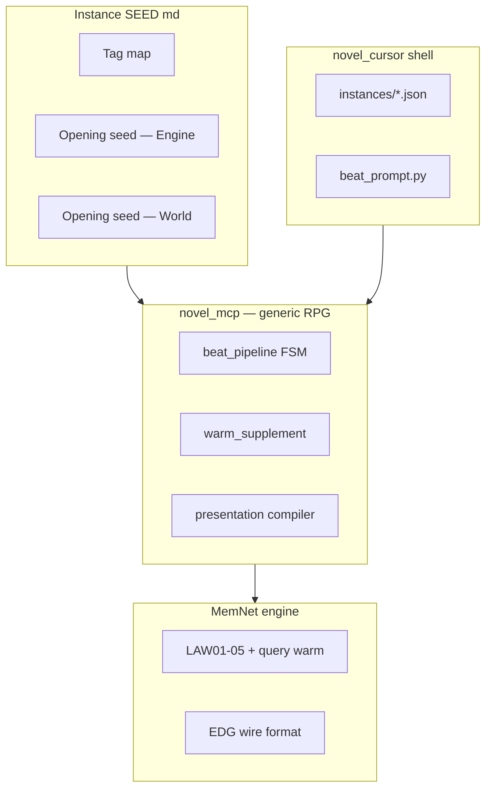
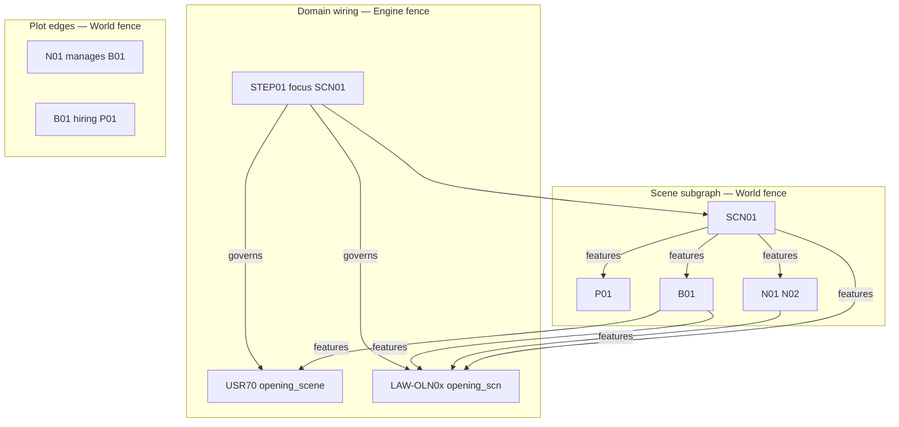
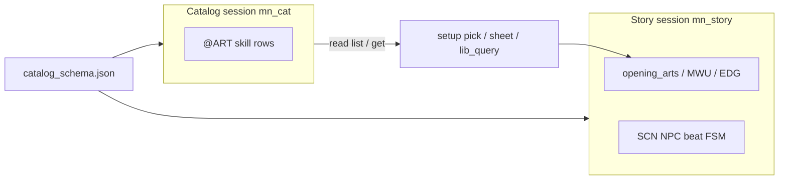
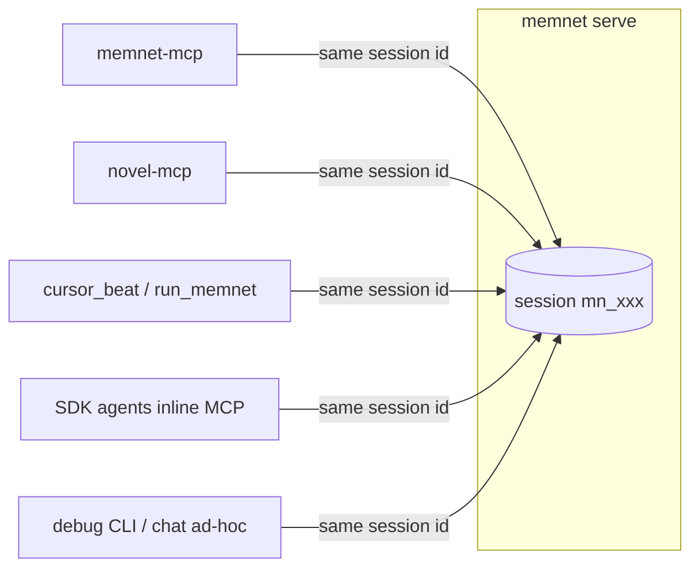
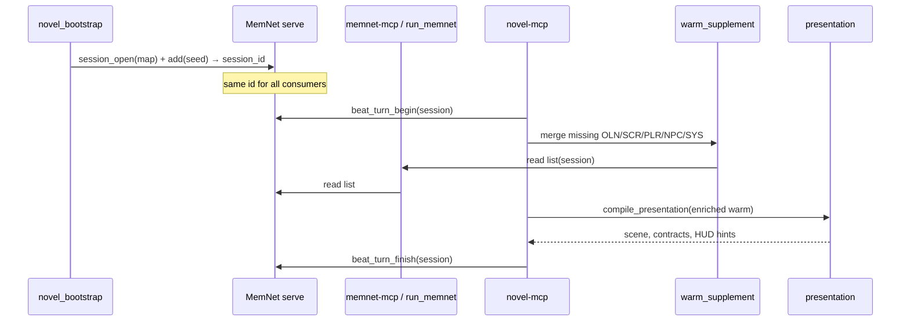

# Novel RPG SEED — formulation spec (generic)

**Status:** normative for new seeds and remakes.  
**Audience:** integrators authoring `application-notes/novel-*-initial-state.md`.  
**Not in scope:** MemNet engine internals (`src/memnet/`) — see engine docs; **not** a specific story (沈家 is one instance).

**Related:**

| Doc | Role |
|-----|------|
| [`llm-novel-writer.md`](llm-novel-writer.md) | Pattern / pedagogy (Harry Potter example, 6-step loop) |
| [`llm-novel-cursor-sdk.md`](llm-novel-cursor-sdk.md) | `cursor_beat.py` dual-agent orchestration + shared session |
| [`llm-build-on-memnet.md`](llm-build-on-memnet.md) | MCP split, `MEMNET_SESSION`, `run_memnet` |
| [`novel-shenjia-initial-state.md`](novel-shenjia-initial-state.md) | Reference instance (晚明武俠 RPG) |
| `src/novel_mcp/` | Generic RPG pipeline (`beat_turn_begin`, `warm_supplement`, `presentation`) |

---

## 1. Layering (do not blur)



| Layer | Owns | Must NOT own |
|-------|------|----------------|
| **MemNet** | Graph storage, `query warm`, recycle, LAW prepend | OLN/SBD/SCR visibility hacks, scene cast attach, story names |
| **novel_mcp** | Beat FSM, presentation envelope, warm enrich, validators | Specific world facts, protagonist name |
| **SEED md** | Tag map + opening graph for one world | Python orchestration, Cursor prompts |
| **Instance json** | Output paths, model ids, title override | Duplicate tag map or world rows |

**Rule:** If a behaviour applies to *every* novel RPG using `beat_turn_begin`, it belongs in **novel_mcp**. If it applies to *every* MemNet session, it belongs in **memnet**. Only world-specific facts and domain LAW/USR belong in the **seed**.

---

## 2. Seed planning principles (before writing rows)

Use this **design order** before filling fences. Integrator notes come **last**; they are not ingested and must not be the only place a fact lives.

### 2.1 One fact, one wire home

| If the fact is… | Put it in… | Must also… |
|-----------------|------------|------------|
| Opening location / cast / industry hook | `@SCN` + `@USR\|opening_scene\|` + domain `@LAW` | Wire cast to SCN; wire BIZ/NPC to that LAW/USR via `features` |
| Protagonist display name | `@USR03\|pc_name\|` only | `@PLR` 身份欄用**中性 placeholder**（如 `流民`、`待定`），勿預填玩家將輸入的姓名；`commit_player_profile` 寫 `pc_name` |
| NPC identity + voice hints | `@NPC` traits + `@PRS`/`@PTY` | `SCN\|features\|NPC`; age via birth year + `USR25` |
| Pairwise intimacy / trust / respect | `@EDG` `aff_to` (directed; scores in `attrs`) | Register `aff_to` in snapshot `# relations`; warm via graph from cast |
| Industry state (debt, hiring) | `@BIZ` row + plot `@EDG` (`hiring`, `manages`) | `SCN\|features\|BIZ` if in opening beat |
| Genre-specific validation (e.g. martial tiers) | `@USR\|catalog_schema\|` → `catalog_specs/*.json` | **Not** hard-coded in `novel_mcp`; loadout/slots in json `loadout` block |
| How script should write OLN | `@LAW` + `stage_hint_oln` USR | Cite the USR/LAW ids in constraint tokens |
| Long balance tables / examples | Integrator notes only | Duplicate **codes** into wire if LLM must obey |

**Drift test:** If `beat_turn_begin` → `presentation` cannot surface the fact (directly or via governed USR/LAW), the seed is incomplete.

### 2.2 Three EDG planes (all required for opening)

Do not wire only `STEP01|governs|USR*`. Opening beats need **three planes**:



| Plane | Relation types | Purpose |
|-------|----------------|---------|
| **Pipeline** | `STEP\|governs\|USR*`, `STEP\|governs\|LAW-*`, `STEP\|focus\|SCN*` | What enters warm / FSM |
| **Scene** | `SCN\|features\|{PLR,NPC,BIZ,…}`, `SCN\|set_in\|SYS*` | Who is in beat 0; `presentation.scene` cast |
| **Domain** | `{BIZ,NPC,SCN}\|features\|{USR,LAW}` for opening-specific contracts | Stops script from inventing a different setting |
| **Plot** | `manages`, `hiring`, `qiuzhu`, … | Story mechanics; may need `at` = SYS time |

**Anti-pattern:** NPC traits say「孤女」but no `BIZ`/`manages`/`opening_scene` → model writes「破廟流浪」instead of「鐵坊門前求聘」.

### 2.3 Opening scene contract (template)

For any game with a fixed beat-0 location:

1. `@SCN: SCN01|<ascii_code>|awakening|delete_on_settle` — `code` is machine key (e.g. `smithy_gate`).
2. `@USR: USR70|opening_scene|<one-line facts; 禁語 list>|persistent` — human + LLM readable; pipe-safe inside value.
3. `@LAW: LAW-OLN0x|OLN|on_add|opening_scn|cite_usr70;…|persistent` — hard constraints for OLN stage (**row id is instance-specific**; 沈家 uses `LAW-OLN01`).
4. `EG*: STEP01|governs|USR70` and `STEP01|governs|LAW-OLN0x` (your opening OLN LAW id).
5. `EG*: {B01,N01,N02,SCN01}|features|{USR70,LAW-OLN0x}` — **domain plane** (required when BIZ/NPC define the opening).
6. World: `E*: SCN01|features|*` for every entity in the scene; plot edges (`hiring`, `manages`, …) as needed.

Until `SCN01` settles (`delete_on_settle`), every OLN/SBD/SCR must stay consistent with `opening_scene`.

### 2.4 Tag map vs row shape

- Tag map declares **column count and names** per tag. Every seeded row must match exactly.
- If a tag has **no** `回收` column in the map (e.g. `@PLR: id|…|身體狀態` only), updates must **not** append `|persistent`.
- `@USR` is always `id|key|value|recycle` (4 fields). Multi-part content uses `;` **inside** `value`.

### 2.5 God-realm setup dialogue (player vs seed)

**Principle:** Opening chat content is **story-specific**. `novel_mcp` only runs the FSM (`next_action`), validation, and graph commits. **Do not** hard-code dialogue, scenes, tone, or world labels in Python prompts or `.mdc` rules.

| Source | What | Examples |
|--------|------|----------|
| **Player input** | Values only | `pc_name` / `pc_gender` committed via `commit_player_profile` (may be one field per call) |
| **Player choice** | Picks from seed skill catalog | `commit_opening_pick` → `opening_arts` (USR58); `@ART` ids from **catalog session** + `catalog_schema` |
| **Seed `@USR`** | All narrated setup content | See table below |
| **Instance json** | Shell paths, models, expand flags | `catalog_schema` path (bootstrap); genre loadout lives in **catalog_specs** json |
| **novel_mcp** | Generic FSM only | `narrate_open` → `narrate_ask_name` → `narrate_ask_gender` → optional `narrate_pre_pick` → `pick_*` → `narrate_transmigration` → `start_play` |

**Required setup USR keys** (per instance — ids are project convention; keys are normative):

| USR `key` | Phase | Value shape |
|-----------|-------|-------------|
| `setup_tone` | all setup | `god_banter;…tokens…;禁…` — voice + ban list for 【神域】chat |
| `setup_format_god` | optional | Section label, e.g. `【神域】` (fallback in code if absent) |
| `setup_format_play` | optional | Section label, e.g. `【劇情】` |
| `setup_god_line_open` | `narrate_open` | God's opening line |
| `setup_god_line_ask_name` | `narrate_ask_name` | Ask protagonist name (after open) |
| `setup_god_line_ask_gender` | `narrate_ask_gender` | Ask gender (after name committed) |
| `setup_profile_name_rule` | `commit_player_profile` | `cjk_2_4` or `regex:…` |
| `setup_profile_genders` | `commit_player_profile` | `男;女` (semicolon list) |
| `setup_god_line_profile` | legacy | Combined name+gender prompt; use ask_name/ask_gender instead |
| `setup_god_line_library` | optional `narrate_pre_pick` | Instance-only (e.g. 神家); wired via `catalog_specs.loadout.pre_pick_line_usr_key` |
| `setup_god_line_transmigrate` | `narrate_transmigration` | Closing line before world SCN |
| `setup_scene_{slot}` | `pick_{slot}` | `title;hint` — one row per `catalog_specs.loadout.slot_order` entry (e.g. 武俠: `setup_scene_neigong`) |
| `setup_soul_library` or any gift key | optional opening gift | Instance-only; `name;rank;no_pick` — wired via `loadout.opening_gift_usr_key` |
| `setup_pick_offer_count` | `pick_*` | Per-slot random offer size, e.g. `5-9` (from full `@ART` pool for that slot) |
| `opening_offer_{slot}` | runtime | Rolled ART ids (`;`-sep); seed `_` until first pick phase |
| `skill_catalog_md` | picks | Path to expandable skill-catalog seed md (`@ART` fence). **Legacy key:** `martial_catalog_md` (沈家) |
| `skill_catalog_session` | runtime | `mn_…` background catalog session id (bootstrap writes). **Legacy:** `martial_catalog_session` |
| `party_roster` | runtime | `;`-sep character ids (`P01;N01`); default = protagonist only |
| `party_ui` | runtime | Comma sections for party overlay: `items`, `skills`, `attrs`, `summary`, `relations` (author/script via `beat_turn_finish`) |
| `party_ui_note` | runtime | Free text shown atop party panel |

**Slot keys:** Internal slot ids (`neigong`, `martial`, `arcane`, `mobility`, …) come from `catalog_specs/*.json` → `loadout.slot_order`. Seed USR **keys** follow `setup_scene_{slot}` and `opening_offer_{slot}`; **player-facing labels** live in seed values or `body_stat_labels` in json — not in `novel_mcp`.

### 2.5.1 Skill catalog (generic — 武學／魔法／異能)

**Principle:** `novel_mcp` treats one `@ART` row as one **skill** entry. Genre flavour (金庸武學、奇幻魔法、科幻異能) is **not** hard-coded in Python — it comes from:

| Layer | Owns |
|-------|------|
| **`catalog_specs/*.json`** | Wire columns, `valid_kinds`, `kind_to_slot`, `slot_order`, `body_stat_labels`, `min_slots`, expand rules |
| **Skill-catalog seed md** | `@ART` rows (background data); ingested into a **dedicated catalog MemNet session** |
| **Story seed md** | `setup_scene_{slot}` copy, `opening_scene`, plot — **not** the full skill table |
| **Story session graph** | Player picks (`opening_arts`), proficiency edges (`MWU` / schema `proficiency_tag`), body stats (`WUX` / `body_stat_tag`) |



**沈家 instance (武俠):** `wuxia_jinyong.json` maps 內功→`neigong` slot, 武學→`martial`, 輕功→`qinggong`; seed `setup_scene_neigong` 等 holds 【神域】場景文案. **Fantasy instance:** same machinery with `arcane`/`mobility` kinds and English labels — see `tests/fixtures/catalog_schema_fantasy.json`.

**Bootstrap:** `ensure_catalog_session` → `novel-output/catalogs/<schema_stem>/catalog_session_id.txt` (shared per schema); story bootstrap links `skill_catalog_session` USR. Do **not** ingest the full `@ART` table into the story session.

**Anti-pattern:** Python or prompts that say「內功／武學／輕功」unconditionally; slot count loops hard-coded to wuxia triple — use `slot_order(schema)` and `catalog_slots`.

Wire each setup USR with `STEP01|governs|USR*` (and `setup_tone` USR — e.g. `USR63` — `|governs|` every `setup_god_line_*` it should colour, including optional `narrate_pre_pick`). Chat agent reads `read_player_setup` → `setup_guidance.suggested_lines` / `scene` / `tone` — **never** invent copy from integrator notes or shell docs.

**Anti-pattern:** Shenjia god-banter in `beat_prompt.py` or `novel-writer.mdc`; another story's shrine awakening in shared Python.

### 2.5.2 Character affinity (`aff_to` on `@EDG`)

**Principle:** Node-to-node feelings are **`@EDG`**, not a fake node tag with `甲|乙` columns (violates MemNet graph discipline: relations belong on `@EDG`, not duplicated in node fields). **`@TRT` / `@PRS`** stay per-character nodes linked by `has_trait` / `persona`. **Directed** scores (親密度、信任度、敬重…) live on edges:

```text
@EDG: EAFF01|P01|aff_to|N01||親密度:35;信任度:60;敬重:50;備註:姐弟日久|常駐
@EDG: EAFF04|N01|aff_to|P01||親密度:40;信任度:70;敬重:55;備註:依賴姐姐|常駐
@EDG: EAFF10|P01|aff_to|N99||親密度:-40;信任度:-80;敬重:-60;備註:世仇未解|常駐
@EDG: EAFF11|N99|aff_to|P01||親密度:15;信任度:25;敬重:0;備註:不識此人|常駐
```

| Layer | Owns |
|-------|------|
| **Snapshot `# relations`** | Register ASCII relation `aff_to` (display 親和 in narrative) |
| **Seed `@EDG` rows** | `src|aff_to|dist` + `attrs` kv (`親密度` / `信任度` / `敬重` / `備註`) |
| **Instance USR / LAW** | Dimension names, scale −100…+100, when updates allowed |
| **`novel_mcp`** | `read_directed_affinity()` parses `attrs`; party UI |
| **Script / author** | `beat_turn_finish` → `update @EDG` on the one directed edge |

**Asymmetric (directed) pairs — required discipline:**

- One `@EDG` = **one direction** (`甲|aff_to|乙`). Reverse direction is a **second edge** with its own `attrs`.
- **Never** mirror or infer reverse scores. A 敵視 B does **not** imply B 敵視 A.
- Updates patch **one edge's `attrs`**; other direction untouched unless explicitly updated.

**Scale:** Signed integers in `attrs` (default **−100…+100** per dimension).

| Sign | 親密度 | 信任度 | 敬重 |
|------|--------|--------|------|
| **+** | 親近、好感 | 信賴 | 敬重 |
| **0** | 陌生／無感 | 中立 | 無特別態度 |
| **−** | 厭惡、敵意 | 猜疑、不信 | 輕蔑、不屑 |

**Warm:** `STEP01 → SCN → cast` then **one more hop** for `aff_to` attrs — use **`NOVEL_WARM_DEPTH=3`** in `beat_turn_begin`. If LAW/`governs` flood truncates warm, **`novel_mcp` `enrich_warm_stdout`** merges missing `aff_to` edges whose `src` or `dist` is a `@PLR`/`@NPC` id already in warm. No `STEP01|governs|AFF*` — that was the wrong pattern.

**Party UI:** When `party_ui` includes `relations`, panel shows **two independent directed blocks**: `plr`→member and member→`plr`.

**Not `@BOND`:** Beat-level `@BOND` atoms are per-beat deltas; persistent scores stay on `aff_to` edges.

**Anti-pattern:** `@AFF` node rows duplicating `src|dst` — use `@EDG` only.

### 2.6 God-realm vs play (two phases)

| Phase | Graph keys | Chat `next_action` | MCP tools |
|-------|------------|--------------------|-----------|
| **Setup** | `USR03/53/58`, setup USRs above | `narrate_open` → … → `start_play` | `read_player_setup`, `commit_player_profile`, `commit_opening_pick` |
| **Play** | `USR23` FSM, per-beat OLN/SCR | `cursor_beat --choice` | `beat_turn_begin` / `finish` |

Setup USRs and `opening_scene` are **play gates**, not substitutes for `SCN`/`BIZ` world rows.

### 2.7 LAW budget and warm reachability

- Every `@LAW` row prepends to warm → keep domain LAWs **short** (codes in `constraint`).
- **`beat_turn_begin`** uses `depth=3` (`NOVEL_WARM_DEPTH`) so `STEP01 → SCN → PLR/NPC → aff_to` fits in one BFS pass.
- **Reachability checklist** for beat 0 (after bootstrap, before first `--choice`):
  - `presentation.scene.focus` = opening SCN id
  - `presentation.scene.npcs` populated (enrich or warm)
  - `presentation.scene.biz` / `scn_code` if industry opening
  - `presentation.contracts` includes `opening_scene` USR and your opening OLN LAW (e.g. `LAW-OLN01`)
  - Warm or enrich includes `aff_to` `@EDG` rows for opening cast (audit: `aff_to` in `warm_stdout`)
  - No `@OLN` rows in seed (script creates them)

### 2.8 Instance json vs seed md vs catalog_specs

| Item | seed md | instance json | catalog_specs/*.json |
|------|---------|---------------|----------------------|
| Tag map, world graph, LAW/USR | yes | no | no |
| `catalog_schema` path | `@USR` pointer (`catalog_schema`) | bootstrap default | file is the schema |
| `expand_catalog*` | — | yes | — |
| **Loadout machinery** | USR keys for **story copy** only | — | `loadout.slot_order`, `pre_pick_line_usr_key`, `opening_gift_usr_key`, proficiency/body tags, `extra_wire_lines` |
| Model ids, output slug | via USR14/15 paths | yes | — |
| `session_id.txt` | no | runtime pointer | — |

**Pre-pick narration:** If `loadout.pre_pick_line_usr_key` is set (神家: `setup_god_line_library`), FSM emits `narrate_pre_pick` before the first catalog slot. Omit both keys for stories with no god-realm interlude.

**Bootstrap:** `catalog_schema` USR in seed is SSOT for graph pointer; instance json may duplicate for `novel_bootstrap.py --app` convenience — keep paths identical.

### 2.9 Authoring workflow (ordered)

1. **Scope** — tags needed; opening SCN code; cast list.
2. **Opening contract** — USR70 + opening OLN LAW (`LAW-OLN0x`) + three EDG planes (§2.2–2.3).
3. **Tag map** — declare tags; match column counts to rows you will write.
4. **Engine fence** — pipeline LAWs, USR FSM, governs/features EDGs.
5. **World fence** — SYS, PLR, SCN subgraph, BIZ, NPC, plot EDGs.
6. **Bootstrap smoke** — `novel_bootstrap.py`; `read_player_setup`; sample `beat_turn_begin` presentation JSON.
7. **One scripted beat** — OLN must cite opening_scene; prose must match BIZ/NPC graph.
8. **Integrator notes** — tables, examples, maintenance prose only.

---

## 3. Shared session (one graph, many consumers)

MemNet **`memnet serve`** holds **one logical session = one graph** (tag map + all rows). That session is **not** owned by novel-mcp, cursor_beat, or a single MCP key — it is **shared**.



| Principle | Detail |
|-----------|--------|
| **One session id** | Pass the **same** `session` to `memnet-mcp`, `novel-mcp`, `run_memnet`, and SDK `inline_mcp_servers(memnet_session)` — see `session_contract_block()` in `novel_mcp/session_contract.py`. |
| **Graph is SSOT** | Story state lives only in the session graph (+ chapter files referenced by `@USR14`). Chat threads, agent ids, and `session_id.txt` are **handles**, not a second source of truth. |
| **`session_id.txt`** | Per-instance **pointer** (`novel-output/<slug>/session_id.txt`). Optional `--session` overrides. Reload via `session_load(snapshot, keep_id=true)` restores the **same** id when serve was cold. |
| **`MEMNET_SESSION`** | Optional env pin in `mcp.json` so memnet-mcp reattaches after restart without re-bootstrap. |
| **Snapshot** | `@USR15` path + `# relations` in snapshot — required for `session_load` to revive a shared session elsewhere. |

**Division of labour on the shared session** (do not duplicate reads/writes):

| Consumer | Typical use on shared session |
|----------|-------------------------------|
| **novel-mcp** | `beat_turn_begin` / `beat_turn_finish` — canonical per-beat read + commit |
| **memnet-mcp** | `session_*`, `read_get`, ad-hoc `add`/`update` **between** beats, debug `query_walk` |
| **cursor_beat.py** | Calls `run_memnet` in-process with the same id (no second graph) |

**Same-turn bans** (race / stale warm): do not call memnet `query warm` in the same beat turn as `beat_turn_begin`; do not `add`/`update` on memnet after `begin` and before `finish` on that beat.

**Seed / instance implications:**

1. **One story instance → one play session** — bootstrap once per new game (`session open` + seed `add`).
1b. **One catalog schema → one catalog session** (optional, shared) — skill background `@ART` for lookup; link via `skill_catalog_session` USR.
2. **Tag map is session-scoped** — set at `session open`. Two different seeds with incompatible tag maps must **not** share one session.
3. **Paths in graph** — `@USR14` / `@USR15` live in the session; any consumer with the session id resolves the same chapter dir and snapshot.
4. **Multiple apps on one serve** — different stories = different session ids on the **same** `memnet serve` process (e.g. `mn_abc` vs `mn_def`). Same serve, many sessions.
5. **Cross-tool debugging** — e.g. chat `read_get` + `cursor_beat` on one id is valid if beat boundaries are respected.

**Bootstrap output** is a `session_id` string, not a forked copy of the graph. Writing `session_id.txt` only records which shared session this shell uses.

---

## 4. SEED document anatomy (required sections)

Every bootstrap-ready seed is one markdown file with **exactly these machine-readable fences** (headings are parsed by `bootstrap_from_md`):

| Section | Required | Consumed by |
|---------|----------|-------------|
| `# Title` | yes | `app_config` title fallback |
| `## Tag map` + ` ```text ` block | **yes** | `session open --map` |
| `## Opening seed — Engine` + fence | **yes** | `add --stdin` (first half) |
| `## Opening seed — World` + fence | **yes** | `add --stdin` (second half) |
| `## Seed layout` | recommended | humans |
| `## Integrator notes` | recommended | humans only — **LLM must not depend on prose outside fences** |

Legacy single fence `## Opening seed` is supported but deprecated for new work.

**Integrator notes** may be long (武學表、維護對照). They are **not** ingested. All LLM-visible contracts must live in **wire rows** inside the three fences.

---

## 5. Necessary elements (minimum viable RPG seed)

### 5.1 Tag map

- Declare **every user tag** the world uses (`@SYS`, `@PLR`, `@NPC`, …).
- Field names may be **中文** in the map; MemNet stores them as logical keys.
- **Do not** declare `@LAW` or `@EDG` in the map — engine built-ins.
- **Do not** declare per-beat tags in the map unless the world truly uses them at bootstrap (`@OLN` in map is for field schema; opening seed usually **omits** OLN rows).

### 5.2 Engine fence — mandatory rows

| Id / pattern | Tag | Purpose |
|--------------|-----|---------|
| `STEP01` | `@STEP` | Pipeline anchor; `focus` = opening `@SCN` id |
| `CFG01` | `@CFG` | Work title, anchor id, version note |
| `USR03` | `@USR` | `pc_name` — use `未定` until `commit_player_profile` |
| `USR53` | `@USR` | `pc_gender` — `男`/`女`/`未定` |
| `USR58` | `@USR` | `opening_arts` — `;`-separated ART ids, count = `loadout.slot_order` length; use `未定` per slot until picks |
| `USR67` | `@USR` | `skill_catalog_md` — path to skill-catalog seed md (**legacy:** `martial_catalog_md`) |
| `USR69` | `@USR` | `catalog_schema` — repo-relative path to `catalog_specs/*.json` |
| `USR70` | `@USR` | `opening_scene` — beat-0 facts + ban list; cite from opening OLN LAW |
| `USR14` | `@USR` | `chapter_out` — relative path to chapter dir |
| `USR15` | `@USR` | `snapshot` — relative path to `session_snap.json` |
| `USR23` | `@USR` | `beat_stage` — initial `oln` |
| `USR05` | `@USR` | `scene_length` — band or `no_gate` |
| `LAW06` | `@LAW` | `law_scope|linked_from_anchor` (or document `*` scope choice) |
| `LAW-PIPE20` | `@LAW` | Stage FSM: oln→sbd→scr→prose; `no_bundle` |
| `LAW-PIPE21` | `@LAW` | `begin_finish_only` |
| `LAW-MCP01` or equivalent | `@LAW` | Commits via MCP finish, not chat |
| `ES01` | `@EDG` | `STEP01|focus|<opening SCN id>` |
| `EG*` | `@EDG` | `STEP01|governs|USR*` for every USR that must appear in warm |
| `EG*` | `@EDG` | `STEP01|governs|LAW-*` for pipeline / prose LAWs |
| Stage hints | `@USR` | `USR54`–`USR57` → `stage_hint_oln|sbd|scr|prose` (or project convention) |

**Strongly recommended** (generic RPG UX):

- `LAW-BAN01`–`03` — no loop gate / manual chapter / prose before finish
- `LAW-OUT04`–`05` — hide wires in player UI
- `LAW-OPT01` + six-option `USR` keys if using standard option model
- `LAW-CHR04` + `USR25` — age from `@SYS` year − birth year
- `LAW-NAME01` — no hard-coded protagonist name in LAW text

### 5.3 World fence — mandatory rows

| Id / pattern | Tag | Purpose |
|--------------|-----|---------|
| `SYS01` | `@SYS` | Calendar time in agreed mechanical format |
| `P01` (or project id) | `@PLR` | Birth year, body state, abilities; **身份欄 = social placeholder** (`流民`), not `pc_name` |
| Opening `SCN*` | `@SCN` | `delete_on_settle`; code + beat phase |
| `E*` scene wiring | `@EDG` | `SCN|features|PLR/NPC/BIZ/…` for everyone in opening beat |
| `E*` | `@EDG` | `SCN|set_in|SYS01` |
| Opening NPCs | `@NPC` | Names, birth years, traits — **SSOT for cast** |
| Key `aff_to` edges | `@EDG` | Directed intimacy/trust between cast (`attrs` kv) |

**Do not seed at opening:** `@OLN`, `@SBD`, `@SCR`, `@OPT` (created per beat by script agent + finish).

### 5.4 Snapshot relations block

If the seed introduces **new `@EDG.relation` verbs** (e.g. `unknows`, `speaks`, `qiuzhu`), register them in the snapshot `# relations` section as `@REL:` rows. Otherwise `session_load` rejects edges.

`relation` values in `@EDG` rows: **ASCII only**. Display Chinese belongs in `attrs` or narrative, not in `relation`.

---

## 6. Content rules (field-level)

### 6.1 Atomic rows

- **No sentences in fields** — facts are short codes, numbers, pipe-safe tokens.
- Long lore → multiple `@LORE` / `@NPC.特徵` / `@GLO` rows + `@EDG`, not one blob.
- Player-facing prose is generated at **prose stage** from `@SCR`, not stored in seed fields.

### 6.1.1 Owner column vs `@EDG` (denormalized index)

Tags such as `@ITM` (`角色`), `@SKL`/`@MWU` (`角色`), `@PRS` (`角色`) may carry an owner id **for list/read convenience**. **Authoritative graph links** are `@EDG` (`carries`, `has_skill`, `has_mwu`, `persona`, …). On `beat_turn_finish`, update **both** the edge and the owner field, or drop the field and rely on edges only.

`@NPC.技能` / `@NPC.物品` are **HUD summaries** for warm readability — mechanical SSOT remains `SKL`+`has_skill`, `ITM`+`carries`. Do not change summary text without updating the atom rows.

### 6.1.2 Kinship vs affect

- **Plot / kinship** edges (`sibling`, `manages`, …) = structural facts.
- **`aff_to`** = directed affective scores (may be asymmetric and signed). Do not encode the same story only in one of the two.
- **`aff_to` 備註** = emotional context only (e.g. 主雇、初識). **Do not** put kinship terms (姐弟/妹妹) that assume player gender — use `@EDG sibling` + `@PLR`/`@NPC.性別` for称呼/structure.

### 6.2 Recycle (persistence)

| Value | Meaning | Seed usage |
|-------|---------|------------|
| `persistent` / 常駐 | Survives settlement | PLR, NPC, SYS, LAW, USR, CFG, STEP |
| `delete_on_settle` / 失效刪 | Hidden from `active_only` warm after settle | Opening SCN, beat wires OLN/SBD/SCR, scene-local EDG |
| `delete_on_expire` | TTL housekeeping | Rare in opening seed |

**Implication:** In-flight `@OLN`/`@SCR` will **not** appear in MemNet `query warm --active-only`. **novel_mcp** `enrich_warm_stdout()` merges them via `read list` — seeds must still **create** those rows during play; enrich is not a substitute for missing graph data.

### 6.3 Names and identity

| What | Where |
|------|-------|
| Protagonist display name | `@USR03\|pc_name\|` only — `未定` until `commit_player_profile` |
| PLR 身份欄 | Neutral role placeholder (e.g. `流民`); **not** the player-chosen name |
| NPC names | `@NPC` rows + `SCN\|features` edges |
| **Protagonist gender** | `@PLR.性別` (field 4) + `@USR53\|pc_gender\|` — setup writes both; `身體狀態` must **not** embed `性別:` |
| **NPC gender** | `@NPC.性別` (field 4 after `出生年`) — `男`/`女` |
| **NPC persona** | `@NPC.外觀` / `.性格` / `.語氣` / `.特徵` — appearance, personality, speech tone, identity/social tags (fields 5–8); `@PRS`/`@PTY` remain mechanical baselines |
| LAW text | **Never** embed specific character names or ids |
| Prompt shells (`beat_prompt.py`) | **Never** hard-code story NPCs; read `presentation.scene` |

### 6.4 Time

- `@SYS.時間` is the mechanical clock (e.g. `YYYY-MM-DDTHH`).
- Plot `@EDG` with non-wiring relations must set `at` = current SYS time (`LAW-EDG01` pattern).
- Age display: SYS year − `出生年` (expose via `USR25` + CHR LAW).

---

## 7. LAW / USR / GLO taxonomy

| Tag | Governs | In every warm? | EDG to appear? |
|-----|---------|----------------|----------------|
| `@LAW` | Procedure + hard constraints | **All rows prepended** | No (optional audit EDG) |
| `@USR` | Operator / UI / FSM knobs | Only if `STEP01|governs` | Yes |
| `@GLO` | Semantic axis labels (traits, library) | If governed from USR | Yes |
| `@RULE` (pattern doc) | Story voice | When linked | Yes |

**LAW budget:** Every LAW row hits **every** warm read. Keep domain LAWs short (`mechanism|constraint` codes). Move voluminous world lore out of LAW into `@NPC`, `@TEC`, `@LIB`, etc.

**USR reserved keys** (novel_mcp expects these semantics when using standard pipeline):

| Key | Role |
|-----|------|
| `pc_name` | Protagonist name gate |
| `beat_stage` | FSM: oln / sbd / scr / prose |
| `chapter_out` | Chapter directory path |
| `snapshot` | Snapshot file path |
| `scene_length` | Prose band or `no_gate` |
| `stage_hint_*` | Per-stage task text for presentation |
| `opening_scene` | Beat-0 location/cast contract (`USR70` pattern) |
| `catalog_schema` | Path to genre validation json (skill sub-types) |
| `skill_catalog_md` | Path to expandable skill-catalog md (`@ART`). Legacy: `martial_catalog_md` |
| `skill_catalog_session` | Linked catalog MemNet session id. Legacy: `martial_catalog_session` |

Projects may add USRs; wire each with `STEP01|governs|USRxx` or they will not enter warm.

---

## 8. EDG wiring patterns (opening world)

Minimum scene subgraph for beat 0:

```text
@STEP: STEP01|1|SCN01|persistent
@SCN: SCN01|<code>|<phase>|delete_on_settle
@EDG: ES01|STEP01|focus|SCN01||persistent
@EDG: E20|SCN01|features|P01||delete_on_settle
@EDG: E21|SCN01|features|N01||delete_on_settle
@EDG: E24|SCN01|set_in|SYS01||delete_on_settle
```

| Relation class | `at` field | Examples |
|----------------|------------|----------|
| Wiring | omit | `governs`, `features`, `set_in`, `focus` |
| Plot / social | required (= SYS time) | `qiuzhu`, `speaks`, `unknows`, `hiring` |

**Cast in presentation:** `compile_presentation` builds `scene.npcs` from warm/indexed `@NPC` rows. Seeds must wire opening NPCs to opening SCN via `features` (or ensure they appear in enriched warm).

---

## 9. Runtime contract (seed → play)



**Seed obligations for this pipeline:**

1. `STEP01.focus` points at opening `SCN` id (not OLN id).
2. `USR23` starts at `oln` for new games.
3. NPC/PLR/SYS rows exist and are reachable for presentation (directly in warm or via enrich list).
4. Engine LAWs cite the correct USR ids your finish pipeline updates (time, body, traits, etc.).

**Thin chat rule:** LLM turns use `presentation` + `pipeline` from `beat_turn_begin` — not Integrator notes, not `.mdc` story bibles.

---

## 10. Instance shell (`applications/novel_cursor/instances/*.json`)

Optional thin config — **not** a second seed.

```json
{
  "app_id": "my_story",
  "title": "Display title",
  "seed_md": "application-notes/novel-my-story-initial-state.md",
  "model_script": "…",
  "model_prose": "…",
  "thinking_script": true,
  "thinking_prose": false
}
```

Paths resolve from `USR14`/`USR15` in seed unless overridden. Instance must not duplicate graph rows. **`session_id.txt` is not part of the seed** — it only binds this shell to an existing shared session (bootstrap creates; `session_load` may rewrite the same id).

---

## 11. Bootstrap checklist

Before first `cursor_beat.py` beat:

- [ ] `## Tag map` fence parses; all seeded tags declared
- [ ] Engine + World fences non-empty
- [ ] `STEP01`, `CFG01`, `USR03/14/15/23`, `ES01` present
- [ ] `STEP01|governs` covers all USRs referenced by LAW constraints
- [ ] Opening `SCN` + `features` cast + `set_in SYS01`
- [ ] No `@OLN`/`@SCR` in opening seed (unless replay/debug snapshot)
- [ ] New relations registered for snapshot load
- [ ] `python scripts/novel_bootstrap.py <seed.md>` exit 0
- [ ] `beat_turn_begin` presentation has `scene.npcs` ages if CHR LAWs require it
- [ ] `warm_stdout` (or enrich) contains `aff_to` for opening cast — depth 3 default
- [ ] `setup_complete` via `read_player_setup` before first `--choice`
- [ ] Same `session_id` used for memnet-mcp + novel-mcp + `cursor_beat` (no parallel session for “novel only”)
- [ ] Snapshot `# relations` complete if using custom EDG verbs (portable `session_load`)

---

## 12. Anti-patterns (learned)

| Anti-pattern | Why it fails | Fix |
|--------------|--------------|-----|
| Story names in `beat_prompt.py` / MCP Python | Breaks generic tooling | `presentation.scene` only |
| Novel logic in `mem_store.context_pack` | Couples engine to one app | `novel_mcp/warm_supplement` |
| 80+ LAW rows with duplicate prose rules | Truncates warm; drops NPC/SYS | Split lore to world tags; dedupe LAW |
| `STEP.focus = OLN01` at opening | Parser confusion; SCN cast lost | `focus = SCN*` |
| Protagonist name only in integrator notes | Author invents wrong age/voice | `@USR03` + PLR placeholder identity |
| Protagonist name in `@PLR` 身份欄 | Drift vs `pc_name` after setup | Placeholder role; name in `USR03` only |
| Missing `features` edges to SCN | Empty cast block | Wire PLR/NPC/BIZ to opening SCN |
| BIZ/NPC not wired to `opening_scene` LAW/USR | Script invents orphan shrine / wrong setting | Domain plane: `{BIZ,NPC,SCN}|features|USR70` + LAW |
| English `relation` with Chinese story grammar in field | `session_load` / add reject | ASCII relation + Chinese attrs |
| Seeding finished OLN/SCR in opening | Violates FSM; stale wires | Let script agent create per beat |
| Second `session open` for novel play | Forked graph; chat vs beat desync | One bootstrap session; pass id everywhere |
| `query warm` + `beat_turn_begin` same turn | Stale / double read | Use `beat_turn_begin` only for beat read |
| `session_id.txt` treated as graph | Resume fails; wrong SSOT | Load snapshot into **serve**; txt is pointer only |
| Only `@NPC` skill/item summary changed | Drift vs `SKL`/`ITM` graph | Update atom rows + `has_skill`/`carries` EDGs |
| `aff_to` missing from warm at depth 2 | Script invents relationship tone | Use depth 3 + `enrich_warm_stdout` aff_to merge |

---

## 13. Remake workflow

When rewriting a seed or porting from [`llm-novel-writer.md`](llm-novel-writer.md) pattern, follow **§2 Seed planning principles** in order:

1. **Freeze scope** — list tags and USR keys the world needs (not every Shenjia tag is required).
2. **Opening contract** — USR `opening_scene` + domain LAW + three EDG planes (§2.2–2.3).
3. **Write Tag map** — minimal column set per tag; column counts match rows.
4. **Engine fence** — pipeline LAWs + USR FSM + governs/features EDGs.
5. **World fence** — SYS, PLR, opening SCN subgraph, BIZ/NPC, plot EDGs.
6. **Bootstrap + inspect** — `beat_turn_begin(include_warm=true)`; verify presentation.scene + contracts.
7. **Play one beat** — OLN cites opening_scene; prose matches graph.
8. **Integrator notes last** — tables, balance, 武學 coefficients for humans.

Do **not** change novel_mcp or memnet until this checklist passes on the new seed.

---

## 14. Relation to Shenjia reference seed

[`novel-shenjia-initial-state.md`](novel-shenjia-initial-state.md) is a **full-fidelity instance** (晚明 + 金庸 + 匠坊經營). New projects should **copy structure**, not row count:

- Required: §5 minimum tables above
- Optional: `@ART`/`@MWU`/`@TEC`/`@LIB` stacks — only if the game uses those mechanics
- Integrator notes §武學/科技: instance lore, not generic spec

---

*Version: 2026-06 — aligns with `warm_supplement` layer, memnet core separation, and shared-session contract.*
