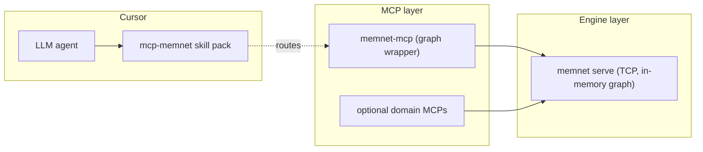

# LLM Build on MemNet — A MemNet Application Note

**Application example (documentation only).** This note is for **builders, not consumers**: how to put a new **MCP server** and a matching **Cursor skill pack** on top of MemNet so other agents can pick up your domain through one-shot tool calls and skill auto-routing — rather than learning the wire format from scratch every turn.

**Primary worked example:** the **`mcp-memnet` skill pack** that ships in the user pack at `~/.cursor/skills/mcp-memnet/`, paired with the **`memnet-mcp`** server in this repo (`parts/memnet-mcp/software/memnet_mcp/`). Domain-specific MCPs (if any) should live in **separate packages** so `memnet-mcp` stays a thin graph wrapper.

**Dialect teach for agents:** Write = display / **Layer** (`pin_map`, bare `--rel_name-->`, electrical `ports=` / `law=` / `--bind-->`). Do not teach `@TAG` pipe or `query_warm` as the primary surface — see [`memnet-multi-layer.md`](../grammar/memnet-multi-layer.md) and circuit notes under this folder.

Unlike the other application notes (which document wire-format **schemas**), this note documents **code structure and routing artefacts** — there is no new tag map.

This note complements:

- [`llm-software-development.md`](llm-software-development.md) — using MemNet from a coding agent (consumer side)
- [`llm-mud.md`](llm-mud.md) — domain consumer pattern on a shared world graph

---

## 1. Problem

`memnet serve` is a TCP daemon. Raw consumers must:

- Spell out CLI argv (`memnet add --stdin`, `memnet query pin-map --anchor ...`)
- Parse Write = display / Layer lines and warnings off stdout/stderr
- Track session ids manually
- Re-discover atomisation discipline, LAW invariants, and the goldfish loop every chat

That is too much for an agent to relearn each turn. Two complementary surfaces fix it:

| Surface | Audience | Job |
|---------|----------|-----|
| **MCP server** (`memnet-mcp`, optional domain MCPs) | LLM via tool-call protocol | Wrap CLI in typed tools; return JSON envelope |
| **Skill pack** (`~/.cursor/skills/<name>/`) | Cursor agent-routing layer | Tell the agent *when* and *how* to invoke; carry token guardrails and references |

A skill without an MCP only documents; an MCP without a skill is invisible to the agent until it stumbles into the right tool name.

---

## 2. Two-layer architecture



| Layer | Owns | Does **not** own |
|-------|------|------------------|
| **Engine** (`memnet serve`) | Graph state, LAW enforcement, TCP | MCP knowledge, domain logic |
| **`memnet-mcp`** | CLI argv shape, JSON envelope, LAW supplementation on `session_open` | Domain-specific tools |
| **Domain MCP** (optional, separate package) | Domain side-effects (file I/O, gates, metrics) | Graph state — that stays in `memnet-mcp` |
| **Skill pack** | Trigger phrases, token guardrails, deep-dive references | Code execution |

One engine, one graph MCP — add domain MCPs only when side-effects do not belong in `memnet-mcp`.

---

## 3. MCP server pattern (`memnet-mcp`)

### Skeleton

```python
# parts/memnet-mcp/software/memnet_mcp/server.py
from mcp.server.fastmcp import FastMCP
import anyio

from memnet_mcp.client import MemNetResponse, run_memnet
from memnet_mcp.seed import supplement_seed_lines

mcp = FastMCP("memnet")

async def _run(argv, *, stdin=None, session=None) -> str:
    resp = await anyio.to_thread.run_sync(
        lambda: run_memnet(argv, stdin=stdin, session=session),
    )
    return resp.to_json()

@mcp.tool()
async def pin_map(anchor: str, depth: int = 2, max_rows: int = 50,
                  session: str | None = None) -> str:
    """Read the live pin-map slice anchored on a node id (primary teach)."""
    return await _run(
        ["query", "pin-map", "--anchor", anchor,
         "--depth", str(depth), "--max-rows", str(max_rows)],
        session=session,
    )
# Legacy alias query_warm / query warm still accepted in 0.4.x — do not teach as primary.

def main() -> None:
    mcp.run(transport="stdio")
```

Three building blocks:

| File | Role | Lines |
|------|------|-------|
| `server.py` | `@mcp.tool()` wrappers; no graph mutation logic | ~200 |
| `client.py` | `run_memnet(argv)` CLI bridge; `MemNetResponse` dataclass; serve probe; inline-test mode | ~145 |
| `seed.py` | `supplement_seed_lines()` — auto-add engine LAW01–LAW05 on `session_open` | ~30 |
| `parse.py` | Extract `session_id` and error lines from CLI stderr | ~40 |

### JSON envelope

Every tool returns the same shape (`MemNetResponse.to_json()`):

```json
{
  "exit_code": 0,
  "stdout": "TSK [T42] ; goal=… ; status=in_progress\nE77 [N03] --helps--> [T42]\n",
  "stderr": "",
  "session_id": "mn_abcd",
  "errors": []
}
```

Agents branch on `errors[]` and `exit_code`; parse `stdout` for Write = display / Layer rows. Wire-format text is **passed through verbatim** — no JSON-graph translation. This is the entire reason MemNet is token-efficient on the wire. Legacy `@TAG` pipe may still appear in older snapshots — accept, do not teach.

### LAW supplementation

`session_open` is the only place where domain agents do not have to know about engine invariants:

```python
# parts/memnet-mcp/software/memnet_mcp/seed.py
# Engine may still seed LAW rows as Write=display or legacy pipe (accept path).
# Prefer pin_map-first discipline in agent docs; do not teach pipe as primary.
DEFAULT_LAW_LINES = (
    "LAW [LAW01] ; name=edge_recycle ; cycle=on_context ; mechanism=hide ; constraint=settled_edg_unless_anchor",
    "LAW [LAW02] ; name=unique ; cycle=on_add ; mechanism=unique ; constraint=one_id_add_then_update",
    "LAW [LAW03] ; name=validate ; cycle=on_add ; mechanism=validate ; constraint=src_dist_exist_first",
    "LAW [LAW05] ; name=read_pin_map ; cycle=on_turn ; mechanism=read ; constraint=pin_map_before_add_or_update",
)

def supplement_seed_lines(seed_lines):
    seed = list(seed_lines or [])
    present = {_law_id_from_line(line) for line in seed}
    prefix = [line for line in DEFAULT_LAW_LINES
              if _law_id_from_line(line) not in present]
    return prefix + seed
```

If your domain MCP wraps `session_open`, do the same: agents should never have to type engine LAW rows by hand.

### Console-script registration

```toml
# pyproject.toml
[project.scripts]
memnet-mcp = "memnet_mcp.server:main"

[project.optional-dependencies]
mcp = ["mcp>=1.2,<2"]
```

Optional-deps keep `pip install memnet-llm` lightweight; only `[mcp]` users pull the `mcp` package.

---

## 4. Application-layer MCP (optional)

Keep domain orchestration in a **separate package** when it owns side-effects that are not graph primitives (local files, gates, product-specific tools). That package should call `run_memnet` with the **same session id** as `memnet-mcp` (shared `memnet serve`).

```text
parts/
  memnet-mcp/software/memnet_mcp/   # graph wrapper
  <your-domain>/software/<pkg>/     # domain tools (optional, separate repo or part)
```

| Question | `memnet-mcp` answer | Domain MCP answer |
|----------|---------------------|-------------------|
| Touches `memnet serve`? | Yes (every tool) | Yes (via `run_memnet`) |
| Domain-specific? | No (any agent) | Yes |
| Separate MCP key in `mcp.json`? | `memnet` | your product name |
| Optional-dep group | `mcp` | your extra |

**Rule of thumb:** graph **primitives** (`pin_map`, `add`, `update`, `session_*`) → `memnet-mcp`.
Domain **orchestration** → a separate MCP package.

---

## 5. Skill pack anatomy

`~/.cursor/skills/<name>/` (user pack — outside any repo):

```text
mcp-memnet/
├── SKILL.md
└── references/
    ├── wire-format.md
    ├── atomisation.md
    ├── article-breakdown.md
    ├── coding-memory.md
    ├── mcp-policy.md
    ├── tool-parameters.md
    └── user-input-memory.md
```

### `SKILL.md` frontmatter

```yaml
---
name: mcp-memnet
description: >-
  Cursor MCP MemNet: token-efficient Write=display / Layer graph
  (not JSON) — atomise, pin_map from anchor, goldfish loop via
  memnet serve or HTTP. Coding, articles, user constraints, SysML/MUD.
  Triggers: memnet, memnet mcp, pin_map, goldfish loop, atomise,
  wire format, token efficient, knowledge graph, Layer dialect.
metadata:
  pattern: tool-wrapper
  specialization: mcp-integration
  domain: memnet
  mcp_key: memnet
  version: "1.4"
token_guardrails: |
  - **Wire format:** Write=display / Layer; short fields, no prose.
  - **Atomise first:** one fact per row; edges for relations; electrical ports/law/bind.
  - **Read:** pin_map with anchor — never bare full-session dump.
  - **Write:** add new ids; update changes; copy ids from pin_map.
  - **Coding:** grep/LSP to verify — then store compact MOD/SYM atoms.
  - **Session:** pass session on tools or MEMNET_SESSION in mcp.json.
  - **Server:** memnet serve / HTTP reachable when sharing a graph.
---
```

| Field | Purpose |
|-------|---------|
| `name` | Skill id; matches folder name |
| `description` | First paragraph used by Cursor's auto-router; **include trigger phrases** here |
| `metadata.mcp_key` | Cross-link to `mcp.json` entry |
| `metadata.version` | Bump when references or guardrails change materially |
| `token_guardrails` | 5–8 imperative lines the agent reads every invocation |

### Body sections

| Section | Length | Purpose |
|---------|--------|---------|
| Token efficiency | 5–10 lines | Why MemNet over JSON dumps |
| Atomisation | 5–10 lines + reference link | The one write discipline |
| Invoke procedure | 5 numbered steps | The goldfish loop, MCP-flavoured |
| When to use | Table by domain | Routing matrix |
| Quick start | 3 lines | `pip install`, `mcp.json`, first tool call |
| References | Bulleted list | Deep-dive files under `references/` |

Keep `SKILL.md` ≤200 lines. Push detail into `references/`.

---

## 6. Why references are split

`mcp-memnet` ships 7 reference files because Cursor only loads them **on demand** when an agent explicitly opens one. Splitting:

| Reference | When agent loads it |
|-----------|---------------------|
| `wire-format.md` | First write of a new session |
| `atomisation.md` | Before any `add` batch |
| `tool-parameters.md` | Tool arg shape unclear |
| `mcp-policy.md` | `mcp.json` debugging, LAN setup |
| `coding-memory.md` | Coding tasks (`@MOD`/`@SYM`) |
| `article-breakdown.md` | Reports, papers, manuals |
| `user-input-memory.md` | Capturing constraints (`@USR`) |

One monolithic 1500-line `SKILL.md` would: blow the auto-router context, defeat lazy load, and force every invocation to pay for every domain. Per-domain files keep each turn cheap.

**Rule of thumb:** if a section exceeds 200 lines or addresses one domain only, move it to `references/<name>.md` and link from `SKILL.md`.

---

## 7. Retrospective — extending `coding-memory.md` for v0.2.14

Narrated in **past tense** — work shipped as commits `06ffb1b` (note) and `c026606` (release). Two 6-step turns of the goldfish loop (same six steps as the sw-dev note §3).

### Turn A — extend the reference

**User goal:** *"Add `@USR`/`@DEC` patterns and `session_load`/`session_save` to the coding skill reference."*

| Step | Action |
|------|--------|
| 1 Read | Warmed prior `coding-memory.md` (read tool); reviewed `schema.coding.example.txt` and `workflow.coding.example.txt` |
| 2 Verify | Confirmed `@TSK` schema in note vs reference (`goal|anchor|status|recycle`); confirmed `session_load`/`save` MCP tools at `server.py` lines 100–125 |
| 3 Edit | Updated `coding-memory.md` table: added `@USR`/`@DEC` rows, MCP examples for `session_open` with `seed_lines`, settlement example for `DEC_mcp_keep_id` |
| 4 Capture | No new `@USR`/`@DEC` rows — reference change followed the note's existing decisions |
| 5 Persist | (Skill-pack edits commit to disk directly; no MemNet graph mutation) |
| 6 Loop | Moved to Turn B once reference matched the note |

### Turn B — cross-link the application note

| Step | Action |
|------|--------|
| 1 Read | Reviewed `mcp-memnet/SKILL.md` *"When to use"* table |
| 2 Verify | Grepped for old "Coding" row format; confirmed only one match |
| 3 Edit | Updated the row to point at both `coding-memory.md` and `application-notes/llm-software-development.md` (#1) |
| 4 Capture | None |
| 5 Persist | Skill pack saved; bumped `metadata.version` not required (additive link) |
| 6 Loop | Committed; new agents using the skill see the application note in the routing table |

The retrospective shows: skill-pack edits follow the **same 6-step loop** as graph-aware turns, but step 5 is filesystem-only (no `add`/`update`).

---

## 8. Registering MCPs in `mcp.json`

Cursor reads `~/.cursor/mcp.json` at startup:

```json
{
  "mcpServers": {
    "memnet": {
      "command": "memnet-mcp",
      "args": [],
      "env": {
        "MEMNET_SERVE_HOST": "127.0.0.1",
        "MEMNET_SERVE_PORT": "18765",
        "MEMNET_SESSION": "mn_..."
      }
    }
  }
}
```

| Env var | Set when |
|---------|----------|
| `MEMNET_SERVE_HOST` | Serve runs on LAN (e.g. Raspberry Pi) |
| `MEMNET_SERVE_PORT` | Non-default port |
| `MEMNET_SESSION` | Pin to one session across MCP restarts (snapshot-loaded) |

**Windows:** use the full path to `memnet-mcp.exe` if not on `PATH`. **Restart Cursor** after `mcp.json` edits.

The `mcp_key` field in `SKILL.md` frontmatter **must match** the top-level key in `mcp.json` so the skill can declare which server it routes to.

---

## 9. Tests and validation

### MCP envelope test

```python
# tests/test_mcp.py
def test_pin_map_tool_envelope(memnet_temp, schema_file, monkeypatch):
    monkeypatch.setenv("MEMNET_TEST_INLINE", "1")
    from memnet_mcp.server import pin_map, session_open

    open_raw = asyncio.run(session_open(map_lines=schema_lines))
    sid = json.loads(open_raw)["session_id"]
    warm_raw = asyncio.run(pin_map(anchor="PLR55", depth=1, session=sid))
    payload = json.loads(warm_raw)
    assert payload["exit_code"] == 0
    assert payload["errors"] == []
```

`MEMNET_TEST_INLINE=1` runs the CLI in-process (no TCP daemon). **Production must not set it** — set in tests only.

### Skill pack smoke test

There is no automated test for a skill pack. Manually:

1. Edit `SKILL.md` and save.
2. In a fresh Cursor chat, type one of the trigger phrases from `description`.
3. The skill should appear in the *Available skills* list; opening it should show the body.
4. Tool invocations should match `mcp_key` in `mcp.json`.

If step 3 fails: `description` triggers are too narrow or YAML frontmatter has a syntax error.

---

## 10. Pitfalls

| Pitfall | Fix |
|---------|-----|
| MCP auto-spawns `memnet serve` | Don't — `serve_status` first, fail loudly if down |
| Domain logic in `memnet-mcp` | Split into new MCP package + own `pyproject` script entry |
| `SKILL.md` >200 lines | Move per-domain content into `references/<name>.md` |
| No `token_guardrails` in frontmatter | Agent will not self-limit on prose / verbosity |
| Skill triggers too generic (`"agent"`) | Auto-router collides with other skills; use domain phrases |
| Skipping `supplement_seed_lines` in custom `session_open` wrapper | Agents lose LAW01–LAW05; goldfish loop breaks |
| Embedding LAW dump rows in `description` | Wrong artefact — guardrails go in `token_guardrails`, LAW in the seed |
| Forgetting to bump `metadata.version` on breaking reference changes | Stale local installs continue with old guardrails |
| Skill references the wrong `mcp_key` | Agent looks for a server that doesn't exist |
| `MEMNET_TEST_INLINE=1` in production `mcp.json` | All graph state lives in MCP process; lost on restart |

---

## 11. Bridge to other application notes

| Note | Relationship |
|------|--------------|
| [`llm-software-development.md`](llm-software-development.md) | Consumer side — uses `memnet-mcp` for coding sessions |
| [`llm-mud.md`](llm-mud.md) | Consumer side — shared-world graph pattern |
| [`llm-tech-docs-decomposition.md`](llm-tech-docs-decomposition.md) | Future application MCP (`rto-mcp`?) could expose `CMD` lookup as typed tools |
| [`llm-daily-news.md`](llm-daily-news.md) | Python bridge (not MCP) — alternative integration style |

---

## 12. Verification

```powershell
# Engine
memnet serve
# In second terminal:
$env:MEMNET_TEST_INLINE = $null
python -c "from memnet_mcp.client import run_memnet; print(run_memnet(['session','current']).to_json())"

# MCP envelope test
pytest tests/test_mcp.py -v

# Skill pack — manual
# 1. Edit ~/.cursor/skills/mcp-memnet/SKILL.md
# 2. Restart Cursor
# 3. Trigger phrase "pin_map" / "memnet mcp" should surface the skill
```

Expected:

- `memnet-mcp` connects without auto-starting serve; `serve_required` error if serve is down
- Tool JSON envelope has all five fields (`exit_code`, `stdout`, `stderr`, `session_id`, `errors`)
- Settled rows do not appear in subsequent `pin_map` (LAW01)
- New agent invocation surfaces the skill within one turn of a trigger phrase

---

## Related material

- [`parts/memnet-mcp/software/memnet_mcp/`](../parts/memnet-mcp/software/memnet_mcp/) — graph MCP source
- [`tests/test_mcp.py`](../tests/test_mcp.py) — envelope and supplementation tests
- `~/.cursor/skills/mcp-memnet/SKILL.md` (user pack) — worked skill
- `~/.cursor/skills/mcp-memnet/references/*.md` — split references
