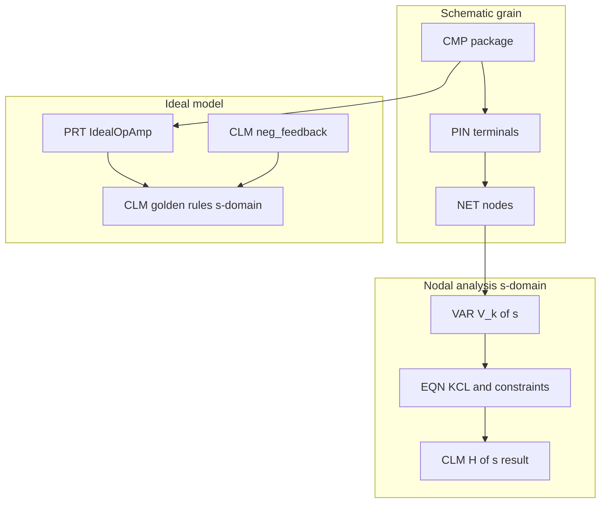

# LLM Circuit Schematic & s-Domain Analysis — A MemNet Application Note

**Application example (documentation only).** Pattern for holding **electrical schematics** and **linear circuit analysis in the s-domain** in MemNet so an agent can warm a small subgraph (one IC, one net, one KCL equation) without packing pin lists or textbook prose into a single row.

For **linear LTI** networks, the Laplace (**s**) domain is the **unifying analysis frame**: DC, steady-state sinusoid (phasor), and linear transient results are specialisations or inversions of the same \(V(s)\) / \(H(s)\) model — not parallel incompatible graphs. Prefer one s-domain atom set (`domain=s`); recover other views by evaluation or inverse Laplace.

**Primary worked example:** inverting op-amp with resistive negative feedback — schematic grain (`CMP` / `PIN` / `NET`), ideal op-amp library type, **golden rules in that s-domain linear model under negative feedback**, and nodal (node-voltage) equation atoms.

This note complements:

- [`llm-sysml-v2-modeling.md`](llm-sysml-v2-modeling.md) — SysML `PRT` / `POR` / `hasPort` for system ports (logical grain)
- Grammar PCBA fixtures — `docs/grammar/examples/17_pin_map_pcba_ato_good.txt`, `18_mutate_annotation_on_pcba_pin_good.txt`
- [`docs/grammar/memnet-grammar-design.md`](../grammar/memnet-grammar-design.md) — atomisation, Write=display, pin locators

Prefer the **shared dialect** (NODE | EDGE) for agent I/O. Legacy `@TAG` pipe may appear in seeds; do not teach it as the preferred surface.

---

## 1. Problem

An op-amp stage is one component on the BOM but many facts in analysis:

- Package pins and nets (undirected copper)
- Ideal-model assumptions (golden rules)
- Feedback topology that licenses those assumptions
- Nodal equations and transfer-function results held once in the **Laplace (s) domain**, then specialised (DC / \(j\omega\) / inverse Laplace) as needed

Stuffing `pins=2,3,6,…` or a paragraph of golden rules onto `U1` breaks atomisation: warm bloats, nets cannot attach, and s-domain constraints cannot be scoped.

MemNet stores a **small subgraph per device** plus separate claim / equation atoms for analysis.



---

## 2. Hard rules (schematic)

1. **One device ≠ one fat row.** Package = `CMP` (or SysML `PRT`); each terminal = `PIN` (or `POR`); multiplicity only via edges.
2. **Do not embed port/pin lists** on the device (`ports=…`, `pins=…`). That is an embedded relation (lint class of `07_bad_embedded_relation`).
3. **Copper is undirected.** MemNet edges are directed for storage only. Canonical attachment: **`PIN --(connects_to)--> NET`**. The arrow is not current and not signal sense.
4. **Signal sense** lives on the pin/port (`name=IN-`, `dir=in`), not on net edges.
5. **Schematic pins use locator ids** (`ATO_U1`, `PIN_U1_2`, `NET_SUM`) — copy from warm / ingest; **no client `NEW`** for those. Use `[NEW]` only for goldfish annotations (`CLM`, `EQN`, …).
6. **Golden rules are not engine `LAW`.** They are domain assumptions on the ideal type (see §4).

| Relation | Orientation (convention) | Meaning |
|----------|--------------------------|---------|
| `owns` | `CMP → PIN` | Package contains terminal |
| `connects_to` | `PIN → NET` | Terminal on net (undirected phys.) |
| `typedBy` | instance → ideal `PRT` | Linear model binding |
| `applies_to` / `about` | `CLM` → type or pin | Rule scope |
| `kcl_at` | `EQN → NET` | Nodal equation locus |
| `voltage_of` | `VAR → NET` | Unknown \(V_k(s)\) |

---

## 3. Domain kinds (shared dialect)

**Agent I/O is shared dialect only** (Write = display): `KIND [id] ; key=value…` and `[from] --(rel)--> [to]`. Do **not** use `@TAG: id|field|…` pipe as the agent-facing surface (store / legacy only).

Illustrative kinds and fields for this note:

| Kind | Role | Typical fields |
|------|------|----------------|
| `CMP` | Package / instance | `refdes=`, `value=`, `path=`, `recycle=` |
| `PIN` | Package terminal | `refdes=`, `pin=`, `name=`, `path=`, `recycle=` |
| `NET` | Electrical node | `net=`, `role=`, `path=`, `recycle=` |
| `PRT` | Ideal / library part | `name=`, `kind=`, `recycle=` |
| `POR` | Logical port on ideal type | `name=`, `kind=`, `dir=`, `recycle=` |
| `CLM` | Assumption, fact, result | `type=`, `code=`, `domain=`, `when=`, `view=`, `recycle=` |
| `VAR` | Unknown \(V_k(s)\) | `symbol=`, `of=` / `voltage_of` edge, `unit=`, `domain=`, `recycle=` |
| `EQN` | KCL / constraint | `method=`, `form=`, `code=`, `domain=`, `recycle=` |
| `TSK` | Analysis campaign | `goal=`, `phase=`, `status=`, `recycle=` |

Edges use named relations (`owns`, `connects_to`, `typedBy`, `hasPort`, `applies_to`, `kcl_at`, …) — never embedded id lists on a node.

Field notes:

- `domain=` on `CLM` / `VAR` / `EQN` — default **`s`** for linear analysis (unifying frame; see §4.0).
- Optional `view=dc` / `view=jw` / `view=t` on a **derived** result `CLM` — do not fork a second full equation set for the same linear network.
- `when=` — guard such as `neg_feedback` (required for virtual short).
- `NET` `role=` — e.g. `reference` for the nodal ground.

### 3.1 Session TagMap (engine schema only — not agent wire)

`session open --map-file` still declares **user-tag columns** in legacy pipe form (same pattern as `schema.coding.example.txt`). That file is **engine TagMap**, not mutate/display dialect. Prefer shared dialect in every agent turn; keep the map file out of warm prompts.

```text
# TagMap for session_open --map-file only (NOT agent mutate / pin map).
@CMP: id|refdes|value|path|recycle
@PIN: id|refdes|pin|name|path|recycle
@NET: id|net|role|path|recycle
@PRT: id|name|kind|recycle
@POR: id|name|kind|dir|recycle
@CLM: id|type|code|domain|when|recycle
@VAR: id|symbol|of|unit|domain|recycle
@EQN: id|method|form|code|domain|recycle
@TSK: id|goal|phase|status|recycle
```

(`EDG` / engine `LAW` are fixed and merged by the session — do not redefine them here.)

---

## 4. Ideal op-amp and golden rules (**s-domain**)

### 4.0 s-domain converts linear analysis

For a **linear time-invariant** schematic (R, L, C, dependent sources, ideal op-amp under NFB), hold **one** analysis in \(s\):

| Familiar view | How it relates to the s-model |
|---------------|-------------------------------|
| DC / bias (linear) | Evaluate at \(s \to 0\) (capacitors open, inductors short in the \(Z(s)\) sense) |
| Steady sinusoid | Set \(s = j\omega\) (phasor / AC) |
| Linear transient | Inverse Laplace of \(V_k(s)\) (with initial-condition sources if needed) |
| Transfer function | \(H(s)\) itself — then Bode from \(H(j\omega)\) |

So linear “DC vs AC vs transient” are **views of the same graph**, not three unrelated MemNet dialects. Mark core `VAR` / `EQN` / golden-rule `CLM` with `domain=s`. Add thin result rows (`type=result`, optional `view=…`) when the agent specialises.

**Outside this unification:** large-signal / non-linear behaviour (op-amp saturation, slew, switching, hard limits). Those need separate atoms and must **not** reuse G1/G2 as written.

### 4.1 Scope (important)

The classical **golden rules** in this note are **linear s-domain analysis assumptions** for an ideal voltage-controlled op-amp **under negative feedback**:

| Id | Statement (s-domain) | Code atom |
|----|----------------------|-----------|
| G1 | \(V_+(s) = V_-(s)\) (virtual short) | `V_plus_s_eq_V_minus_s` |
| G2 | \(I_+(s) = I_-(s) = 0\) | `I_plus_s_eq_0_and_I_minus_s_eq_0` |

They license writing nodal / transfer-function algebra in \(s\) (impedances \(Z(s)\), \(H(s) = V_\mathrm{out}(s)/V_\mathrm{in}(s)\)). DC and \(j\omega\) answers for the **same linear stage** come from that model (§4.0).

**They are not:**

- Engine invariants (`LAW01`…)
- Large-signal time-domain identities (saturation, slew limiting, supply clipping)
- Valid as a virtual short **without** a negative-feedback path that holds the loop linear
- A substitute for a finite-gain model \(A(s)\) when you care about GBW, peaking, or stability margins

Non-ideal refinements (`A_s_eq_A0_over_1_plus_s_over_wp`, input bias, etc.) are **extra `CLM`s**, not fields on the package.

### 4.2 Library type (not on every `U1` row)

```text
PRT [PRT_IdealOpAmp] ; name=IdealOpAmp ; kind=partDef ; recycle=persistent
POR [POR_INP] ; name=inp ; kind=portUsage ; dir=in ; recycle=persistent
POR [POR_INN] ; name=inn ; kind=portUsage ; dir=in ; recycle=persistent
POR [POR_OUT] ; name=out ; kind=portUsage ; dir=out ; recycle=persistent
E_hp1 [PRT_IdealOpAmp] --(hasPort)--> [POR_INP] ; recycle=persistent
E_hp2 [PRT_IdealOpAmp] --(hasPort)--> [POR_INN] ; recycle=persistent
E_hp3 [PRT_IdealOpAmp] --(hasPort)--> [POR_OUT] ; recycle=persistent

CLM [CLM_OA_G1] ; type=assumption ; code=V_plus_s_eq_V_minus_s ; domain=s ; when=neg_feedback ; recycle=persistent
CLM [CLM_OA_G2] ; type=assumption ; code=I_plus_s_eq_0_and_I_minus_s_eq_0 ; domain=s ; when=neg_feedback ; recycle=persistent
CLM [CLM_NFB] ; type=fact ; code=neg_feedback ; domain=s ; recycle=persistent

E_g1 [CLM_OA_G1] --(applies_to)--> [PRT_IdealOpAmp] ; recycle=persistent
E_g2 [CLM_OA_G2] --(applies_to)--> [PRT_IdealOpAmp] ; recycle=persistent
E_g1a [CLM_OA_G1] --(about)--> [POR_INP] ; recycle=persistent
E_g1b [CLM_OA_G1] --(about)--> [POR_INN] ; recycle=persistent
E_req [CLM_OA_G1] --(requires)--> [CLM_NFB] ; recycle=persistent
```

Instance binding:

```text
CMP [ATO_U1] ; refdes=U1 ; value=OPA192 ; path=boards/afe/inverting.ato ; recycle=persistent
E_ty [ATO_U1] --(typedBy)--> [PRT_IdealOpAmp] ; recycle=persistent
E_nfb [CLM_NFB] --(applies_to)--> [ATO_U1] ; recycle=persistent
```

---

## 5. Worked example — inverting amp (schematic)

Topology:

```text
Vin -- Rin -- (IN-) -- U1 -- (OUT) -- Vout
              |              |
              +----- Rf -----+
(IN+) -------- GND
```

### 5.1 Parts and pins

```text
CMP [ATO_U1]  ; refdes=U1 ; value=OPA192 ; path=boards/afe/inverting.ato ; recycle=persistent
CMP [ATO_Rin] ; refdes=R1 ; value=10k    ; path=boards/afe/inverting.ato ; recycle=persistent
CMP [ATO_Rf]  ; refdes=R2 ; value=100k   ; path=boards/afe/inverting.ato ; recycle=persistent

PIN [PIN_U1_INN] ; refdes=U1 ; pin=2 ; name=IN- ; path=boards/afe/inverting.ato ; recycle=persistent
PIN [PIN_U1_INP] ; refdes=U1 ; pin=3 ; name=IN+ ; path=boards/afe/inverting.ato ; recycle=persistent
PIN [PIN_U1_OUT] ; refdes=U1 ; pin=6 ; name=OUT ; path=boards/afe/inverting.ato ; recycle=persistent
PIN [PIN_R1_a] ; refdes=R1 ; pin=1 ; path=boards/afe/inverting.ato ; recycle=persistent
PIN [PIN_R1_b] ; refdes=R1 ; pin=2 ; path=boards/afe/inverting.ato ; recycle=persistent
PIN [PIN_R2_a] ; refdes=R2 ; pin=1 ; path=boards/afe/inverting.ato ; recycle=persistent
PIN [PIN_R2_b] ; refdes=R2 ; pin=2 ; path=boards/afe/inverting.ato ; recycle=persistent

E_o1 [ATO_U1] --(owns)--> [PIN_U1_INN] ; recycle=persistent
E_o2 [ATO_U1] --(owns)--> [PIN_U1_INP] ; recycle=persistent
E_o3 [ATO_U1] --(owns)--> [PIN_U1_OUT] ; recycle=persistent
```

### 5.2 Nets (nodal nodes)

```text
NET [NET_GND]  ; net=GND  ; role=reference ; path=boards/afe/inverting.ato ; recycle=persistent
NET [NET_VIN]  ; net=VIN  ; path=boards/afe/inverting.ato ; recycle=persistent
NET [NET_SUM]  ; net=SUM  ; path=boards/afe/inverting.ato ; recycle=persistent
NET [NET_VOUT] ; net=VOUT ; path=boards/afe/inverting.ato ; recycle=persistent

E_c1 [PIN_U1_INN] --(connects_to)--> [NET_SUM]  ; recycle=persistent
E_c2 [PIN_U1_INP] --(connects_to)--> [NET_GND]  ; recycle=persistent
E_c3 [PIN_U1_OUT] --(connects_to)--> [NET_VOUT] ; recycle=persistent
E_c4 [PIN_R1_a]   --(connects_to)--> [NET_VIN]  ; recycle=persistent
E_c5 [PIN_R1_b]   --(connects_to)--> [NET_SUM]  ; recycle=persistent
E_c6 [PIN_R2_a]   --(connects_to)--> [NET_VOUT] ; recycle=persistent
E_c7 [PIN_R2_b]   --(connects_to)--> [NET_SUM]  ; recycle=persistent
```

Feedback as **analysis vocabulary** (optional digest), not reversed copper:

```text
E_fb [ATO_Rf] --(closes_loop)--> [ATO_U1] ; recycle=persistent
E_fb2 [NET_VOUT] --(feeds_back_to)--> [NET_SUM] ; note=via_Rf ; recycle=persistent
```

---

## 6. Nodal analysis in the s-domain

MemNet does **not** solve KCL. It holds the **node set, branch uses, and equation atoms** in \(s\). An agent or external solver reads the warm slice, solves for \(V_k(s)\) / \(H(s)\), writes result `CLM`s, and may add `view=dc` / `view=jw` / `view=t` specialisations without rebuilding the netlist equations.

### 6.1 Mapping

| Nodal analysis | MemNet |
|----------------|--------|
| Essential node | `NET` |
| Reference | `NET` with `role=reference` + \(V=0\) assumption |
| Branch | `CMP` + pin→net edges |
| Unknown \(V_k(s)\) | `VAR` with `domain=s` |
| KCL at node | one `EQN` (`method=nodal`, `domain=s`) |
| Ideal constraints | `EQN` / `CLM` from G1/G2 under `CLM_NFB` |

### 6.2 Variables and reference

```text
VAR [VAR_SUM]  ; symbol=V_SUM_s  ; of=NET_SUM  ; unit=V ; domain=s ; recycle=persistent
VAR [VAR_VOUT] ; symbol=V_VOUT_s ; of=NET_VOUT ; unit=V ; domain=s ; recycle=persistent
VAR [VAR_VIN]  ; symbol=V_VIN_s  ; of=NET_VIN  ; unit=V ; domain=s ; recycle=persistent

E_v1 [VAR_SUM]  --(voltage_of)--> [NET_SUM]  ; recycle=persistent
E_v2 [VAR_VOUT] --(voltage_of)--> [NET_VOUT] ; recycle=persistent
E_v3 [VAR_VIN]  --(voltage_of)--> [NET_VIN]  ; recycle=persistent

CLM [CLM_VREF] ; type=assumption ; code=V_GND_s_eq_0 ; domain=s ; recycle=persistent
E_ref [CLM_VREF] --(applies_to)--> [NET_GND] ; recycle=persistent
```

### 6.3 KCL at the summing node

With G2, no current into IN−. Resistive branches (frequency-flat):

\[
\frac{V_\mathrm{SUM}(s) - V_\mathrm{IN}(s)}{R_\mathrm{in}} + \frac{V_\mathrm{SUM}(s) - V_\mathrm{OUT}(s)}{R_f} = 0
\]

```text
EQN [EQN_KCL_SUM] ; method=nodal ; form=KCL ; code=I_Rin_s_plus_I_Rf_s_eq_0 ; domain=s ; recycle=persistent
E_k1 [EQN_KCL_SUM] --(kcl_at)--> [NET_SUM] ; recycle=persistent
E_k2 [EQN_KCL_SUM] --(uses)--> [ATO_Rin] ; recycle=persistent
E_k3 [EQN_KCL_SUM] --(uses)--> [ATO_Rf] ; recycle=persistent
E_k4 [EQN_KCL_SUM] --(uses)--> [VAR_SUM] ; recycle=persistent
E_k5 [EQN_KCL_SUM] --(uses)--> [VAR_VOUT] ; recycle=persistent
E_k6 [EQN_KCL_SUM] --(uses)--> [VAR_VIN] ; recycle=persistent
```

### 6.4 Virtual earth from G1 (IN+ at ground)

Under `CLM_NFB` + G1 with IN+ on `NET_GND`:

\[
V_\mathrm{SUM}(s) = 0
\]

```text
EQN [EQN_VIRT] ; method=nodal ; form=constraint ; code=V_SUM_s_eq_0 ; domain=s ; recycle=persistent
E_c1 [EQN_VIRT] --(from)--> [CLM_OA_G1] ; recycle=persistent
E_c2 [EQN_VIRT] --(requires)--> [CLM_NFB] ; recycle=persistent
E_c3 [EQN_VIRT] --(constrains)--> [VAR_SUM] ; recycle=persistent
```

### 6.5 Transfer-function result

\[
H(s) = \frac{V_\mathrm{OUT}(s)}{V_\mathrm{IN}(s)} = -\frac{R_f}{R_\mathrm{in}}
\]

(ideal, resistive; still an s-domain statement — \(H(s)\) is constant.)

```text
CLM [CLM_H] ; type=result ; code=H_s_eq_minus_Rf_over_Rin ; domain=s ; recycle=persistent
E_r1 [CLM_H] --(derived_from)--> [EQN_KCL_SUM] ; recycle=persistent
E_r2 [CLM_H] --(derived_from)--> [EQN_VIRT] ; recycle=persistent
E_r3 [CLM_H] --(about)--> [ATO_U1] ; recycle=persistent
```

When \(Z_f(s)\) / \(Z_\mathrm{in}(s)\) are reactive, keep the same graph shape and change `code` to the symbolic ratio (still `domain=s`).

---

## 7. Agent loop (circuit turn)

1. **`pin_map` / `query pin-map`** on the focus (`ATO_U1`, `NET_SUM`, `EQN_KCL_SUM`, or analysis `TSK`).
2. **Reason** only from that slice + user ask (goldfish).
3. **Mutate** — schematic pins with locator ids; analysis atoms with `[NEW]` then copy assigned ids.
4. **Re-warm** before the next edit.

Illustrative focus task:

```text
TSK [TSK_inv_nfb] ; goal=Analyse inverting NFB amp in s-domain ; phase=nodal ; status=in_progress ; recycle=persistent
E_t1 [TSK_inv_nfb] --(owns)--> [ATO_U1] ; recycle=persistent
E_t2 [TSK_inv_nfb] --(owns)--> [EQN_KCL_SUM] ; recycle=persistent
```

---

## 8. Two grains (do not conflate)

| Grain | Kinds | Use when |
|-------|-------|----------|
| Schematic / PCBA | `CMP`, `PIN`, `NET` | Wiring, `.ato` locators, nodal nodes |
| SysML / logical | `PRT`, `POR`, `CON` | Interface contracts, allocations, docs |

Same device may appear in both: schematic `ATO_U1` `typedBy` ideal `PRT_IdealOpAmp`; SysML part usage can `allocates` / mirror ports. Keep ids stable; relate with edges — do not merge grains into one row.

---

## 9. Pitfalls

| Mistake | Fix |
|---------|-----|
| `ports=inp,inn,out` on `CMP` | Separate `PIN`/`POR` + `owns`/`hasPort` |
| Net arrow as current or “feedback direction” | `connects_to` is PIN→NET only; use `closes_loop` / `CLM_NFB` for feedback story |
| Golden rules as prose on `U1` | `CLM` on ideal type; `domain=s`; `requires` `CLM_NFB` |
| Applying G1 with no feedback / in saturation | Keep `when=neg_feedback`; add separate large-signal `CLM`s if needed |
| Parallel DC / AC / transient equation graphs for one LTI netlist | One `domain=s` set; specialise with `view=` result rows (§4.0) |
| Omitting `domain=s` on linear analysis atoms | Mark core `VAR`/`EQN`/golden-rule `CLM` as `domain=s` |
| Reusing G1/G2 for saturation / switching | Separate non-linear `CLM`s; golden rules stay linear s-domain under NFB |
| `NEW` for `ATO_*` / `PIN_*` / `NET_*` | Locator path only; `[NEW]` for annotations |
| One KCL blob for the whole circuit | One `EQN` per essential node (+ constraint eqns) |
| Expecting MemNet to SPICE-solve | Graph holds atoms; solver/agent writes `type=result` |

---

## 10. Minimal seed (copy-paste sketch)

After opening a session with the TagMap in §3.1 (engine schema only), seed library + task in **shared dialect** (abbreviated; expand pins as in §5):

```text
+ PRT [PRT_IdealOpAmp] ; name=IdealOpAmp ; kind=partDef ; recycle=persistent
+ CLM [CLM_OA_G1] ; type=assumption ; code=V_plus_s_eq_V_minus_s ; domain=s ; when=neg_feedback ; recycle=persistent
+ CLM [CLM_OA_G2] ; type=assumption ; code=I_plus_s_eq_0_and_I_minus_s_eq_0 ; domain=s ; when=neg_feedback ; recycle=persistent
+ CLM [CLM_NFB] ; type=fact ; code=neg_feedback ; domain=s ; recycle=persistent
+ NEW [CLM_OA_G1] --(applies_to)--> [PRT_IdealOpAmp] ; recycle=persistent
+ NEW [CLM_OA_G1] --(requires)--> [CLM_NFB] ; recycle=persistent
+ TSK [TSK_inv_nfb] ; goal=Analyse inverting NFB amp in s-domain ; phase=schematic ; status=in_progress ; recycle=persistent
```

Then ingest or hand-seed `CMP`/`PIN`/`NET` with **explicit locator ids**, bind `typedBy`, emit nodal `VAR`/`EQN`, warm on `TSK_inv_nfb` or `NET_SUM`.

---

## 11. Related

| Path | Role |
|------|------|
| `docs/grammar/examples/17_pin_map_pcba_ato_good.txt` | PCBA pin→net present form |
| `docs/grammar/examples/18_mutate_annotation_on_pcba_pin_good.txt` | `[NEW]` only for annotations |
| `docs/application-notes/llm-sysml-v2-modeling.md` | Logical ports / `hasPort` |
| `docs/LLM-GUIDE.md` | Goldfish loop (operational) |
| `.cursor/skills/memnet-reference/` | Engine dialect routing (keep thin — this note is the circuit SSOT) |

**This file is one documented application example.** Use it for schematic subgraphs, s-domain golden-rule scoping, and nodal equation atoms on MemNet. For SysML system ports see `llm-sysml-v2-modeling.md`; for engine behaviour see `docs/LLM-GUIDE.md` and `docs/grammar/`.
