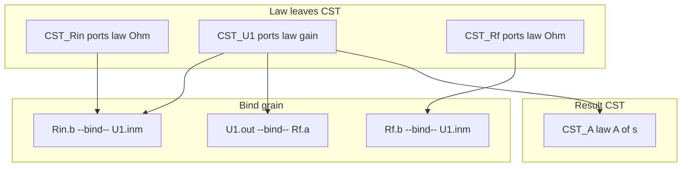

# LLM circuit schematic and s-domain analysis — circuit domain

> **Dialect (1.x):** **GQL only** — [`../grammar/gql-wire-profile.md`](../grammar/gql-wire-profile.md). Do **not** teach Layer / Tier A. Note body may still show historical seeds until **M3**; prefer [`examples/inverting-amplifier-gql-case-study.md`](examples/inverting-amplifier-gql-case-study.md) for wire shapes.

**Application example (documentation only).** Hold **electrical schematics** and **linear circuit analysis in the s-domain** in MemNet so an agent can warm a small subgraph (one IC, one star, one transfer result) without packing pin lists or textbook prose into a single row. **Wire shapes:** GQL case study / profile — not Layer ASCII.

For **linear LTI** networks, the Laplace (**s**) domain is the **unifying analysis frame**: DC, steady-state sinusoid (phasor), and linear transient results are specialisations or inversions of the same \(V(s)\) / \(H(s)\) model. Prefer one s-domain atom set (`domain=s`); recover other views by evaluation or inverse Laplace.


**Primary worked example:** inverting op-amp with resistive negative feedback — [`examples/inverting-amplifier-memnet.md`](examples/inverting-amplifier-memnet.md).

Complements:

- [`llm-nodal-analysis-formulas.md`](llm-nodal-analysis-formulas.md) — node method ↔ NODE `law=` / binds
- [`llm-sysml-v2-modeling.md`](llm-sysml-v2-modeling.md) — SysML locators (logical grain; relation EDGEs)
- Layer goldens — `docs/grammar/archive/examples-layer/` (historical only)

British English. ASCII. Historical CMP/PIN/NET sketches in §10 are **not** agent teach.

---

## 1. Problem

An op-amp stage is one component on the BOM but many facts in analysis:

- Terminals and nets (undirected copper)
- Ideal-model assumptions (golden rules) as **NODE laws**
- Feedback topology that licenses those assumptions
- Nodal equations and transfer-function results held once in the **Laplace (s) domain**

Stuffing `pins=2,3,6,…` or a paragraph of golden rules onto `U1` breaks atomisation. MemNet stores **one CST per device** (ports + law) plus optional result CSTs; copper is **bind**, not a pin-list field.



---

## 2. Hard rules (Layer schematic)

1. **One device = one law leaf.** Prefer kind **`CST`** with `ports=` + `law=` (+ params). No fat pin-list field on the device.
2. **Ports are bags on the NODE.** Teach `ports=name: {direc=…, V=@…, I=@…}` — across + through on **one** port. Do **not** mint first-class `PIN` atoms as the Layer teach surface.
3. **Copper is bind grain.** Both ends `[Node.port]`; teach **`bind`** only (`--bind-->` / `--bind--`). Optional `carries=I`. Arrow is not current sense.
4. **Signal / current sense** lives in port `direc=` and device `law=` (signed `I`), not on the bind label.
5. **Law never on EDGE.** Continuity is implied by bind; Ohm / KCL / gain stay on NODE.
6. **Golden rules are domain `law=` / thin result CSTs**, not engine `LAW01` rows.
7. Teach **`direc=`** only; omit session-default `recycle=`. Teach **`view=`** on `pin_map` (`shell` / `interior`) — not a kind zoo.

| Shape | Meaning |
|-------|---------|
| `CST` + `ports=` + `law=` | Device / constitutive / causal leaf |
| `[A.p] --bind--> [B.q]` | Ideal connection (copper / pipe) |
| `[A] --about--> [B]` | Chart / semantic (bare ids; label = sense) |

---

## 3. Domain fields (Layer)

**Agent I/O teach = Layer.** Present / mutate lines:

```text
CST [Id] ; name=… ; ports=… ; law=$…$ ; param=…
Eid [Id.port] --bind--> [Id.port] ; carries=…
```

Illustrative fields:

| Field / shape | Role |
|---------------|------|
| `ports=` | `name: {direc=in\|out\|inout, V=@…, I=@…}`, `,`-joined |
| `law=` | LaTeX `$…$` on NODE; multi-eq `,`-joined |
| `R=` / `a_s=` / `A_s=` | Params on the NODE |
| `domain=s` | Linear analysis frame (optional on result CSTs) |
| `role=` | Thin disambiguator only — not a new KIND |
| `view=` | Pin-map grain (`shell` / `interior`) — query envelope |

### 3.1 Alias discipline

Primary teach: declare `V=@va, I=@ia` in the bag; **repeat `@va` / `@ia` inside** `law=$…$`. Alias scope is **per NODE**. Cross-node coupling = **bind**, not a shared `@` namespace.

```text
CST [CST_R] ; R=50 ; ports=a: {direc=inout, V=@va, I=@ia},b: {direc=inout, V=@vb, I=@ib} ; law=$@va-@vb=@ia*R$,$@ia=-@ib$
```

---

## 4. Ideal op-amp and golden rules (**s-domain**)

### 4.0 s-domain converts linear analysis

| Familiar view | How it relates to the s-model |
|---------------|-------------------------------|
| DC / bias (linear) | Evaluate at \(s \to 0\) |
| Steady sinusoid | Set \(s = j\omega\) |
| Linear transient | Inverse Laplace of \(V_k(s)\) |
| Transfer function | \(H(s)\) itself — then Bode from \(H(j\omega)\) |

Mark core analysis with `domain=s`. Specialise with thin result rows / params — do not fork a second full equation set for the same LTI netlist.

**Outside this unification:** saturation, slew, switching, hard limits — separate atoms; do **not** reuse G1/G2 as written.

### 4.1 Scope

| Id | Statement (s-domain) | On wire |
|----|----------------------|---------|
| G1 | \(V_+(s) = V_-(s)\) under NFB (virtual short) | Ideal **limit** in `law=` / result — or finite \(a(s)\) first (InvAmp note) |
| G2 | \(I_+(s) = I_-(s) = 0\) | `law=` on the op-amp CST |

**They are not:** engine invariants; large-signal identities; valid without a negative-feedback path that holds the loop linear.

### 4.2 Ideal op-amp CST (finite gain teach)

Prefer finite \(a(s)\) on the NODE; take \(a\to\infty\) only at the end (see InvAmp derivation):

```text
CST [CST_U1] ; name=opamp ; a_s=1000000 ; ports=inp: {direc=in, V=@vp, I=@ip},inm: {direc=in, V=@vm, I=@im},out: {direc=out, V=@vo, I=@io} ; law=$@ip=0$,$@im=0$,$@vo=a_s*(@vp-@vm)$
```

Ideal-limit shortcut (only after NFB closure is established):

```text
CST [CST_U1] ; name=opamp_ideal ; ports=inp: {direc=in, V=@vp, I=@ip},inm: {direc=in, V=@vm, I=@im},out: {direc=out, V=@vo, I=@io} ; law=$@ip=0$,$@im=0$,$@vp=@vm$
```

Negative feedback is **topology** (binds that close the loop) — optional bare-id fact `CST [CST_NFB] ; role=fact ; name=neg_feedback` with `--about-->` if the digest needs it. Do not reverse copper arrows to “mean” feedback.

---

## 5. Worked example — inverting amp (Layer)

Topology:

```text
Vin -- Rin -- (IN-) -- U1 -- (OUT) -- Vout
              |              |
              +----- Rf -----+
(IN+) -------- GND
```

Full derivation + mutate seed: [`examples/inverting-amplifier-memnet.md`](examples/inverting-amplifier-memnet.md). Golden: [`../grammar/examples/layer/layer_09_inv_amp_good.txt`](../grammar/examples/layer/layer_09_inv_amp_good.txt).

### 5.1 Devices and binds (present)

```text
CST [CST_Vin] ; name=Vin ; Vin=1.0 ; ports=p: {direc=out, V=@vin, I=@iin} ; law=$@vin=Vin$
CST [CST_Rin] ; name=Rin ; R=10000 ; ports=a: {direc=inout, V=@va_r, I=@ia_r},b: {direc=inout, V=@vb_r, I=@ib_r} ; law=$@va_r-@vb_r=@ia_r*R$,$@ia_r=-@ib_r$
CST [CST_Rf] ; name=Rf ; R=100000 ; ports=a: {direc=inout, V=@va_f, I=@ia_f},b: {direc=inout, V=@vb_f, I=@ib_f} ; law=$@va_f-@vb_f=@ia_f*R$,$@ia_f=-@ib_f$
CST [CST_U1] ; name=opamp ; a_s=1000000 ; ports=inp: {direc=in, V=@vp, I=@ip},inm: {direc=in, V=@vm, I=@im},out: {direc=out, V=@vo, I=@io} ; law=$@ip=0$,$@im=0$,$@vo=a_s*(@vp-@vm)$
CST [CST_Gnd] ; name=VGND ; ports=a: {direc=inout, V=@vg, I=@ig} ; law=$@vg=0$
CST [CST_A] ; name=closed_loop ; a_s=1000000 ; Rin=10000 ; Rf=100000 ; A_s=-10.0 ; A_s_lim=-10.0 ; Vin=1.0 ; Vout=-10.0 ; ports=in: {direc=in, V=@vin_a},out: {direc=out, V=@vout_a} ; law=$@vout_a=@vin_a*A_s$,$A_s=-(Rf/Rin)*a_s/(a_s+1+Rf/Rin)$,$A_s_lim=-(Rf/Rin)$
E_vin [CST_Vin.p] --bind--> [CST_Rin.a] ; carries=I
E_sum_r [CST_Rin.b] --bind-- [CST_U1.inm] ; carries=I
E_sum_f [CST_Rf.b] --bind-- [CST_U1.inm] ; carries=I
E_out_f [CST_U1.out] --bind-- [CST_Rf.a] ; carries=I
E_inp [CST_U1.inp] --bind-- [CST_Gnd.a] ; carries=I
E_A_in [CST_Vin.p] --bind--> [CST_A.in]
E_A_out [CST_U1.out] --bind--> [CST_A.out]
```

Star at the inverting node: `Rin.b` and `Rf.b` both bind to `U1.inm`.

### 5.2 Transfer result

Ideal limit: \(H(s)=-R_f/R_\mathrm{in}\) lives in `CST_A` as `A_s_lim` / `law=` — **not** as an EDGE `derives`. When \(Z_f(s)\) / \(Z_\mathrm{in}(s)\) are reactive, keep the same bind topology and change `law=` / params.

---

## 6. Nodal analysis in the s-domain

MemNet does **not** solve KCL. It holds **devices, binds, and result laws** in \(s\). An agent or external solver reads `pin_map`, solves for \(V_k(s)\) / \(H(s)\), and `update`s absolutes. Mapping detail: [`llm-nodal-analysis-formulas.md`](llm-nodal-analysis-formulas.md).

| Nodal analysis | Layer |
|----------------|--------|
| Essential node | Equipotential at a star of binds |
| Reference | Ground CST with \(V=0\) law |
| Branch | Device CST + port binds |
| Unknown \(V_k(s)\) | Port `V=@…` absolutes / aliases |
| KCL | Implied at star + \(I=0\) ports, or thin KCL CST |
| Ideal constraints | Op-amp `law=` (+ NFB topology) |

---

## 7. Agent loop (circuit turn)

1. **`pin_map`** on the focus (`CST_U1`, `CST_A`, or analysis `TSK`) — prefer `view=shell`, descend with `view=interior` / re-anchor when blocked.
2. **Reason** only from that slice + user ask (goldfish).
3. **Mutate** Layer lines (`+` / `~` / binds). Copy assigned ids.
4. **Re-warm** before the next edit.

```text
TSK [TSK_inv_nfb] ; goal=Analyse inverting NFB amp in s-domain ; phase=nodal ; status=in_progress
E_t1 [TSK_inv_nfb] --about--> [CST_U1]
E_t2 [TSK_inv_nfb] --about--> [CST_A]
```

(`TSK` / `--about-->` = relation grain — bare ids.)

---

## 8. Two grains (do not conflate)

| Grain | Shape | Use when |
|-------|-------|----------|
| Electrical Layer | `CST` + `ports=` + `law=` + `--bind-->` | Wiring, Ohm, gain, s-domain stamps |
| SysML / locator | `PRT` / `POR` / `PKG` + bare-id relations | Interface contracts, file locators, docs |

Same physical device may appear in both: Layer `CST_U1` for analysis; SysML part usage for system ports. Keep ids stable; **relate** with bare-id edges — do not merge grains into one row. Do **not** invent `self` ports to force bind on chart rows.

---

## 9. Pitfalls

| Mistake | Fix |
|---------|-----|
| Flat `PIN` atoms / `connects_to` as primary | Port bags + `--bind-->` |
| `law=` or `derives` on EDGE | Law on NODE only |
| Paren `--(rel)-->` teach | Bare `--bind-->` / `--rel_name-->` |
| Net arrow as current or “feedback direction” | Bind = continuity; NFB = topology / fact |
| Golden rules as prose on the package | `law=` on op-amp CST; finite \(a(s)\) then limit |
| Applying G1 with no feedback / in saturation | Keep NFB topology; separate large-signal CSTs |
| Parallel DC / AC / transient equation graphs for one LTI netlist | One `domain=s` set; specialise results |
| Expecting MemNet to SPICE-solve | Graph holds atoms; solver/agent writes absolutes |
| Dual-teaching Tier A in the same seed | Layer only; legacy pointer §10 |

---

## 10. Legacy Tier A (pointer only)

CMP / PIN / NET + `--(connects_to)-->` + self-loop `derives` remain an **accept path** through 0.5.x. Fixtures under `docs/grammar/examples/17_*.txt`, `18_*.txt`, `22_inverting_amp_nodal_good.txt`. **Do not** seed new agent sessions in those shapes — migrate copper → `bind`, maths → NODE `law=`.

---

## 11. Related

| Path | Role |
|------|------|
| [`examples/inverting-amplifier-memnet.md`](examples/inverting-amplifier-memnet.md) | Derivation + Layer MCP seed |
| [`llm-nodal-analysis-formulas.md`](llm-nodal-analysis-formulas.md) | Ohm / KCL Layer patterns |
| [`../grammar/memnet-multi-layer.md`](../grammar/memnet-multi-layer.md) | Layer SSOT |
| [`../grammar/examples/layer/layer_09_inv_amp_good.txt`](../grammar/examples/layer/layer_09_inv_amp_good.txt) | InvAmp Layer golden |
| [`../LLM-GUIDE.md`](../LLM-GUIDE.md) | Goldfish loop (operational) |
| `~/.cursor/skills/memnet-format/` | Wire shapes (user pack) |

**This file is one documented application example.** Use it for Layer schematic subgraphs, s-domain golden-rule scoping, and nodal stamps on MemNet.
