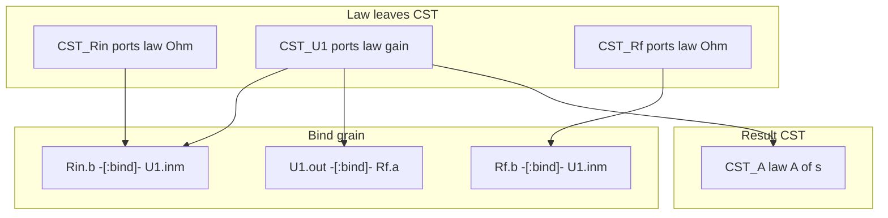

# LLM circuit schematic and s-domain analysis — circuit domain

> **Dialect (product 0.8):** **GQL only** — [`../grammar/gql-wire-profile.md`](../grammar/gql-wire-profile.md). Do **not** teach Layer / Tier A.

**Application example (documentation only).** Hold **electrical schematics** and **linear circuit analysis in the s-domain** in MemNet so an agent can warm a small subgraph (one IC, one star, one transfer result) without packing pin lists or textbook prose into a single row.

For **linear LTI** networks, the Laplace (**s**) domain is the **unifying analysis frame**: DC, steady-state sinusoid (phasor), and linear transient results are specialisations or inversions of the same \(V(s)\) / \(H(s)\) model. Prefer one s-domain atom set (`domain:'s'`); recover other views by evaluation or inverse Laplace.

**Primary worked example (GQL wire):** [`examples/inverting-amplifier-gql-case-study.md`](examples/inverting-amplifier-gql-case-study.md).  
**Math derivation SSOT:** [`examples/inverting-amplifier-memnet.md`](examples/inverting-amplifier-memnet.md).

Complements:

- [`llm-nodal-analysis-formulas.md`](llm-nodal-analysis-formulas.md) — node method ↔ node `law` / `:bind`
- [`llm-sysml-v2-modeling.md`](llm-sysml-v2-modeling.md) — SysML locators (logical grain)

British English. ASCII.

---

## 1. Problem

An op-amp stage is one component on the BOM but many facts in analysis:

- Terminals and nets (undirected copper)
- Ideal-model assumptions (golden rules) as **node laws**
- Feedback topology that licenses those assumptions
- Nodal equations and transfer-function results held once in the **Laplace (s) domain**

Stuffing pin lists or a paragraph of golden rules onto `U1` breaks atomisation. MemNet stores **one `:CST` per device** (`ports` + `law`) plus optional result CSTs; copper is **`:bind`**, not a pin-list property.



---

## 2. Hard rules (GQL schematic)

1. **One device = one law leaf.** Prefer label **`:CST`** with `ports` + `law` (+ params). No fat pin-list property on the device.
2. **Ports are bags on the node.** Teach `ports: {name: {direc:…, V:'@…', I:'@…'}}` — across + through on **one** port. Do **not** mint first-class `PIN` atoms as teach.
3. **Copper is bind grain.** Relationship type **`:bind`** with `fromPort` / `toPort`. Optional `carries:'I'`. Arrow is not current sense.
4. **Signal / current sense** lives in port `direc` and device `law` (signed `I`), not on the bind type.
5. **Law never on a relationship.** Continuity is implied by `:bind`; Ohm / KCL / gain stay on the node.
6. **Golden rules are domain `law` / thin result CSTs**, not engine `LAW01` rows.
7. Teach **`direc`** only; omit session-default `recycle`. Teach **`view=`** on `pin_map` (`shell` / `interior`) — not a kind zoo.

| Shape | Meaning |
|-------|---------|
| `:CST` + `ports` + `law` | Device / constitutive / causal leaf |
| `(a)-[:bind {fromPort,toPort}]->(b)` | Ideal connection (copper / pipe) |
| `(a)-[:about]->(b)` | Chart / semantic (bare ids; type = sense) |

---

## 3. Domain fields (GQL)

**Agent I/O teach = GQL.** Mutate / present sketches:

```cypher
CREATE (n:CST {name:'…', ports:{…}, law:'$…$', R:50})
MATCH (a:CST {name:'A'}), (b:CST {name:'B'})
CREATE (a)-[:bind {fromPort:'p', toPort:'q', carries:'I'}]->(b)
```

| Field / shape | Role |
|---------------|------|
| `ports` | map `name → {direc, V, I}` |
| `law` | LaTeX string on node; multi-eq `,`-joined |
| `R` / `a_s` / `A_s` | Params on the node |
| `domain:'s'` | Linear analysis frame (optional on result CSTs) |
| `role` | Thin disambiguator only — not a new label |
| `view=` | Pin-map grain (`shell` / `interior`) — query envelope |

### 3.1 Alias discipline

Primary teach: declare `V:'@va', I:'@ia'` in the bag; **repeat `@va` / `@ia` inside** `law`. Alias scope is **per node**. Cross-node coupling = **`:bind`**, not a shared `@` namespace.

```cypher
(:CST {id:'CST_R', R:50, ports:{a:{direc:'inout', V:'@va', I:'@ia'}, b:{direc:'inout', V:'@vb', I:'@ib'}}, law:'$@va-@vb=@ia*R$,$@ia=-@ib$'})
```

---

## 4. Ideal op-amp and golden rules (**s-domain**)

### 4.0 s-domain converts linear analysis

| Familiar view | How it relates to the s-model |
|---------------|-------------------------------|
| DC / bias (linear) | Evaluate at \(s \to 0\) |
| Steady sinusoid | Set \(s = j\omega\) |
| Linear transient | Inverse Laplace of \(V_k(s)\) |
| Transfer function | \(H(s)\) itself — then Bode from \(H(j\omega)\) |

Mark core analysis with `domain:'s'`. Specialise with thin result rows / params — do not fork a second full equation set for the same LTI netlist.

**Outside this unification:** saturation, slew, switching, hard limits — separate atoms; do **not** reuse G1/G2 as written.

### 4.1 Scope

| Id | Statement (s-domain) | On wire |
|----|----------------------|---------|
| G1 | \(V_+(s) = V_-(s)\) under NFB (virtual short) | Ideal **limit** in `law` / result — or finite \(a(s)\) first (InvAmp note) |
| G2 | \(I_+(s) = I_-(s) = 0\) | `law` on the op-amp CST |

**They are not:** engine invariants; large-signal identities; valid without a negative-feedback path that holds the loop linear.

### 4.2 Ideal op-amp CST (finite gain teach)

Prefer finite \(a(s)\) on the node; take \(a\to\infty\) only at the end:

```cypher
(:CST {
  id:'CST_U1', name:'opamp', a_s:1000000,
  ports:{
    inp:{direc:'in', V:'@vp', I:'@ip'},
    inm:{direc:'in', V:'@vm', I:'@im'},
    out:{direc:'out', V:'@vo', I:'@io'}
  },
  law:'$@ip=0$,$@im=0$,$@vo=a_s*(@vp-@vm)$'
})
```

Negative feedback is **topology** (`:bind` that close the loop) — optional bare-id fact with `:about` if the digest needs it. Do not reverse copper arrows to “mean” feedback.

---

## 5. Worked example — inverting amp (GQL)

Topology:

```text
Vin -- Rin -- (IN-) -- U1 -- (OUT) -- Vout
              |              |
              +----- Rf -----+
(IN+) -------- GND
```

**Full GQL mutate + shaped `pin_map`:** [`examples/inverting-amplifier-gql-case-study.md`](examples/inverting-amplifier-gql-case-study.md).  
**Math derivation:** [`examples/inverting-amplifier-memnet.md`](examples/inverting-amplifier-memnet.md).

Star at the inverting node: `Rin.b` and `Rf.b` both `:bind` to `U1.inm` via `fromPort`/`toPort`.

Ideal limit: \(H(s)=-R_f/R_\mathrm{in}\) lives on `CST_A` as `A_s_lim` / `law` — **not** as a relationship `derives`.

---

## 6. Nodal analysis in the s-domain

MemNet does **not** solve KCL. It holds **devices, binds, and result laws** in \(s\). An agent or external solver reads `pin_map`, solves for \(V_k(s)\) / \(H(s)\), and `update`s absolutes. Mapping detail: [`llm-nodal-analysis-formulas.md`](llm-nodal-analysis-formulas.md).

| Nodal analysis | GQL shape |
|----------------|-----------|
| Essential node | Equipotential at a star of `:bind` |
| Reference | Ground CST with \(V=0\) law |
| Branch | Device CST + port binds |
| Unknown \(V_k(s)\) | Port `V:'@…'` absolutes / aliases |
| KCL | Implied at star + \(I=0\) ports, or thin KCL CST |
| Ideal constraints | Op-amp `law` (+ NFB topology) |

---

## 7. Agent loop (circuit turn)

Cue then `pin_map`. Skip if the seed is empty (`find` / known id first). MCP arg is **`session`**. In-process MCP only for a **single** agent.

1. **Cue** — labels+properties / keyword, or `find(kind='CST', limit=L)`. Empty \(Q\) ⇒ skip. When \(|Q|>1\), CueConflict (do not pick one root; do not absorb). leftover copy-id `--anchor` is leftover.
2. **`pin_map`** from that cue — prefer `view=shell`, descend with `view=interior` when blocked.
3. **Reason** only from that slice + user ask (goldfish).
4. **Commit** gated GQL (`CREATE` / `MATCH`…`SET` / `:bind`). leftover `id:'NEW'` mint is leftover.
5. **Re-`pin_map`** from the cue before the next edit.

```cypher
CREATE (t:TSK {id:'TSK_inv_nfb', goal:'Analyse inverting NFB amp in s-domain', phase:'nodal', status:'in_progress'})
MATCH (t:TSK {id:'TSK_inv_nfb'}), (u:CST {id:'CST_U1'}) CREATE (t)-[:about]->(u)
MATCH (t:TSK {id:'TSK_inv_nfb'}), (a:CST {id:'CST_A'}) CREATE (t)-[:about]->(a)
```

---

## 8. Two grains (do not conflate)

| Grain | Shape | Use when |
|-------|-------|----------|
| Electrical (GQL) | `:CST` + `ports` + `law` + `:bind` | Wiring, Ohm, gain, s-domain stamps |
| SysML / locator | `:PRT` / `:POR` / `:PKG` + bare-id rels | Interface contracts, file locators, docs |

Same physical device may appear in both: `CST_U1` for analysis; SysML part usage for system ports. Keep ids stable; **relate** with bare-id relationships — do not merge grains into one node. Do **not** invent `self` ports to force bind on chart rows.

---

## 9. Pitfalls

| Mistake | Fix |
|---------|-----|
| Flat `PIN` atoms / `connects_to` as primary | Port bags + `:bind` |
| `law` on a relationship | Law on node only |
| Layer ASCII / paren `--(rel)-->` teach | GQL + `:bind` / typed rels |
| Net arrow as current or “feedback direction” | Bind = continuity; NFB = topology / fact |
| Golden rules as prose on the package | `law` on op-amp CST; finite \(a(s)\) then limit |
| Expecting MemNet to SPICE-solve | Graph holds atoms; solver/agent writes absolutes |
| Dual-teaching Layer / Tier A | GQL only |

---

## 10. Retired Layer / Tier A

Layer ASCII, CMP/PIN/NET, and leftover paren arrows are **not** product accept or teach. Math SSOT: [`examples/inverting-amplifier-memnet.md`](examples/inverting-amplifier-memnet.md).

---

## 11. Related

| Path | Role |
|------|------|
| [`examples/inverting-amplifier-gql-case-study.md`](examples/inverting-amplifier-gql-case-study.md) | **Primary** GQL InvAmp teach |
| [`examples/inverting-amplifier-memnet.md`](examples/inverting-amplifier-memnet.md) | Math SSOT |
| [`llm-nodal-analysis-formulas.md`](llm-nodal-analysis-formulas.md) | Ohm / KCL GQL patterns |
| [`../grammar/gql-wire-profile.md`](../grammar/gql-wire-profile.md) | GQL wire SSOT |
| [`../LLM-GUIDE.md`](../LLM-GUIDE.md) | Goldfish loop |

**This file is one documented application example.** Use it for GQL schematic subgraphs, s-domain golden-rule scoping, and nodal stamps on MemNet.
