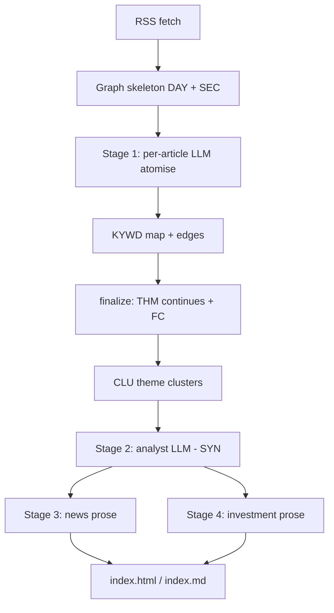

# LLM daily news digest

> **Dialect (1.x):** **GQL only** — [`../grammar/gql-wire-profile.md`](../grammar/gql-wire-profile.md). Do **not** teach Layer / Tier A. Note body may still show historical seeds until **M3**; prefer [`examples/inverting-amplifier-gql-case-study.md`](examples/inverting-amplifier-gql-case-study.md) for wire shapes.

**Application example (documentation only).** Multi-stage RSS digest pipeline with session-scoped working memory — not part of the MemNet engine. The graph is built during one run, queried for analysis, and drives final prose; readers see Markdown/HTML, not raw wires.

**Teach:** Write = display; keyword / story links as bare-id **`--rel_name-->`**. **`pin_map`** (not `query warm`). Pipe `@TAG` — legacy only (§8). Doctrine: [`gql-wire-profile.md`](../grammar/gql-wire-profile.md).

**Project sketch:** `daily-news` — RSS digest with fact-checking; bridge `memnet_bridge.py`; schema `memnet_schema.txt`; orchestrator `generate.py`.

British English. ASCII. No `|` pipe on the agent surface.

---

## 1. Problem MemNet solves

Each day the pipeline ingests ~100 RSS articles. The LLM cannot hold all articles in context. MemNet provides:

1. **Structured ingest** — articles become nodes and edges as they arrive.
2. **Shared vocabulary** — keyword tokens (`KYWD`) are session-wide; repeated terms reuse one node.
3. **Cross-article linkage** — same keyword joins stories via `supports` / `covers` / `relates` edges.
4. **Layered analysis** — theme clusters (`CLU`) and narrative arcs (`SYN`) sit above raw readings.
5. **Prompt-safe views** — formatters turn graph state into bounded text for each LLM stage.

Run-scoped memory (TTL ~120 minutes), not a permanent archive.

---

## 2. Pipeline overview



| Stage | MemNet role | LLM |
|-------|-------------|-----|
| Ingest skeleton | `DAY`, `SEC`, per-article `ENT` / `SRC` / `THM` | No |
| Stage 1 | `KYWD` nodes, supports/covers/relates edges | Yes |
| Finalize | `THM --continues-->`, `FC` fact-check nodes | No |
| Stage 2a/b | `CLU` / `SYN` | Analyst reads keyword map |
| Stage 3/4 | `pin_map` → graph context → prose | Yes |

---

## 3. Session policy

| Setting | Typical | Meaning |
|---------|---------|---------|
| TTL | 120 min | Session expires after two hours |
| Fresh open | `session_open` + map + seed | New calendar day |
| Resume / load | `session_load` / snapshot | Same-day interrupt |

Seed (Write = display; omit default `recycle=`):

```text
CFG [CFG01] ; corpus=daily_news ; anchor=CFG01 ; version=3 ; notes=knowledge_graph_digest
CST [LAW_atomise] ; role=rule ; name=atomise ; law=$tokens_only$
CST [LAW_graph] ; role=rule ; name=graph ; law=$relations_via_edges$
CST [LAW_short] ; role=rule ; name=short_term ; law=$session_scoped$
```

(Engine may still inject `LAW01`…; domain rules above are illustrative CST leaves — or keep thin `CLM` rows if that matches the project schema.)

---

## 4. Ingest shapes

Keywords and polarity (present):

```text
KYWD [trump] ; hits=11
KYWD [war] ; hits=6
E_s1 [ENT20260612001] --supports--> [trump]
E_c1 [THMirn_war_live_up] --covers--> [trump]
E_r1 [trump] --relates--> [war]
```

Article skeleton:

```text
ENT [ENT20260612001] ; kind=event ; code=iran_war_live ; day=2026-06-12 ; status=active
SRC [SRC20260612001] ; name=nytimes ; url="https://…" ; tier=tier1 ; day=2026-06-12
E_rep [SRC20260612001] --reports--> [ENT20260612001]
E_part [ENT20260612001] --part_of--> [DAY20260612]
E_sec [SEC_politics] --covers--> [ENT20260612001]
```

**Rule:** no sentences in fields; relations are EDGEs, not embedded id lists.

---

## 5. Agent / bridge loop

1. Ensure session (TTL / day).
2. Skeleton `DAY` / `SEC` / empty `ENT` shells.
3. Stage-1 LLM → `add` KYWD + edges; upsert pattern: `update` then `add` if missing.
4. Finalize continues / fact-check nodes.
5. Analyst `pin_map` on keyword / cluster anchors → `SYN`.
6. Editorial stages read `pin_map` slices — never the whole session.

---

## 6. Pitfalls

| Mistake | Fix |
|---------|-----|
| Pipe `@TAG` as agent teach | Write = display above |
| `query warm` without anchor | `pin_map(anchor=…)` |
| Prose in KYWD / ENT fields | Tokens / codes only |
| Treating MemNet as the published briefing | Graph is working memory |

---

## 7. Related

- [`../LLM-GUIDE.md`](../LLM-GUIDE.md) — goldfish loop
- [`../grammar/memnet-multi-layer.md`](../grammar/memnet-multi-layer.md) — Layer SSOT
- `~/.cursor/skills/memnet-format/`

---

## 8. Legacy pipe (pointer only)

Historical `@CFG: …|…` / `@EDG: …|…` seeds may still exist in project repos. Accept on load; **do not** dual-teach. Translate to Write = display when touching the bridge.
