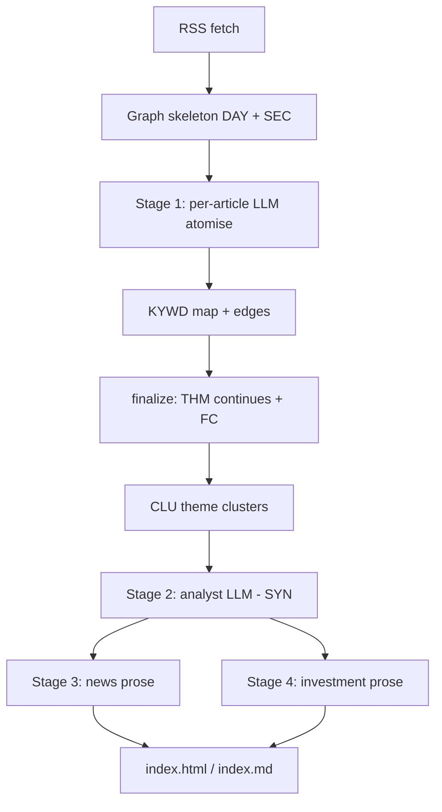

# LLM daily news digest

> **Dialect (product 0.8):** **GQL only** — [`../grammar/gql-wire-profile.md`](../grammar/gql-wire-profile.md). Do **not** teach Layer / Tier A.

**Application example (documentation only).** Multi-stage RSS digest pipeline with session-scoped working memory — not part of the MemNet engine. The graph is built during one run, queried for analysis, and drives final prose; readers see Markdown/HTML, not raw wires.

**Teach:** openCypher-shaped GQL; keyword / story links as relationship types (`:supports`, `:covers`, `:relates`). **`pin_map`** (not `query warm`). Doctrine: [`gql-wire-profile.md`](../grammar/gql-wire-profile.md).

**Project sketch:** `daily-news` — RSS digest with fact-checking; bridge `memnet_bridge.py`; schema `memnet_schema.txt`; orchestrator `generate.py`.

British English. ASCII.

---

## 1. Problem MemNet solves

Each day the pipeline ingests ~100 RSS articles. The LLM cannot hold all articles in context. MemNet provides:

1. **Structured ingest** — articles become nodes and relationships as they arrive.
2. **Shared vocabulary** — keyword tokens (`KYWD`) are session-wide; repeated terms reuse one node.
3. **Cross-article linkage** — same keyword joins stories via `:supports` / `:covers` / `:relates`.
4. **Stratified analysis** — theme clusters (`CLU`) and narrative arcs (`SYN`) sit above raw readings.
5. **Prompt-safe views** — formatters turn graph state into bounded text for each LLM stage.

Run-scoped memory (TTL ~120 minutes), not a permanent archive.

---

## 2. Pipeline overview



| Stage | MemNet role | LLM |
|-------|-------------|-----|
| Ingest skeleton | `DAY`, `SEC`, per-article `ENT` / `SRC` / `THM` | No |
| Stage 1 | `KYWD` nodes, supports/covers/relates rels | Yes |
| Finalize | `THM -[:continues]->`, `FC` fact-check nodes | No |
| Stage 2a/b | `CLU` / `SYN` | Analyst reads keyword map |
| Stage 3/4 | `pin_map` → graph context → prose | Yes |

---

## 3. Session policy

| Setting | Typical | Meaning |
|---------|---------|---------|
| TTL | 120 min | Session expires after two hours |
| Fresh open | `session_open` + seed | New calendar day |
| Resume / load | `session_load` / snapshot | Same-day interrupt |

Seed (GQL; omit default `recycle`):

```cypher
CREATE (c:CFG {id:'CFG01', corpus:'daily_news', anchor:'CFG01', version:3, notes:'knowledge_graph_digest'})
CREATE (:CST {id:'LAW_atomise', role:'rule', name:'atomise', law:'$tokens_only$'})
CREATE (:CST {id:'LAW_graph', role:'rule', name:'graph', law:'$relations_via_edges$'})
CREATE (:CST {id:'LAW_short', role:'rule', name:'short_term', law:'$session_scoped$'})
```

---

## 4. Ingest shapes

```cypher
(:KYWD {id:'trump', hits:11})
(:KYWD {id:'war', hits:6})
(:ENT {id:'ENT20260612001'})-[:supports {id:'E_s1'}]->(:KYWD {id:'trump'})
(:THM {id:'THMirn_war_live_up'})-[:covers {id:'E_c1'}]->(:KYWD {id:'trump'})
(:KYWD {id:'trump'})-[:relates {id:'E_r1'}]->(:KYWD {id:'war'})

(:ENT {id:'ENT20260612001', kind:'event', code:'iran_war_live', day:'2026-06-12', status:'active'})
(:SRC {id:'SRC20260612001', name:'nytimes', url:'https://…', tier:'tier1', day:'2026-06-12'})
(:SRC {id:'SRC20260612001'})-[:reports {id:'E_rep'}]->(:ENT {id:'ENT20260612001'})
(:ENT {id:'ENT20260612001'})-[:part_of {id:'E_part'}]->(:DAY {id:'DAY20260612'})
(:SEC {id:'SEC_politics'})-[:covers {id:'E_sec'}]->(:ENT {id:'ENT20260612001'})
```

**Rule:** no sentences in properties; relations are relationships, not embedded id lists.

---

## 5. Agent / bridge loop

Cue then `pin_map`. Skip if the seed is empty. MCP arg is **`session`**. In-process only for a **single** agent.

1. Ensure session (TTL / day).
2. Skeleton `DAY` / `SEC` / empty `ENT` shells.
3. Stage-1 LLM → gated GQL `add` KYWD + rels; upsert pattern: `update` then `add` if missing.
4. Finalize continues / fact-check nodes.
5. Analyst **cue** (keyword / cluster id, or `find`) then `pin_map` → `SYN`.
6. Editorial stages read `pin_map` slices — never the whole session.

---

## 6. Pitfalls

| Mistake | Fix |
|---------|-----|
| Layer / `@TAG` as agent teach | GQL above |
| `query warm` without anchor | `pin_map(anchor=…)` |
| Prose in KYWD / ENT properties | Tokens / codes only |
| Treating MemNet as the published briefing | Graph is working memory |

---

## 7. Related

- [`../LLM-GUIDE.md`](../LLM-GUIDE.md) — goldfish loop
- [`../grammar/gql-wire-profile.md`](../grammar/gql-wire-profile.md) — GQL wire SSOT

---

## 8. Retired dialects (pointer only)

Historical `@CFG` / `@EDG` pipe or Layer ASCII seeds may still exist in project repos. **Do not** dual-teach. Archive: [`../grammar/archive/`](../grammar/archive/).
