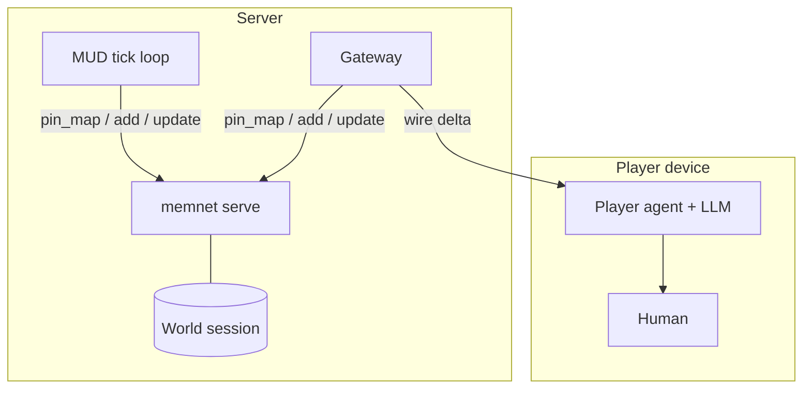

# LLM MUD

> **Dialect (1.x):** **GQL only** — [`../grammar/gql-wire-profile.md`](../grammar/gql-wire-profile.md). Do **not** teach Layer / Tier A. Note body may still show historical seeds until **M3**; prefer [`examples/inverting-amplifier-gql-case-study.md`](examples/inverting-amplifier-gql-case-study.md) for wire shapes.

**Application example (documentation only).** Multiplayer text MUD backed by MemNet — not part of the engine. Sample world: Lewis Carroll's *Alice's Adventures in Wonderland* (1865, public domain).

**Teach:** Write = display; room exits / containment as bare-id **`--exit-->`** / **`--contains-->`** / **`--located-->`** (relation grain). **`pin_map`** from the player's current `ROM`. Pipe `@TAG` — legacy only (§8). Doctrine: [`gql-wire-profile.md`](../grammar/gql-wire-profile.md).

**MemNet** holds the **shared world graph** on the server (`memnet serve` / HTTP). Warm stays small if you anchor on the current room.

| Side | Job | LLM? |
|------|-----|------|
| **Server MUD agent** | Active rooms, ticks, NPC movement, combat maths, quest state | Optional (usually rules only) |
| **Client player agent** | `pin_map` (or receive delta), generate room prose | Yes |

**No sentences in graph rows.** Room descriptions and dialogue are generated **on the client** from warm wire data.

British English. ASCII. No `|` pipe on the agent surface.

---

## 1. Split architecture



They do **not** talk agent-to-agent. Gateway moves **wire rows**, not prose.

---

## 2. Tiered atomisation

| Tier | Examples | Recycle |
|------|----------|---------|
| Persistent world | `ROM`, `OBJ`, exits, lore | default persistent |
| Soft state | NPC location, quest flags | persistent until changed |
| Beat / event | `BEAT`, `EVT` | `delete_on_settle` |

---

## 3. Schema (Write = display)

```text
SCHEMA REG ; fields=id key phase
SCHEMA ROM ; fields=id key zone flags
SCHEMA LORE ; fields=id name kind code
SCHEMA CHR ; fields=id name kind cur size status
SCHEMA OBJ ; fields=id name kind code
SCHEMA QST ; fields=id name status
SCHEMA BEAT ; fields=id key kind
SCHEMA EVT ; fields=id kind actor room when
SCHEMA BOND ; fields=id left right delta code
```

Hall of doors (present):

```text
ROM [ROM04] ; key=hall_of_doors ; zone=underground ; flags=lit
E40 [ROM04] --exit--> [ROM03] ; note=west
E41 [ROM04] --exit--> [ROM05] ; note=east
E42 [ROM04] --contains--> [OBJ01]
```

Domain rules (illustrative CST / CLM leaves):

```text
CST [LAW_ATOM01] ; role=rule ; name=no_sentences ; law=$break_to_nodes_edges$
CST [LAW_MUD01] ; role=rule ; name=anchor ; law=$warm_anchor_rom_or_plr$
CST [LAW_MUD02] ; role=rule ; name=no_prose ; law=$client_generates_descriptions$
CST [LAW_MUD03] ; role=rule ; name=validate_exit ; law=$exit_edge_must_exist$
```

---

## 4. Wonderland seed (abbreviated)

```text
ROM [ROM01] ; key=riverbank ; zone=surface ; flags=lit
ROM [ROM02] ; key=rabbit_hole ; zone=surface ; flags=dark
ROM [ROM03] ; key=long_hall ; zone=underground ; flags=lit
CHR [PLR01] ; name=Alice ; kind=plr ; cur=10 ; size=norm ; status=idle
CHR [NPC02] ; name=White_Rabbit ; kind=npc ; cur=8 ; size=norm ; status=idle
OBJ [OBJ01] ; name=drink_me ; kind=bottle ; code=shrink
E01 [ROM01] --exit--> [ROM02] ; note=south
E02 [ROM02] --exit--> [ROM03] ; note=down
E10 [PLR01] --located--> [ROM02]
E11 [NPC02] --located--> [ROM01]
```

---

## 5. Worked beats

**Client look** — `pin_map(anchor=ROM02)` then generate prose from keys/flags/edges (no graph sentences).

**Deterministic go south** (Alice at ROM01):

```text
~ [PLR01] ; status=moving
~ E10 ;  # retarget located → ROM02 via update that replaces the edge
+ E10b [PLR01] --located--> [ROM02]
- E10
```

(Exact retarget style depends on engine mutate ops — prefer one `located` edge per actor.)

**Server tick beat** (rabbit flees):

```text
BEAT [BT01] ; key=rabbit_chase ; kind=pursuit ; recycle=delete_on_settle
EVT [EVT01] ; kind=flee ; actor=NPC02 ; room=ROM01 ; when=late ; recycle=delete_on_settle
~ [NPC02] ; status=fled
+ E11b [NPC02] --located--> [ROM02]
+ E50 [ROM01] --active--> [BT01] ; recycle=delete_on_settle
+ E51 [BT01] --caused--> [EVT01] ; recycle=delete_on_settle
+ E52 [BT01] --features--> [NPC02] ; recycle=delete_on_settle
```

---

## 6. Agent loop

1. Server: `pin_map` active rooms; apply tick rules; `add`/`update` deltas.
2. Client: `pin_map` player `ROM` / `CHR`; LLM prose only.
3. Settle beats (`recycle=delete_on_settle`) when done.
4. Never put room descriptions in `ROM` fields.

---

## 7. Pitfalls

| Mistake | Fix |
|---------|-----|
| Pipe `@TAG` teach | Write = display |
| Prose in graph rows | Client generates from keys |
| Warm without room/player anchor | `pin_map(anchor=ROM…)` |
| Exit without an edge | Validate `--exit-->` first |

---

## 8. Legacy pipe (pointer only)

Older Wonderland seeds used `@ROM: id|key|zone|flags|persistent`. Accept on load; **do not** dual-teach. Translate to Write = display when editing the world pack.
