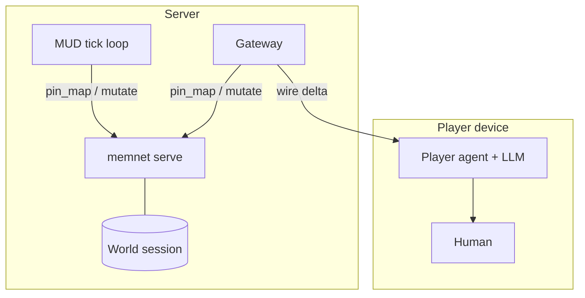

# LLM MUD

> **Dialect (product 0.8):** **GQL only** — [`../grammar/gql-wire-profile.md`](../grammar/gql-wire-profile.md). Do **not** teach Layer / Tier A.

**Application example (documentation only).** Multiplayer text MUD backed by MemNet — not part of the engine. Sample world: Lewis Carroll's *Alice's Adventures in Wonderland* (1865, public domain).

**Teach:** openCypher-shaped GQL; room exits / containment as `:exit` / `:contains` / `:located` (relation grain). **`pin_map`** from the player's current `ROM`. Doctrine: [`gql-wire-profile.md`](../grammar/gql-wire-profile.md).

**MemNet** holds the **shared world graph** on the server (`memnet serve` / HTTP). Cue the current `ROM` then `pin_map`. Shared graph **requires** serve or streamable-http — not default in-process.

| Side | Job | LLM? |
|------|-----|------|
| **Server MUD agent** | Active rooms, ticks, NPC movement, combat maths, quest state | Optional (usually rules only) |
| **Client player agent** | `pin_map` (or receive delta), generate room prose | Yes |

**No sentences in graph rows.** Room descriptions and dialogue are generated **on the client** from pin-map data.

British English. ASCII.

---

## 1. Split architecture



They do **not** talk agent-to-agent. Gateway moves **shaped graph rows**, not prose.

---

## 2. Tiered atomisation

| Tier | Examples | Recycle |
|------|----------|---------|
| Persistent world | `ROM`, `OBJ`, exits, lore | default persistent |
| Soft state | NPC location, quest flags | persistent until changed |
| Beat / event | `BEAT`, `EVT` | `delete_on_settle` |

---

## 3. Schema (GQL)

Illustrative labels: `:REG`, `:ROM`, `:LORE`, `:CHR`, `:OBJ`, `:QST`, `:BEAT`, `:EVT`, `:BOND`.

Hall of doors (shaped present):

```cypher
(:ROM {id:'ROM04', key:'hall_of_doors', zone:'underground', flags:'lit'})
(:ROM {id:'ROM04'})-[:exit {id:'E40', note:'west'}]->(:ROM {id:'ROM03'})
(:ROM {id:'ROM04'})-[:exit {id:'E41', note:'east'}]->(:ROM {id:'ROM05'})
(:ROM {id:'ROM04'})-[:contains {id:'E42'}]->(:OBJ {id:'OBJ01'})
```

Domain rules (illustrative CST leaves):

```cypher
(:CST {id:'LAW_ATOM01', role:'rule', name:'no_sentences', law:'$break_to_nodes_edges$'})
(:CST {id:'LAW_MUD01', role:'rule', name:'anchor', law:'$warm_anchor_rom_or_plr$'})
(:CST {id:'LAW_MUD02', role:'rule', name:'no_prose', law:'$client_generates_descriptions$'})
(:CST {id:'LAW_MUD03', role:'rule', name:'validate_exit', law:'$exit_edge_must_exist$'})
```

---

## 4. Wonderland seed (abbreviated)

```cypher
CREATE (r1:ROM {id:'ROM01', key:'riverbank', zone:'surface', flags:'lit'})
CREATE (r2:ROM {id:'ROM02', key:'rabbit_hole', zone:'surface', flags:'dark'})
CREATE (r3:ROM {id:'ROM03', key:'long_hall', zone:'underground', flags:'lit'})
CREATE (alice:CHR {id:'PLR01', name:'Alice', kind:'plr', cur:10, size:'norm', status:'idle'})
CREATE (rabbit:CHR {id:'NPC02', name:'White_Rabbit', kind:'npc', cur:8, size:'norm', status:'idle'})
CREATE (bottle:OBJ {id:'OBJ01', name:'drink_me', kind:'bottle', code:'shrink'})
MATCH (a:ROM {id:'ROM01'}), (b:ROM {id:'ROM02'}) CREATE (a)-[:exit {note:'south'}]->(b)
MATCH (b:ROM {id:'ROM02'}), (c:ROM {id:'ROM03'}) CREATE (b)-[:exit {note:'down'}]->(c)
MATCH (p:CHR {id:'PLR01'}), (b:ROM {id:'ROM02'}) CREATE (p)-[:located]->(b)
MATCH (n:CHR {id:'NPC02'}), (a:ROM {id:'ROM01'}) CREATE (n)-[:located]->(a)
```

---

## 5. Worked beats

**Client look** — `pin_map` from a room cue (e.g. `kind=ROM` + `key=rabbit_hole`) then generate prose from keys/flags/edges (no graph sentences). leftover `pin_map(anchor=ROM02)` is leftover nickname cue.

**Deterministic go south** (Alice at ROM01) — prefer one `:located` edge per actor:

```cypher
MATCH (p:CHR {id:'PLR01'}) SET p.status = 'moving'
MATCH (p:CHR {id:'PLR01'})-[e:located]->() DELETE e
MATCH (p:CHR {id:'PLR01'}), (r:ROM {id:'ROM02'}) CREATE (p)-[:located]->(r)
```

**Server tick beat** (rabbit flees):

```cypher
CREATE (bt:BEAT {id:'BT01', key:'rabbit_chase', kind:'pursuit', recycle:'delete_on_settle'})
CREATE (ev:EVT {id:'EVT01', kind:'flee', actor:'NPC02', room:'ROM01', when:'late', recycle:'delete_on_settle'})
MATCH (n:CHR {id:'NPC02'}) SET n.status = 'fled'
MATCH (n:CHR {id:'NPC02'})-[e:located]->() DELETE e
MATCH (n:CHR {id:'NPC02'}), (r:ROM {id:'ROM02'}) CREATE (n)-[:located]->(r)
MATCH (rom:ROM {id:'ROM01'}), (bt:BEAT {id:'BT01'}) CREATE (rom)-[:active {recycle:'delete_on_settle'}]->(bt)
```

---

## 6. Agent loop

Cue then `pin_map` (MCP arg **`session`**). Shared world = TCP / HTTP, not in-process.

1. Server: cue active rooms; `pin_map`; apply tick rules; gated GQL `add`/`update` deltas.
2. Client: cue player `ROM` / `CHR`; `pin_map`; LLM prose only.
3. Settle beats (`recycle=delete_on_settle`) when done.
4. Never put room descriptions in `ROM` properties.

---

## 7. Pitfalls

| Mistake | Fix |
|---------|-----|
| Layer / `@TAG` pipe teach | GQL only |
| Prose in graph rows | Client generates from keys |
| leftover `query warm` / leftover `anchor=` as law | `pin_map` from a cue (`kind` / locators / `cue`) |
| Exit without a relationship | Validate `:exit` first |

---

## 8. Retired dialects (pointer only)

Older Wonderland seeds used `@ROM: id|…` or Layer ASCII. **Do not** dual-teach.
