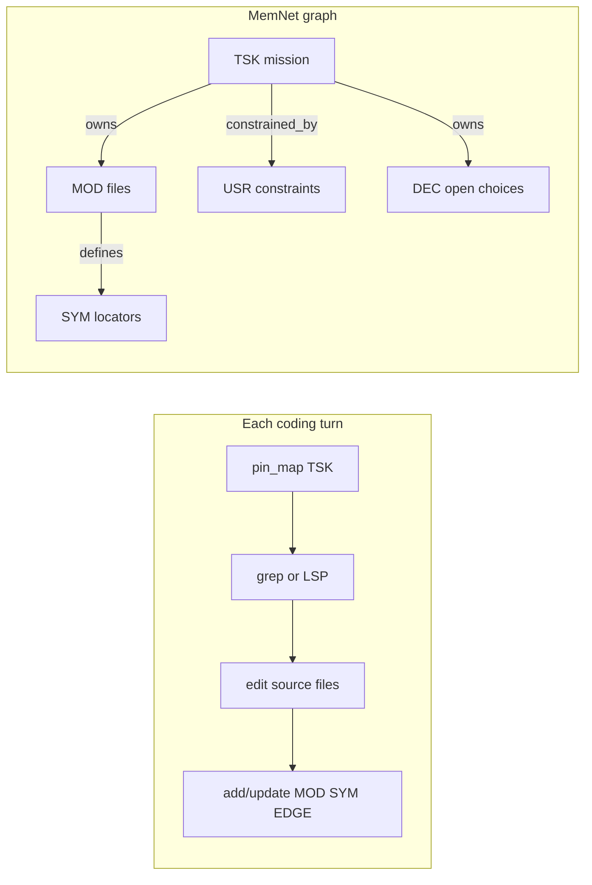

# LLM software development

> **Dialect (1.x):** **GQL only** — [`../grammar/gql-wire-profile.md`](../grammar/gql-wire-profile.md). Do **not** teach Layer / Tier A. Note body may still show historical seeds until **M3**; prefer [`examples/inverting-amplifier-gql-case-study.md`](examples/inverting-amplifier-gql-case-study.md) for wire shapes.

**Application example (documentation only).** Multi-turn coding in Cursor — task scope, verified symbol locators, user constraints, and open decisions in MemNet so the agent can **`pin_map`** a small slice each turn without stuffing paths into chat.

**Teach:** Write = display; chart links as bare-id **`--rel_name-->`**. Law leaves (when needed) use `CST` + `ports=` + `law=` — see [`gql-wire-profile.md`](../grammar/gql-wire-profile.md). Electrical ports/bind: [`llm-circuit-schematic.md`](llm-circuit-schematic.md). **Do not** teach `@TAG` pipe or paren `--(rel)-->` as primary.

**Primary worked example (retrospective):** shipping **`session_load`** / **`session_save`** on `memnet-mcp` (release v0.2.12, commit `7440aee`).

**Schema map (example):** `parts/common/memnet/memnet/examples/schema.coding.example.txt`  
**Seed workflow (example):** `parts/common/memnet/memnet/examples/workflow.coding.example.txt`

Complements: user-pack `mcp-memnet` / `coding-memory.md`; [`llm-sysml-v2-modeling.md`](llm-sysml-v2-modeling.md) for design memory.

British English. ASCII. No `|` pipe on the agent surface.

---

## 1. Problem

Multi-file coding tasks span many Cursor turns. Chat scrolls away; the agent re-greps or trusts stale line numbers.

| Tool | Role |
|------|------|
| Cursor index | Full-repo semantic search snapshot |
| grep / LSP | Authoritative truth on disk this turn |
| git | Source-of-truth for code history |
| MemNet | **Cross-turn task state + agent-verified atoms** |

MemNet remembers which `TSK` is active, which `MOD` files were touched, which `SYM` locators were confirmed, which `DEC` is still open, and what the user said (`USR`).



---

## 2. What MemNet stores vs not

| Store in graph | Do not store |
|----------------|--------------|
| Repo metadata + version | Branch lists, env vars |
| Repo-relative `MOD.path`, summary ≤6 words | Whole file contents |
| `SYM` name, path, line hint, signature ≤40 chars | Full function bodies |
| `USR` distilled user constraints | Chat transcript |
| `DEC` pending API/design forks | Assumptions without a row |
| Edges: `defines`, `calls`, `tests`, `implements`, `owns` | Unverified grep guesses |

**Rule:** grep/LSP confirms truth on disk; MemNet remembers **confirmed** atoms only.

---

## 3. The 6-step coding goldfish loop

1. **Read** — `pin_map(anchor=<TSK or SYM>, depth=2)` (optional `view=shell`).
2. **Verify** — grep or LSP on disk; never trust stale `SYM.line` without re-check when editing.
3. **Edit** — change source files; code lives in git, not the graph.
4. **Capture** — user constraints → `USR`; open forks → `DEC`.
5. **Persist** — `add` / `update` MOD / SYM / USR / DEC / EDGEs; refresh line hints.
6. **Loop** — settle `TSK` when done; next mission anchors on a new `TSK`.

---

## 4. Schema (Write = display)

```text
SCHEMA CFG ; fields=id repo anchor version notes
SCHEMA MOD ; fields=id path summary status
SCHEMA SYM ; fields=id name kind path line signature status
SCHEMA TSK ; fields=id goal anchor status
SCHEMA USR ; fields=id topic content status
SCHEMA DEC ; fields=id task question options chosen
```

Present / mutate examples (omit session-default `recycle=persistent`):

```text
TSK [TSK_mcp_session_load] ; goal=Expose session_load on memnet-mcp ; status=in_progress
MOD [MOD_cli] ; path=parts/common/memnet/memnet/cli.py ; summary=CLI session load/save ; status=active
SYM [SYM_mcp_session_load] ; name=session_load ; kind=fn ; path=parts/memnet-mcp/software/memnet_mcp/server.py ; line=100 ; signature="async def session_load(...)" ; status=active
E_mcp [SYM_mcp_session_load] --implements--> [SYM_cli_session_load] ; note=wraps_cli
DEC [DEC_mcp_keep_id] ; task=TSK_mcp_session_load ; question=keep_id default on session_load ; options="true / false" ; chosen=true ; recycle=delete_on_settle
```

Relation grain = bare ids + label = sense. Do **not** invent ports on `MOD`/`SYM` just to force bind.

---

## 5. Domain discipline (coding)

| Id | Constraint |
|----|------------|
| CODE01 | grep/LSP before first `SYM` row |
| CODE02 | `update` line after every edit |
| CODE03 | path + line + signature — not file text |
| CODE04 | one `in_progress` TSK per session |
| MEMNET01 | wrap existing CLI; do not reimplement |

Engine `LAW01`… rows may still appear on `pin_map` from the session seed — treat as engine invariants, not domain teach dumps.

---

## 6. MCP turn sketch

```text
pin_map(anchor="TSK_mcp_session_load", depth=2)
add(lines=[
  "SYM [SYM_mcp_session_load] ; name=session_load ; kind=fn ; path=parts/memnet-mcp/software/memnet_mcp/server.py ; line=100 ; signature=\"async def session_load(...)\" ; status=active",
  "E_mcp [SYM_mcp_session_load] --implements--> [SYM_cli_session_load] ; note=wraps_cli"
])
update(lines=["~ [TSK_mcp_session_load] ; status=settled ; recycle=delete_on_settle"])
```

---

## 7. Legacy pipe (pointer only)

Historical `@TAG: id|…` and `query_warm` remain accepted on some paths. **Do not** seed new coding sessions in pipe. See [`LLM-GUIDE.md`](../LLM-GUIDE.md) Appendix A.

---

## Related

- [`llm-system-dev-multitask.md`](llm-system-dev-multitask.md) — Multitask + shared session
- [`llm-sysml-v2-modeling.md`](llm-sysml-v2-modeling.md) — SysML design memory
- `~/.cursor/skills/memnet-format/` — wire shapes
- [`../grammar/memnet-multi-layer.md`](../grammar/memnet-multi-layer.md) — Layer SSOT
