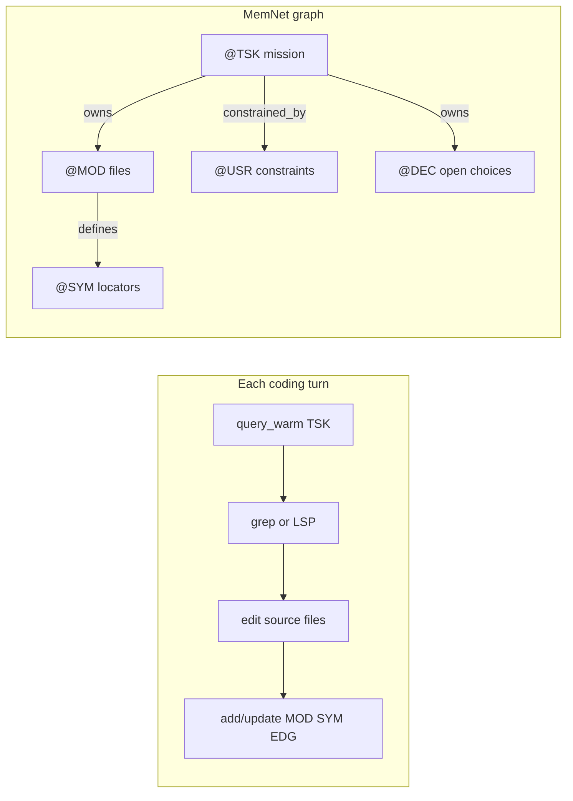

# LLM Software Development — A MemNet Application Note

**Application example (documentation only).** This file is a self-contained pattern for **multi-turn coding in Cursor** — task scope, verified symbol locators, user constraints, and open decisions stored in MemNet so the agent can `query_warm` a small slice each turn without stuffing paths into chat history.

**Primary worked example (retrospective):** shipping **`session_load`** and **`session_save`** on `memnet-mcp` (release v0.2.12, commit `7440aee`) — multi-file change touching CLI (already existed), MCP server, client bridge, and tests.

**Schema map:** `parts/common/memnet/memnet/examples/schema.coding.example.txt`  
**Seed workflow:** `parts/common/memnet/memnet/examples/workflow.coding.example.txt`

This note fills a gap between:

- **mcp-memnet** skill `references/coding-memory.md` (user pack) — compact MCP reference
- [`application-notes/llm-sysml-v2-modeling.md`](llm-sysml-v2-modeling.md) — design/model memory, not day-to-day repo edits

---

## 1. Problem

Multi-file coding tasks span many Cursor turns: add an MCP tool, wire tests, settle a design fork. Chat history scrolls away. The agent re-greps the same symbols, re-reads the same files, or assumes stale line numbers.

**Cursor's codebase indexing is complementary, not redundant.**

| Tool | Role |
|------|------|
| Cursor index | Full-repo semantic search snapshot |
| grep / LSP | Authoritative truth on disk this turn |
| git | Source-of-truth for code history |
| MemNet | **Cross-turn task state + agent-verified atoms** |

MemNet remembers which `@TSK` is active, which `@MOD` files were touched, which `@SYM` locators were confirmed, which `@DEC` is still open, and what the user said (`@USR`). Cursor finds the code; MemNet remembers the conclusion.



---

## 2. What MemNet stores vs not

| Store in graph | Do not store |
|----------------|--------------|
| `@CFG` repo metadata + version | Branch lists, env vars |
| Repo-relative `@MOD.path`, summary ≤6 words | Whole file contents |
| `@SYM` name, path, line hint, signature ≤40 chars | Full function bodies |
| `@USR` distilled user constraints | Chat transcript |
| `@DEC` pending API/design forks | Assumptions without a row |
| `@EDG` defines, calls, tests, implements, owns | Unverified grep guesses |
| `@LAW` engine + domain invariants | Coding style essays |

**Rule:** grep/LSP confirms truth on disk; MemNet remembers **confirmed** atoms only.

Optional **`@ISSUE`** rows (blockers) mirror the SysML note — deferred from the tutorial seed; add when a real blocker appears mid-task.

---

## 3. The 6-step coding goldfish loop

Every turn follows the same loop (aligned with SysML and tech-docs notes):

1. **Read** — `query_warm(anchor=<TSK or SYM>, depth=2)`. Warm always starts with `@LAW` rows.
2. **Verify** — grep or LSP on disk; never trust stale `@SYM.line` without re-check when editing.
3. **Edit** — change source files; code lives in git, not the graph.
4. **Capture** — user constraints become `@USR`; open forks become `@DEC`.
5. **Persist** — `add`/`update` all node and edge rows (`@MOD`/`@SYM`/`@USR`/`@DEC`/`@EDG`); refresh line hints (LAW-CODE02).
6. **Loop** — settle `@TSK` when done; next mission anchors on a new `@TSK`.

Real turns may reorder steps 2–5 — Turn A interleaves capture before implement; Turn B implements before verify (tests are the verification). The six labels are the *checklist*, not a strict sequence.

---

## 4. Schema map

```text
@CFG: id|repo|anchor|version|notes
@MOD: id|path|summary|status|recycle
@SYM: id|name|kind|path|line|signature|status|recycle
@TSK: id|goal|anchor|status|recycle
@USR: id|topic|content|status|recycle
@DEC: id|task|question|options|chosen|recycle
@LAW: id|name|cycle|mechanism|constraint
@EDG: id|from|rel|to|note|recycle
```

| Tag | Role |
|-----|------|
| `@CFG` | Repo root; **`anchor` = synthetic `MOD_repo_root`** (stable warm-from row) |
| `@MOD` | One file; `summary` ≤6 words |
| `@SYM` | One symbol; `kind`: `fn`, `class`, `method`, `const`, `var`, `test` |
| `@TSK` | One coding mission; `anchor` = entry `@MOD` or `@SYM` for warm |
| `@USR` | User constraints (`topic`: scope, style, api) |
| `@DEC` | Open fork; settle with `chosen` + `delete_on_settle` |
| `@LAW` | Engine + domain invariants — **built-in tag**; prepended on every `query_warm` |
| `@EDG` | Directed link between any rows — **built-in tag** (always available; not declared in `schema.coding.example.txt`) |

**Built-in tags (`@LAW`, `@EDG`):** omit from `session_open` map_lines. Add domain `@LAW` rows via seed ingest or `add --stdin`. MCP `session_open` also auto-supplements core engine LAW01–LAW05 when missing.

**`@EDG` field names (mnemonic):** `from` = `src`, `rel` = `relation`, `to` = `dist`, `note` = `attrs`. Wire form:

```text
@EDG: E_mcp_impl_load|SYM_mcp_session_load|implements|SYM_cli_session_load|wraps_cli|persistent
```

**`@TSK` field change:** coding sessions use `id|goal|anchor|status|recycle` (not `deadline`). The `anchor` field names the warm-from row for this task.

### Id grammar

| Prefix | Example |
|--------|---------|
| `CFG*` | `CFG01` (single synthetic row) |
| `MOD_*` | `MOD_cli`, `MOD_mcp_server` |
| `SYM_*` | `SYM_cli_session_load`, `SYM_mcp_session_load` |
| `TSK_*` | `TSK_mcp_session_load` |
| `USR_*` | `USR_keep_id` |
| `DEC_*` | `DEC_mcp_keep_id` |
| `LAW-*` | `LAW-CODE01`, `LAW-MEMNET01` (dashed; group-prefixed) |
| `E_*` | `E_mcp_impl_load` |

**Layer prefix for symbols:** CLI handler `SYM_cli_session_save` vs MCP wrapper `SYM_mcp_session_save` — always disambiguate cross-layer pairs.

### Edge relations

| Relation | Use |
|----------|-----|
| `owns` | `@TSK` → `@MOD` / `@SYM` / `@DEC` |
| `defines` | `@MOD` → `@SYM` |
| `calls` | `@SYM` → `@SYM` (after verified) |
| `tests` | test `@MOD` → `@SYM` under test |
| `implements` | MCP `@SYM` → CLI `@SYM` |
| `constrained_by` | `@TSK` → `@USR` |
| `blocks` | `@ISSUE` → `@TSK` (optional extension) |
| `related` | Cross-file note |
| `contains` | `@CFG` → `@MOD` (repo root wiring) |

Register new relations on first use: `add --allow-new-relation`.

---

## 5. Domain LAW rows

Generic coding (CODE01–04) plus project-local example (MEMNET01). These **5 rows** are the first lines of `workflow.coding.example.txt`; every warm read returns them (plus core engine LAW01–LAW05 when using MCP `session_open`):

```text
@LAW: LAW-CODE01|SYM|on_add|verify_first|grep_or_lsp_before_first_sym_row
@LAW: LAW-CODE02|SYM|on_turn|refresh_line|update_line_after_every_edit
@LAW: LAW-CODE03|*|on_add|no_bodies|path_line_signature_not_file_text
@LAW: LAW-CODE04|TSK|on_turn|one_active|one_in_progress_tsk_per_session
@LAW: LAW-MEMNET01|*|on_turn|cli_before_mcp|wrap_existing_cli_not_reimplement
```

**LAW-CODE01** — never add `@SYM` from memory; grep/LSP first.  
**LAW-CODE02** — after every edit touching a symbol, `update` its `line` field.  
**LAW-CODE03** — store path + line + short signature, never file bodies.  
**LAW-CODE04** — one `@TSK` with `status=in_progress` per session.  
**LAW-MEMNET01** — project-specific: wrap existing CLI (`session load`) rather than reimplement in MCP.

LAW-MEMNET01 is analogous to domain LAW rows in other application notes — other repos seed their own project LAW rows.

---

## 6. Session policy

| Setting | Value | Meaning |
|---------|-------|---------|
| TTL | 7–14 days | Multi-day feature work |
| `session_save` / `session_load` | after substantive turns | Persist **graph** to disk; git holds **code** |
| `@CFG.version` | e.g. `0.2.12` | Tag which release the task targeted |

```powershell
memnet session open --map-file parts/common/memnet/memnet/examples/schema.coding.example.txt --ttl 10080
Get-Content parts/common/memnet/memnet/examples/workflow.coding.example.txt | memnet add --stdin --allow-new-relation
memnet session save --file coding.snapshot.txt
memnet session load --file coding.snapshot.txt --keep-id
```

**LAW supplementation asymmetry:** MCP `session_open` auto-supplements core engine LAW01–LAW05 when missing (via `supplement_seed_lines`); the CLI path above does **not** — your seed should include any LAW rows you want warm to return. The example seed ships 5 domain LAWs only; add engine LAWs to the `add --stdin` pipe if needed.

MCP: `session_open(map_lines=[...], seed_lines=[...], ttl=10080)` then `session_save` / `session_load`.

---

## 7. Retrospective walkthrough — v0.2.12 session MCP tools

Narrated in **past tense** — code already shipped. Tables show what the agent **did**, not work to redo.

### Files in scope

| Id | Path | Role |
|----|------|------|
| `MOD_repo_root` | `.` | Synthetic CFG anchor |
| `MOD_cli` | `parts/common/memnet/memnet/cli.py` | CLI `session_save` / `session_load` (lines 339–363) |
| `MOD_mcp_server` | `parts/memnet-mcp/software/memnet_mcp/server.py` | MCP wrappers (lines 100–125) |
| `MOD_mcp_client` | `parts/memnet-mcp/software/memnet_mcp/client.py` | `run_memnet` bridge (line 128) |
| `MOD_test_snapshot` | `tests/test_snapshot.py` | CLI snapshot tests |
| `MOD_test_mcp` | `tests/test_mcp.py` | MCP integration tests |

### Symbols (layer-prefixed)

| Id | Path | Line | Layer |
|----|------|------|-------|
| `SYM_cli_session_save` | `parts/common/memnet/memnet/cli.py` | 339 | CLI Typer command |
| `SYM_cli_session_load` | `parts/common/memnet/memnet/cli.py` | 351 | CLI Typer command |
| `SYM_mcp_session_load` | `parts/memnet-mcp/software/memnet_mcp/server.py` | 100 | MCP `@mcp.tool()` |
| `SYM_mcp_session_save` | `parts/memnet-mcp/software/memnet_mcp/server.py` | 120 | MCP `@mcp.tool()` |
| `SYM_run_memnet` | `parts/memnet-mcp/software/memnet_mcp/client.py` | 128 | subprocess bridge |

### Decision row

```text
@DEC: DEC_mcp_keep_id|TSK_mcp_session_load|keep_id default on session_load|true / false|true|delete_on_settle
```

The row above shows **post-Turn-A state**. In §8 step 3 it was first added with `chosen=` empty and `recycle=active`, then `update`d to `chosen=true|recycle=delete_on_settle` once the user confirmed. The seed snapshot captures the settled form so the tutorial starts from a coherent end state.

### Seed edges (`workflow.coding.example.txt`)

The tutorial seed includes **20 `@EDG` rows** (~half the seed) wiring modules, symbols, tasks, and constraints:

| Relation | Example edge |
|----------|--------------|
| `defines` | `MOD_cli` → `SYM_cli_session_load` |
| `implements` | `SYM_mcp_session_load` → `SYM_cli_session_load` |
| `calls` | `SYM_mcp_session_load` → `SYM_run_memnet` |
| `owns` | `TSK_mcp_session_load` → `MOD_cli`, `DEC_mcp_keep_id` |
| `constrained_by` | `TSK_mcp_session_load` → `USR_keep_id` |
| `tests` | `MOD_test_mcp` → `SYM_mcp_session_load` |
| `contains` | `CFG01` → `MOD_repo_root` |

Without these edges, warm reads would not traverse from `@TSK` to owned modules, symbols, or constraints.

The MCP `session_load` tool defaults `keep_id=True` so resumed sessions reuse the snapshot session id (CLI defaults `keep_id=False`; MCP chose the agent-friendly default).

---

## 8. Turn A — `session_load` MCP wrapper

**User goal:** *"Expose snapshot restore on memnet-mcp so agents don't need Shell."*

| Step | Action (agent narration) |
|------|---------------------------|
| 1 Read | Warmed `TSK_mcp_session_load` (depth 2) → LAW + `MOD_cli` + `SYM_cli_session_load` + open `DEC_mcp_keep_id` |
| 2 Verify | Read `cli.py` lines 350–365 — confirmed `--file`, `--keep-id`, `--ttl` argv shape |
| 3 Edit | Added `session_load` MCP tool in `server.py` as thin wrapper over `run_memnet(["session","load",...])` |
| 4 Capture | User said "keep_id default true". Added `USR_keep_id` + `constrained_by` edge; settled `DEC_mcp_keep_id` with `chosen=true` |
| 5 Persist | Added `SYM_mcp_session_load`; EDG `MOD_mcp_server defines SYM_mcp_session_load`; EDG `SYM_mcp_session_load implements SYM_cli_session_load` |
| 6 Loop | Opened `TSK_mcp_session_save`; `TSK_mcp_session_load` stayed `in_progress` until tests landed |

### MCP wrapper pattern (reference)

```python
@mcp.tool()
async def session_load(
    file: str,
    keep_id: bool = True,
    ttl: int | None = None,
) -> str:
    argv = ["session", "load", "--file", file]
    if keep_id:
        argv.append("--keep-id")
    if ttl is not None:
        argv.extend(["--ttl", str(ttl)])
    resp = await anyio.to_thread.run_sync(lambda: run_memnet(argv))
    return _json(resp)
```

This follows **LAW-MEMNET01**: CLI already implements load; MCP only forwards argv.

### Warm excerpt — `query_warm(anchor="TSK_mcp_session_load", depth=2)`

Returns approximately:

- `@LAW` rows (CODE01–04, MEMNET01)
- `TSK_mcp_session_load`, `MOD_cli`, `MOD_mcp_server`
- `SYM_cli_session_load`, `DEC_mcp_keep_id`, `USR_keep_id`
- `implements` edge target once Turn A step 5 persisted
- **Not** unrelated modules or settled tasks

~15–25 rows total.

---

## 9. Turn B — `session_save` + tests + settle

**User goal:** *"Add session_save MCP tool and test both tools."*

| Step | Action (agent narration) |
|------|---------------------------|
| 1 Read | Warmed `TSK_mcp_session_save` + linked `MOD_test_mcp`, `SYM_run_memnet` |
| 2 Verify | Ran `pytest tests/test_mcp.py` (green = locator + argv shape confirmed before extending) |
| 3 Edit | Added `session_save` MCP wrapper (mirror pattern from Turn A); extended `test_mcp.py` |
| 4 Capture | No new `@USR`/`@DEC` — Turn A constraints carried over |
| 5 Persist | Added `tests` edges: `MOD_test_mcp tests SYM_mcp_session_load`, same for save; refreshed `SYM_mcp_session_load.line` if shifted |
| 6 Loop | `update @TSK` for both → `done` + `delete_on_settle`; `session_save --file coding.snapshot.txt`; next mission anchors on new `@TSK` |

CLI snapshot tests already existed in `tests/test_snapshot.py` (`test_cli_session_save_load`); Turn B focused on MCP exposure and integration coverage.

---

## 10. MCP usage

```json
session_open(
  map_lines=[
    "@CFG: id|repo|anchor|version|notes",
    "@MOD: id|path|summary|status|recycle",
    "@SYM: id|name|kind|path|line|signature|status|recycle",
    "@TSK: id|goal|anchor|status|recycle",
    "@USR: id|topic|content|status|recycle",
    "@DEC: id|task|question|options|chosen|recycle"
  ],
  seed_lines=<contents of workflow.coding.example.txt split on newline>,
  ttl=10080
)
```

In Python the seed is just `Path("parts/common/memnet/memnet/examples/workflow.coding.example.txt").read_text(encoding="utf-8").splitlines()`. `@LAW` and `@EDG` are **built-in tags** — omit from `map_lines`; add via seed ingest or `add`. MCP auto-supplements core LAW01–LAW05 on open when absent.

Per turn:

```json
query_warm(anchor="TSK_mcp_session_load", depth=2)
add(wire_lines=[
  "@SYM: SYM_mcp_session_load|session_load|fn|parts/memnet-mcp/software/memnet_mcp/server.py|100|async def session_load(...)|active|persistent",
  "@EDG: E_mcp_impl_load|SYM_mcp_session_load|implements|SYM_cli_session_load|wraps_cli|persistent"
])
update(wire_lines=["@TSK: TSK_mcp_session_load|Expose session_load on memnet-mcp|MOD_cli|done|delete_on_settle"])
session_save(file="coding.snapshot.txt")
```

---

## 11. Pairing with Cursor

| When | Action |
|------|--------|
| Start non-trivial task | `session_open` with coding map + optional seed |
| Each turn | `query_warm(anchor=TSK_*)` before grep-heavy exploration |
| After finding a symbol | `add @SYM` with verified path/line |
| After every edit | `update @SYM` line field |
| User states constraint | `add @USR` + `constrained_by` from `@TSK` |
| Design fork | `add @DEC`; settle when chosen |
| End of day | `session_save`; resume with `session_load --keep-id` |

**Anchor choice:**

| Anchor | Warm slice |
|--------|------------|
| `TSK_*` | Task + owned modules/symbols/decisions/constraints |
| `MOD_*` | File + symbols defined there |
| `SYM_*` | Symbol + module + neighbour edges |
| `MOD_repo_root` | CFG anchor — repo context only |

Prefer **`TSK_*`** for active coding work.

---

## 12. Pitfalls

| Pitfall | Fix |
|---------|-----|
| Stale `@SYM.line` after edits | `update` line every turn (LAW-CODE02) |
| Store whole functions in `@SYM.signature` | ≤40 chars; path holds location |
| Add `@SYM` from chat memory | grep/LSP first (LAW-CODE01) |
| Index entire repo into MemNet | One `@MOD`/`@SYM` per confirmed discovery |
| Two `@TSK` in_progress | Settle or pause one (LAW-CODE04) |
| Reimplement CLI in MCP | Wrap argv via `run_memnet` (LAW-MEMNET01) |
| Assume Cursor index = task state | MemNet holds decisions and verified locators |
| Skip `session_save` on multi-day work | Snapshot graph; git holds code |

**LAW-violation sanity:** an `@SYM` row missing the `path` field raises `FIELD_COUNT` on parse — illustrates LAW-CODE01/03 enforcement.

---

## 13. Design patterns

- **One `@TSK` per mission** — hello MCP load, then MCP save + tests as separate or sequential tasks
- **`@DEC` for forks** — API defaults, naming, test strategy; settle with `chosen`
- **`@USR` for user words** — not paraphrased assumptions in chat
- **Layer-prefixed `@SYM`** — `SYM_cli_*` vs `SYM_mcp_*`
- **`implements` edge** — documents MCP→CLI wrapping explicitly
- **Synthetic `MOD_repo_root`** — stable `@CFG.anchor` across task changes
- **Incremental graph** — add rows as you verify; never bulk-import repo

---

## 14. Bridge to other application notes

| Note | Relationship |
|------|--------------|
| [`llm-sysml-v2-modeling.md`](llm-sysml-v2-modeling.md) | `@DEC`/`@ISSUE` pattern; design outputs vs code locators |
| [`llm-tech-docs-decomposition.md`](llm-tech-docs-decomposition.md) | `@CMD maps_to @SYM` when driver code implements manual commands (§15) |
| [`llm-mud.md`](llm-mud.md) | Shared-world multiplayer pattern; EDG wiring on rooms/agents |
| [`llm-daily-news.md`](llm-daily-news.md) | Short TTL run-scoped graphs vs long TTL coding sessions |

---

## 15. Verification

```powershell
pytest tests/test_tag_map.py -k coding
memnet session open --map-file parts/common/memnet/memnet/examples/schema.coding.example.txt
Get-Content parts/common/memnet/memnet/examples/workflow.coding.example.txt | memnet add --stdin --allow-new-relation
memnet query warm --anchor TSK_mcp_session_load --depth 2
```

Expected:

- Seed parses against schema without field errors
- Warm on `TSK_mcp_session_load` returns LAW + task scope + CLI/MCP modules + decision row
- Settled `@TSK` with `delete_on_settle` drops from subsequent warm unless anchor touches it

---

## Related material

- [`parts/common/memnet/memnet/examples/schema.coding.example.txt`](../parts/common/memnet/memnet/examples/schema.coding.example.txt)
- [`parts/common/memnet/memnet/examples/workflow.coding.example.txt`](../parts/common/memnet/memnet/examples/workflow.coding.example.txt)
- mcp-memnet skill `references/coding-memory.md` (user pack)
- mcp-memnet skill `references/user-input-memory.md` (user pack)
