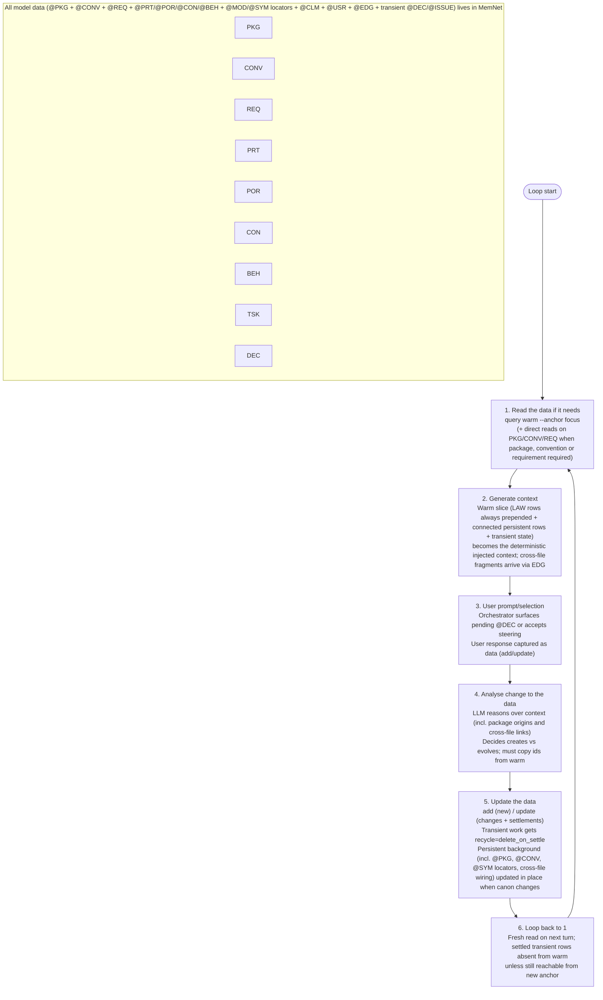

# LLM SysML v2 Modeling — A MemNet Application Note

**Single-file document example.** This file is self-contained. It demonstrates how to drive a long-form, user-steered SysML v2 textual modeling session where *every* piece of data lives in MemNet, following the canonical patterns from the `sysml-memnet-documentation` skill (user pack) and its mandatory 6-step snap procedure.

It complements `sysml-modeling-workflow`, `mcp-sysml-v2` (validate), `sysml-view-doc-sync`, and `mcp-sysmledgraph` (impact/trace). MemNet holds the symbol index (@MOD/@SYM), design atoms (@PRT/@CON/@REQ/@CLM), locators, rationale and backlog; the authoritative structure and satisfy links live in the split `models/*.sysml` files. For electrical schematic / s-domain analysis atoms (`CMP`/`PIN`/`NET`, op-amp golden rules), see [`llm-circuit-schematic.md`](llm-circuit-schematic.md).

Background, conventions, requirements, model elements (parts, ports, connections, behaviours), traceability links, symbol locators, user preferences, current focus tasks, claims and open decisions are **not** kept as monolithic bibles, external files, or scattered chat state. They are broken into many small, independent rows (following the atomisation rules in the sysml-memnet-documentation skill):

- TSK — modeling campaign or step (anchor: TSK_model_pdu; persistent or delete_on_settle)
- PKG — logical source files / packages (split .sysml project)
- @PRT / @POR / @CON / @BEH / @ITM / @REQ — model elements (parts, ports, connections, behaviour, items, requirements) — one focused atom per row
- MOD / SYM — file modules and editable symbols with path + ephemeral line hints (refreshed after every validated edit)
- ART / SEC / CLM — outputs / system design report structure and atomic claims (for doc generation and traceability)
- USR — per-project modeller preferences and de-facto conventions (one key or convention per row)
- Transient: DEC / ISSUE / short-lived TSK steps (settled with delete_on_settle)

A given piece of background or model element (including a definition whose authoritative text lives in a different .sysml file on disk) is only pulled into the LLM's context for a turn when it is needed — either by anchoring directly on it or (more commonly) when an EDG link from the current live focus (task, part, port, decision, etc.) reaches it. Cross-file references are first-class: elements carry a declaredIn EDG to their logical @PKG row; warm + EDG traversal pulls only the needed fragments from other packages without the agent opening multiple files or remembering locations. The rest stays out of the warm slice.

The graph is the single place where elements from different source files are referred to together. No external model bibles for the agent, no hidden system prompts, no "the model will remember the other file." The graph is the single source of truth for the modeling session. The session can be snapshotted and resumed with `session save` / `session load`. This note itself can hold and "deploy" the whole (unified) model as rows for quick reference or as a canonical starting state, even though the real project splits the authoritative SysML v2 text across multiple .sysml files.

## The 6-Step Pipeline (the repeating loop)

This is the disciplined loop the orchestrator + LLM follow on every turn. The document's worked examples are structured strictly around these steps.

1. **serve_status** (if not running → edit .sysml only and note stale graph; skip read/write steps).

2. **Read the data if it needs** — `query_warm(anchor=TSK_model_<short>, depth=2, max_rows=50)`. Use the smallest useful anchor (TSK, PRT, REQ, SYM, ART, CLM). Warm always starts with LAW rows. Never rely on prior chat messages, full file reads, or "the other .sysml file".

3. **Locate then edit** — from warm/SYM (path+line hint) → narrow Read window or grep on the exact file → perform the .sysml textual edit. Use mcp-sysml-v2 get* helpers for discovery when warm is cold.

4. **Validate** — `mcp-sysml-v2 validate` (and preview where useful) until clean. Fix issues.

5. **Doc sync (conditional)** — `sysml-view-doc-sync` only if outputs/ exist and structure/traceability changed.

6. **Delta write + locator refresh** — add/update the affected @PRT/@CON/@REQ/@CLM + @SYM/@MOD rows (copy stable ids). Re-grep lines for every touched @SYM under the changed @MOD(s) and `update` the line hints. Settle only transient work (`delete_on_settle`). 

After any substantive model change the authoritative source is still the .sysml files; MemNet holds the queryable index, rationale and cross-file memory.

After heavy settlement, optionally run `housekeep prune recyclable --apply` to physically remove settled rows and free cap space. Reference material (PKG, CONV, USR, REQ, core PARTD/PORTD/CONND/BEHD defs and their traceability EDG) is never settled away.

**Persistent vs transient (quick legend)**

- Persistent (survives settlements, visible when anchored or reached via EDG links): @TSK (top campaign), @ART/@SEC trees, @PKG, @PRT/@CON/@REQ model atoms, @MOD/@SYM locators, @CLM claims, @USR conventions, and the @EDG that wire them (declaredIn, satisfies, owns, inFile, etc.). Each atom is its own row and is only pulled when the current anchor reaches it — even if the authoritative .sysml lives in another file.
- Transient (created/updated during the current modeling, settled with `delete_on_settle` once done): short-lived @TSK steps, @DEC/@ISSUE, temporary sync tasks.

## Part A: Schema (the user tag map)

This is the map you feed to `memnet session open --map-file`. It is the **canonical 19-tag map** from the `sysml-memnet-documentation` skill (references/sysml-memnet-patterns.md). Fixed tags (EDG and LAW) are always present.

**Do not use legacy tags** `@PARTD` / `@PORTD` / `@CONND` / `@BEHD` / `@TASK`. Use the unified tags below. On warm miss with legacy data, re-snap with this map.

The example in this note now includes a real COTS MIPI camera:

- Camera: Leopard Imaging LI-IMX900-MIPI-078H (Sony IMX900 3.2MP global shutter, I-PEX 30-pin, M12 lens 78° FOV)
- Adapter: LI-FPC22-IPEX-PI (22-pin to I-PEX for Jetson Orin NX/Nano CAM1 or Raspberry Pi)

This demonstrates modeling a real vision payload: @PRT for the module, @POR for MIPI CSI-2 + power, power allocation from the PDU, MIPI connection to host, and the adapter board as part of the interface.

```text
@ART: id|title|source|kind|status|recycle
@SEC: id|art|heading|order|status|recycle
@CLM: id|sec|type|code|status|recycle
@ENT: id|name|kind|code|recycle
@PKG: id|qname|kind|status|recycle
@PRT: id|name|kind|role|status|recycle
@POR: id|name|kind|dir|typeRef|status|recycle
@CON: id|name|kind|ends|status|recycle
@BEH: id|name|kind|owner|status|recycle
@ITM: id|name|kind|status|recycle
@REQ: id|requirementId|text|status|recycle
@MOD: id|path|pkg|role|status|recycle
@SYM: id|name|kind|path|line|owner|status|recycle
@CONV: id|topic|rule|status|recycle
@DEC: id|task|question|options|chosen|recycle
@ISSUE: id|task|code|status|recycle
@TSK: id|goal|phase|status|recycle
@USR: id|topic|value|status|recycle
@EDG: id|from|rel|to|note|recycle
```

Field notes (from the skill):
- @PRT.role, @POR.dir, @POR.typeRef, @CON.ends, @BEH.owner, @DEC.task, @ISSUE.code
- `kind` enums are closed (see patterns.md)
- satisfy/allocate are **@EDG only** (rel=`satisfies` / `allocates`). @SYM only for line locators.
- Every new @PRT/@POR/@CON **must** include `declaredIn` + `inFile` in the same batch.

EDG relations used: `satisfies`, `allocates`, `declaredIn`, `hasPort`, `typedBy`, `connects`, `owns`, `inFile`, `contains`, `mentions`, `constrained_by`, `flowOf`.

**EDG rows — the explicit wiring for selective context**

EDG is a *fixed, built-in tag* (always available; never declared in your map). It models directed, named links between any rows:

```
@EDG: E99|SRC_ID|relation|DST_ID|optional_attrs|recycle
```

**Core function in the pipeline:**
- They are how you declare "this controller *satisfies* this requirement", "this port *hasPort* on that part", "this port *typedBy* that interface (which happens to be defined in the library package)", "this element *declaredIn* this logical package/file", "this behaviour *allocates* to that hardware", "this package *contains* these elements".
- `query_warm --anchor <focus> --depth N` traverses EDG links (including declaredIn and cross-package links) to pull in *only* the connected persistent background, conventions, requirements, package origins and element defs the current focus needs. Without the right EDGs, anchoring on a @TSK or @PRT would return almost nothing but LAW + the anchor itself — even if the authoritative definition lives in another .sysml file.
- LAW01 (`edge_recycle`) keeps the warm slice clean: most transient EDGs (and the rows they point to) are hidden from context unless the anchor touches src or dist.
- You manage them with the same `add`/`update` discipline as nodes (copy ids from warm; use `--allow-new-relation` only for genuinely new relation verbs). They are first-class data, not implicit "the LLM will remember the connection or which file it came from".

In short: EDG (including declaredIn to @PKG) is the mechanism that makes "read only what the anchor can reach" — and "easily refer together elements whose models live in different files" — reliable and deterministic for long-running modeling work.

**Background is many small pieces, referred only when needed**

Because the persistent material itself is stored as many small rows rather than one giant "model" or per-file bibles the agent must keep open, the warm slice for any turn contains only the fragments the current focus actually needs. In the seed and full model block you will see separate @PKG rows for the logical library and project files, multiple distinct @CONV rows, individual @REQ, focused @PRT/@POR etc., each carrying (via EDG) its package of origin. When you later need a specific convention, requirement or a type defined in the library package, you can anchor directly on it (as Turn 3 does with a CONV) or let the live focus's EDG (including cross-package typedBy or satisfies) pull it in. Most of the time the relevant pieces — even those whose .sysml source lives in a different file — arrive automatically because earlier turns wired them with EDG (declaredIn, typedBy, satisfies, etc.). Unrelated background or elements from unrelated packages stay out of context and out of the way.

The graph unifies the split-file reality: the modeller never has to open multiple .sysml files or paste content between them for the agent; ids + EDG + warm give precise, on-demand access across package boundaries.

## SysML v2 syntax to MemNet representation (quick reference table)

Aligned with the construct table in sysml-memnet-patterns.md. **satisfy/allocate are @EDG only**.

| SysML v2 Construct              | MemNet row(s)                          | Required same-batch EDG                                      | Notes |
|--------------------------------|----------------------------------------|--------------------------------------------------------------|-------|
| part def / part usage          | @PRT (kind=partDef/partUsage) + @SYM   | declaredIn→@PKG, inFile→@MOD                                | Stable id = name. @PRT.role optional. |
| port def / port usage          | @POR (kind=...) + @SYM                 | declaredIn; parent hasPort; typedBy if applicable            | @POR.dir + @POR.typeRef. |
| connection / link              | @CON + @SYM                            | declaredIn + inFile; connects or ends                        | @CON.ends for the two ends. |
| requirement def                | @REQ + @SYM (kind=requirement)         | declaredIn to requirements @PKG                              | Use requirementId as stable id. |
| satisfy link                   | @EDG rel=`satisfies` ( @SYM only for locator ) | —                                                          | Never a separate link row. |
| allocate                       | @EDG rel=`allocates`                   | —                                                            | From @BEH or @PRT. |
| behaviour / state machine      | @BEH + @SYM                            | declaredIn; allocates if applicable                          | @BEH.owner. |
| item / flow                    | @ITM + optional @EDG `flowOf`          | declaredIn                                                   | — |
| site convention                | @CONV                                  | @TSK constrained_by @CONV                                    | — |
| design decision fork           | @DEC                                   | @TSK owns @DEC                                               | Settle when chosen. |
| backlog item                   | @ISSUE or @CLM (type=assumption)       | —                                                            | — |
| Symbol locator                 | @SYM                                   | inFile→@MOD; declaredAs / hasPort etc. from semantic row    | line = hint only. Refresh after every validate. |
| Cross-file use                 | @EDG (declaredIn, typedBy, ...)        | —                                                            | Warm on local + depth reaches remote definition. |

## Part B: Initial Seed (complete starting state)

Copy the block below (or extract it via heredoc) and feed it to `memnet add --stdin` after opening the session with the schema above. This is an **initial snap** (see sysml-memnet-snap.md). It contains only atoms + locators + wiring — never full .sysml text. Use @MOD/@SYM for files and editable symbols (line is a refreshable hint). Persistent rows use `persistent`; starter work uses `delete_on_settle`.

```text
@LAW: LAW01|edge_recycle|on_context|hide|delete_on_expire and delete_on_settle EDG unless anchor touches src or dist
@LAW: LAW02|node_id|on_add|unique|one row per global id use add then update same tag only
@LAW: LAW03|edge_endpoints|on_add|validate|prefer src and dist to reference existing node ids before settle
@LAW: LAW04|field_escape|on_add|use_backslash|pipe inside one field value is backslash pipe not bare pipe

@TSK: TSK_model_pdu|Model 6U CubeSat PDU (build + docs + eval)|model|in_progress|persistent

@PKG: PKG-LIB|library/power|library|active|persistent
@PKG: PKG-PDU|project/pdu|project|active|persistent
@PKG: PKG-VIS|payload/vision|vision|active|persistent

@MOD: MOD_power_ports|library/power-ports.sysml|PKG-LIB|library|active|persistent
@MOD: MOD_pdu|project/pdu-controller.sysml|PKG-PDU|deploy|active|persistent
@MOD: MOD_cam|payload/imx900-cam.sysml|PKG-VIS|payload|active|persistent

@USR: USR_de-facto|ports|use exact port names and site conventions from the .sysml files|active|persistent

@REQ: REQ-01|REQ-01|Total PDU output budget 15 W average, 20 W peak.|active|persistent
@REQ: REQ-02|REQ-02|28 V nominal input (22-32 V range). Galvanic isolation on load side.|active|persistent
@REQ: REQ-03|REQ-03|Status, current and voltage telemetry at 100 ms period.|active|persistent
@REQ: REQ-04|REQ-04|All load switches must fail-open on command loss or watchdog.|active|persistent
@REQ: REQ-05|REQ-05|Command accepted and first response telemetry < 10 ms.|active|persistent

@PRT: PRT_PDUController|PDUController|composite|active|persistent
@PRT: PRT_Battery|BatteryInterface|interface|active|persistent
@PRT: PRT_LoadSw|LoadSwitchBank|module|active|persistent
@PRT: PRT_Rail|PowerRail|internal|active|persistent
@PRT: PRT_MCU|MCU|compute|active|persistent

@CON: CON_PwrIn|pwr_in_28v|BatteryInterface.pwrOut|PDUController.pwr_in_28v|active|persistent
@CON: CON_Cmd|cmd_uart|LibraryCmdIface|PDUController.cmd_uart|active|persistent
@CON: CON_Telem|telem_uart|PDUController.telem_uart|LibraryTelemIface|active|persistent

@SYM: SYM_PDUController|PDUController|partUsage|project/pdu-controller.sysml|42|PRT_PDUController|active|persistent
@SYM: SYM_PwrIn|pwr_in_28v|portUsage|project/pdu-controller.sysml|45|CON_PwrIn|active|persistent

@PRT: PRT_IMX900|IMX900Camera|partUsage|vision|active|persistent
@POR: POR_MIPI|cam_mipi|portUsage|inout|MIPI_CSI2_4L|active|persistent
@POR: POR_CamPwr|cam_3v3|portUsage|in|Power3V3|active|persistent

@SYM: SYM_IMX900|IMX900Camera|partUsage|payload/imx900-cam.sysml|12|PRT_IMX900|active|persistent
@SYM: SYM_MIPI|cam_mipi|portUsage|payload/imx900-cam.sysml|15|POR_MIPI|active|persistent

@EDG: E01|TSK_model_pdu|owns|MOD_pdu|scope|persistent
@EDG: E02|MOD_pdu|ownsPackage|PKG-PDU|scope|persistent
@EDG: E03|PRT_PDUController|declaredIn|PKG-PDU||persistent
@EDG: E04|SYM_PDUController|inFile|MOD_pdu|loc|persistent
@EDG: E05|PRT_PDUController|hasPort|CON_PwrIn||persistent
@EDG: E06|PRT_PDUController|satisfies|REQ-01||persistent
@EDG: E07|CON_Cmd|typedBy|LibraryCmdIface||persistent
@EDG: E08|CON_Cmd|declaredIn|PKG-PDU||persistent
@EDG: E09|TSK_model_pdu|constrained_by|USR_de-facto|convention|persistent

@EDG: E10|PRT_IMX900|declaredIn|PKG-VIS||persistent
@EDG: E11|SYM_IMX900|inFile|MOD_cam|loc|persistent
@EDG: E12|PRT_IMX900|hasPort|POR_MIPI||persistent
@EDG: E13|PRT_IMX900|hasPort|POR_CamPwr||persistent
@EDG: E14|POR_CamPwr|poweredFrom| some 3V3 rail from PDU ||persistent
@EDG: E15|POR_MIPI|typedBy|MIPI_CSI2_4L||persistent
```

(The @TSK + @MOD/@SYM + model atoms + cross-package @EDG (e.g. typedBy) ensure the first `query_warm --anchor TSK_model_pdu` surfaces the right slice plus the library reference story. @SYM.line will be refreshed after the first validate+delta.)

## The 6-Step Pipeline (command-level view)

**Orchestrator responsibilities (mandatory per sysml-memnet-snap.md):**
- Step 1: `serve_status`. If not running: edit .sysml only; skip 2 & 6; note "stale graph".
- Step 2: `query_warm(anchor=TSK_model_pdu, depth=2, max_rows=60)` — READ.
- Step 3: Locate via warm/@SYM (path+line) or narrow Read/grep on the exact file; perform the textual .sysml edit.
- Step 4: `mcp-sysml-v2 validate` (repeat until clean). Use `preview` for visual checks if needed.
- Step 5: `sysml-view-doc-sync` only when outputs exist *and* structure or traceability changed.
- Step 6: Delta write (@PRT/@CON/@REQ/@CLM + @EDG) + re-grep + `update @SYM.line` for every symbol under touched @MOD(s) — WRITE.

The LLM never "remembers" ids, facts, or "which file a type came from". It only ever sees what step 2 (plus any narrow locate reads) put in front of it. All writes are deltas after validate.

## Part D: Worked Turns (the pipeline in action)

Three compact turns. Each is shown strictly as the six numbered steps from the skill. Warm output excerpts include the prepended `@LAW:` rows. All stable ids are copied from warm. Line hints in @SYM are refreshed in step 6. Transient rows are settled with `delete_on_settle`. At least one turn demonstrates a cross-file reference (library type used from the project PDU package) plus @SYM/@MOD locator maintenance.

### Turn 1 — Bootstrap Controller + Cross-File Interface Decision

**User prompt/steering:** "Begin work on the top-level PDUController in the project package. Surface any decision on the command channel interface (UART command vs simple GPIO enable). Use the shared CmdInterface type defined in the library package."

**Step 1 — serve_status + Read the data if it needs**
```
memnet serve_status
memnet query warm --anchor TSK_model_pdu --depth 2 --max-rows 60
```

**Step 2 — Generate context (warm output excerpt)**
```
@LAW: LAW01 edge_recycle ...
@LAW: ...
@TSK: TSK_model_pdu|Model 6U CubeSat PDU...|model|in_progress|persistent
@PKG: PKG-LIB|library/power|library|active|persistent
@PKG: PKG-PDU|project/pdu|project|active|persistent
@MOD: MOD_pdu|project/pdu-controller.sysml|PKG-PDU|deploy|active|persistent
@REQ: REQ-01|REQ-01|...|active|persistent
@PRT: PRT_PDUController|PDUController|composite|active|persistent
@CON: CON_PwrIn|...|active|persistent
@SYM: SYM_PDUController|PDUController|partUsage|project/pdu-controller.sysml|42|PRT_PDUController|active|persistent
@EDG: E03|PRT_PDUController|declaredIn|PKG-PDU||persistent
@EDG: E04|SYM_PDUController|inFile|MOD_pdu|loc|persistent
...
```

**Step 3 — User prompt/selection**
The steering is the modelling task plus the interface choice. The agent will surface the dilemma as a pending decision row (DEC01) rather than hard-coding an assumption. The human will pick the UART path later. The shared CmdInterface type lives in PKG-LIB; we will reference it via typedBy (cross-file).

**Step 4 — Analyse change to the data**
"query_warm(TSK_model_pdu) + the MOD/SYM rows give me the current locators (line hints), PKG-PDU/MOD_pdu, PRT_PDUController skeleton, REQs, and the library PKG for the shared interface. Per USR_de-facto and traceability I must emit satisfies + declaredIn + inFile together.

Plan:
- add/update @PRT / @CON / @SYM for the command port (typedBy the library one — cross @PKG)
- add satisfies to REQ-05, declaredIn to PKG-PDU, inFile to MOD_pdu
- add transient @DEC01 (or small @TSK) for the interface decision
- settle the bootstrap @TSK
- (after the .sysml edit + mcp-sysml-v2 validate) re-grep the touched MOD and batch-update the @SYM.line values

All stable ids copied from this warm. Only new ids for genuinely new atoms."

**Step 5 — Update the data (delta after validate)**
```
memnet add --allow-new-relation --stdin @"
@DEC: DEC01|TSK_model_pdu|Command channel...|UART (shared CmdInterface) / Simple GPIO enable||delete_on_settle
@CON: CON_Cmd|cmd_uart|...|...|active|persistent
@SYM: SYM_Cmd|cmd_uart|portUsage|project/pdu-controller.sysml|58|CON_Cmd|active|persistent
@EDG: E10|CON_Cmd|typedBy|LibraryCmdIface||persistent   # cross-PKG
@EDG: E11|CON_Cmd|declaredIn|PKG-PDU||persistent
@EDG: E12|CON_Cmd|inFile|MOD_pdu|loc|persistent
@EDG: E13|PRT_PDUController|hasPort|CON_Cmd||persistent
@EDG: E14|PRT_PDUController|satisfies|REQ-05||persistent
@EDG: E15|DEC01|declaredIn|PKG-PDU||delete_on_settle
"@
memnet update --stdin @"
@TSK: TSK_model_pdu|Model 6U CubeSat PDU...|model|in_progress|persistent
@SYM: SYM_PDUController|PDUController|partUsage|project/pdu-controller.sysml|55|PRT_PDUController|active|persistent   # line may have shifted; refreshed below
"@
# After mcp-sysml-v2 validate, re-grep lines under MOD_pdu and batch update all @SYM.line for that MOD
```

**Step 6 — Loop**
Next turn will start with a fresh `query_warm --anchor DEC01` (or PRT_PDUController / SYM_PDUController). The decision is the live focus. The bootstrap @TSK is settled. The cross-file typedBy remains visible because it is wired from the live @CON/@SYM. @SYM.line for the touched @MOD will be refreshed on the next delta.

(After this turn the orchestrator might optionally prune if other settled rows existed, but here the graph is still small.)

### Turn 2 — The Human Chooses; Cross-File Wiring Completed and Prior Work Settled

**User prompt/selection:** "Choose the UART command interface using the shared library type. Add the port, wire the remaining traceability, and move on to basic telemetry."

**Step 1 — Read the data if it needs**
```
memnet query warm --anchor DEC01 --depth 2 --max-rows 30
```

**Step 2 — Generate context**
Warm now surfaces the pending DEC01, the still-active @PRT_PDUController and its ports, linked @PKG/@CONV/@REQ (including PKG-LIB origin for the typedBy), the cross-file EDG, and the prepended LAW rows.

**Step 3 — User prompt/selection**
The human's choice ("UART (shared CmdInterface)") is captured. The orchestrator will turn it into an update of DEC01 (chosen + short note) and drive the follow-on elements and wiring.

**Step 4 — Analyse change to the data**
"DEC01 is still open. Per CONV03 the UART choice must carry the cross-package typedBy (already seeded in Turn 1 E10) and satisfy REQ-05. I will:
- update DEC01 with chosen and a short consequence note
- add the concrete telemetry port (also declaredIn PKG-PDU) and any flow link
- wire additional satisfies/allocates and declaredIn as needed
- settle DEC01 and any prior transient
- add one small follow-on TASK02 'Add basic telemetry status port + behaviour stub' (delete_on_settle) wired to PKG-PDU, the new port, and REQ-03
I will copy every id from the current warm output. No new ids for existing people or packages. The library interface stays referenced via the existing typedBy cross-file link."

**Step 5 — Update the data**
```
memnet update --stdin @"
@DEC: DEC01|TSK_model_pdu|Command channel interface for PDUController. UART (full cmd/telem) vs simple GPIO enable lines. UART re-uses the shared CmdInterface type from the library package.|UART (shared CmdInterface) / Simple GPIO enable|UART (shared CmdInterface)|... UART chosen; shared type from PKG-LIB used via typedBy.|delete_on_settle
@POR: POR_Telem|telem_uart|portUsage|out|UartTelem|active|persistent
@EDG: E15|POR_Telem|declaredIn|PKG-PDU||persistent
@EDG: E16|PRT_PDUController|hasPort|POR_Telem||persistent
@EDG: E17|PRT_PDUController|satisfies|REQ-03||persistent
@EDG: E18|BEH_CTRL|allocates|PRT_MCU||persistent
@EDG: E19|TASK02|declaredIn|PKG-PDU||delete_on_settle
@TSK: TSK02|Add basic telemetry status port + behaviour stub|sync|in_progress|delete_on_settle
"@
```

**Step 6 — Loop**
Next read (e.g. `query_warm --anchor TSK02` or PRT_PDUController) will not show the settled DEC01 unless it remains directly connected to the new anchor. The cross-file links and persistent @CONV/@REQ rows remain available when the focus reaches them.

### Turn 3 — A Canon Change to a Persistent Convention (Direct Anchor, Cross-Package Impact)

**User prompt/steering:** "Update the cross-cutting port naming convention: power ports must now end in _pwr (already in CONV02) and we must enforce it on the two power ports defined so far. Audit the affected elements across the PDU package."

**Step 1 — Read the data if it needs**
```
memnet query warm --anchor CONV02 --depth 1
# (direct anchor on the persistent convention; also light read on current focus for context)
memnet query warm --anchor TASK02 --depth 1 --max-rows 20
```

**Step 2 — Generate context**
Warm on CONV02 surfaces the current (old) text plus linked PKG-PDU (via prior wiring) and any elements that have used it. Warm on TASK02 surfaces the recent task + its connections and the packages it touches. LAW rows are prepended in both.

**Step 3 — User prompt/selection**
The steering is a direct request to tighten a persistent cross-cutting convention (already partially stated) and to propagate it. The orchestrator treats this as an update to CONV02 (canon revision) plus a follow-on audit task that may touch ports in the current package.

**Step 4 — Analyse change to the data**
"Direct anchor on CONV02 this turn (per user request). This is a legitimate canon tightening. I must read the current text first (done), then update the row in place. The two power ports (PORT-PWRIN and any sibling) are declaredIn PKG-PDU; I will re-read them via the warm or a light follow read, update their name/attrs to enforce the _pwr suffix and nominal_V, and add a lightweight audit TASK03 'Re-verify power ports and flows after naming canon change' (delete_on_settle) wired via dependsOn/audits EDG to CONV02 and the affected ports (all within PKG-PDU but the convention itself is cross-cutting). Copy ids: CONV02, PKG-PDU, PORT-PWRIN, TASK02 (for context), REQ-02. No new ids for existing elements."

**Step 5 — Update the data**
```
memnet update --stdin @"
@CONV: CONV02|Voltage attrs|power|Use nominal_V for nominal voltage. Power ports *must* carry _pwr suffix in name. Document isolation where required. Enforce on all power ports.|persistent
@POR: POR_PwrIn|pwr_in_28v|portUsage|in|Power28V|active|persistent
@TSK: TSK03|Re-verify power ports and flows after naming canon change|sync|in_progress|delete_on_settle
@EDG: E20|TASK03|dependsOn|CONV02||delete_on_settle
@EDG: E21|TASK03|declaredIn|PKG-PDU||delete_on_settle
"@
```

**Step 6 — Loop**
Next turn begins with `query warm --anchor TASK03` (or a power port). CONV02 (updated) remains visible when needed because it is persistent and connected (via the audit wiring and prior declaredIn). Previous TASK02 is now absent from warm unless explicitly reached. The cross-package story (PKG-LIB types) is untouched but still reachable if a future focus wires to it.

## Using the deployed model to build the system and write the docs (and evaluate runtime)

The 6-step pipeline above is the disciplined core for *creating and evolving* the SysML v2 model.

Once a substantial part of the model (or the complete model) is live in MemNet — either by following the pipeline turns or by deploying the "Complete model as rows" block later in this note — the same rows (PKG for the split files, allocations, connections, BEHD, requirements, conventions) become the single source of truth for the rest of the lifecycle.

**Build the system**

The graph directly drives implementation, wiring, deployment and test:

- Allocations (e.g. BEH-CTRL allocates to PART-MCU) + port definitions + typedBy + CONND tell the firmware and hardware teams exactly what must be implemented on which target, what the interface contracts are, and which logical package owns the code.
- You can derive build artefacts and task lists straight from the rows:
  - A "Hardware/Software allocation and interface matrix" for the implementers (extract allocates + hasPort + typedBy, grouped by declaredIn PKG).
  - A "signal and harness list" or "PDU wiring table" from the CONND and power ports (with voltage and isolation notes from CONV02).
  - Implementation TASK rows: "Implement telemetry assembly per BEH-CTRL and REQ-03 on the allocated MCU", "Wire load enable discretes per PORT-LD1 and REQ-04", each linked back via EDG so the builder can trace why the work exists.
- Cross-file reality is handled automatically: a type defined in PKG-LIB (the shared CmdInterface) is referenced via typedBy from a port declaredIn PKG-PDU; the builder sees the origin and the contract in one warm slice.

**Write the system model docs**

The graph is the authoritative input for the official system documentation (no more manual copy from chat or multiple .sysml files):

- Typical outputs that can be generated or validated from the rows:
  - System Design / Architecture Description (PKG structure + top-level PARTD + key allocations and satisfies, with package origins).
  - Interconnection and Interface View (all hasPort, typedBy, CONND, with declaredIn PKG for each end).
  - Behaviour Specification (BEHD rows + linked requirements and allocations).
  - Requirements Traceability Matrix (every REQ + the design elements that satisfy it + their PKG + the CONV rules that governed the wiring).
  - Verification and Validation Plan (link BEHD states, timing attributes and test TASKs back to requirements).
- In practice, after deploying the full model block:
  ```powershell
  # Example: pull everything needed for the "PDU Interconnection" section
  memnet query warm --anchor PKG-PDU --depth 2 --max-rows 80
  # Feed the @PRT / @CON / @SYM / @EDG lines (with @MOD path and declaredIn) into your doc template or Mermaid generator.
  ```
- Because the source is the live graph (with explicit EDG and package unification), the generated docs stay in sync with the model. When a canon change happens (Turn 3 style), re-extract the affected slice and the docs are updated from the same ids and facts the modeller just used.

**Evaluate how the system runs (and how it will run)**

BEHD rows (state machines, activities), timing and power attributes on ports/connections, allocations to hardware, and the linked requirements give you a precise, queryable model of runtime behaviour:

- Static analysis: "Does the allocated MCU have enough margin for the 100 ms telemetry loop (BEH-CTRL + REQ-03)?"
- Power and thermal roll-up: sum the loads from all ports connected to a rail (PORT-PWRIN, load enables), cross-checked against REQ-01/02 and CONV02.
- End-to-end paths: follow the EDG from a command port through behaviour states to an actuator port, using timing attributes to estimate latency.
- Runtime tracing: when the real hardware/software runs, log events with the model ids ("entered state X in BEH-CTRL on PART-MCU"); later query the graph to explain which requirement, allocation and design decision that corresponds to, and which package owns the code.

All of this works even though the authoritative SysML v2 text is split across multiple .sysml files on disk. The @PKG rows + declaredIn + cross-package EDG give the unification; `query warm --anchor <focus>` (or direct on a PKG or BEHD) gives the precise slice the builder, documenter or evaluator needs right now.

The same 6-step hygiene (read the live slice, reason citing ids and persistent facts, add/update with correct recycle, settle finished work) applies whether you are modelling, building, documenting or evaluating runtime. The graph in MemNet is the common working memory across the whole activity.

## Snapshot (full project state)

At any point you can capture *everything* — current model elements, packages (the logical files), conventions, requirements, traceability, allocations, user prefs and in-flight tasks/decisions:

```powershell
memnet session save --file my-sysml-model.snap
```

Later (new machine, new terminal, after a break, or to share the unified state with a colleague):

```powershell
memnet session load --file my-sysml-model.snap
# or --keep-id if you want the old session id
```

The resulting session contains the complete (unified) model. Warm reads will surface whatever the current anchor can reach, including @PKG origins and cross-package EDG links — even though the real .sysml sources are split across multiple files on disk. You can also extract the complete-model block later in this note and `memnet add --stdin` it for a quick full reference or deploy.

## Pipeline-Aware Pitfalls (and how the design helps)

- **Skipping the read (step 1)** and "remembering" that the command interface uses 115200 baud from earlier chat or "the library file" → you invent a new PORTD or use the wrong protocol/attrs. Fix: every turn starts with `query warm --anchor ...` (or direct on CONV/PKG); copy ids, names and package origins from the output you actually received.
- **Treating background, conventions or package origins as external notes or "the model knows"** → PKG, CONV, REQ and element defs (including those whose source .sysml lives in another file) live only in the graph. If you do not read them this turn (via anchor or EDG), they are not in context. Fix: anchor on them or ensure EDG links (declaredIn, typedBy, satisfies) when you need them.
- **Adding a design element (PARTD/PORTD) that should satisfy a REQ or live in a PKG but omitting the EDG** → traceability and package origin are broken; the element no longer surfaces when anchoring on the REQ or PKG, and cross-file queries miss it. Fix: always emit the satisfies + declaredIn EDG in the same batch (copy ids).
- **Using `add` for something that already exists** (e.g. re-creating a port that is already declaredIn a PKG) → `id_exists` (good). Fix: read first (direct or via warm from the package), then `update` with the exact id.
- **Forgetting to settle transient work** (TASK/DEC for a package edit) → `query warm` keeps showing old decisions and draft elements. Fix: when a modeling task or decision is done, `update` it with the appropriate `delete_on_settle` (and usually a status change).
- **Mutating a CONV, PKG path, or element def without reading its current row this turn** (direct anchor or via live EDG) → you contradict the live text/attrs or use a stale version after a prior canon change. Fix: read the row (direct warm anchor or via links), then update.
- **Anchoring only on a settled TASK/DEC after settlement** → warm returns mostly LAW and feels "empty." Fix: move the anchor to the new live TASK, PARTD, DEC or PKG after settlement.
- **Generating "new context" in prose or "I read the other file" instead of reading rows** → the model drifts from the recorded canon and package structure. Fix: the only context that matters is what step 1 + 2 put in the prompt.
- **Hunting across multiple .sysml files on disk for a type definition or "which package owns this port?"** → slow, error-prone, and the agent cannot do it reliably. Fix: PKG rows + declaredIn EDG + `query warm --anchor <focus or PKG>` (or direct on the PKG) surfaces the origin and all wired references in one deterministic slice. Maintain the declaredIn links.
- **Broad refactors (package moves, interface changes that cross files) without updating declaredIn / contains / typedBy / dependsOn EDGs or using `--depth` + `--max-rows`** → either pulls far too much or loses dependents that live in another logical file. Fix: treat package boundaries as first-class EDG, keep wiring up to date, and use the depth/max caps.

## Quick-Start (copy-paste these commands)

```powershell
# Terminal 1
memnet serve
# note the MEMNET_SERVE address if it is not the default

# Terminal 2 (client)
# 1. Extract the schema block (the recommended map from Part A) to a temp map file.
# PowerShell example (use the full modern map with @ART/@SEC/@CLM/@MOD/@SYM/@PRT/@CON/@TSK...):
@'
@ART: id|title|source|kind|status|recycle
@SEC: id|art|heading|order|status|recycle
@CLM: id|sec|type|code|status|recycle
@PKG: id|qname|kind|status|recycle
@PRT: id|name|kind|status|recycle
@CON: id|name|ends|status|recycle
@REQ: id|requirementId|text|status|recycle
@MOD: id|path|pkg|role|status|recycle
@SYM: id|name|kind|path|line|owner|status|recycle
@TSK: id|goal|phase|status|recycle
@USR: id|topic|value|status|recycle
'@ | Out-File -Encoding utf8 $env:TEMP\sysml.map.txt

memnet session open --map-file $env:TEMP\sysml.map.txt
# stderr will print something like: MEMNET_SESSION=mn_3f8a2c1d
$env:MEMNET_SESSION = "mn_3f8a2c1d"

# 2. Add the initial seed (the snap block). Start with query_warm on TSK_model_pdu. Use the 6-step (validate + @SYM.line refresh) for all subsequent work.
# Again using a heredoc for clarity; in practice you can also use --file.
memnet add --stdin @"
@LAW: LAW01|edge_recycle|on_context|hide|delete_on_expire and delete_on_settle EDG unless anchor touches src or dist
@LAW: LAW02|node_id|on_add|unique|one row per global id use add then update same tag only
@LAW: LAW03|edge_endpoints|on_add|validate|prefer src and dist to reference existing node ids before settle
@LAW: LAW04|field_escape|on_add|use_backslash|pipe inside one field value is backslash pipe not bare pipe

@PKG: PKG-LIB|library/power|library/power-ports.sysml|Shared power port definitions, interfaces and item types for spacecraft power distribution.|persistent
@PKG: PKG-PDU|project/pdu-controller|project/pdu-controller.sysml|6U CubeSat PDU controller: battery input, load switching, telemetry, command interface, allocation to MCU.|persistent

@CONV: CONV01|Naming|style|Parts: PascalCase. Ports: snake_case; power ports end in _pwr. Protocols: UPPER for known buses.|persistent
@CONV: CONV02|Voltage attrs|power|Use nominal_V for nominal voltage. Power ports *must* carry _pwr suffix in name. Document isolation where required.|persistent
@CONV: CONV03|Traceability|project|New design elements (PARTD/PORTD) must wire satisfies to at least one REQ and declaredIn to their PKG in the same batch. Cross-package typedBy/realizes must be explicit.|persistent

@USR: USR01|trace_on_warm|always|persistent
@USR: USR02|row_style|compact|persistent

@REQ: REQ-01|REQ-01|Total PDU output budget 15 W average, 20 W peak.|active|persistent
@REQ: REQ-02|REQ-02|28 V nominal input (22-32 V range). Galvanic isolation on load side.|active|persistent
@REQ: REQ-03|REQ-03|Status, current and voltage telemetry at 100 ms period.|active|persistent
@REQ: REQ-04|REQ-04|All load switches must fail-open on command loss or watchdog.|active|persistent
@REQ: REQ-05|REQ-05|Command accepted and first response telemetry < 10 ms.|active|persistent

@PRT: PRT_PDUController|PDUController|partUsage|composite|active|persistent
@PRT: PRT_Battery|BatteryInterface|partUsage|interface|active|persistent
@PRT: PRT_LoadSw|LoadSwitchBank|partUsage|module|active|persistent
@PRT: PRT_Rail|PowerRail|partUsage|internal|active|persistent
@PRT: PRT_MCU|MCU|partUsage|compute|active|persistent

@POR: POR_PwrIn|pwr_in_28v|portUsage|in|Power28V|active|persistent
@POR: POR_Cmd|cmd_uart|portUsage|inout|UartCmd|active|persistent
@POR: POR_Telem|telem_uart|portUsage|out|UartTelem|active|persistent
@POR: POR_Load1|load_en_1|portUsage|out|Discrete|active|persistent

@BEH: BEH_CTRL|PDUControl|stateMachine|PRT_MCU|active|persistent

@SYM: SYM_PDUController|PDUController|partUsage|project/pdu-controller.sysml|42|PRT_PDUController|active|persistent
@SYM: SYM_PwrIn|pwr_in_28v|portUsage|project/pdu-controller.sysml|45|POR_PwrIn|active|persistent

@EDG: E01|TSK_model_pdu|owns|MOD_pdu|scope|persistent
@EDG: E02|MOD_pdu|ownsPackage|PKG-PDU|scope|persistent
@EDG: E03|PRT_PDUController|declaredIn|PKG-PDU||persistent
@EDG: E04|SYM_PDUController|inFile|MOD_pdu|loc|persistent
@EDG: E05|PRT_PDUController|hasPort|POR_PwrIn||persistent
@EDG: E06|PRT_PDUController|satisfies|REQ-01||persistent
@EDG: E07|POR_Cmd|typedBy|LibraryCmdIface||persistent
@EDG: E08|POR_Cmd|declaredIn|PKG-PDU||persistent
"@

# 3. First read (start of your first pipeline cycle)
memnet query warm --anchor TSK_model_pdu --depth 2 --max-rows 60

# 4. Now follow the 6 steps for real. Example first read of Turn 1:
# memnet query warm --anchor TSK_model_pdu --depth 2 --max-rows 60
# ... think (note PKG-LIB cross-file origin in analysis) ...
# memnet add --allow-new-relation --stdin @" ... @DEC ... @EDG with declaredIn and cross typedBy ... "@
# (then wait for modeller choice on the interface, then continue the loop)

# 5. (Optional) Later there is a "Complete model as rows" block. Extract + add --stdin for a ready unified snap (with @MOD/@SYM). In real work always follow the 6-step loop with validate + line refresh.
```

Bash users: use `cat <<'EOF' > /tmp/sysml.map.txt` and `memnet add --stdin <<'EOF' ... EOF`.

## Complete model as rows (quick reference / deploy the whole model)

The block below is a representative snap of the unified model state (atoms + @MOD/@SYM locators + wiring) after following the canonical procedure. It unifies elements from separate .sysml files via @PKG + crossing EDG and @SYM (with line hints that are refreshed post-edit).

Use it as:
- Quick reference.
- Deploy: `memnet add --stdin` after the schema map. In real work you would start from `query_warm(TSK_model_pdu)`, perform the 6-step loop (validate + delta + @SYM.line refresh), and keep @CLM in sync with outputs via sysml-view-doc-sync.

```text
@LAW: LAW01|edge_recycle|on_context|hide|delete_on_expire and delete_on_settle EDG unless anchor touches src or dist
@LAW: LAW02|node_id|on_add|unique|one row per global id use add then update same tag only
@LAW: LAW03|edge_endpoints|on_add|validate|prefer src and dist to reference existing node ids before settle
@LAW: LAW04|field_escape|on_add|use_backslash|pipe inside one field value is backslash pipe not bare pipe

@PKG: PKG-LIB|library/power|library|active|persistent
@PKG: PKG-PDU|project/pdu|project|active|persistent
@PKG: PKG-VIS|payload/vision|vision|active|persistent

@CONV: CONV01|Naming|style|Parts: PascalCase. Ports: snake_case; power ports end in _pwr.|persistent
@CONV: CONV02|Voltage|power|Use nominal_V. Power ports carry _pwr suffix. Enforce isolation.|persistent
@CONV: CONV03|Traceability|project|New @PRT/@POR/@CON must include declaredIn + inFile in same batch. Cross-package typedBy explicit.|persistent

@USR: USR_de-facto|ports|use exact port names from the .sysml files|active|persistent

@REQ: REQ-01|REQ-01|Total PDU output budget 15 W average, 20 W peak.|active|persistent
@REQ: REQ-02|REQ-02|28 V nominal input (22-32 V range). Galvanic isolation on load side.|active|persistent
@REQ: REQ-03|REQ-03|Status, current and voltage telemetry at 100 ms period.|active|persistent
@REQ: REQ-04|REQ-04|All load switches must fail-open on command loss or watchdog.|active|persistent
@REQ: REQ-05|REQ-05|Command accepted and first response telemetry < 10 ms.|active|persistent

@PRT: PRT_PDUController|PDUController|partUsage|composite|active|persistent
@PRT: PRT_Battery|BatteryInterface|partUsage|interface|active|persistent
@PRT: PRT_LoadSw|LoadSwitchBank|partUsage|module|active|persistent
@PRT: PRT_Rail|PowerRail|partUsage|internal|active|persistent
@PRT: PRT_MCU|MCU|partUsage|compute|active|persistent

@POR: POR_PwrIn|pwr_in_28v|portUsage|in|Power28V|active|persistent
@POR: POR_Cmd|cmd_uart|portUsage|inout|UartCmd|active|persistent
@POR: POR_Telem|telem_uart|portUsage|out|UartTelem|active|persistent
@POR: POR_Load1|load_en_1|portUsage|out|Discrete|active|persistent

@BEH: BEH_CTRL|PDUControl|stateMachine|PRT_MCU|active|persistent

@SYM: SYM_PDUController|PDUController|partUsage|project/pdu-controller.sysml|42|PRT_PDUController|active|persistent
@SYM: SYM_PwrIn|pwr_in_28v|portUsage|project/pdu-controller.sysml|45|POR_PwrIn|active|persistent

@EDG: E01|TSK_model_pdu|owns|MOD_pdu|scope|persistent
@EDG: E02|MOD_pdu|ownsPackage|PKG-PDU|scope|persistent
@EDG: E03|PRT_PDUController|declaredIn|PKG-PDU||persistent
@EDG: E04|SYM_PDUController|inFile|MOD_pdu|loc|persistent
@EDG: E05|PRT_PDUController|hasPort|POR_PwrIn||persistent
@EDG: E06|PRT_PDUController|satisfies|REQ-01||persistent
@EDG: E07|PRT_PDUController|satisfies|REQ-05||persistent
@EDG: E08|BEH_CTRL|allocates|PRT_MCU||persistent
@EDG: E09|POR_Cmd|declaredIn|PKG-PDU||persistent
@EDG: E10|POR_Cmd|typedBy|LibraryCmdIface||persistent
@EDG: E11|PRT_PDUController|hasPort|POR_Cmd||persistent
@EDG: E12|POR_Telem|declaredIn|PKG-PDU||persistent
@EDG: E13|PRT_PDUController|hasPort|POR_Telem||persistent
@EDG: E14|PRT_PDUController|satisfies|REQ-03||persistent

@PKG: PKG-VIS|payload/vision|vision|active|persistent

@PRT: PRT_IMX900|IMX900Camera|partUsage|vision|active|persistent
@POR: POR_MIPI|cam_mipi|portUsage|inout|MIPI_CSI2_4L|active|persistent
@POR: POR_CamPwr|cam_3v3|portUsage|in|Power3V3|active|persistent

@SYM: SYM_IMX900|IMX900Camera|partUsage|payload/imx900-cam.sysml|12|PRT_IMX900|active|persistent
@SYM: SYM_MIPI|cam_mipi|portUsage|payload/imx900-cam.sysml|15|POR_MIPI|active|persistent

@EDG: E20|PRT_IMX900|declaredIn|PKG-VIS||persistent
@EDG: E21|SYM_IMX900|inFile|MOD_cam|loc|persistent
@EDG: E22|PRT_IMX900|hasPort|POR_MIPI||persistent
@EDG: E23|PRT_IMX900|hasPort|POR_CamPwr||persistent
@EDG: E24|POR_CamPwr|poweredFrom| some 3V3 rail from PDU ||persistent
@EDG: E25|POR_MIPI|typedBy|MIPI_CSI2_4L||persistent

@EDG: E26|PRT_IMX900|poweredBy| some PDU rail ||persistent
@EDG: E27|POR_MIPI|connectsTo| host MIPI port on MCU or Jetson ||persistent
```

Extract the block and `memnet add --stdin` (after the schema) to load a ready unified snap. In real work always run the full 6-step (validate + @SYM.line refresh).

## Diagram — The 6-Step Pipeline as a Loop



**Persistent vs transient (legend for the diagram above)**

- Persistent (stays across settlements, visible when anchored or reached via EDG links): @PKG (logical files/packages — the key to cross-file unification), individual @CONV, USR prefs, @REQ, focused @PRT/@POR/@CON/@BEH defs and the EDG that wire them (including declaredIn to their package of origin and cross-package typedBy/satisfies/allocates). Each piece is its own row and appears only when needed.
- Transient (created/updated during modeling, settled with `delete_on_settle` once done): @TSK (current modeling focus), @DEC (pending decisions), @ISSUE (open issues), active package edit work.

---

**Read this file at the start of any SysML v2 modeling project that uses MemNet + the sysml-memnet-documentation skill.** The recommended map (with @MOD/@SYM locators, @PRT/@CON/@REQ atoms, @ART/@SEC/@CLM for docs), the snap 6-step (serve_status → query_warm(TSK_model_*) → locate/edit → validate → doc-sync → delta+line refresh), atomisation (one fact per row, short fields, explicit EDG), stable ids, line refresh discipline, and the ability to hold a unified cross-file memory while the .sysml files remain authoritative — these are the whole game. The rows (plus the paired MCPs) let an LLM build the system, write the docs, and evaluate runtime behaviour without ever losing the split-file reality or the latest validated state.