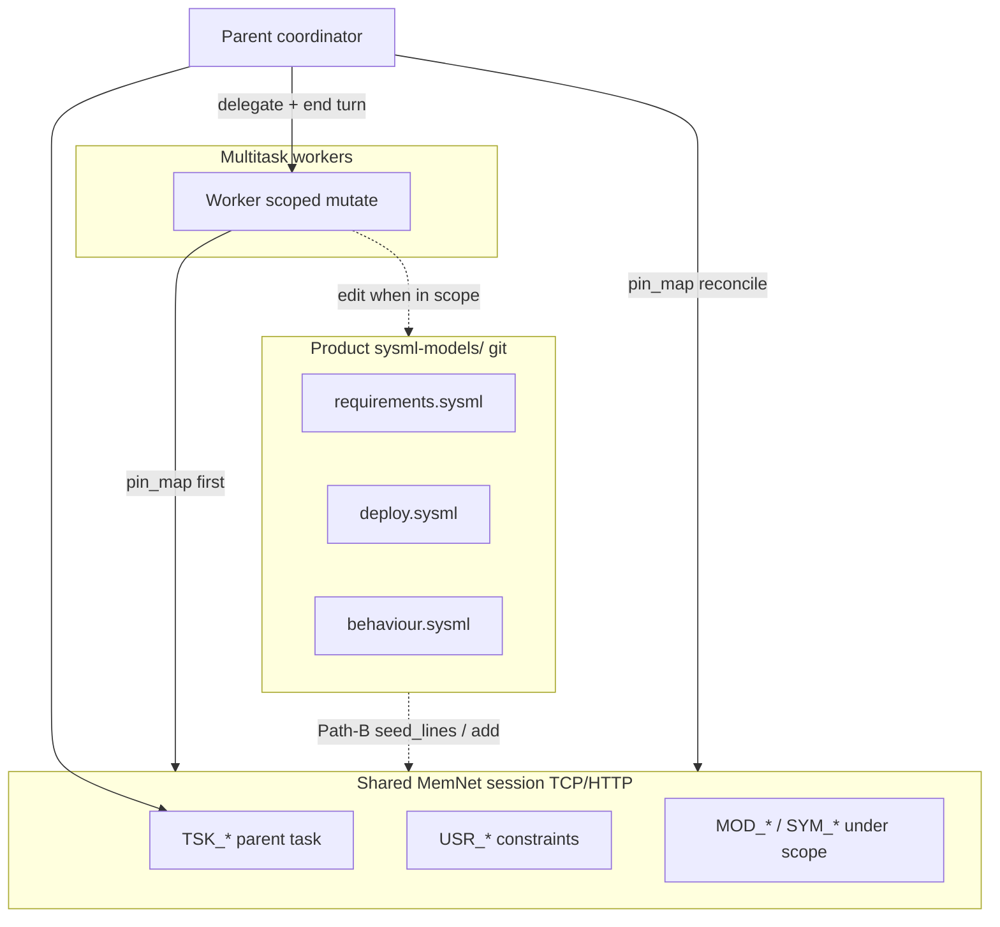

# System development with Multitask — A MemNet application note

> **Dialect (product 0.8):** **GQL only** — [`../grammar/gql-wire-profile.md`](../grammar/gql-wire-profile.md). Product shape: [`../SHAPE.md`](../SHAPE.md). Shared contract: [`README.md`](README.md). Do **not** teach Layer / Tier A. Wire shapes: [`examples/inverting-amplifier-gql-case-study.md`](examples/inverting-amplifier-gql-case-study.md).

**Class:** applications — downstream `modelbasedPrj-*` system repos.  
**Operational doctrine (developers):** [`docs/multi-agent-sessions.md`](../multi-agent-sessions.md).  
**Application skill:** `~/.cursor/skills/memnet-multitask/`. Index: [`docs/README.md`](../README.md).

**Application example (documentation only).** Pattern for a downstream **`modelbasedPrj-*` system repository** when Cursor **Multitask Mode** (or Task sub-agents) runs multi-step system, software, or SysML work. MemNet holds **mission goldfish state**; the product **`sysml-models/`** tree remains **structural SSOT** for the system under design.

**Dialect:** GQL ([`../grammar/gql-wire-profile.md`](../grammar/gql-wire-profile.md)).

This note complements:

- [`docs/multi-agent-sessions.md`](../multi-agent-sessions.md) — enforceable Multitask doctrine (as-is 0.8; RSV + Path-B ingest shipped)
- [`sysml-models/outputs/multitask-case-study.md`](../../sysml-models/outputs/multitask-case-study.md) — MemNet product SysML walk-through (MN-REQ-12)
- [`llm-sysml-v2-modeling.md`](llm-sysml-v2-modeling.md) — single-agent SysML memory (no Multitask transport)
- [`llm-software-development.md`](llm-software-development.md) — single-agent coding memory

**Doctrine pointer:** adopt **MN-REQ-12** via a short local requirement mirror or doc link — do **not** import `MemNetRequirements` from the MemNet product repo into the system project's SysML load tree.

---

## 1. Two stores of truth

| Store | Role | SSOT for |
|-------|------|----------|
| **MemNet session** (shared TCP/HTTP) | Turn-facing goldfish: `TSK_*`, `USR_*`, scoped `MOD_*` / `SYM_*`, `CLM_*` / `DEC_*` | Mission ids, paths, task status, agent-verified locators |
| **Product `sysml-models/`** | Versioned structural model (requirements, deploy, behaviour) | System architecture, interfaces, satisfy/trace to product reqs |
| **Source tree** (`parts/`, firmware, docs) | Git history | Code and artefacts on disk |

Chat and sub-agent prose are **never** mission SSOT (MN-REQ-12.1; extends MN-REQ-10.1).

---

## 2. Transport (non-negotiable under Multitask)

Parent and every worker **MUST** bind to the **same** GraphStore via **TCP serve** (`MEMNET_MCP_TRANSPORT=tcp`, `:18765`) or **streamable-http** MCP (`:18766/mcp`). Default **in-process** MCP gives each process an isolated graph — **MUST NOT** use for shared missions (MN-REQ-12.2).

| Pattern | When |
|---------|------|
| **One mission session id** | Default: parent passes `session` in every worker prompt |
| **Separate session ids** | Independent missions only; parent **imports** a member slice at settle if needed (prefer **import** over session merge) |

Probe with `serve_status` before delegating if transport is uncertain.

---

## 3. Parent coordinator

### MUST

- `session_open` / `session_load` **one** mission id before spawn; pass it in worker prompts.
- Mint and own **`TSK_*`** / **`USR_*`**: `status=active` → `status=settled`; optional `led_to_success` edges.
- Assign **write scope** (anchor ids + allowed relation types) in self-contained worker prompts.
- **End the turn** after background spawn — no poll, no await (MN-REQ-12.6).
- Next coordinator turn: **`pin_map` first**; act from refreshed slice — do not redo worker investigation from chat.
- Prefer **one worker** per coherent workstream; parallel only with **disjoint** anchors or **separate** sessions (MN-REQ-12.5).

### MUST NOT

- Settle parent `TSK_*` from worker chat — only from shared-session pin-map facts.
- Assume full session ACL modes (`private`/`shared`/`open` + `session_token`) or pin-map export/round-trip (MN-REQ-12.7; verified by MN-VER-12-S09). RSV and Path-B ingest domains are shipped.

---

## 4. Worker agent

### MUST

- Use the parent's **session id**; **`pin_map` first** every turn.
- Copy assigned ids from pin map — **MUST NOT** invent ids the parent already minted.
- Mutate only under the **assigned subgraph** (anchors + relations in the prompt).
- Return a concise result; durable facts live in MemNet rows.

### MUST NOT

- Open a different session unless explicitly assigned.
- Settle parent-owned `TSK_*` / `USR_*` unless delegated.
- Use in-process MCP when the parent uses shared TCP/HTTP.

---

## 5. Serial SysML then code (recommended)

When work touches both **`sysml-models/`** and implementation files:

| Order | Worker | Scope | Rationale |
|-------|--------|-------|-----------|
| **1** | SysML worker | `MOD_*` under `sysml-models/`, product `REQ_*` / `SYM_*` | Structural decisions land in git SSOT first |
| **2** | Code worker | `parts/`, tests, firmware | Implementation follows model; disjoint `MOD_*` anchors |

**Alternative:** one worker if the mission is small and files do not overlap.

**MUST NOT** run two workers on the **same** anchor slice without serialisation or an **RSV** lease (last-write-wins if you skip both).

---

## 6. Adopting MN-REQ-12 in a system repo

The MemNet **product** models Multitask in `MemNetRequirements::MN_REQ_12_*` and `MemNetVerification` (MN-VER-12-G00, S01…S09). A **`modelbasedPrj-*` repo** should:

| Approach | Use |
|----------|-----|
| **Doc pointer** | Link `docs/multi-agent-sessions.md` + this note in `AGENTS.md` / project rules |
| **Thin local mirror** | e.g. `SYS_REQ_MT_*` leaves in *product* `requirements.sysml` that restate operational SHALLs — **not** a git submodule of MemNet SysML |
| **Verify (optional)** | Product-specific verify cases that `verify` local reqs and reference MemNet case study — do not duplicate the full MemNet verify package |

Do **not** add `import MemNetRequirements::*` from the MemNet engine repo into the system load tree unless the project explicitly owns a merged model (rare).

---

## 7. Path-B pin ingest

Path-B **`PinMapIngest_*`** domains are **shipped** (MN-REQ-11; #31 / #64):

| CLI | MCP | Locators |
|-----|-----|----------|
| `memnet ingest sysml --path …` | `ingest_sysml` | `path=`, `qname=` |
| `memnet ingest codebase --path …` | `ingest_codebase` | `path=`, `line=`, `signature=` |
| `memnet ingest pcba --path …` | `ingest_pcba` | `refdes=`, `net=`, `pin=`, `path=` |
| `memnet ingest skills --path …` | `ingest_skills` | `skill_id=`, `phrase=` |

Client `NEW` is illegal for source pins. Prefer ingest for bounded pin maps; `seed_lines` / `add` remain valid for one-off locators. Ingest is not export. 0.19 cue `pin_map` GQL write-out is `memnet export pin-map`; re-ingest later (#66).

| Method | When |
|--------|------|
| Path-B `ingest …` | Primary: selective artefact → pins |
| `session_open` **`seed_lines`** | Mission start bootstrap without artefact path |
| **`add`** with deterministic ids | Incremental locators after grep/LSP confirm |
| **LLM `NEW`** | Goldfish-authored `CLM_*`, `DEC_*`, mission annotations only — not for re-creating source pins |

Re-`pin_map` after ingest/seed; workers copy ids from the slice.

---

## 8. Pin taxonomy (system-dev missions)

| Prefix | Owner | Typical use |
|--------|-------|-------------|
| `TSK_*`, `USR_*` | **Parent** | Mission task, user constraints |
| `MOD_*`, `SYM_*`, `REQ_*`, `PRT_*` | Worker under scope | Files, symbols, product requirements, parts |
| `CLM_*`, `DEC_*` | Worker (**NEW** OK) | Findings, open decisions |

Edges: `owns`, `about`, `constrained_by`, `led_to_success` (parent settle), domain relations from product grammar.

---

## 9. Failure modes

| Failure | Symptom | Mitigation |
|---------|---------|------------|
| In-process MCP under Multitask | Worker writes invisible to parent | TCP/HTTP shared store; `serve_status` |
| Chat as SSOT | Duplicate ids, stale paths | `pin_map` every turn; parent reconcile from session |
| Parent polls / re-investigates | Token waste; gate violation | End turn after spawn; next turn pin_map only |
| Parallel same-anchor writers | Silent clobber | Serial worker or disjoint scopes |
| Assuming full ACL modes / `session_token` | False isolation | CapsPolicy when enabled; RSV + Path-B ingest **are** shipped; full modes still to-be |
| SysML vs MemNet drift | Model and pins disagree | SysML in git wins for structure; MemNet holds locators + mission state |
| Worker settles parent `TSK_*` | Lifecycle violation | Parent-only settle unless delegated |

---

## 10. Open decisions (record in `DEC_*`)

- Local IPC vs TCP: `LocalIpcGateway` **is shipped** (`memnet serve --ipc`); choose per host.
- Whether to add product-specific `SYS_REQ_MT_*` leaves or doc-only adoption.
- Single worker vs SysML-then-code split per mission class.
- Full ACL modes / `session_token` remain to-be; `WorkerWriteScope` **hard-rejects** when session ACL is enabled.

---

## 11. Related

| Topic | Path |
|-------|------|
| Enforceable Multitask doctrine | [`docs/multi-agent-sessions.md`](../multi-agent-sessions.md) |
| MemNet product MN-REQ-12 model | [`sysml-models/models/requirements.sysml`](../../sysml-models/models/requirements.sysml) |
| Verify package | [`sysml-models/models/verify.sysml`](../../sysml-models/models/verify.sysml) (MN-VER-12-G00, S01…S09) |
| Case study | [`sysml-models/outputs/multitask-case-study.md`](../../sysml-models/outputs/multitask-case-study.md) |
| ACL / reserve (RSV shipped; full ACL modes design) | [`docs/grammar/memnet-security-multi-agent.md`](../grammar/memnet-security-multi-agent.md), [`memnet-neighbourhood-reserve.md`](../grammar/memnet-neighbourhood-reserve.md) |
| SysML modeling (single-agent) | [`llm-sysml-v2-modeling.md`](llm-sysml-v2-modeling.md) |
