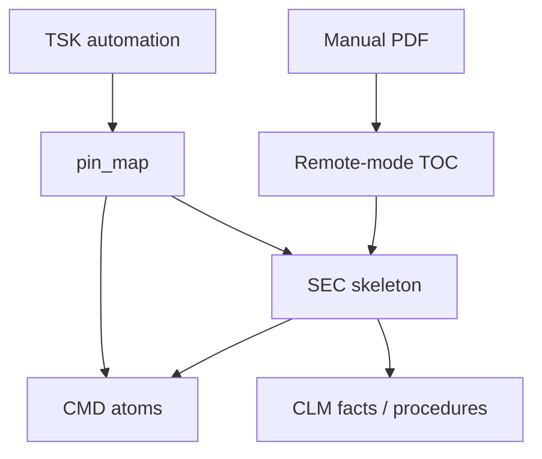

# LLM technical docs decomposition

> **Dialect (1.x):** **GQL only** — [`../grammar/gql-wire-profile.md`](../grammar/gql-wire-profile.md). Do **not** teach Layer / Tier A. Product shape: [`../SHAPE.md`](../SHAPE.md).

**Application example (documentation only).** Atomise long instrument manuals (PDFs, SCPI references) into a MemNet graph so an agent can **`pin_map`** one remote-mode subsection and drive the instrument — without storing manual prose in row fields.

**Teach:** openCypher-shaped GQL; procedure links as **`:precedes`** / **`:requires`**. Doctrine: [`gql-wire-profile.md`](../grammar/gql-wire-profile.md). Shared contract: [`README.md`](README.md).

**Open:** `schema.techdocs.example.txt`. PDF/manual is **host corpus** (Snap locators); MemNet holds distilled `CMD`/`CLM` atoms. MCP arg **`session`**.

**Primary worked example:** [R&S RTO User Manual en rev 29](https://scdn.rohde-schwarz.com/ur/pws/dl_downloads/pdm/cl_manuals/user_manual/1332_9725_01/RTO_UserManual_en_29.pdf) — remote mode (SCPI over LAN).

**Seed workflow (example):** `parts/common/memnet/memnet/examples/workflow.rto-remote.example.txt` — large `CMD` extract from the manual *List of commands*. Regenerate with `python scripts/extract_rto_scpi.py` when the PDF is available.

British English. ASCII.

---

## 1. Problem

Instrument manuals exceed 1 000 pages. MemNet stores:

- **Structure** — manual as `ART`, chapters as `SEC`
- **Atomic facts** — one idea per `CLM`
- **SCPI atoms** — one command per `CMD` (`scpi` property)
- **Procedures** — `CLM` + `:precedes` / `:requires` relationships
- **Tasks** — `TSK` per automation goal; `pin_map` pulls the subgraph

The PDF stays on disk. The graph holds **locators and distilled atoms**, not paragraphs.



---

## 2. Hard rules

1. Manual text stays in the PDF — rows are locators / codes / SCPI trees.
2. One SCPI command per `CMD` node.
3. Awkward characters in SCPI → tool stdin / quoted STRING properties — not bare pipe wire.
4. Handshake order before setup; setup/trigger before acquire before measure.
5. **`pin_map(anchor=…)`** every turn — never dump the whole corpus.

---

## 3. Schema (GQL)

Illustrative labels: `:CFG`, `:ART`, `:SEC`, `:CLM`, `:CMD`, `:ENT`, `:TSK`, `:USR`.

Seed sketch — `ART_rto_um` is a **ground** locator for that manual. Goldfish `CLM`/`TSK` use `id:'NEW'`.

```cypher
CREATE (c:CFG {id:'CFG01', corpus:'rto_remote', anchor:'ART_rto_um', version:29, notes:'scpi_acq_trig_meas'})
CREATE (a:ART {id:'ART_rto_um', title:'R&S RTO User Manual', source:'1332_9725_01/RTO_UserManual_en_29.pdf', kind:'instrument_manual', status:'active'})
```

---

## 4. Procedure wiring (relation grain)

**Hello / connect:**

```cypher
(:CMD {id:'CMD_cls'})-[:precedes {id:'E_h1'}]->(:CMD {id:'CMD_idn'})
(:CMD {id:'CMD_idn'})-[:precedes {id:'E_h2'}]->(:CMD {id:'CMD_rst'})
(:CMD {id:'CMD_rst'})-[:precedes {id:'E_h3'}]->(:CMD {id:'CMD_opc'})
(:CMD {id:'CMD_opc'})-[:precedes {id:'E_h4'}]->(:CMD {id:'CMD_err'})
```

**Setup (channel + timebase + trigger):**

```cypher
(:CMD {id:'CMD_chan_scal'})-[:precedes {id:'E_s1'}]->(:CMD {id:'CMD_tbase_scal'})
(:CMD {id:'CMD_tbase_scal'})-[:precedes {id:'E_s2'}]->(:CMD {id:'CMD_trig_sour'})
(:CMD {id:'CMD_trig_sour'})-[:precedes {id:'E_s3'}]->(:CMD {id:'CMD_trig_mode'})
(:CMD {id:'CMD_trig_mode'})-[:precedes {id:'E_s4'}]->(:CMD {id:'CMD_trig_lev'})
(:CLM {id:'CLM_setup_seq'})-[:requires {id:'E_req'}]->(:CLM {id:'CLM_hello_seq'})
```

**Measure:**

```cypher
(:CMD {id:'CMD_meas_enab'})-[:precedes {id:'E_m1'}]->(:CMD {id:'CMD_meas_res'})
(:CLM {id:'CLM_meas_seq'})-[:requires {id:'E_m2'}]->(:CLM {id:'CLM_capture_seq'})
```

---

## 5. MCP turn sketch

```text
pin_map(anchor="TSK_rto_capture_ch1", depth=3, session="<id>")
add(session="<id>", wire_lines=["CREATE (c:CLM {id:'NEW', sec:'S_chan_remote', type:'constraint', code:'ch1_scale_1v_div', status:'active'})"])
update(session="<id>", wire_lines=["MATCH (t:TSK {id:'TSK_rto_capture_ch1'}) SET t.status = 'settled', t.recycle = 'delete_on_settle'"])
```

---

## 6. Domain rules (illustrative)

| Id | Constraint |
|----|------------|
| DOC01 | locator not body — manual text stays in PDF |
| SCPI01 | one cmd per row — tree in `scpi` |
| SCPI02 | special chars via stdin / STRING |
| SCPI03 | handshake before setup |
| SCPI04 | setup/trig before acq before meas |

---

## 7. Related

- [`../SHAPE.md`](../SHAPE.md) — product shape (PDF ≠ session)
- [`llm-sysml-v2-modeling.md`](llm-sysml-v2-modeling.md) — design memory (not manual ingest)
- [`../LLM-GUIDE.md`](../LLM-GUIDE.md)
- [`../grammar/gql-wire-profile.md`](../grammar/gql-wire-profile.md)

---

## 8. Retired dialects (pointer only)

Historical `@CMD` pipe or Layer ASCII extracts are **not** agent teach. Archive: [`../grammar/archive/`](../grammar/archive/). Prefer GQL + `pin_map`.
