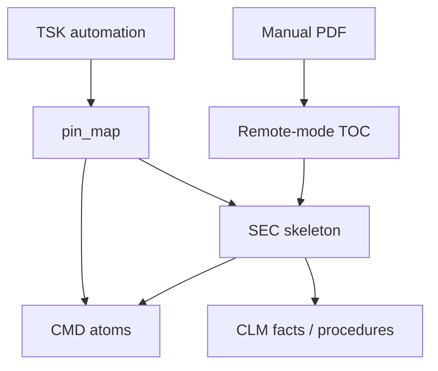

# LLM technical docs decomposition

> **Dialect (1.x):** **GQL only** — [`../grammar/gql-wire-profile.md`](../grammar/gql-wire-profile.md). Do **not** teach Layer / Tier A. Note body may still show historical seeds until **M3**; prefer [`examples/inverting-amplifier-gql-case-study.md`](examples/inverting-amplifier-gql-case-study.md) for wire shapes.

**Application example (documentation only).** Atomise long instrument manuals (PDFs, SCPI references) into a MemNet graph so an agent can **`pin_map`** one remote-mode subsection and drive the instrument — without storing manual prose in row fields.

**Teach:** Write = display; procedure links as bare-id **`--precedes-->`** / **`--requires-->`**. Pipe `@TAG` — legacy only (§8). Doctrine: [`gql-wire-profile.md`](../grammar/gql-wire-profile.md).

**Primary worked example:** [R&S RTO User Manual en rev 29](https://scdn.rohde-schwarz.com/ur/pws/dl_downloads/pdm/cl_manuals/user_manual/1332_9725_01/RTO_UserManual_en_29.pdf) — remote mode (SCPI over LAN).

**Seed workflow (example):** `parts/common/memnet/memnet/examples/workflow.rto-remote.example.txt` — large `CMD` extract from the manual *List of commands*. Regenerate with `python scripts/extract_rto_scpi.py` when the PDF is available.

British English. ASCII. No `|` pipe on the agent surface.

---

## 1. Problem

Instrument manuals exceed 1 000 pages. MemNet stores:

- **Structure** — manual as `ART`, chapters as `SEC`
- **Atomic facts** — one idea per `CLM`
- **SCPI atoms** — one command per `CMD` (`scpi=` field)
- **Procedures** — `CLM` + `--precedes-->` / `--requires-->` edges
- **Tasks** — `TSK` per automation goal; warm pulls the subgraph

The PDF stays on disk. The graph holds **locators and distilled atoms**, not paragraphs.



---

## 2. Hard rules

1. Manual text stays in the PDF — rows are locators / codes / SCPI trees.
2. One SCPI command per `CMD` row.
3. Awkward characters in SCPI → tool stdin / quoted STRING fields — not bare `|` wire.
4. Handshake order before setup; setup/trigger before acquire before measure.
5. **`pin_map(anchor=…)`** every turn — never dump the whole corpus.

---

## 3. Schema (Write = display)

```text
SCHEMA CFG ; fields=id corpus anchor version notes
SCHEMA ART ; fields=id title source kind status
SCHEMA SEC ; fields=id art heading numbering parent order status
SCHEMA CLM ; fields=id sec type code status
SCHEMA CMD ; fields=id sec scpi role params_code status
SCHEMA ENT ; fields=id name kind code
SCHEMA TSK ; fields=id goal anchor status
SCHEMA USR ; fields=id key value
```

Seed sketch:

```text
CFG [CFG01] ; corpus=rto_remote ; anchor=ART_rto_um ; version=29 ; notes=scpi_acq_trig_meas
ART [ART_rto_um] ; title="R&S RTO User Manual" ; source="1332_9725_01/RTO_UserManual_en_29.pdf" ; kind=instrument_manual ; status=active
```

---

## 4. Procedure wiring (relation grain)

**Hello / connect:**

```text
E_h1 [CMD_cls] --precedes--> [CMD_idn]
E_h2 [CMD_idn] --precedes--> [CMD_rst]
E_h3 [CMD_rst] --precedes--> [CMD_opc]
E_h4 [CMD_opc] --precedes--> [CMD_err]
```

**Setup (channel + timebase + trigger):**

```text
E_s1 [CMD_chan_scal] --precedes--> [CMD_tbase_scal]
E_s2 [CMD_tbase_scal] --precedes--> [CMD_trig_sour]
E_s3 [CMD_trig_sour] --precedes--> [CMD_trig_mode]
E_s4 [CMD_trig_mode] --precedes--> [CMD_trig_lev]
E_req [CLM_setup_seq] --requires--> [CLM_hello_seq]
```

**Measure:**

```text
E_m1 [CMD_meas_enab] --precedes--> [CMD_meas_res]
E_m2 [CLM_meas_seq] --requires--> [CLM_capture_seq]
```

---

## 5. MCP turn sketch

```text
pin_map(anchor="TSK_rto_capture_ch1", depth=3)
add(lines=["CLM [CLM_ch1_1v_div] ; sec=S_chan_remote ; type=constraint ; code=ch1_scale_1v_div ; status=active"])
update(lines=["~ [TSK_rto_capture_ch1] ; status=settled ; recycle=delete_on_settle"])
```

---

## 6. Domain rules (illustrative)

| Id | Constraint |
|----|------------|
| DOC01 | locator not body — manual text stays in PDF |
| SCPI01 | one cmd per row — tree in `scpi=` |
| SCPI02 | special chars via stdin / STRING |
| SCPI03 | handshake before setup |
| SCPI04 | setup/trig before acq before meas |

---

## 7. Related

- [`llm-sysml-v2-modeling.md`](llm-sysml-v2-modeling.md) — design memory (not manual ingest)
- [`../LLM-GUIDE.md`](../LLM-GUIDE.md)
- `~/.cursor/skills/memnet-format/`
- [`../grammar/memnet-multi-layer.md`](../grammar/memnet-multi-layer.md)

---

## 8. Legacy pipe (pointer only)

Historical `@CMD: id|sec|scpi|…` extracts and `query_warm` call sites may remain in old seeds. Accept on load; rewrite bridge examples to Write = display + `pin_map` when touched. Do not dual-teach pipe as the agent surface.
