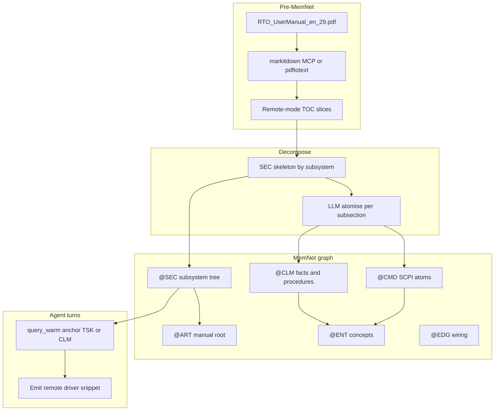
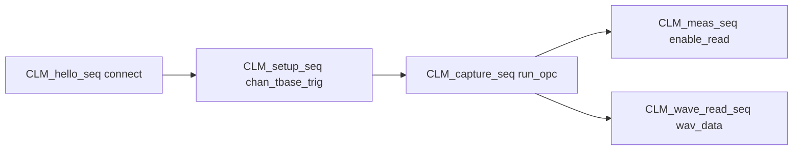

# LLM Technical Docs Decomposition — A MemNet Application Note

**Application example (documentation only).** This file is a self-contained pattern for **atomising long instrument manuals** (PDFs, SCPI references, API specs) into a MemNet knowledge graph so an agent can `query_warm` one remote-mode subsection at a time and **drive the instrument** from that warm slice — without storing manual prose in row fields.

**Primary worked example:** [R&S RTO User Manual en rev 29 (PDF)](https://scdn.rohde-schwarz.com/ur/pws/dl_downloads/pdm/cl_manuals/user_manual/1332_9725_01/RTO_UserManual_en_29.pdf) — **remote mode**: SCPI over LAN including connectivity, acquisition, triggers, and measurements (not front-panel UI walkthroughs).

**Seed workflow:** `parts/common/memnet/memnet/examples/workflow.rto-remote.example.txt` — **4 584 `@CMD` rows** extracted from the manual *List of commands* (rev 29). Regenerate with `python scripts/extract_rto_scpi.py` after placing the PDF at `data/rto/UserManual_en_29.pdf`.

**Command index (plain text):** `data/rto/scpi_commands.txt` — tab-separated `scpi` + manual page.

This note fills a gap between:

- **mcp-memnet** skill `references/article-breakdown.md` (user pack) — compact MCP reference for papers and instrument manuals
- [`application-notes/llm-sysml-v2-modeling.md`](llm-sysml-v2-modeling.md) — `@ART/@SEC/@CLM` for **outputs** and design memory, not manual ingest

---

## 1. Problem

Instrument user manuals exceed 1 000 pages. An agent asked to "write a Python script that connects to an RTO, configures CH1, triggers, captures once, and reads peak-to-peak" cannot load the whole PDF each turn.

MemNet solves this by storing:

- **Structure** — manual as `@ART`, chapters as `@SEC` (by subsystem, not alphabetically)
- **Atomic facts** — one idea per `@CLM` (syntax rules, interface constraints)
- **SCPI atoms** — one command per `@CMD` with canonical mixed-case tree in the `scpi` field
- **Procedures** — `@CLM type=procedure` wired with `precedes` and `requires` `@EDG` rows
- **Tasks** — `@TSK` per automation goal; warm anchor pulls only the subgraph needed

The PDF stays on disk. The graph holds **locators and distilled atoms**, not paragraphs.



---

## 2. Step 0 — External prerequisites

MemNet does **not** ship a PDF reader. Before atomising, extract text with one of:

| Tool | Use |
|------|-----|
| **markitdown MCP** | Recommended — converts PDF/HTML to markdown in the agent |
| `pdftotext -layout` (Poppler) | CLI fallback when MCP unavailable |
| R&S online HTML manual | If accessible — preserves headings natively |

Extracted text lives **outside** the graph (on disk). MemNet rows carry **locators** only (`@ART.source`, `@SEC.numbering`, `@CLM.code`).

---

## 3. What MemNet stores vs not

| Store in graph | Do not store |
|----------------|--------------|
| Section headings, manual section numbers | Full chapter prose |
| One SCPI command per `@CMD` row | Entire command tables as one row |
| Short `code` tokens on `@CLM` | Example programs as paragraphs |
| Procedure order via `@EDG precedes` | Front-panel key sequences |
| `@USR` transport/language prefs | Per-task instrument params (use `@CLM type=constraint` on `@TSK`) |
| `@TSK` automation goals | Settled tasks (update status, drop from warm) |

The official PDF remains the authority. The graph is **agent working memory**.

---

## 4. Remote-mode scope (RTO rev 29)

| Manual region | In graph? | MemNet use |
|---------------|-----------|------------|
| Remote control intro | Yes | `@SEC` + `@CLM` |
| Network and remote operation | Yes | LAN, raw socket port 5025 |
| SCPI basics / status byte / error queue | Yes | `@CLM type=syntax` + common `@CMD` |
| `:ACQuire:*` remote commands | Yes | Sample mode, `:RUN` / `:STOP`, `*OPC?` |
| `:TRIGger:*` remote commands | Yes | Source, mode, level |
| `:MEASurement:*` remote commands | Yes | Enable, read result query |
| `:CHANnel<n>:WAVeform<m>:DATA?` | Yes | Raw waveform pull after capture |
| `:CHANnel:*` / `:TIMebase:*` setup | Yes | Scale/range before capture |
| List of Commands (alphabetical index) | Yes — full extract | 4 584 `@CMD` rows + `S_cmd_index` in seed |
| Web Control / RDP / VNC | Summary only | `@CLM` + `see_also` to SCPI path |
| Front-panel Getting Started | **No** | UI-only |
| Mask test, serial decode, optional apps | **No** | Extend graph later if needed |

---

## 5. Remote-mode layering (five procedure layers)

Five layers — each a `@CLM type=procedure` with `precedes` EDGs; downstream layers use `requires`:



| Layer | Subsystems | Typical `@CMD` |
|-------|------------|----------------|
| 1 Connect | `:SYSTem:COMMunicate:*`, common | `*CLS`, `*IDN?`, `:SYSTem:ERRor?` |
| 2 Setup | `:CHANnel:`, `:TIMebase:`, `:TRIGger:` | `:CHANnel1:SCALe`, `:TIMebase:SCALe`, `:TRIGger:MODE` |
| 3 Capture | `:ACQuire:`, `:RUN`/`:STOP`, `*OPC?` | `:ACQuire:MODE`, `:RUN`, `:STOP`, `*OPC?` |
| 4a Measure | `:MEASurement:*` | `:MEASurement1:ENABle`, `:MEASurement1:RESult?` |
| 4b Waveform read | `:CHANnel<n>:WAVeform<m>:DATA?` | `:CHANnel1:WAVeform1:DATA?` |

Warm anchor on **`CLM_capture_seq`** with `depth=3` pulls setup prerequisites via `requires` without loading unrelated subsystems.

`:RUN` and `*OPC?` live **only** in `CLM_capture_seq`. Measurement and waveform-read procedures `require` capture complete — they do not re-run acquisition.

---

## 6. The 6-step goldfish pipeline

Every agent turn follows the same loop (mirrors SysML and other application notes):

1. **Read** — `query_warm(anchor=<TSK or CLM>, depth=2..3)`. Warm always starts with `@LAW` rows.
2. **Synthesise** — emit driver code or configuration from warm slice only; code lives in a deliverable file, **not** the graph.
3. **Capture** — user constraints become new rows (`@USR` for host prefs; `@CLM type=constraint` for task params).
4. **Analyse** — re-warm specific `@CMD` or `@CLM` rows to confirm roles and order.
5. **Persist** — `update` settled `@TSK`; `add` validated facts; wire `@EDG`.
6. **Loop** — next `@TSK` or deeper procedure layer.

### Domain LAW rows (seed after engine LAW01–05)

```text
@LAW: LAW-DOC01|*|on_add|locator_not_body|manual_text_stays_in_pdf_file
@LAW: LAW-SCPI01|CMD|on_add|one_cmd_per_row|scpi_tree_in_cmd_field_not_prose
@LAW: LAW-SCPI02|CMD|on_add|stdin_for_special|pipe_question_brackets_via_stdin_not_inline
@LAW: LAW-SCPI03|*|on_turn|handshake_order|cls_idn_err_before_setup_commands
@LAW: LAW-SCPI04|*|on_turn|remote_order|setup_trig_before_acq_before_meas_read
```

**LAW-SCPI02** — never paste SCPI with `?`, `:`, `[]` as inline `memnet add` args on PowerShell; use `--stdin` or MCP `wire_lines`.

**LAW-SCPI04** — setup and trigger before `:RUN`; read `:MEASurement<m>:RESult?` only after `*OPC?` confirms capture complete.

---

## 7. Session policy

Instrument driver work spans multiple days. Recommended:

| Setting | Value | Meaning |
|---------|-------|---------|
| TTL | 7–30 days | Long enough for multi-session driver development |
| `session_save` / `session_load` | after each substantive turn | Persist graph to disk |
| `@CFG.version` | manual revision (e.g. `29`) | Bump on manual update; refresh changed `@CMD`/`@CLM` |

```text
session_open(map_lines=[...], seed_lines=[...], ttl=10080)
session_save --file rto-remote.snapshot.txt
session_load --file rto-remote.snapshot.txt
```

---

## 8. Id grammar

| Prefix | Tag | Example |
|--------|-----|---------|
| `ART_*` | `@ART` | `ART_rto_um` |
| `S_*` | `@SEC` | `S_acq_remote`, `S_trig_remote` |
| `CLM_*` | `@CLM` | `CLM_capture_seq` |
| `CMD_*` | `@CMD` | `CMD_acq_mode`, `CMD_trig_mode` |
| `ENT_*` | `@ENT` | `ENT_channel`, `ENT_trigger` |
| `TSK_*` | `@TSK` | `TSK_rto_capture_ch1` |
| `USR_*` | `@USR` | `USR_transport` |
| `E_*` | `@EDG` | `E_cap_1` |

---

## 9. Schema map

```text
@CFG: id|corpus|anchor|version|notes
@ART: id|title|source|kind|status|recycle
@SEC: id|art|heading|numbering|parent|order|status|recycle
@CLM: id|sec|type|code|status|recycle
@CMD: id|sec|scpi|role|params_code|status|recycle
@ENT: id|name|kind|code|recycle
@TSK: id|goal|anchor|status|recycle
@USR: id|key|value|recycle
```

| Tag | Role |
|-----|------|
| `@CFG` | Corpus root; `anchor` = warm-from row (e.g. `ART_rto_um`); `version` = manual revision |
| `@ART` | One manual (`kind`: instrument_manual) |
| `@SEC` | Chapter tree; `numbering` = manual section string; `parent` = `-` for top level |
| `@CLM` | Atomic claim; `type`: fact, constraint, interface, syntax, **procedure** |
| `@CMD` | One SCPI command; `role`: set, query, both; `params_code` = short token only |
| `@ENT` | Shared concept: SCPI, LAN, channel, trigger, waveform, meas_result |
| `@TSK` | Automation goal; `anchor` = procedure or section to warm from |
| `@USR` | Host/transport prefs only — **not** per-task instrument parameters |

`@CMD` is a **user-map tag** — no engine changes required.

### SCPI canonical form

`@CMD.scpi` carries **mixed-case long+short** per SCPI convention:

- Good: `:CHANnel1:SCALe`, `:MEASurement1:RESult?`, `:SYSTem:ERRor?`
- Bad: `:CHAN1:SCAL` alone — loses information; short form is derivable from canonical

### Indexed commands

For `:CHANnel<n>:SCALe`, `:TRIGger:LEVel<n>`, `:MEASurement<m>:RESult?`:

- **One `@CMD` row per family** with placeholder in `scpi` (e.g. `:CHANnel<n>:SCALe`)
- `params_code` holds parameter tokens (e.g. `n,scale_v`)
- Instance choice (channel 1, measurement 3) belongs in `@TSK` or `@CLM type=constraint` — not four duplicate rows per channel

### Edge relations

| Relation | Use |
|----------|-----|
| `contains` | `ART → SEC`, `SEC → CLM`, `SEC → CMD` |
| `part_of` | `SEC → SEC` |
| `defines` | SCPI reference section → `@CMD` |
| `mentions` | `CLM/CMD → ENT` |
| `requires` | `CLM_capture_seq → CLM_setup_seq`; `CLM_meas_seq → CLM_capture_seq` |
| `precedes` | Ordered steps within a procedure |
| `see_also` | Web Control ↔ SCPI |
| `owns` | `TSK → CLM` or `TSK → SEC` |

Register new relations on first use: `add --allow-new-relation`.

---

## 10. Decomposition procedure

1. **Extract** PDF to markdown/text (Step 0).
2. **Identify remote-mode TOC** — skip front-panel chapters; slice by subsystem (ACQ, TRIG, MEAS, SYST, common).
3. **Skeleton `@SEC`** — one row per subsystem section; wire `part_of` / `contains` from `@ART`.
4. **Atomise `@CLM`** — syntax rules, interface facts, one procedure row per automation layer.
5. **Atomise `@CMD`** — one row per SCPI command family; canonical mixed-case in `scpi`.
6. **Wire procedures** — `precedes` between `@CMD`; `requires` between `@CLM` layers.
7. **Add `@ENT`** — shared concepts; `mentions` from `@CMD` and `@CLM`.
8. **Add `@TSK`** — one per user automation goal; `owns` → procedure anchor.

For a **full dictionary**, run `scripts/extract_rto_scpi.py` against the manual PDF (List of commands section). For incremental work, add `@CMD` rows as new tasks need them.

---

## 11. RTO walkthrough — full command dictionary

The seed file contains **every command** from the manual *List of commands* section (pages 2955–3058, rev 29): **4 584 unique `@CMD` rows**, each linked to a subsystem `@SEC` via `contains` `@EDG`.

| Subsystem `@SEC` | `@CMD` count (approx.) |
|------------------|------------------------|
| `S_search_remote` | 1 027 |
| `S_bus_remote` | 793 |
| `S_trig_remote` | 719 |
| `S_power_remote` | 289 |
| `S_meas_remote` | 239 |
| `S_acq_remote` | ~20 |
| `S_cmd_common` | 19 |
| … | see `python scripts/extract_rto_scpi.py` output |

**Do not** `query_warm` an entire large `@SEC` at high depth — e.g. `S_search_remote` would pull 1 000+ rows. Instead:

- Anchor on **`@TSK`** or **`@CLM` procedure** for driver synthesis
- Anchor on a **specific `@CMD` id** (e.g. `CMD_runsingle`) for one command + neighbours
- Anchor on **`S_trig_remote`** with **`max_rows`** cap if browsing a subsystem

Corpus root:

```text
@CFG: CFG01|rto_remote|ART_rto_um|29|scpi_acq_trig_meas
@ART: ART_rto_um|R&S RTO User Manual|1332_9725_01/RTO_UserManual_en_29.pdf|instrument_manual|active|persistent
```

Eleven `@SEC` rows (connectivity, ACQ, TRIG, MEAS, CHAN, TBAS, wave read) — see `workflow.rto-remote.example.txt`.

Sixteen **tutorial** `@CMD` rows (subset of the full 4 584) illustrate the procedure layers:

| Id | scpi | role | Layer |
|----|------|------|-------|
| `CMD_cls` | `*CLS` | set | connect |
| `CMD_idn` | `*IDN?` | query | connect |
| `CMD_rst` | `*RST` | set | connect |
| `CMD_opc` | `*OPC?` | query | connect |
| `CMD_err` | `:SYSTem:ERRor?` | query | connect |
| `CMD_chan_scal` | `:CHANnel<n>:SCALe` | set | setup |
| `CMD_tbase_scal` | `:TIMebase:SCALe` | set | setup |
| `CMD_trig_sour` | `:TRIGger:SOURce` | set | setup |
| `CMD_trig_mode` | `:TRIGger:MODE` | set | setup |
| `CMD_trig_lev` | `:TRIGger:LEVel<n>` | set | setup |
| `CMD_acq_mode` | `:ACQuire:MODE` | set | capture |
| `CMD_run` | `:RUN` | set | capture |
| `CMD_stop` | `:STOP` | set | capture |
| `CMD_wav_data` | `:CHANnel<n>:WAVeform<m>:DATA?` | query | wave_read |
| `CMD_meas_enab` | `:MEASurement<m>:ENABle` | set | measure |
| `CMD_meas_res` | `:MEASurement<m>:RESult?` | query | measure |

### Procedure wiring

**`CLM_hello_seq`** — connect handshake:

```text
precedes: CMD_cls → CMD_idn → CMD_rst → CMD_opc → CMD_err
```

**`CLM_setup_seq`** — channel + timebase + trigger (source before mode/level):

```text
precedes: CMD_chan_scal → CMD_tbase_scal → CMD_trig_sour → CMD_trig_mode → CMD_trig_lev
requires: CLM_hello_seq
```

**`CLM_capture_seq`** — single-shot capture (ends at `*OPC?`):

```text
precedes: CMD_acq_mode → CMD_run → CMD_opc
requires: CLM_setup_seq
```

**`CLM_meas_seq`** — enable measurement, read result:

```text
precedes: CMD_meas_enab → CMD_meas_res
requires: CLM_capture_seq
```

**Waveform read** (optional fourth branch): anchor `CMD_wav_data` with `requires CLM_capture_seq` — no separate procedure row in the tutorial seed; add `CLM_wave_read_seq` when the task needs raw bytes.

### Warm excerpt — `query_warm(anchor="CLM_capture_seq", depth=3)`

Returns approximately:

- `@LAW` rows (DOC01, SCPI01–04)
- `CLM_capture_seq`, `CLM_setup_seq`, `CLM_hello_seq` (via `requires` chain)
- `CMD_acq_mode`, `CMD_run`, `CMD_opc` and setup `@CMD` chain
- Linked `@ENT` rows (channel, trigger, timebase)
- **Not** measurement commands, waveform read, or unrelated `@SEC` prose

Turn B warm slice at `depth=3` from `TSK_rto_capture_ch1`: ~35–45 rows — **not** the full 4 584-command dictionary.

---

## 12. Turn A — Hello (connectivity)

**User goal:** "Connect to RTO at 10.0.0.50:5025 and print `*IDN?`."

| Step | Action |
|------|--------|
| 1 Read | `query_warm(anchor="TSK_rto_hello", depth=2)` → LAW + `CLM_hello_seq` + 5 chained `@CMD` + `CLM_raw_socket_5025` + `ENT_raw_socket`, `ENT_lan` |
| 2 Synthesise | ~20-line Python `socket` driver from warm rows; saved to `rto_hello.py` |
| 3 Capture | User confirms transport. `add @USR: USR_transport\|raw_socket_5025\|persistent`, `USR_timeout\|5s\|persistent` |
| 4 Analyse | Re-warm `USR_transport` and `CMD_idn` to confirm role=query |
| 5 Persist | `update @TSK: TSK_rto_hello\|Connect and print IDN\|CLM_hello_seq\|done\|delete_on_settle`; `add @CLM_rto_at_10_0_0_50` (fact) + EDG `mentions ENT_lan` |
| 6 Loop | Settled `TSK_rto_hello` drops from next warm; ready for Turn B |

Example driver skeleton (not stored in graph):

```python
import socket

HOST, PORT = "10.0.0.50", 5025
TERM = "\n"

def scpi(sock, cmd: str) -> str:
    sock.sendall((cmd + TERM).encode())
    return sock.recv(4096).decode().strip()

with socket.create_connection((HOST, PORT), timeout=5) as s:
    scpi(s, "*CLS")
    print(scpi(s, "*IDN?"))
    scpi(s, "*RST")
    scpi(s, "*OPC?")
    while True:
        stb = scpi(s, "*ESR?")
        if stb.strip() in ("0", "+0"):
            break
        print("ESR:", stb)
```

---

## 13. Turn B — Capture + measure

**User goal:** "Configure CH1 1 V/div, edge trigger on CH1 at 0.5 V, single acquisition, read peak-to-peak measurement."

| Step | Action |
|------|--------|
| 1 Read | `query_warm(anchor="TSK_rto_capture_ch1", depth=3)` → LAW + `CLM_setup_seq` + `CLM_capture_seq` + `CLM_meas_seq` + related `@CMD` + `@ENT` |
| 2 Synthesise | Extend driver: setup → `:RUN` → `*OPC?` → `:MEASurement1:RESult?`; saved to `rto_capture.py` |
| 3 Capture | User: "trigger mode EDGE, source CH1, level 0.5 V". Add `@CLM type=constraint`: `CLM_trig_edge_ch1`, `CLM_trig_lev_0v5`; wire to `TSK_rto_capture_ch1` via `mentions`. **Not** `@USR` |
| 4 Analyse | Re-warm `CMD_trig_mode`, `CMD_meas_res` to confirm roles |
| 5 Persist | `update @TSK` settled; `add @CLM_ch1_1v_div` (validated scale fact) |
| 6 Loop | Next `@TSK` for waveform binary read (`CMD_wav_data`) if user wants raw data |

Setup command sequence from warm (instantiate `n=1`, `m=1`):

```text
:CHANnel1:SCALe 1.0
:TIMebase:SCALe 1.0E-3
:TRIGger:SOURce CH1
:TRIGger:MODE EDGE
:TRIGger:LEVel1 0.5
:ACQuire:MODE SINGLE
:RUN
*OPC?
:MEASurement1:ENABle ON
:MEASurement1:RESult?
```

---

## 14. MCP usage

```json
session_open(
  map_lines=[
    "@CFG: id|corpus|anchor|version|notes",
    "@ART: id|title|source|kind|status|recycle",
    "@SEC: id|art|heading|numbering|parent|order|status|recycle",
    "@CLM: id|sec|type|code|status|recycle",
    "@CMD: id|sec|scpi|role|params_code|status|recycle",
    "@ENT: id|name|kind|code|recycle",
    "@TSK: id|goal|anchor|status|recycle",
    "@USR: id|key|value|recycle"
  ],
  seed_lines=[ "... workflow.rto-remote.example.txt ..." ],
  ttl=10080
)
```

Per turn:

```json
query_warm(anchor="TSK_rto_capture_ch1", depth=3)
add(wire_lines=["@CLM: CLM_ch1_1v_div|S_chan_remote|constraint|ch1_scale_1v_div|active|persistent"])
update(wire_lines=["@TSK: TSK_rto_capture_ch1|CH1 capture and peak-to-peak|CLM_setup_seq|done|delete_on_settle"])
session_save(file="rto-remote.snapshot.txt")
```

CLI equivalent:

```powershell
memnet session open --map-file parts/common/memnet/memnet/examples/schema.techdocs.example.txt --ttl 10080
Get-Content parts/common/memnet/memnet/examples/workflow.rto-remote.example.txt | memnet add --stdin --allow-new-relation
memnet query warm --anchor CLM_capture_seq --depth 3
```

---

## 15. Linking to code (optional)

When paired with the coding-memory skill, map driver functions to `@CMD`:

```text
@EDG: E_drv_idn|CMD_idn|maps_to|SYM_rto_idn|driver.py|persistent
```

Warm on `CMD_idn` then pulls the implementation locator if wired.

---

## 16. Pitfalls

| Pitfall | Fix |
|---------|-----|
| Dump whole List of Commands into one row | One `@CMD` per command (4 584 rows in seed) |
| `query_warm` on large `@SEC` without cap | Anchor `@TSK`, `@CLM`, or single `@CMD` |
| One `@SEC` per SCPI line | One `@SEC` per subsystem chapter |
| Sentences in `@CMD.params_code` | Short tokens: `n,scale_v`, `mode`, `-` |
| Inline shell quoting of `?`/`:`/`[]` | `add --stdin` or MCP `wire_lines` (LAW-SCPI02) |
| `:RUN` before trigger configured | Follow `CLM_setup_seq` order (LAW-SCPI04) |
| Read `:MEASurement1:RESult?` before `*OPC?` | Wait for capture complete |
| Store short-form SCPI only | Use mixed-case canonical form |
| Four `@CMD` rows per channel | One family row with `<n>` placeholder |
| `@USR` for trigger level / channel | `@CLM type=constraint` on `@TSK` |
| Anchoring settled `@TSK` | Anchor on `@CLM` procedure or open `@TSK` |

---

## 17. Design patterns

- **Procedure layers** — connect → setup → capture → (measure | wave_read); `requires` pulls prerequisites
- **`@TSK` per automation goal** — hello, capture+measure, waveform export as separate tasks
- **Incremental graph growth** — start with tutorial seed; add `@CMD` as new tasks appear
- **Manual revision discipline** — bump `@CFG.version`; `update` changed rows; `session_save`
- **Procedure as `@CLM type=procedure` + `precedes`** — no separate `@PROC` tag
- **Index vs reference** — alphabetical index is navigation; subsystem `@SEC` is the atomisation unit

---

## 18. Verification

```powershell
pytest tests/test_tag_map.py -k techdocs
memnet query warm --anchor CLM_capture_seq --depth 3
memnet query warm --anchor CLM_meas_seq --depth 2
```

Expected:

- Parse `workflow.rto-remote.example.txt` against `schema.techdocs.example.txt` without field errors
- `CLM_capture_seq` warm includes setup chain, not measurement `@CMD`
- `CLM_meas_seq` warm includes `requires` to capture, no duplicate `:RUN` in precedes chain
- LAW-SCPI04 documented as turn-time discipline (agents check order before synthesising)

---

## Related material

- [`data/rto/scpi_commands.txt`](../data/rto/scpi_commands.txt) — plain-text command index (regenerate with extractor)
- [`scripts/extract_rto_scpi.py`](../scripts/extract_rto_scpi.py) — PDF → `@CMD` + `@EDG` generator
- mcp-memnet skill `references/article-breakdown.md` — SCPI `@CMD` mini-example and link back to this note
- [`application-notes/llm-sysml-v2-modeling.md`](llm-sysml-v2-modeling.md) — `@ART/@SEC/@CLM` for design outputs
