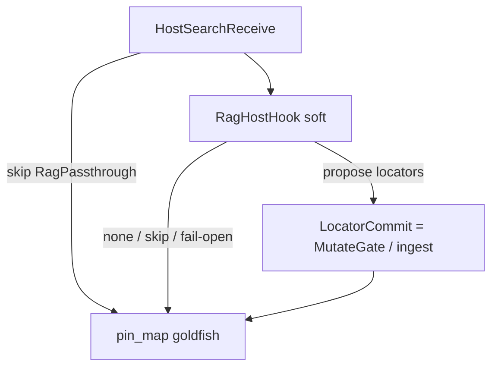

# Host search nest (design)

**Status:** design only — **not** shipped. No `rag_query` MCP; no embeddings in the engine.  
**Research:** [#77](https://github.com/chouswei/MemNet/issues/77) — graph retrieve-then-generate vs this nest. External contrast: [Adding RAG to your GraphQL API](https://neo4j.com/blog/graphql/rag-graphql-api/) (Neo4j / Cowley).  
**Audience:** product developers. Application walk: [`../../sysml-models/outputs/host-search-nest-case-study.md`](../../sysml-models/outputs/host-search-nest-case-study.md).  
**Isomorphism:** Path-B `ImportGuard` nest (`SessionImportReceive` → soft guard → hard `ImportAbsorb`).  
**Dialect:** GQL only ([`gql-wire-profile.md`](gql-wire-profile.md)).  
**British English.** ASCII ids.

MN-REQ-00: MemNet is working memory, **not** the search corpus. It sits *between* LLM pipelines and data searching. This file names the **host** side of that cut as a nest — same brace as ImportGuard / `AgentShapedRead` (parent has no single `implemented=true`; flags live on children).

## Decision

Host retrieval (Cursor index, docs MCP, vector store, EvidenceCentre librarian) **MAY** sit in an optional **`HostSearchBridge`** nest **outside** `MemNetSystem`. Soft children propose **locators**. Hard commit **reuses** shipped `MutateGate` / Path-B `PinMapIngest_*` (no second absorb engine). Skipping the nest is valid (goldfish `pin_map` + grep / LSP) — Path A analogue.

**MUST NOT** nest `HostSearchBridge` / EvidenceCentre / MissionDock under `MemNetSystem`. **MUST NOT** teach RAG as goldfish read or as a peer of `pin_map`.

## Nest (application; not product composite)

```text
HostSearchBridge                    // application pattern; MUST NOT nest under MemNetSystem
└── HostSearchReceive               // optional; skip = pin_map + host grep (Path A analogue)
    ├── RagHostHook   gateKind=soft     implemented=false
    │   ├── RagPassthrough              // skip is valid
    │   ├── HostRagAdapter              // env-gated; not shipped
    │   ├── SoftHitBudget               // max_hits / max_chars / timeout
    │   ├── SoftLocatorOnlyEmit         // path=/line=/qname= — not chunk bodies
    │   └── SoftDecisionEmit            // propose | none | skip
    └── LocatorCommit gateKind=hard     // REUSES MutateGate / PinMapIngest
                                        // (not a new engine; not ImportAbsorb)
```

Parent has **no** `implemented=true`. Soft leaves are design (`implemented=false`). `LocatorCommit` is not a new part in `MemNetSystem` — it is the existing mutate/ingest hard path.



## Soft vs hard (same grain as ImportGuard)

| Concern | Import nest (product, Path B) | Host search nest (application) |
|---------|-------------------------------|--------------------------------|
| Skip | Path A: re-`pin_map` only | Goldfish + grep / LSP; no RAG |
| Soft parent | `ImportGuard` | `RagHostHook` |
| Host plug-in | `ImportGuardHook` / `--no-guard` | `RagHostHook` / host `--no-rag` |
| Optional LLM / index | `CheapLlmImportGuard` (shipped, env-gated) | `HostRagAdapter` (**not** shipped) |
| Decision | `allow` / `trim` / `reject` + `keep_ids` | `propose` / `none` / `skip` + bounded hits |
| Hard | `ImportAbsorb` (new engine verb) | **Existing** `MutateGate` / `PinMapIngest_*` |
| SSOT after | Lead session graph | Same session graph; RAG text discarded |
| Fail-open | Transport → passthrough + `@WRN` | Same spirit; **MUST NOT** fail `pin_map` / `add` |

## Bounded I/O (hook contract)

**In:** `session_id` (capability; do not log), `anchor`, short question, optional locator scope from the current pin map, `max_hits`, timeout. Never the whole session or source artefact.

**Out:** closed `RagDecision` (`propose` | `none` | `skip`) plus `RagHit[]` of locators (`path=` / `line=` / `qname=` / `skill_id=` …), optional score, optional ≤120-char `claim`. **MUST NOT** emit chunk bodies as goldfish.

Then the host (or agent) writes GQL locators; ground ids for source pins (no client `NEW` on artefact nodes). Ephemeral `HIT` rows **MAY** use `NEW` with `recycle=delete_on_settle`. Next turn: `pin_map` only.

## Distinct from nearby nests

| Nest | Where | Job |
|------|--------|-----|
| `AgentShapedRead` | `MemNetSystem` / `SessionLifecycle` | `pin_map` (shipped) vs `BoundedMatchFind` (not shipped, #73) |
| `PinMapRoadmap` | `MemNetSystem` | Deterministic artefact → pins (structure, not similarity) |
| `ImportGuard` | `SessionImportReceive` (Path B) | Soft review of a **member slice** before absorb |
| `DurableBuffer` | `MemNetSystem` | Hydrate/flush behind sessions — not search |
| **`HostSearchBridge`** | **Application only** | Fuzzy find → locators; MemNet stays the buffer |

`BoundedMatchFind` is unanchored **graph** lookup (label/property/locator + `LIMIT`). Host RAG is **corpus** lookup. Do not merge them.

## MUST / MUST NOT

**MUST**

- Keep the nest **outside** `MemNetSystem` (same shelf as `CompanyAnalyticalSsot` / EvidenceCentre).
- Treat skip / passthrough as valid.
- Atomise hits to locators; verify with grep/LSP when the domain is code.
- Fail-open: timeout / parse / missing adapter → skip, not a failed goldfish turn.
- One graph writer: the adapter **MUST NOT** mutate the session.

**MUST NOT**

- Add `rag_query` (or equivalent) to `memnet-mcp`.
- Store embeddings or chunk text on NODE properties as the memory surface (MN-REQ-11.13).
- Teach RAG emit as shaped `pin_map`.
- Dual-write (vector index and MutateGate both “true”).
- Claim this nest shipped because ImportGuard or ingest shipped.

## Related

| Path | Role |
|------|------|
| [#77](https://github.com/chouswei/MemNet/issues/77) | Research issue (RAG beside MemNet) |
| [Neo4j: RAG on a GraphQL API](https://neo4j.com/blog/graphql/rag-graphql-api/) | External contrast — `generate` resolver *on* the query API (reject as MemNet goldfish) |
| [RAGFlow](https://github.com/infiniflow/ragflow) | External contrast — sibling MCP chunk retrieve; host adapter only ([#77 note 2](https://github.com/chouswei/MemNet/issues/77#issuecomment-5295531416)) |
| [`gql-wire-profile.md`](gql-wire-profile.md) | Agent wire; goldfish = `pin_map` |
| [`../application-notes/llm-software-development.md`](../application-notes/llm-software-development.md) | Cursor index vs MemNet locators |
| [`../../sysml-models/outputs/session-import-case-study.md`](../../sysml-models/outputs/session-import-case-study.md) | ImportGuard nest (product) |
| [`../../sysml-models/outputs/evidence-centre-case-study.md`](../../sysml-models/outputs/evidence-centre-case-study.md) | Librarian soft-gate (application) |
| [`../../sysml-models/outputs/host-search-nest-case-study.md`](../../sysml-models/outputs/host-search-nest-case-study.md) | This nest, evidence walk |
