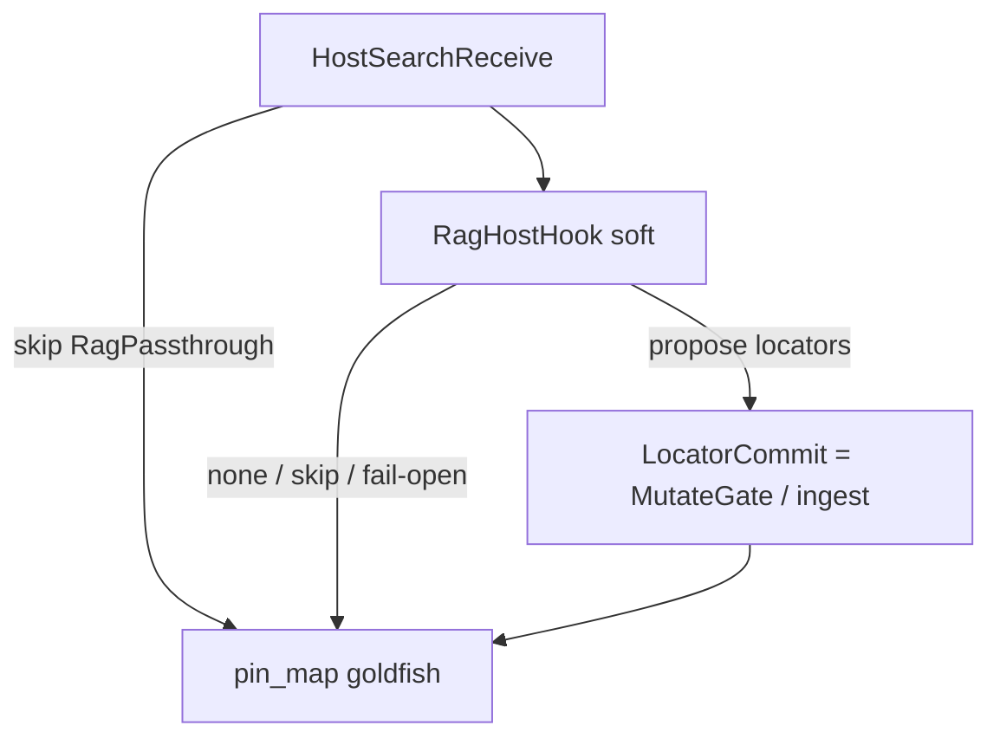

# Host search nest (design)

**Status:** design only — **not** shipped. No `rag_query` MCP; no embeddings in the engine.  
**Research:** [#77](https://github.com/chouswei/MemNet/issues/77) — graph retrieve-then-generate vs this nest. External contrast: [Adding RAG to your GraphQL API](https://neo4j.com/blog/graphql/rag-graphql-api/) (Neo4j / Cowley).  
**Audience:** product developers. Application walk: [`../../sysml-models/outputs/host-search-nest-case-study.md`](../../sysml-models/outputs/host-search-nest-case-study.md).  
**Isomorphism:** Path-B `ImportGuard` nest (`SessionImportReceive` → soft guard → hard `ImportAbsorb`).  
**Dialect:** GQL only ([`gql-wire-profile.md`](gql-wire-profile.md)).  
**British English.** ASCII ids.

MN-REQ-00: MemNet is working memory, **not** the search corpus. It sits *between* LLM pipelines and data searching. This file names the **host** side of that cut as a nest — same brace as ImportGuard / `AgentShapedRead` (parent has no single `implemented=true`; flags live on children).

## Problem statement (research)

Five questions for [#77](https://github.com/chouswei/MemNet/issues/77). This nest is the MemNet-side answer; RAG products answer a *different* problem (corpus → prompt).

### 1. What problem we want to solve

An LLM turn needs **two kinds of bounded context**, and they must not be fused:

| Need | Failure if missing |
|------|--------------------|
| **Mission working memory** | Ids, tasks, constraints, verified locators vanish when chat scrolls (goldfish). |
| **Corpus lookup** | The model invents, or the host dumps a manual / repo / feed into the prompt (tokens + hallucination). |

MN-REQ-00: save wall-clock and tokens **while keeping factual accuracy**. The product problem is: *get the agent from “I need a fact in a haystack” to “I have a copyable id on a pin map” without making MemNet the haystack.*

### 2. Root cause

Three jobs look alike (“put less text in the prompt”) but are different mechanisms:

| Job | Typical mechanism |
|-----|-------------------|
| Retrieve | Index / hybrid search / graph `where` → **hits** (chunks or nodes) |
| Generate | Hits + prompt → **prose** |
| Remember | Atomised NODE\|EDGE → **shaped `pin_map`** |

Root cause of the confusion: treating retrieve+generate (RAG) as memory, or memory as a search engine. Symptom: `rag_query` on `memnet-mcp`, chunk text on `note=`, `pin_map.generate(prompt)`, LangChain “memory” = MemNet session.

### 3. Where we meet it

| Locus | What happens |
|-------|----------------|
| Coding agents | Cursor index / grep vs `MOD`/`SYM` pins (`llm-software-development.md`) |
| Multitask | Workers re-`pin_map`; must not import a corpus dump (Path B ImportGuard) |
| Docs / SCPI / RSS | Selective pins vs swallowing the artefact (MN-REQ-11.13) |
| EvidenceCentre | Librarian soft-gate vs MutateGate (application, not product) |
| MCP surface | Pressure to add retrieve tools next to `pin_map` |
| Durable store | Temptation to put vectors in AgensGraph and teach LLM↔cabinet RAG |

### 4. What can solve it (mechanism)

**Split the pipeline; compose at the host.**

```text
corpus  --retrieve-->  hits (host: Cursor / RAGFlow MCP / Meilisearch / …)
hits    --atomise--->  locators (agent or host)
locators --MutateGate-->  session graph
graph   --pin_map--->  goldfish (MemNet)
```

MemNet mechanism = **HostSearchBridge** (optional): soft `RagHostHook` proposes locators; hard `LocatorCommit` **reuses** MutateGate / Path-B ingest; skip is valid.

Other mechanisms (research contrast — **not** MemNet core):

| Mechanism | Who | What it solves |
|-----------|-----|----------------|
| `generate` on GraphQL type | Neo4j post | Prose from retrieved **graph records** (LLM inside API) |
| Context engine + `ragflow_retrieval` | RAGFlow | Chunk retrieve as **sibling MCP** |
| Hybrid FTS+vector / LangChain | Meilisearch list | Pick a **retrieve hop** |

### 5. Principles

| Principle | Rule |
|-----------|------|
| **Two products** | Search corpus ≠ working memory (MN-REQ-00). |
| **Goldfish** | Primary read = bounded shaped `pin_map`, not hits and not chat. |
| **Write = display** | Same GQL family both ways (ADR-001). |
| **Pins not dumps** | Locators (`path=` / `qname=` / `document_id`); no chunk bodies (MN-REQ-11.13). |
| **Soft then hard** | Host hook optional / fail-open; MutateGate always owns the graph. |
| **Skip is valid** | Path A: grep / ingest / existing pins — no RAG. |
| **One writer** | Adapter MUST NOT mutate the session; no dual-write to a vector index. |
| **LLM outside retrieve** | Sibling tool (RAGFlow grain); reject `generate` *on* MemNet. |
| **Verify** | Grep/LSP/parser after locators (MN-REQ-10.7). |

### Role (pinned)

**MemNet is mission working memory** — a live session graph agents `pin_map` and mutate. It is **not** a RAG engine, **not** “the small one” in a tool beauty contest, and **not** too thin to be useful.

Pinned job (MN-REQ-00): sit **between** LLM call pipelines and data searching. Hold the working set for **a few technical documents** (structure, locators, distilled atoms — PDF/HTML stay on disk; see `llm-tech-docs-decomposition.md`) **plus** live `TSK`/`USR`/`MOD` facts, and re-read that set **fast** (in-process goldfish, depth ~2 / 50 rows).

Tens of MiB is the **fit for that job**, not a claim that the product is insignificant. RAG tools keep the library; MemNet keeps the open manuals-and-mission on the bench.

**We do face a RAG-shaped issue — inside the session, not over the world's corpus.** Once a few tec docs are atomised, the working set is already too big to dump into chat (hundreds of MiB / thousands of rows). The question is the same shape as RAG: *which slice is relevant this turn?* The mechanism is **not** another vector index. It is goldfish **`pin_map`** (anchor, depth, view, 50-row cap), walk, and leftover [#73](https://github.com/chouswei/MemNet/issues/73) bounded find. Host RAG still owns *finding the next document*; MemNet owns *slicing what is already on the bench*.

| Haystack | Owner | Retrieve mechanism |
|----------|--------|-------------------|
| Library / web / PDFs on disk | Host RAG, grep, ingest | Chunks / hybrid search / Path-B locators |
| Live session graph | **MemNet** | Ego neighbourhood `pin_map` (GQL shaped emit) |

| Axis | Pinned expectation | Not |
|------|--------------------|-----|
| Role | Working set for **a few tec docs** + mission graph; goldfish-fast | Corpus search, chunk/embed/chat UI |
| Product | Engine + generic MCP (`memnet-llm` / `memnet-mcp`) | Context engine / RAG platform |
| Runtime | In-process first; optional local serve | 16 GB Docker + ES + embedding models |
| Goldfish emit | Depth ~2, **50** rows — **fast enough** for a turn | Unbounded retrieve / chunk pages |
| Session store | Cap **5000** non-law rows (`MEMNET_MAX_ROWS`) | Millions of vectors |
| Semantic grain | Atoms for a handful of docs + task/constraint pins | The archive / full KB |
| **RAM (fit)** | Tens of MiB typical; **hundreds of MiB still in role** (order **10–500 MiB** session payload) | **GB-class** RAG index / embedding models in-process |
| Time | Session TTL / mission length | Permanent knowledge base |

CPython’s own RSS is already tens of MiB; the fit is **session payload**. Typical atomised missions sit in a **few MiB**. A fuller tec-doc working set (many `CMD`/`SEC` atoms) may reach **hundreds of MiB** — that is still MemNet. `MEMNET_MAX_ROWS` 5000 × `MEMNET_MAX_VALUE_BYTES` 4096 is the same order if fields are fat; **prefer** atomise (MN-REQ-02.2) and locator-only HostSearchBridge so turns stay goldfish-fast. Leave **gigabytes** to RAG/cabinet. A hard `MEMNET_MAX_SESSION_BYTES` meter is **not** shipped.

If a graph becomes the **library**, it has left this role (cabinet or RAG index — downstream).

## Decision

Host retrieval (Cursor index, docs MCP, vector store, EvidenceCentre librarian) **MAY** sit in an optional **`HostSearchBridge`** nest **outside** `MemNetSystem`. Soft children propose **locators**. Hard commit **reuses** shipped `MutateGate` / Path-B `PinMapIngest_*` (no second absorb engine). Skipping the nest is valid (goldfish `pin_map` + grep / LSP) — Path A analogue.

**MUST NOT** nest `HostSearchBridge` / EvidenceCentre / MissionDock under `MemNetSystem`. **MUST NOT** teach RAG as goldfish read or as a peer of `pin_map`.

## Nest (application; not product composite)

```text
HostSearchBridge                    // application pattern; MUST NOT nest under MemNetSystem
└── HostSearchReceive               // optional; skip = pin_map + host grep (Path A analogue)
    ├── RagHostHook   gateKind=soft     implemented=false
    │   ├── RagPassthrough              // skip is valid
    │   ├── HostRagAdapter              // env-gated; not shipped
    │   ├── SoftHitBudget               // max_hits / max_chars / timeout
    │   ├── SoftLocatorOnlyEmit         // path=/line=/qname= — not chunk bodies
    │   └── SoftDecisionEmit            // propose | none | skip
    └── LocatorCommit gateKind=hard     // REUSES MutateGate / PinMapIngest
                                        // (not a new engine; not ImportAbsorb)
```

Parent has **no** `implemented=true`. Soft leaves are design (`implemented=false`). `LocatorCommit` is not a new part in `MemNetSystem` — it is the existing mutate/ingest hard path.



## Soft vs hard (same grain as ImportGuard)

| Concern | Import nest (product, Path B) | Host search nest (application) |
|---------|-------------------------------|--------------------------------|
| Skip | Path A: re-`pin_map` only | Goldfish + grep / LSP; no RAG |
| Soft parent | `ImportGuard` | `RagHostHook` |
| Host plug-in | `ImportGuardHook` / `--no-guard` | `RagHostHook` / host `--no-rag` |
| Optional LLM / index | `CheapLlmImportGuard` (shipped, env-gated) | `HostRagAdapter` (**not** shipped) |
| Decision | `allow` / `trim` / `reject` + `keep_ids` | `propose` / `none` / `skip` + bounded hits |
| Hard | `ImportAbsorb` (new engine verb) | **Existing** `MutateGate` / `PinMapIngest_*` |
| SSOT after | Lead session graph | Same session graph; RAG text discarded |
| Fail-open | Transport → passthrough + `@WRN` | Same spirit; **MUST NOT** fail `pin_map` / `add` |

## Bounded I/O (hook contract)

**In:** `session_id` (capability; do not log), `anchor`, short question, optional locator scope from the current pin map, `max_hits`, timeout. Never the whole session or source artefact.

**Out:** closed `RagDecision` (`propose` | `none` | `skip`) plus `RagHit[]` of locators (`path=` / `line=` / `qname=` / `skill_id=` …), optional score, optional ≤120-char `claim`. **MUST NOT** emit chunk bodies as goldfish.

Then the host (or agent) writes GQL locators; ground ids for source pins (no client `NEW` on artefact nodes). Ephemeral `HIT` rows **MAY** use `NEW` with `recycle=delete_on_settle`. Next turn: `pin_map` only.

## Distinct from nearby nests

| Nest | Where | Job |
|------|--------|-----|
| `AgentShapedRead` | `MemNetSystem` / `SessionLifecycle` | `pin_map` (shipped) vs `BoundedMatchFind` (not shipped, #73) |
| `PinMapRoadmap` | `MemNetSystem` | Deterministic artefact → pins (structure, not similarity) |
| `ImportGuard` | `SessionImportReceive` (Path B) | Soft review of a **member slice** before absorb |
| `DurableBuffer` | `MemNetSystem` | Hydrate/flush behind sessions — not search |
| **`HostSearchBridge`** | **Application only** | Fuzzy find → locators; MemNet stays the buffer |

`BoundedMatchFind` is unanchored **graph** lookup (label/property/locator + `LIMIT`). Host RAG is **corpus** lookup. Do not merge them.

## MUST / MUST NOT

**MUST**

- Keep the nest **outside** `MemNetSystem` (same shelf as `CompanyAnalyticalSsot` / EvidenceCentre).
- Treat skip / passthrough as valid.
- Atomise hits to locators; verify with grep/LSP when the domain is code.
- Fail-open: timeout / parse / missing adapter → skip, not a failed goldfish turn.
- One graph writer: the adapter **MUST NOT** mutate the session.

**MUST NOT**

- Add `rag_query` (or equivalent) to `memnet-mcp`.
- Store embeddings or chunk text on NODE properties as the memory surface (MN-REQ-11.13).
- Teach RAG emit as shaped `pin_map`.
- Dual-write (vector index and MutateGate both “true”).
- Claim this nest shipped because ImportGuard or ingest shipped.

## Related

| Path | Role |
|------|------|
| [#77](https://github.com/chouswei/MemNet/issues/77) | Research issue (RAG beside MemNet) |
| [Neo4j: RAG on a GraphQL API](https://neo4j.com/blog/graphql/rag-graphql-api/) | External contrast — `generate` resolver *on* the query API (reject as MemNet goldfish) |
| [RAGFlow](https://github.com/infiniflow/ragflow) | External contrast — sibling MCP chunk retrieve; host adapter only ([#77 note 2](https://github.com/chouswei/MemNet/issues/77#issuecomment-5295531416)) |
| [Meilisearch: RAG tools 2026](https://www.meilisearch.com/blog/rag-tools) | External contrast — retrieve-hop shopping list, not MemNet ([#77 note 3](https://github.com/chouswei/MemNet/issues/77#issuecomment-5295584716)) |
| [`gql-wire-profile.md`](gql-wire-profile.md) | Agent wire; goldfish = `pin_map` |
| [`../application-notes/llm-software-development.md`](../application-notes/llm-software-development.md) | Cursor index vs MemNet locators |
| [`../../sysml-models/outputs/session-import-case-study.md`](../../sysml-models/outputs/session-import-case-study.md) | ImportGuard nest (product) |
| [`../../sysml-models/outputs/evidence-centre-case-study.md`](../../sysml-models/outputs/evidence-centre-case-study.md) | Librarian soft-gate (application) |
| [`../../sysml-models/outputs/host-search-nest-case-study.md`](../../sysml-models/outputs/host-search-nest-case-study.md) | This nest, evidence walk |
