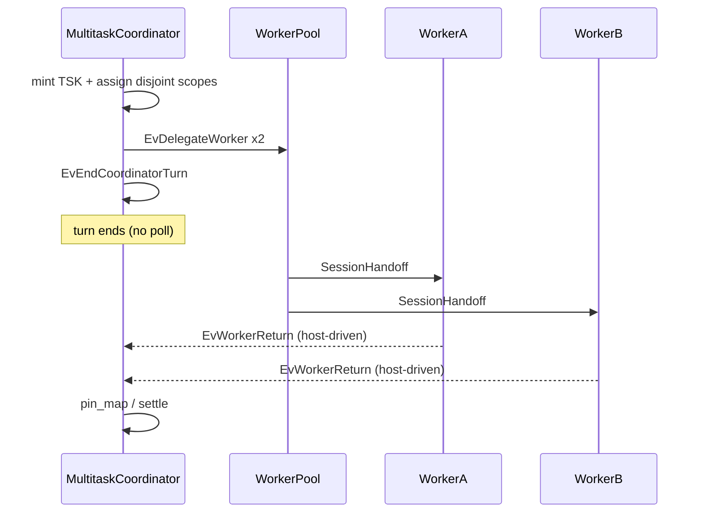

# Case study: asynchronous parallel Multitask (disjoint vs conflict)

**Shelf:** product canon

Evidence walk against SysML under `sysml-models/models/`.  
Companions: [multitask-case-study.md](multitask-case-study.md), [session-import-case-study.md](session-import-case-study.md).  
Doctrine: `docs/multi-agent-sessions.md`.

**Wire:** openCypher-shaped GQL + shaped `pin_map` only (ADR-001). No Layer / md_triple.

## 1. Model locus

| Concern | Model element |
|---------|----------------|
| Nest | `MultitaskOperatingModel` -> `MultitaskCoordinator` (`SessionHandoffEmit`, `AsyncTaskDispatch`, `SessionImportReceive`) + `WorkerPool` / `MultitaskWorker[1..*]` |
| Behaviour | `MultitaskMissionCycle`, `WorkerScopedTurn`, `EvDelegateWorker`, `EvEndCoordinatorTurn`, `EvWorkerReturn`, `EvOverlapScopeForbidden` |
| Items | `MissionTaskPin` (`TSK_*`), `WorkerWriteScope`, `SessionHandoff` |
| Requirements | MN-REQ-12.5, 12.6, 12.12 (also 12.3 / 12.4) |
| Verify | MN-VER-12-S13 (happy + anti); S05 / S06 / S07 |

**doctrineAsIs:** engine 0.4.x does **not** enforce `WorkerWriteScope` (last-write-wins if violated).

## 2. Happy path - two workers, disjoint anchors

**Premise:** Lead opens one mission session. Two independent subgraphs: inventory of behaviour states vs verify-case inventory. Parallel is allowed because scopes are **disjoint**.

### Actors

- `MultitaskCoordinator.dispatch` (`AsyncTaskDispatch`)
- `WorkerPool.members` - worker A and worker B
- Shared store (TCP / streamable-http) - MN-REQ-12.2

### Steps

| Step | Action | Event / state |
|------|--------|----------------|
| 1 | Open/load mission session | `EvOpenSession` / `EvLoadSnapshot` -> `parentPreparing` |
| 2 | Mint tasks | `EvMintParentTask` -> `TSK_async_behav`, `TSK_async_verify` |
| 3 | Assign scopes | `EvAssignWorkerScope` - A: `TSK_async_behav` ego; B: `TSK_async_verify` ego (disjoint) |
| 4 | Handoff + spawn | `EvHandoffSessionId` / `EvDelegateWorker` x2 |
| 5 | **End turn** | `EvEndCoordinatorTurn` - MUST NOT same-turn poll |
| 6 | Workers async | each `WorkerScopedTurn`: `pin_map` -> mutate under scope |
| 7 | Host revival | `EvWorkerReturn` x2 (async completion, not blocking await) |
| 8 | Lead re-pin | `EvPinMapRead` -> `parentReconciling`; settle from pins |

### Illustrative GQL pins (shared session)

```cypher
CREATE (t1:Task {id: 'TSK_async_behav', status: 'active'})
CREATE (t2:Task {id: 'TSK_async_verify', status: 'active'})
CREATE (a:Module {id: 'MOD_behaviour'})
CREATE (v:Module {id: 'MOD_verify'})
CREATE (t1)-[:SCOPED_TO]->(a)
CREATE (t2)-[:SCOPED_TO]->(v)
```

Worker A mutates only under `MOD_behaviour` / `TSK_async_behav`.  
Worker B mutates only under `MOD_verify` / `TSK_async_verify`.

**Separate-session variant:** parent assigns distinct session ids per worker; lead later uses `SessionImportReceive` -> `ImportGuard` -> `ImportAbsorb` (path B) instead of shared re-`pin_map`.



## 3. Anti-pattern - overlapping writers

**Premise:** Two workers both scoped to the same anchor `TSK_model_memnet` / `MOD_deploy` on **one** shared session.

| Gate | Doctrine |
|------|----------|
| MUST NOT | Parallel dual-write on overlapping `WorkerWriteScope` |
| Prefer | One worker, serial dispatch, or disjoint / separate sessions |
| Model signal | `EvOverlapScopeForbidden` from `parentPreparing` |
| If violated (0.4.x) | Last-write-wins; no ACL/reserve - **do not** claim engine blocks it |

### Contrast

| | Happy (disjoint) | Anti (overlap) |
|--|------------------|----------------|
| Anchors | Distinct egos | Same ego |
| Parallel | Allowed (12.5 / 12.12) | Forbidden without serialisation |
| Lead next turn | Clean receive via pin_map | Ambiguous / lost updates |
| Verify | S13 happy constraint | S13 anti narrative |

## 4. Checklist for agents

1. One mission session (or **explicit** separate sessions).
2. Mint `TSK_*`; assign `WorkerWriteScope`; emit `SessionHandoff`.
3. Spawn via `AsyncTaskDispatch`; **end the turn**.
4. Parallel only if disjoint anchors **or** separate session ids.
5. Next lead turn: `pin_map` first; optional import + ImportGuard; settle from pins not chat.

## 5. Related studies

| Study | Role |
|-------|------|
| [multitask-case-study.md](multitask-case-study.md) | Single-worker Multitask spine |
| [session-import-case-study.md](session-import-case-study.md) | Path B after separate sessions |
| [company-memory-case-study.md](company-memory-case-study.md) | `COM_*` analytical SSOT on SharedLlmMemory |
