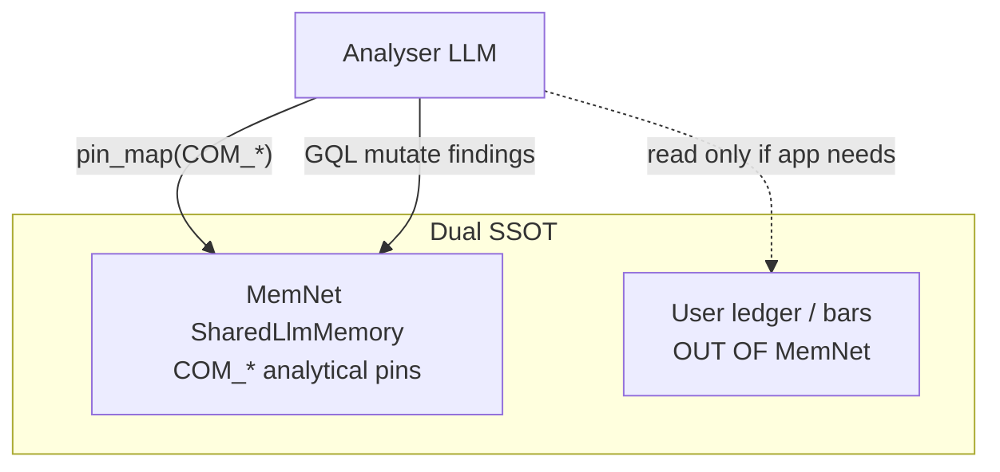

# Case study: Company analytical SSOT (SharedLlmMemory application)

Evidence walk for **application Role D** — MemNet as company analytical memory — against `sysml-models/models/`.  
Companion: [system-design-notes.md](system-design-notes.md), [session-import-case-study.md](session-import-case-study.md).  
**Wire:** GQL / shaped `pin_map` only (ADR-001). No Layer ASCII.

## 1. Roles (MemNet product vs application)

| Role | Meaning | In this product model |
|------|---------|------------------------|
| **A** Agent memory | Goldfish working set for LLM turns | `SharedLlmMemory` / `AgentMemory` / `GoldfishLoop` |
| **B** News / event graph | Atomised facts + relations | NODE\|EDGE via `GqlCodec` + `GraphStore` |
| **C** LLM context bag | Bounded turn payload | `PinMapShapedRead` / `LivePinMap` (MN-REQ-04) |
| **D** Company analytical SSOT | Ego on `COM_*`; analyse loop writes back | **Application pattern** `CompanyAnalyticalSsot` on SharedLlmMemory — not a forked product |

**Dual SSOT:** MemNet holds agent analytical pins. User ledger / OHLCV bars / broker fills stay **out of MemNet** (application ledger SSOT).

## 2. Model locus

| Concern | SysML |
|---------|-------|
| Product memory | `SharedLlmMemory`, `AgentMemory`, `SessionLifecycle`, `GraphStore` |
| Wire | `GqlCodec` (CIP/oC9 gated subset), `PinMapShapedRead` |
| Application item | `CompanyAnalyticalSsot` (`connections.sysml`) |
| Loop | `GoldfishLoop`: pin_map → mutate → settle |
| Caps | `CapsPolicy` / MN-REQ-04 / MN-REQ-05 |



## 3. Fake mission — TSMC ego

Session: `ses_company_2330` · Anchor: `COM_2330_TPE`

### Seed (GQL-shaped)

```text
CREATE (c:Com {id: 'COM_2330_TPE', name: 'TSMC', exchange: 'TPE'})
CREATE (n1:News {id: 'NEWS_capex_2026q1', headline: 'Capex guidance raised', published: '2026-01-15'})
CREATE (f1:Finding {id: 'FND_berk_moat', checklist: 'moat', note: 'Process leadership durable'})
CREATE (c)-[:mentioned_in]->(n1)
CREATE (c)-[:has_finding]->(f1)
CREATE (t:Tsk {id: 'TSK_analyse_2330', status: 'active'})-[:about]->(c)
```

### Analyse loop (goldfish)

| Step | Action | Model |
|------|--------|-------|
| 1 | `pin_map(anchor=COM_2330_TPE, depth=2)` | `EvPinMapRead` / `PinMapShapedRead` |
| 2 | Reason on shaped subgraph (not chat as SSOT) | Goldfish `presentingPinMap` |
| 3 | Write finding: e.g. checklist row | `EvMutateGraph` / `MutateGate` |
| 4 | Next turn re-pin_map — news/findings accumulate | MN-REQ-04 / 10.1 |

### Example write-back

```text
MATCH (c:Com {id: 'COM_2330_TPE'})
CREATE (f2:Finding {id: 'FND_berk_mgmt', checklist: 'management', note: 'Capex discipline consistent'})
CREATE (c)-[:has_finding]->(f2)
```

### Berkshire-style checklist (illustrative pins)

| Checklist theme | Example pin id | Note |
|-----------------|----------------|------|
| Moat | `FND_berk_moat` | Process leadership |
| Management | `FND_berk_mgmt` | Capex discipline |
| Margin of safety | *(analyser may leave absent)* | Not invented in chat — only if grounded |

## 4. Anti-patterns

| Anti-pattern | Why |
|--------------|-----|
| Dump OHLCV bars into MemNet as SSOT | Dual SSOT broken; ledger stays outside |
| Treat chat transcript as company memory | MN-REQ-10.1 / 12.1 spirit |
| Layer NODE\|EDGE ASCII teach | ADR-001 — GQL only |
| Unbounded MATCH/RETURN as goldfish | Use shaped pin_map |

## 5. Nest visibility

Company memory is **not** a second nest under `MemNetSystem`. It is SharedLlmMemory used as `CompanyAnalyticalSsot`. Multitask import nest remains separate (lead/member).

```text
MemNetSystem (SharedLlmMemory)
├── AgentMemory / SessionLifecycle     ← hosts COM_* sessions
└── MultitaskOperatingModel            ← import/handoff (other studies)
```

## 6. Validation note

Doctrine / pattern study. Prefer mcp-sysml-v2 on project load; this cloud run `serve_down`.
