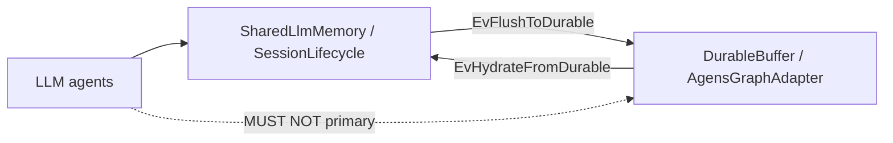

# Case study: durable hydrate / flush (M2.5 roadmap)

Evidence walk against SysML under `sysml-models/models/`.  
Companions: [company-memory-case-study.md](company-memory-case-study.md), [snapshot-passport-case-study.md](snapshot-passport-case-study.md).

**Wire:** GQL / shaped `pin_map` only. **Status:** roadmap M2.5 - **not claimed shipped**.

## 1. Purpose

Show how a mission or company ego **survives process death**: settled / durable pins flush into `DurableBuffer` / `AgensGraphAdapter`, then hydrate into a **new** live session under pin/depth/view budget. Session id remains the agent handoff handle; the LLM talks to **MemNet**, never to the store as primary.

## 2. Model locus

| Concern | Model element |
|---------|----------------|
| Parts | `DurableBuffer`, `AgensGraphAdapter`, `SessionLifecycle` hydrate/flush ports |
| Connections | `DurableHydrateFlow`, `DurableFlushFlow` |
| Behaviour | `DurableHydrateFlushRoadmap` (`EvHydrateFromDurable`, `EvFlushToDurable`) |
| Items | `DurableGraphStore` (connections), `MissionWorkingSet` / `SharedLlmMemory` |
| Requirement | MN-REQ-06.4 (`DurableStoreBehindMemNet`) |
| Contrast | `SnapshotStore` (session file save/load) - see [snapshot-passport-case-study.md](snapshot-passport-case-study.md) |

## 3. Scenario

**Title:** Company analytical ego outlives the MCP process

**Premise:** Role D pins (`COM_*`) and a settled mission task live in session `sess_mission_42`. The host process dies. A new process opens a **new** session and hydrates the durable ego under budget.

### Steps

| Step | Action | Model |
|------|--------|--------|
| 1 | Agents work via MemNet MCP / pin_map / mutate | `SharedLlmMemory` / `AgentMemory` |
| 2 | Settle durable facts; mark flush candidates | `HousekeepSettle` / settled `TSK_*` |
| 3 | Flush session subgraph -> durable store | `EvFlushToDurable` -> `flushing` |
| 4 | Process exit | live `GraphStore` gone |
| 5 | New process; open **new** session id | `EvOpenSession` (new handle) |
| 6 | Hydrate under pin/depth/view budget | `EvHydrateFromDurable` -> `hydrating` |
| 7 | Lead/worker handoff by **new** session id | `SessionHandoff` - not store credentials |

### Illustrative GQL (live session after hydrate)

```cypher
// Hydrated under budget - ego slice, not whole store dump
CREATE (c:Company {id: 'COM_acme', name: 'Acme'})
CREATE (t:Task {id: 'TSK_mission_q3', status: 'settled'})
CREATE (t)-[:ABOUT]->(c)
```

Agents continue with `pin_map(anchor='COM_acme', depth=2, max_rows=50)` on the **new** session. They do **not** open a direct AgensGraph client.



## 4. Gates

| MUST | MUST NOT |
|------|----------|
| MemNet sole agent-facing memory | LLM <-> DurableGraphStore as teach path |
| One sync owner for hydrate/flush | Dual-write without owner |
| Budget hydrate (pin/depth/view) | Unbounded whole-store load into context |
| Session id as handoff handle | Hand store connection strings in chat as SSOT |

## 5. As-is vs to-be

| | As-is 0.4.x | M2.5 target |
|--|-------------|-------------|
| Adapter | Not shipped (`implemented = false`) | `AgensGraphAdapter` |
| Behaviour | Modelled roadmap states only | Engine hydrate/flush |
| Satisfy | MN-REQ-06.4 on `DurableBuffer` | Same; claim shipped only when implemented |

## 6. Related

| Study | Distinction |
|-------|-------------|
| [snapshot-passport-case-study.md](snapshot-passport-case-study.md) | Named session **file** save/load (MN-REQ-01.4/01.5) |
| [company-memory-case-study.md](company-memory-case-study.md) | `COM_*` pattern that would flush/hydrate |
| [async-parallel-conflict-case-study.md](async-parallel-conflict-case-study.md) | Live Multitask; durable is orthogonal |
