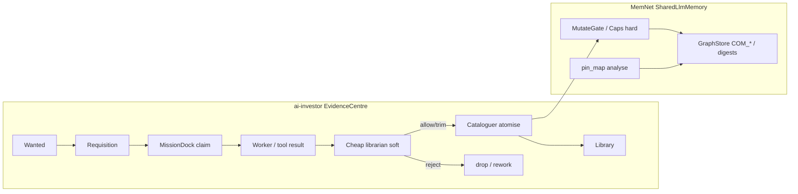

# Case study: Evidence Centre on SharedLlmMemory (ai-investor application)

**Shelf:** application example (on SharedLlmMemory)

Application architecture from **modelbasedPrj-ai-investor** using MemNet as the analytical working set — **not** a new MemNet product core.  
Companions: [company-memory-case-study.md](company-memory-case-study.md) (Role D ego), [session-import-case-study.md](session-import-case-study.md) (ImportGuard soft-gate spirit).  
**Wire:** GQL / shaped `pin_map` only (ADR-001). Do not teach Layer.

**Investor SSOT (external; read there — do not fork Layer wire here):**

| Path (ai-investor) | Role |
|--------------------|------|
| `sysml-models/outputs/system-design-report/25-evidence-centre-architecture.md` | EvidenceCentre nest (Library, Wanted, Requisition, DelayQueue, MissionDock) |
| `sysml-models/outputs/system-design-report/30-behaviour.md` | Librarian / cataloguer / mission-dock arcs |
| `docs/memnet-role.md` | Roles A–D; MemNet vs ledger dual SSOT |

## 1. Product vs application

| Layer | What it is | In MemNet product SysML |
|-------|------------|-------------------------|
| **MemNet product** | SharedLlmMemory buffer, GQL mutate, budgeted `pin_map`, Multitask handoff/import | `MemNetSystem` nest — **no** EvidenceCentre parts |
| **Evidence Centre** | ai-investor librarian / memory **application** around that buffer | Application pattern only (same shelf as `CompanyAnalyticalSsot`) |

Roles (from investor `memnet-role`; GQL teach here):

| Role | Meaning | MemNet locus |
|------|---------|--------------|
| **A** | Agent memory / goldfish working set | `SharedLlmMemory` / `GoldfishLoop` |
| **B** | News / event / evidence graph | NODE\|EDGE via `GqlCodec` + `GraphStore` |
| **C** | Bounded turn context | `PinMapShapedRead` |
| **D** | Company / instrument analytical SSOT | Ego e.g. `COM_*`; findings under that ego |

**Dual SSOT:** digests and findings land in MemNet. User ledger / OHLCV bars / broker fills stay **out**.

## 2. Application components (EvidenceCentre)

Illustrative application nest — **lives in ai-investor SysML**, not under `MemNetSystem`:

```text
EvidenceCentre                          // application
├── Library                             // catalogued evidence atoms
├── Wanted                              // open information needs
├── Requisition                         // fetch / fill requests against Wanted
├── DelayQueue                          // deferred / rate-limited work
└── MissionDock                         // claim → result → cataloguer → Library
```

| Application part | Soft vs hard | MemNet product parallel |
|------------------|--------------|-------------------------|
| Cheap LLM **librarian** | Soft gate (pass / trim / reject digest) | Spirit of `ImportGuard` — doctrine soft review |
| **Cataloguer** atomise | Writes GQL-shaped pins | Still goes through **`MutateGate`** / schema / caps (engine hard) |
| MissionDock claim/result | Application workflow | Session / `TSK_*` pins in SharedLlmMemory |
| Library store of digests | Analytical graph under ego | `GraphStore` content — not a second MemNet core |



## 3. Fake mission

**Title:** Fill Wanted gap on TSMC capex, dock a fetch, catalogue digest under `COM_2330_TPE`  
**Session:** `ses_evidence_2330` · **Ego:** `COM_2330_TPE`

### Seed (GQL — analytical pins only)

```cypher
CREATE (c:Com {id: 'COM_2330_TPE', name: 'TSMC', exchange: 'TPE'})
CREATE (w:Wanted {
  id: 'WNT_2330_capex_guide',
  need: 'Latest capex guidance figure',
  status: 'open'
})
CREATE (c)-[:has_wanted]->(w)
CREATE (req:Requisition {
  id: 'REQ_fetch_capex_2026q1',
  status: 'queued',
  source_hint: 'earnings_release'
})
CREATE (w)-[:filled_by]->(req)
CREATE (dock:MissionDock {id: 'DOCK_evidence_main', status: 'idle'})
CREATE (t:Tsk {id: 'TSK_fill_capex_wanted', status: 'active'})-[:about]->(w)
```

### Mission dock arc (application + MemNet)

| Step | Application | MemNet |
|------|-------------|--------|
| 1 | MissionDock **claim** `REQ_fetch_capex_2026q1` | Optional `TSK_*` / dock pin update via GQL |
| 2 | Worker/tool returns raw result (outside or beside MemNet) | Chat/raw blob is **not** SSOT |
| 3 | Cheap **librarian** soft-reviews digest (trim prose, check relevance) | Parallel to ImportGuard spirit — soft only |
| 4 | **Cataloguer** emits GQL atoms under `COM_2330_TPE` | **`MutateGate`** hard: schema, ids, caps |
| 5 | Wanted → closed; Library holds digest link | `pin_map(anchor=COM_2330_TPE)` for analyse |

### Cataloguer write (after soft allow) — hard gate

```cypher
MATCH (c:Com {id: 'COM_2330_TPE'})
MATCH (w:Wanted {id: 'WNT_2330_capex_guide'})
CREATE (d:Digest {
  id: 'DIG_capex_2026q1',
  kind: 'guidance',
  note: 'Capex guidance raised',
  published: '2026-01-15',
  locator: 'app://earnings/2026q1#capex'
})
CREATE (c)-[:has_digest]->(d)
CREATE (w)-[:satisfied_by]->(d)
SET w.status = 'closed'
```

### Analyse turn

```text
pin_map(anchor=COM_2330_TPE, depth=2)
```

Reason on shaped subgraph (digests, findings, open Wanted). Write checklist findings as in [company-memory-case-study.md](company-memory-case-study.md). Ledger bars stay out.

### DelayQueue sketch

```cypher
CREATE (q:DelayQueue {id: 'DQ_rate_news', status: 'armed'})
CREATE (req2:Requisition {id: 'REQ_sec_filing_later', status: 'delayed'})
CREATE (q)-[:holds]->(req2)
```

When due, dock claims again — still soft librarian then hard MutateGate on catalogue.

## 4. Soft librarian vs engine hard gates

| Gate | Who | Outcome |
|------|-----|---------|
| Cheap LLM librarian | Application EvidenceCentre | pass / trim / reject **before** catalogue |
| `MutateGate` + schema + `CapsPolicy` | MemNet product | Strict create/update; budgeted pin_map hide; NEW mint rules |
| ImportGuard (Multitask path B) | MemNet Multitask doctrine | Same **soft-then-hard** spirit for member WM — different nest |

EvidenceCentre librarian is **not** a shipped MemNet part and is **not** nested under `ImportGuard`. Generic host index / RAG is a **separate** application nest (`HostSearchBridge`) — locators into MutateGate, skip valid — [host-search-nest-case-study.md](host-search-nest-case-study.md).

## 5. Nest visibility (MUST)

```text
MemNetSystem (product)
├── AgentMemory / SessionLifecycle / MutateGate / PinMapShapedRead
└── MultitaskOperatingModel … ImportGuard …

// NOT in MemNet product nest:
// EvidenceCentre { Library, Wanted, Requisition, DelayQueue, MissionDock }
// → ai-investor application SysML; uses SharedLlmMemory as Role A–D buffer
```

## 6. Anti-patterns

| Anti-pattern | Why |
|--------------|-----|
| Add `EvidenceCentre` parts under `MemNetSystem` | Application ≠ product core |
| Treat librarian soft reject as engine enforcement | Soft only; MutateGate is hard |
| Dump earnings PDF / bar series into MemNet as SSOT | Dual SSOT; locators + distilled digests only |
| Catalogue via chat paste without GQL mutate | MN-REQ-10.1; Write=display |
| Teach Layer seeds from investor report as MemNet wire | ADR-001 — GQL only |

## 7. Related

| Study | Role |
|-------|------|
| [company-memory-case-study.md](company-memory-case-study.md) | Role D `COM_*` analyse loop |
| [session-import-case-study.md](session-import-case-study.md) | ImportGuard soft/hard split (canon) |
| [goldfish-chat-desync-case-study.md](goldfish-chat-desync-case-study.md) | Chat never library SSOT |

## 8. Validation note

Application-pattern study. Investor architecture remains SSOT in **modelbasedPrj-ai-investor**; this file is the MemNet-facing GQL evidence walk only. Prefer project SysML validate for MemNet product models — no EvidenceCentre verify leaf in MemNet.
