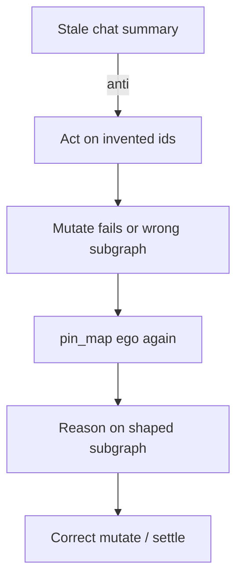

# Case study: goldfish chat desync — recover by re-pin

**Shelf:** product canon

Evidence walk reinforcing **Write = display** and **chat never SSOT** against `sysml-models/models/`.  
Companions: [sysml-modeling-goldfish-case-study.md](sysml-modeling-goldfish-case-study.md), [tcp-shared-multitask-case-study.md](tcp-shared-multitask-case-study.md), [tech-docs-scpi-case-study.md](tech-docs-scpi-case-study.md).

**Wire:** GQL / shaped `pin_map` only (ADR-001).

## 1. Purpose

Show a concrete failure mode: the agent **trusts a prior chat summary** over the live pin map, acts on stale ids/status, then **recovers** by re-`pin_map` and correcting from the shaped subgraph. Product story: chat is disposable narration; `SharedLlmMemory` is the working set.

## 2. Model locus

| Concern | SysML |
|---------|-------|
| Loop | `GoldfishLoop` — awaitingPinMap → presentingPinMap → mutate → settle |
| Read | `PinMapShapedRead` / `LivePinMap` / `ShapedSubgraph` |
| Write | `MutateGate` / `GqlCodec` |
| Session | `SessionLifecycle` — session id is the SSOT handle |
| Reqs | **MN-REQ-10.1** no chat as durable store; **MN-REQ-04** bounded pin map; MN-REQ-12.1 under Multitask |
| Anti event (doctrine) | Contrast `EvDumpGraphInChat` / `EvImportFromChat` (forbidden paths in handoff/import behaviours) |



## 3. Fake mission

**Title:** Settle a modelling task the chat claims is still active  
**Session:** `ses_goldfish_desync` · **True ego:** `TSK_model_memnet`

### Ground truth in MemNet (unknown to the desynced agent)

A prior turn already settled the turn task and recycled a scratch finding. Live graph (illustrative):

```cypher
(:Tsk {id: 'TSK_model_memnet', status: 'active'})
(:Tsk {id: 'TSK_turn_deploy_nest', status: 'settled', recycle: 'delete_on_settle'})
(:Mod {id: 'MOD_deploy', path: 'sysml-models/models/deploy.sysml'})
(:Tsk {id: 'TSK_model_memnet'})-[:TOUCHES]->(:Mod {id: 'MOD_deploy'})
```

### Desync (anti-path)

Chat still says: *"`TSK_turn_deploy_nest` is active; finding `FND_nest_ok` exists; touch `MOD_behaviour` next."*

Agent **skips** `pin_map` and mutates from chat:

```cypher
// ANTI — ids/status invented from chat
MATCH (t:Tsk {id: 'TSK_turn_deploy_nest'})
SET t.status = 'active'
MATCH (f:Finding {id: 'FND_nest_ok'})
CREATE (t)-[:has_finding]->(f)
```

Outcomes (strict mutate): update/create fails if absent; or writes contradict settled/recycle policy — agent now believes a fiction.

### Recovery (happy)

| Step | Action | Model |
|------|--------|-------|
| 1 | Stop treating chat as SSOT | MN-REQ-10.1 |
| 2 | `pin_map(anchor='TSK_model_memnet', depth=2)` | `EvPinMapRead` / `PinMapShapedRead` |
| 3 | Present shaped subgraph — note `TSK_turn_deploy_nest` settled; no `FND_nest_ok` | Goldfish presenting |
| 4 | Act only on live pins (e.g. touch `MOD_deploy` already true; mint **new** turn task if work continues) | `MutateWithNew` if needed |
| 5 | Optional: record a short finding that desync was corrected — still GQL, still bounded | Write = display |

Recovery mutate example:

```cypher
CREATE (t:Tsk {
  id: 'NEW',
  status: 'active',
  title: 'Continue deploy nest after desync recovery'
})
// … copy assigned id from response, then:
MATCH (parent:Tsk {id: 'TSK_model_memnet'})
MATCH (t:Tsk {id: 'TSK_turn_after_desync'})
MATCH (d:Mod {id: 'MOD_deploy'})
CREATE (parent)-[:spawned]->(t)
CREATE (t)-[:TOUCHES]->(d)
```

## 4. Anti-patterns (catalogue)

| Anti-pattern | Violates |
|--------------|----------|
| Skip `pin_map` because "chat already listed the ids" | MN-REQ-04 / GoldfishLoop entry |
| Dump whole graph into chat as the handoff | `SessionHandoffById`; MN-REQ-12.1 |
| Import member WM from chat paste | MN-REQ-12.10; use import nest or shared re-pin |
| After Multitask worker return, reconcile from worker prose only | Parent must re-`pin_map` ([tcp-shared-multitask-case-study.md](tcp-shared-multitask-case-study.md)) |
| Keep using Layer/TOON scratch when serve is up | ADR-001 — GQL pin_map |

## 5. Related

| Study | Role |
|-------|------|
| [sysml-modeling-goldfish-case-study.md](sysml-modeling-goldfish-case-study.md) | Correct loop when serve up/down |
| [snapshot-passport-case-study.md](snapshot-passport-case-study.md) | Cold-start without chat dump |
| [session-import-case-study.md](session-import-case-study.md) | Path B import — still not chat |

## 6. Validation note

Doctrine study for MN-REQ-10.1 / 04. No new verify leaf — reinforces existing GoldfishLoop and SharedLlmMemory framing in system-design-notes.
