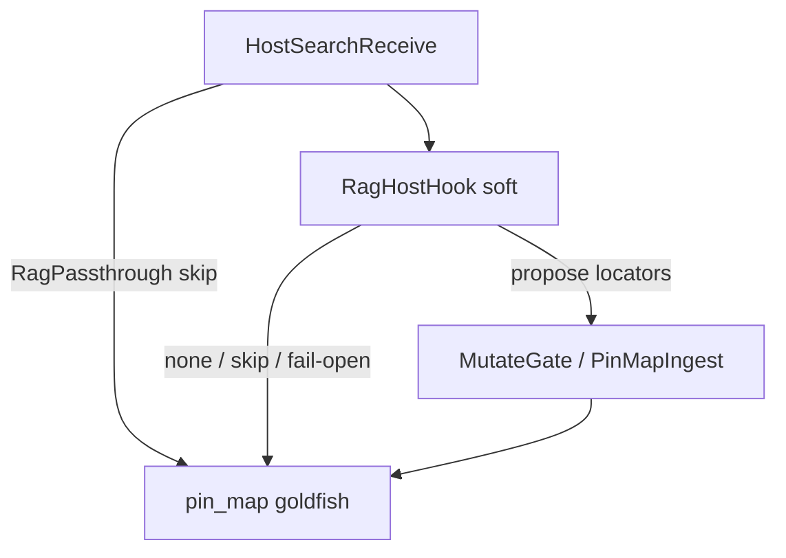

# Case study: Host search nest (ImportGuard-shaped, outside MemNetSystem)

**Shelf:** application example (on SharedLlmMemory)

Host corpus lookup (index / RAG / docs MCP) as an **optional nest**, isomorphic to Path-B `ImportGuard`, **not** a MemNet product tool.  
Companions: [session-import-case-study.md](session-import-case-study.md) (product ImportGuard), [evidence-centre-case-study.md](evidence-centre-case-study.md) (librarian soft-gate), [sysml-models/models/deploy.sysml](../models/deploy.sysml) (`HostSearchBridgePart`).  
**Wire:** GQL / shaped `pin_map` only (ADR-001). Design: [`docs/grammar/memnet-host-search-nest.md`](../../docs/grammar/memnet-host-search-nest.md).  
**Research:** [#77](https://github.com/chouswei/MemNet/issues/77). Contrast (do **not** copy as goldfish): [Adding RAG to your GraphQL API](https://neo4j.com/blog/graphql/rag-graphql-api/).

## 1. Metaphor (binding)

**Host search = the host looks up a corpus; MemNet only keeps locators the agent will re-`pin_map`.**

MN-REQ-00: MemNet is not the search corpus. The nest is the host side of that cut.

| Path | When | What |
|------|------|------|
| A (prefer) | Locators already on the pin map, or grep/LSP suffices | **Skip** `HostSearchReceive` — goldfish only |
| B | Need fuzzy find in docs/repo | Soft `RagHostHook` → hard `LocatorCommit` (**reuses** `MutateGate` / ingest) |

| Term | Meaning |
|------|---------|
| **`HostSearchBridge`** | Application nest root — **MUST NOT** sit under `MemNetSystem` |
| **`RagHostHook`** | Soft plug-in (`implemented=false`; design) |
| **`RagPassthrough`** | Skip is valid (`--no-rag` / no adapter) |
| **`HostRagAdapter`** | Optional host index — **not** `memnet-mcp` |
| **`LocatorCommit`** | Hard leaf that **reuses** MutateGate / `PinMapIngest_*` — not `ImportAbsorb` |

**Honesty:** this nest is **design only**. ImportGuard shipped ≠ host search shipped. Do not teach `rag_query` on `memnet-mcp`.

## 2. Nest (deploy — application section)

```text
HostSearchBridgePart                 // MUST NOT nest under MemNetSystem
└── HostSearchReceive                // optional; Path A = skip
    ├── RagHostHook    gateKind=soft     implemented=false
    │   ├── RagPassthrough               // skip is valid
    │   ├── HostRagAdapter               // env-gated host; not shipped
    │   ├── SoftHitBudget
    │   ├── SoftLocatorOnlyEmit          // path=/line=/qname= — not chunks
    │   └── SoftSearchDecisionEmit       // propose|none|skip
    └── LocatorCommit  gateKind=hard     // reuses MutateGate / PinMapIngest
```

Parent has no single `implemented=true` (same honesty as `ImportGuard` / `AgentShapedRead`).



| Concern | Model locus | Status |
|---------|-------------|--------|
| Skip entire nest | Path A analogue | Valid |
| Soft hook | `RagHostHook` | **design** (`implemented=false`) |
| Hard commit | `LocatorCommit.reusesMutateGate` | Wrapper design; MutateGate **shipped** under AgentMemory |
| Product ImportGuard | `SessionImportReceive` | Shipped Path B — **different nest** |

## 3. Fake mission

**Title:** Find `session_open` locators; pin them under `TSK_mcp_session`  
**Session:** `ses_host_search_demo` · **Anchor:** `TSK_mcp_session`

### Path A (skip nest)

Agent already has `MOD_server_py` from last turn. `pin_map(anchor=TSK_mcp_session)` → grep to verify line → edit. No RAG.

### Path B (soft propose → hard locators)

Host adapter returns (illustrative — not a shipped tool):

```text
RagDecision { outcome: 'propose'; reason: 'filename match session_open' }
RagHit { locator: 'path=parts/memnet-mcp/software/memnet_mcp/server.py line=59'; kind: 'SYM' }
```

Agent (or host) commits GQL — locators only:

```cypher
MERGE (m:MOD {id:'MOD_mcp_server', path:'parts/memnet-mcp/software/memnet_mcp/server.py'})
MERGE (s:SYM {id:'SYM_session_open', path:'parts/memnet-mcp/software/memnet_mcp/server.py', line:'59', signature:'async def session_open'})
MERGE (t:TSK {id:'TSK_mcp_session'})
CREATE (m)-[:defines {id:'NEW'}]->(s)
CREATE (t)-[:about {id:'NEW'}]->(s)
```

Then **`pin_map(anchor=TSK_mcp_session)`**. Chunk text from the adapter is discarded. Verify with grep before trusting `line=`.

Fail-open: adapter timeout → `RagDecision { outcome: 'skip' }` → same as Path A.

## 4. Counter-examples

| Fault | Why it fails |
|-------|----------------|
| Nest `HostSearchBridgePart` under `MemNetSystem` | MN-REQ-00 — search corpus is not MemNet |
| MCP `rag_query` on `memnet-mcp` | Tool SSOT is session / pin_map / mutate / ingest |
| Store chunk body on `note=` | MN-REQ-11.13 bulky corpus dump |
| Treat this nest as shipped because ImportGuard is | Honesty — `RagHostHook.implemented=false` |
| Merge with `BoundedMatchFind` (#73) | Graph lookup ≠ corpus lookup |
| Adapter writes the graph | Two writers; MutateGate is the hard owner |

## 5. Related

| Path | Role |
|------|------|
| [`docs/grammar/memnet-host-search-nest.md`](../../docs/grammar/memnet-host-search-nest.md) | Design SSOT |
| [session-import-case-study.md](session-import-case-study.md) | Product ImportGuard nest |
| [evidence-centre-case-study.md](evidence-centre-case-study.md) | Application librarian (not this nest under ImportGuard) |
| [`docs/application-notes/llm-software-development.md`](../../docs/application-notes/llm-software-development.md) | Cursor index vs MemNet locators |
