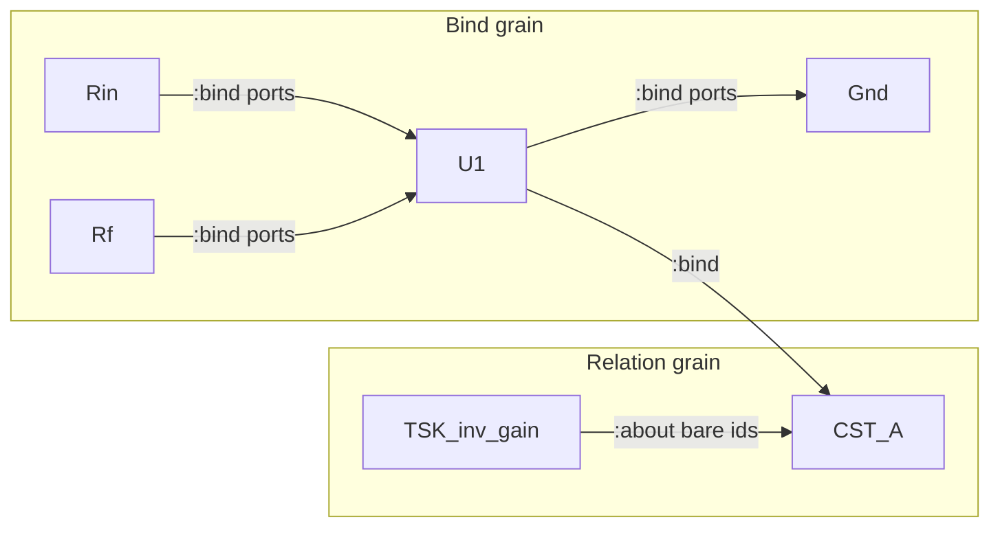

# Case study: inverting amplifier — bind vs relation (SysML evidence)

**Shelf:** application example (on SharedLlmMemory)

Evidence walk of the dual-EDGE topology against `sysml-models/models/`.  
Application wire sketch (same circuit): `docs/application-notes/examples/inverting-amplifier-gql-case-study.md`.  
Derivation (math): `docs/application-notes/examples/inverting-amplifier-memnet.md`.  
Companion: [system-design-notes.md](system-design-notes.md).

**Wire:** openCypher-shaped GQL + shaped `pin_map` only (ADR-001 / M2 `GqlCodec`). No Layer ASCII.

## 1. Purpose

Show a **concrete circuit mission** where agents stamp constitutive devices and copper as graph rows, then ego-read `CST_U1` via `PinMapShapedRead`. Trace dual-EDGE and law-on-node to SysML parts — MemNet stamps; it does **not** solve the network.

## 2. Model locus

| Concern | SysML element | As-is module |
|---------|---------------|--------------|
| Codec | `GqlCodec` | `gql_codec.py` (M2 shipped) |
| Mutate | `MutateGate` + `IdAllocator` | `mutate_gate.py` |
| Shaped read | `PinMapShapedRead` / `LivePinMap` | `pin_map_composer.py` |
| Store | `GraphStore` (dual EDGE; law-on-node) | `mem_store` / `graph_store` |
| Items | `BindRelationship`, `RelationRelationship`, `LawOnNode`, `PortIncidence` | `connections.sysml` |
| Loop | `GoldfishLoop` / `MutateWithNew` | `behaviour.sysml` |
| Reqs | MN-REQ-02 (NODE\|EDGE), MN-REQ-03 (strict mutate), MN-REQ-04 (pin map) | `requirements.sysml` |

```text
AgentMemory / SessionLifecycle
├── GraphStore          // CST_* + :bind / :about
├── GqlCodec
├── MutateGate → IdAllocator
└── PinMapShapedRead    // ego CST_U1
```

## 3. Fake mission

**Title:** Confirm closed-loop gain limit for a 10k/100k inverting amp  
**Session:** `ses_inv_amp_demo` · **Task:** `TSK_inv_gain` · **Ego:** `CST_U1`

Topology (same as app note):

```text
Vin -- Rin -- VMINUS ---- U1 ---- Vout
                |                  |
                +------- Rf -------+
(IN+) ---------- VGND
```

Worked values: \(R_\mathrm{in}=10\,\mathrm{k\Omega}\), \(R_f=100\,\mathrm{k\Omega}\), \(V_\mathrm{IN}=1\,\mathrm{V}\), \(a_s=10^6\).

### Dual EDGE (must keep separate)

| Grain | Relationship | Endpoints | Carries |
|-------|--------------|-----------|---------|
| **Bind** (copper / ideal pipe) | `:bind` | Port-qualified via `fromPort` / `toPort` | Continuity; optional `carries` |
| **Relation** (chart / mission) | e.g. `:about` | Bare node ids only | Semantic link |

**Law** lives on the **node** property `law` (`LawOnNode`) — never on a relationship.

### Seed mutate (illustrative GQL)

```cypher
CREATE (u1:CST {
  id: 'CST_U1', name: 'opamp', a_s: 1000000,
  ports: {
    inp: {direc: 'in', V: '@vp', I: '@ip'},
    inm: {direc: 'in', V: '@vm', I: '@im'},
    out: {direc: 'out', V: '@vo', I: '@io'}
  },
  law: '$@ip=0$,$@im=0$,$@vo=a_s*(@vp-@vm)$'
})
CREATE (rin:CST {
  id: 'CST_Rin', name: 'Rin', R: 10000,
  ports: {
    a: {direc: 'inout', V: '@va_r', I: '@ia_r'},
    b: {direc: 'inout', V: '@vb_r', I: '@ib_r'}
  },
  law: '$@va_r-@vb_r=@ia_r*R$,$@ia_r=-@ib_r$'
})
CREATE (rf:CST {
  id: 'CST_Rf', name: 'Rf', R: 100000,
  ports: {
    a: {direc: 'inout', V: '@va_f', I: '@ia_f'},
    b: {direc: 'inout', V: '@vb_f', I: '@ib_f'}
  },
  law: '$@va_f-@vb_f=@ia_f*R$,$@ia_f=-@ib_f$'
})
CREATE (gnd:CST {
  id: 'CST_Gnd', name: 'VGND',
  ports: {a: {direc: 'inout', V: '@vg', I: '@ig'}},
  law: '$@vg=0$'
})
CREATE (cl:CST {
  id: 'CST_A', name: 'closed_loop',
  A_s: -10.0, A_s_lim: -10.0,
  law: '$@vout_a=@vin_a*A_s$,$A_s_lim=-(Rf/Rin)$'
})

MATCH (rin:CST {id:'CST_Rin'}), (u1:CST {id:'CST_U1'})
CREATE (rin)-[:bind {id:'E_sum_r', fromPort:'b', toPort:'inm', carries:'I'}]->(u1)
MATCH (rf:CST {id:'CST_Rf'}), (u1:CST {id:'CST_U1'})
CREATE (rf)-[:bind {id:'E_sum_f', fromPort:'b', toPort:'inm', carries:'I'}]->(u1)
MATCH (u1:CST {id:'CST_U1'}), (rf:CST {id:'CST_Rf'})
CREATE (u1)-[:bind {id:'E_out_f', fromPort:'out', toPort:'a', carries:'I'}]->(rf)
MATCH (u1:CST {id:'CST_U1'}), (gnd:CST {id:'CST_Gnd'})
CREATE (u1)-[:bind {id:'E_inp', fromPort:'inp', toPort:'a', carries:'I'}]->(gnd)
MATCH (u1:CST {id:'CST_U1'}), (cl:CST {id:'CST_A'})
CREATE (u1)-[:bind {id:'E_A_out', fromPort:'out', toPort:'out'}]->(cl)

CREATE (tsk:Tsk {id:'TSK_inv_gain', status:'active', title:'Confirm A_s limit'})
MATCH (tsk:Tsk {id:'TSK_inv_gain'}), (cl:CST {id:'CST_A'})
CREATE (tsk)-[:about]->(cl)
```

### Goldfish turn

| Step | Action | Model |
|------|--------|-------|
| 1 | `pin_map(anchor='CST_U1', depth=2, view='shell')` | `PinMapShapedRead` / `EvPinMapRead` |
| 2 | Reason on shaped subgraph (ports + `:bind` neighbours + `CST_A`) | `GoldfishLoop.presentingPinMap` |
| 3 | Optionally mutate finding / settle `TSK_inv_gain` | `MutateGate` / `EvSettleRecycle` |

Illustrative shaped emit (ego-bounded — same family as mutate):

```cypher
(:CST {id:'CST_U1', name:'opamp', a_s:1000000, law:'$@ip=0$,$@im=0$,$@vo=a_s*(@vp-@vm)$'})
(:CST {id:'CST_Rin', name:'Rin', R:10000})
(:CST {id:'CST_Rf', name:'Rf', R:100000})
(:CST {id:'CST_Gnd', name:'VGND'})
(:CST {id:'CST_A', name:'closed_loop', A_s_lim:-10.0})
(:CST {id:'CST_U1'})-[:bind {id:'E_sum_r', fromPort:'b', toPort:'inm'}]->(:CST {id:'CST_Rin'})
(:CST {id:'CST_U1'})-[:bind {id:'E_sum_f', fromPort:'b', toPort:'inm'}]->(:CST {id:'CST_Rf'})
(:CST {id:'CST_U1'})-[:bind {id:'E_out_f', fromPort:'out', toPort:'a'}]->(:CST {id:'CST_Rf'})
(:CST {id:'CST_U1'})-[:bind {id:'E_inp', fromPort:'inp', toPort:'a'}]->(:CST {id:'CST_Gnd'})
(:CST {id:'CST_U1'})-[:bind {id:'E_A_out', fromPort:'out', toPort:'out'}]->(:CST {id:'CST_A'})
```



## 4. Anti-patterns

| Anti-pattern | Violates |
|--------------|----------|
| Put Ohm / KCL / gain on a `:bind` edge | `LawOnNode`; GraphStore law-on-node doctrine |
| Use bare-id `:about` where copper continuity is meant | `BindRelationship` / port incidence |
| Omit `fromPort`/`toPort` on `:bind` | `PortIncidence`; wire profile bind grain |
| Unbounded `MATCH … RETURN` as primary goldfish read | MN-REQ-04; `PinMapShapedRead` |
| Teach Layer / pipe dialect for this circuit | ADR-001 — GQL only |

## 5. Related

| Path | Role |
|------|------|
| `docs/application-notes/examples/inverting-amplifier-gql-case-study.md` | Application wire sketch |
| [new-mint-batch-case-study.md](new-mint-batch-case-study.md) | When seeding uses `id: 'NEW'` |
| [sysml-modeling-goldfish-case-study.md](sysml-modeling-goldfish-case-study.md) | Same goldfish shape on product SysML |
| [`docs/grammar/gql-wire-profile.md`](../../docs/grammar/gql-wire-profile.md) | Bind / law / pin_map SSOT |

## 6. Validation note

Doctrine / evidence study against nested deploy + connections items. Prefer project SysML validate; no new verify leaf required (MN-REQ-02/03/04 covered by existing engine satisfy).
