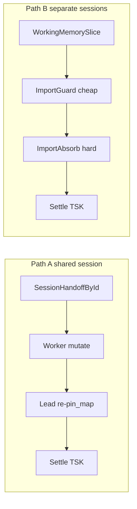

# Case study: Multitask Mode for a relevant modelling task

Evidence walk against the on-disk SysML under `sysml-models/models/`.  
Companion architecture summary: [system-design-notes.md](system-design-notes.md).  
Operational doctrine (developers): `docs/multi-agent-sessions.md`. Application adoption (`modelbasedPrj-*`): `docs/application-notes/llm-system-dev-multitask.md`. Index: `docs/README.md`.

**Wire:** GQL / shaped `pin_map` only (ADR-001). No Layer ASCII.  
**Related:** [session-import-case-study.md](session-import-case-study.md) (path B import), [async-parallel-conflict-case-study.md](async-parallel-conflict-case-study.md), [sysml-modeling-goldfish-case-study.md](sysml-modeling-goldfish-case-study.md), [prose-rpg-session-case-study.md](prose-rpg-session-case-study.md), [company-memory-case-study.md](company-memory-case-study.md).

## 1. Model examination (fitness)

### Purpose

MemNet SysML models the **target** software system: in-memory NODE|EDGE working-memory graph + generic MCP. Multitask Mode (`MN-REQ-12`) adds **agent-host operating doctrine** for parent/worker missions over a shared session — not a new Python package.

### Packages

| File | Package | Multitask-relevant content |
|------|---------|----------------------------|
| `models/requirements.sysml` | `MemNetRequirements` | `MN_REQ_12_*` (12.1–12.8) |
| `models/connections.sysml` | `MemNetConnections` | `MissionTaskPin`, `WorkerWriteScope`, `SessionId`, `LivePinMap` |
| `models/deploy.sysml` | `MemNet` | `MultitaskOperatingModel` + satisfy; `TcpServeBridge` / `ServeBridge` for 12.2 |
| `models/behaviour.sysml` | `MemNetBehaviour` | `ParentTaskLifecycle`, `WorkerScopedTurn`, `MultitaskMissionCycle` (+ engine `GoldfishLoop`) |
| `models/verify.sysml` | `MemNetVerification` | MN-VER-12-G00 + S01…S09 verify cases (case-study trace) |
| `models/root.sysml` | `ProjectMemNet` | Imports all of the above |

### How concepts appear

| Concern | Model locus | As-is vs to-be |
|---------|-------------|----------------|
| Session SSOT | MN-REQ-01 + MN-REQ-12.1; `SessionLifecycle` / `SessionId` | As-is: named sessions exist; Multitask **requires** one shared id |
| Live pin map | MN-REQ-04; `PinMapComposer`; `GoldfishLoop` / `WorkerScopedTurn` | As-is shipped |
| Transport | MN-REQ-06 (in-process primary); MN-REQ-12.2 elevates TCP/HTTP/IPC for Multitask | As-is TCP wired; LocalIpc stub |
| Parent / worker roles | `MultitaskCoordinator`, `MultitaskWorker` (`doctrineAsIs = true`) | As-is **doctrine**; not engine-enforced |
| Task (TSK_*) lifecycle | `MissionTaskPin` + `ParentTaskLifecycle` + MN-REQ-12.3 | Doctrine + graph rows; no ACL |
| Worker write scope | `WorkerWriteScope` + MN-REQ-12.4 / 12.5 | Doctrine; last-write-wins if violated |
| Relevance gate | MN-REQ-12.8; `EvTrivialSingleAgent` | Modelled; trivial → `GoldfishLoop` only |
| ACL / reserve / Path-B ingest | MN-REQ-12.7 forbids assuming shipped; MN-REQ-11 stubs | **To-be** / design docs |

### Verdict

**Fit for Multitask-on-relevant-tasks (as-is doctrine):** the model can mandate shared session, shared store, parent TSK settle, worker pin_map+scope, end-turn, and the relevance gate.  
**Not fit as engine-enforced security:** no ACL/reserve parts; workers rely on prompt discipline (`doctrineAsIs`).

---

## 2. Scenario

**Title:** Parent delegates SysML Multitask behaviour review to one background worker

**Premise:** A parent coordinator is updating MemNet SysML. Work is multi-step (inventory behaviour states, propose a pin-map of `TSK_model_memnet` facts, write findings into the shared session). Per **MN-REQ-12.8** this is a *relevant* task — not a trivial one-shot — so Multitask Mode applies.

**Actors (deploy):**

- `MultitaskCoordinator` — satisfies 12.1, 12.3, 12.5, 12.6, 12.7, 12.8  
- `MultitaskWorker` — satisfies 12.1, 12.4, 12.7, 12.8  
- `MultitaskSharedStoreBinding` + `TcpServeBridge` / `ServeBridge` — satisfy 12.2  

**Items:** `MissionTaskPin` (house `TSK_*`), `WorkerWriteScope` (anchors + relation types).

---

## 3. Step trace (model mandates)

| Step | What happens | Behaviour state / event | Requirement / part |
|------|----------------|-------------------------|--------------------|
| **1. Relevance** | Parent judges work multi-step + delegated → Multitask on; does **not** fire `EvTrivialSingleAgent` | `MultitaskMissionCycle.missionIdle` → open/load | **MN-REQ-12.8**; contrast: trivial stays on `GoldfishLoop` |
| **2. Shared store** | Parent and future worker bind MCP via TCP (`MEMNET_MCP_TRANSPORT=tcp`) or streamable-http — **not** isolated in-process | Mission enters `parentPreparing`; transport via `TcpServeBridge` / `ServeBridge` | **MN-REQ-12.2** (`MultitaskSharedStoreBinding`); single-agent MAY still use MN-REQ-06.1 |
| **3. Shared session + pin_map** | `session_open` / load one mission session; parent `pin_map` | `EvOpenSession` / `EvLoadSnapshot`; `EvPinMapRead` in `parentPreparing` | **MN-REQ-12.1**, **MN-REQ-04.1**; chat not SSOT (**MN-REQ-10.1** / 12.1) |
| **4. Mint parent task** | Parent creates `MissionTaskPin` e.g. `TSK_review_multitask_behaviour` (`status=active`) | `EvMintParentTask` → `ParentTaskLifecycle.taskMinted` | **MN-REQ-12.3**; item `MissionTaskPin` |
| **5. Assign scope + delegate** | Parent sets `WorkerWriteScope` (e.g. anchors `TSK_model_memnet`, `SYM_ParentTaskLifecycle`; write relations `about`/`owns`); spawns one worker; **ends turn** | `EvAssignWorkerScope` → `taskScoped`; `EvDelegateWorker` → `taskDelegated` / `workersDelegated` | **MN-REQ-12.4**, **12.5** (one worker), **12.6** (no poll) |
| **6. Worker turn** | Worker uses **same** session id; `pin_map` first; mutates only under scope (findings as NODE/EDGE); does **not** settle parent TSK | `WorkerScopedTurn`: `workerAwaitingPinMap` → `workerPresentingPinMap` → `workerApplyingScopedMutate` → `workerTurnDone`; `EvWorkerReturn` | **MN-REQ-12.4**; engine path reuses `GoldfishLoop` / `MutateWithNew` under shared store |
| **7. Parent reconcile** | Next parent turn: `pin_map` first; act from refreshed slice; **no** redo of worker investigation from chat | `workersDelegated` → `parentReconciling` via `EvPinMapRead` / `EvWorkerReturn`; `ParentTaskLifecycle.taskReconciling` | **MN-REQ-12.1**, **12.6** |
| **8. Settle** | Parent sets `TSK_*` `status=settled` (optional `led_to_success`) from session facts | `EvSettleMissionTask` → `taskSettled` / `missionComplete` | **MN-REQ-12.3**; worker MUST NOT settle unless explicitly delegated |

---

## 3b. Concrete GQL pins (shared-session path)

Session: `ses_mission_sysml` · Task: `TSK_review_multitask_behaviour`

```text
CREATE (t:Tsk {id: 'TSK_review_multitask_behaviour', status: 'active'})
CREATE (s:Sym {id: 'SYM_ParentTaskLifecycle', kind: 'state_def'})
CREATE (m:Mod {id: 'MOD_behaviour_sysml', path: 'sysml-models/models/behaviour.sysml'})
CREATE (t)-[:about]->(s)
CREATE (s)-[:defined_in]->(m)
```

Worker scoped mutate (same session — **no** import nest):

```text
MATCH (t:Tsk {id: 'TSK_review_multitask_behaviour'})
CREATE (f:Finding {id: 'FND_worker_states_ok', note: 'ParentTaskLifecycle arcs match MN-REQ-12.3'})
CREATE (t)-[:has_finding]->(f)
```

Parent next turn: `pin_map(anchor=TSK_review_multitask_behaviour)` then settle — chat never SSOT.

### Optional path B note

If the worker used a **separate** session, lead imports via nested `SessionImportReceive` → `ImportGuard` → `ImportAbsorb` ([session-import-case-study.md](session-import-case-study.md)). Default Multitask shared session **skips** import (path A re-pin_map).



---

## 4. Where the model is silent or design-intent only

| Topic | Status in model |
|-------|-----------------|
| Engine rejects worker writes outside `WorkerWriteScope` | **Silent** — doctrine (`doctrineAsIs`); 0.4.x last-write-wins (**MN-REQ-12.5** / **12.7**) |
| Session ACL / `RSV` neighbourhood reserve | **To-be** — forbidden to assume shipped (**MN-REQ-12.7**) |
| Path-B `PinMapIngest_*` for SysML snap | **Roadmap stubs** (MN-REQ-11); seed via `seed_lines` / explicit `add` |
| Formal SysML `verify` cases for MN-REQ-12 | **Present** — `MemNetVerification` MN-VER-12-G00 (group) + S01…S09 (see §7) |
| Streamable-http as a first-class part | **Doc-only** on 12.2 / `MultitaskSharedStoreBinding`; TCP parts are the wired stand-in |
| Parallel two-worker same-anchor serialisation protocol | **Silent** beyond SHALL NOT without serialisation (12.5) |

---

## 5. Anti-pattern counter-examples (same scenario)

| Anti-pattern | Violates |
|--------------|----------|
| Worker opens a private in-process session | MN-REQ-12.1, 12.2 |
| Parent polls worker mid-turn / redoes walk from chat | MN-REQ-12.6 |
| Worker settles `TSK_review_*` | MN-REQ-12.3 |
| Two workers mutate same anchor without disjoint scope | MN-REQ-12.5 |
| Treating ACL/`RSV` as available | MN-REQ-12.7 |

---

## 6. Validation note

`MemNetVerification` (`models/verify.sysml`) validated via Cursor SysML v2 MCP `validate` (`valid: true`; no syntax errors). Isolated single-file validation may warn on unresolved deploy imports and unsatisfied requirements — expected until full project load (`sysml-models/config.yaml`: connections → requirements → deploy → behaviour → verify → root).

---

## 7. Verify coverage (MN-REQ-12)

| Verify id | Case-study step | Verifies |
|-----------|-----------------|----------|
| MN-VER-12-G00 | Group (organisational parent) | **MN-REQ-12** (composite; leaves via deploy + behaviour) |
| MN-VER-12-S01 | 1 Relevance | MN-REQ-12.8 |
| MN-VER-12-S02 | 2 Shared store | MN-REQ-12.2 |
| MN-VER-12-S03 | 3 Session + pin_map | MN-REQ-12.1, MN-REQ-04.1 |
| MN-VER-12-S04 | 4 Mint TSK | MN-REQ-12.3 (mint) |
| MN-VER-12-S05 | 5 Scope + delegate + end turn | MN-REQ-12.4, 12.5, 12.6 |
| MN-VER-12-S06 | 6 Worker turn | MN-REQ-12.4 |
| MN-VER-12-S07 | 7 Parent reconcile | MN-REQ-12.1, 12.6 |
| MN-VER-12-S08 | 8 Settle | MN-REQ-12.3 (settle) |
| MN-VER-12-S09 | 12.7 gate | MN-REQ-12.7 (must not assume ACL/reserve/ingest shipped) |

Model locus: `models/verify.sysml` (`MemNetVerification`). Method: inspection / scenario against behaviour states and deploy doctrine parts — not runtime engine enforcement.

## 8. Recommended model follow-ups

1. Explicit item fields on `MissionTaskPin` / `WorkerWriteScope` (e.g. `status`, `anchorIds`) if the project wants typed attributes beyond doc.  
2. When LocalIpc ships, allocate `LocalIpcFlow` and satisfy 12.2 from `LocalIpcGateway`.  
3. Keep ACL/reserve in a future to-be package — do not fold into MN-REQ-12 as-is.
