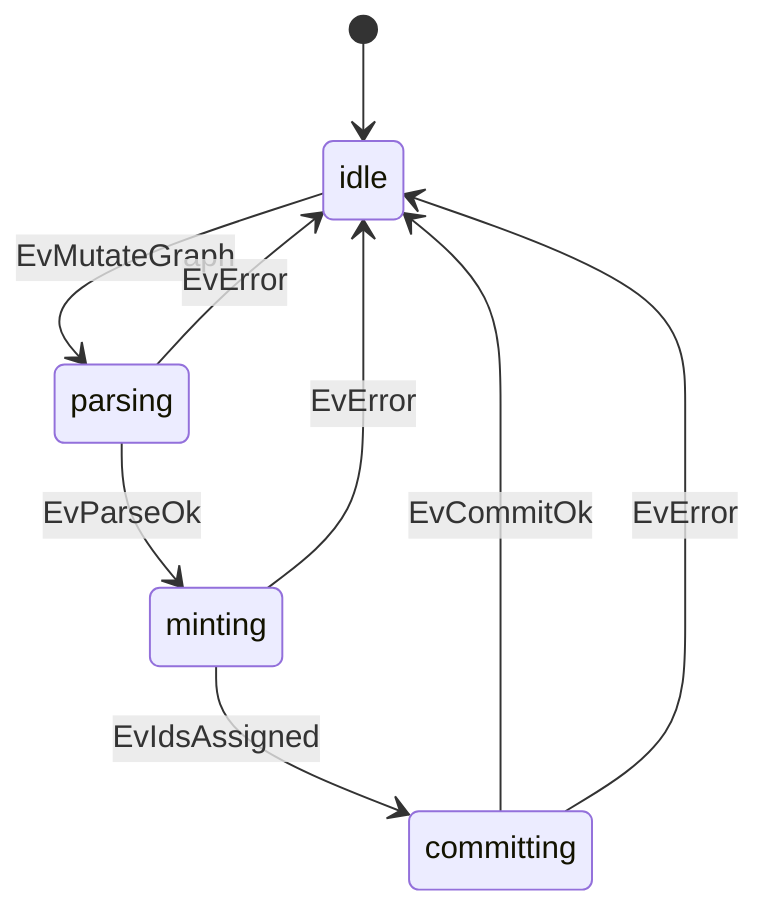

# Case study: leftover_NEW_mint batch (IdAllocator / MutateGate)

**Shelf:** product canon — **0.9 leftover invented store**, not TARGET GraphElement identity.

Evidence walk of leftover `NEW` mint against `sysml-models/models/` and wire profile §2.2.
Companion: [inverting-amp-bind-relation-case-study.md](inverting-amp-bind-relation-case-study.md), [sysml-modeling-goldfish-case-study.md](sysml-modeling-goldfish-case-study.md).
SSOT: [`docs/grammar/gql-wire-profile.md`](../../docs/grammar/gql-wire-profile.md) §2.2.

**Wire:** GQL only (M2 `GqlCodec`). Surface leftover mint token is the string **`NEW`** in nickname property `id`. TARGET create is `CREATE ()` / `CREATE (:Label {props})` with no mint law.

## 1. Purpose

Show a concrete goldfish batch that **creates nodes with `id: 'NEW'`**, reads assigned ids from the mutate response, then **creates relationships** to those ids. Contrast illegal `NEW` on update/settle and unordered "rels before nodes" failures.

## 2. Model locus

| Concern | SysML | As-is |
|---------|-------|-------|
| Orchestration | `MutateGate` | `mutate_gate.py` |
| Mint | `IdAllocator` (nested under MutateGate) | `id_allocator.py` |
| Behaviour | `MutateWithNew`: parsing → minting → committing | `behaviour.sysml` |
| Events | `EvMutateGraph`, `EvParseOk`, `EvIdsAssigned`, `EvCommitOk` | |
| Codec | `GqlCodec` | M2 shipped |
| Reqs | MN-REQ-03 strict mutate; MN-REQ-10.4 external ground truth | |
| Wire | gql-wire-profile **§2.2** | |



## 3. Fake mission

**Title:** Seed two finding nodes then link them under an active task  
**Session:** `ses_mint_demo` · **Known ground id:** `TSK_mint_demo` (already present)

### Policy (wire §2.2)

| Case | Leftover 0.9 as-is (not TARGET) |
|------|------|
| **Create (LLM goldfish)** | Client sets `id: 'NEW'`; engine leftover_by_id |
| **Update / settle** | `NEW` **illegal** — known nickname only |
| **External locators** (SysML paths, etc.) | leftover_allocate_from_locator — TARGET locators are properties |
| **Multiple `NEW` in one batch** | Distinct leftover ids; response lists **in order** |
| **Relationship ends** | Leftover known ids after mint; TARGET = type + end elements |

Prefer: **create nodes → response ids → create rels** when unsure.

### Batch A — mint nodes (ordered)

```cypher
CREATE (f1:Finding {id: 'NEW', note: 'First observation'})
CREATE (f2:Finding {id: 'NEW', note: 'Second observation'})
```

Illustrative mutate response (AssignedIdMap / ordered list):

```text
NEW -> FND_a1b2c3
NEW -> FND_d4e5f6
```

Agent **copies** these ids — does not invent `FND_*` in chat.

### Batch B — create rels with known ids

```cypher
MATCH (t:Tsk {id: 'TSK_mint_demo'})
MATCH (f1:Finding {id: 'FND_a1b2c3'})
MATCH (f2:Finding {id: 'FND_d4e5f6'})
CREATE (t)-[:has_finding]->(f1)
CREATE (t)-[:has_finding]->(f2)
CREATE (f1)-[:precedes]->(f2)
```

### Batch C — settle (no NEW)

```cypher
MATCH (t:Tsk {id: 'TSK_mint_demo'})
SET t.status = 'settled', t.recycle = 'delete_on_settle'
```

### Optional single-batch when engine resolves mint before rel commit

Some hosts accept one mutate where node `NEW` appears before rels **in the same ordered list** and mint runs before commit (`MutateWithNew.minting` → `committing`). Agents that are unsure MUST still split: nodes first, then rels after copying the id map.

```cypher
// Only if host documents same-batch mint-before-rel
CREATE (f:Finding {id: 'NEW', note: 'Same-batch observation'})
// … engine assigns id, then …
// MATCH + CREATE rel using assigned id from response — not client-guessed
```

## 4. Step trace

| Step | Action | Behaviour |
|------|--------|-----------|
| 1 | `pin_map(anchor=TSK_mint_demo)` | Ensure ground task exists |
| 2 | Mutate Batch A (`NEW` ×2) | `parsing` → `minting` → `committing` |
| 3 | Read ordered AssignedIdMap | Copy ids into next GQL |
| 4 | Mutate Batch B (rels) | Commit with ground ends only |
| 5 | Re-`pin_map`; settle Batch C | `NEW` absent |

## 5. Anti-patterns

| Anti-pattern | Why |
|--------------|-----|
| `SET n.id = 'NEW'` / settle with `id: 'NEW'` | §2.2 — NEW illegal on update/settle |
| Client-invented `NEW1` / `NEW_2` tokens | Surface spelling is exactly `NEW` |
| `CREATE (a)-[:about]->(b)` with both ends still `NEW` before mint response | Ends must be known ids |
| Guessing engine ids from chat after a failed parse | MN-REQ-10.1 / 10.4 — copy from response or pin_map |
| Using `NEW` for SysML file locators (`MOD_*` from path) | Deterministic ground ids — no LLM mint |

## 6. Related

| Path | Role |
|------|------|
| [`docs/grammar/gql-wire-profile.md`](../../docs/grammar/gql-wire-profile.md) §2.2 | Mint policy SSOT |
| [inverting-amp-bind-relation-case-study.md](inverting-amp-bind-relation-case-study.md) | Ground `CST_*` / `E_*` ids |
| [goldfish-chat-desync-case-study.md](goldfish-chat-desync-case-study.md) | Inventing ids from chat |
| [session-import-case-study.md](session-import-case-study.md) | Import absorbs **known** member ids |

## 7. Validation note

Behaviour inspection of `MutateWithNew` + deploy `IdAllocator` / `MutateGate`. No new MN-VER-12 leaf — mint is MN-REQ-03 / 10.4 engine path, not Multitask doctrine.
