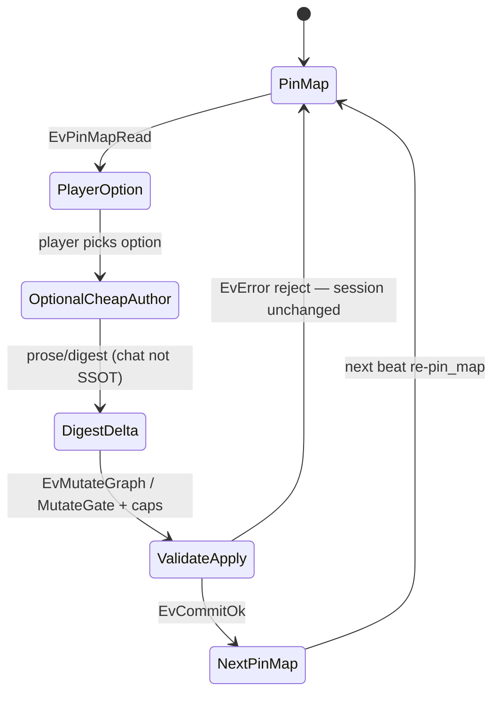

# Case study: Prose RPG beat on SharedLlmMemory (novel-cut patterns)

Evidence walk translating **novel-cut** goldfish / beat-pipeline patterns onto MemNet product SysML.  
**MUST NOT** revive md_triple / Layer / novel-writer dialect. Agent wire = **GQL + shaped pin_map** only (ADR-001).  
Companion: [system-design-notes.md](system-design-notes.md), [session-import-case-study.md](session-import-case-study.md), [company-memory-case-study.md](company-memory-case-study.md).

## 1. Patterns stolen (not dialect)

| Novel-cut pattern | MemNet angle | Model locus |
|-------------------|--------------|-------------|
| Honour Now / Cast / Present each beat | Every turn `pin_map` before mutate; session SSOT | `GoldfishLoop`, MN-REQ-04 / 10.1 |
| Prose before settle | Chat never SSOT; durable facts only after grounded mutate | MN-REQ-10.1; settle from pins |
| Cheap author + hard gate | Optional cheap assist → engine schema/caps validate → apply | Soft: optional cheap LLM; hard: `MutateGate` / `CapsPolicy` / schema |
| Specs-first modules | Application prompt packs sit **on** SharedLlmMemory | App pattern — not a second product |
| Beat pipeline | option → (prose) → digest → delta → validate → apply → re-pin_map | Worked scenario below |

**ImportGuard analogy:** optional story-lead import of a side-thread session uses the same cheap soft gate as Multitask path B (`ImportGuard` before `ImportAbsorb`). Default single-player beat does **not** need import.

## 2. Nest / product (no second MemNet)

```text
MemNetSystem (SharedLlmMemory)
└── AgentMemory / SessionLifecycle / GqlCodec / MutateGate / PinMapShapedRead / CapsPolicy
```

Application RPG session = one named MemNet session. Prompt packs live outside the engine.

## 3. Fake mission — one beat

Session: `ses_rpg_demo` · Task: `TSK_beat_harbour_choice`

### Seed pins (GQL-shaped; illustrative labels)

```text
CREATE (plr:Plr {id: 'PLR_hero', name: 'Ash'})
CREATE (loc:Loc {id: 'LOC_harbour', name: 'Mist Harbour'})
CREATE (qkr:Qkr {id: 'QKR_smuggler', name: 'Old Len', disposition: 'wary'})
CREATE (now:Beat {id: 'BEAT_now', summary: 'Ash faces Len at the pier'})
CREATE (plr)-[:at]->(loc)
CREATE (qkr)-[:at]->(loc)
CREATE (t:Tsk {id: 'TSK_beat_harbour_choice', status: 'active'})-[:about]->(now)
```

### Beat pipeline



| Step | What happens | Model |
|------|----------------|-------|
| 1 | `pin_map(anchor=BEAT_now, depth=2)` — honour Now/Cast/Present | `GoldfishLoop.awaitingPinMap` → `presentingPinMap` |
| 2 | Player option (e.g. bribe Len) — prose may draft in chat | Chat **not** durable |
| 3 | Optional cheap author proposes delta | Soft assist only |
| 4 | Engine validate: schema + caps + strict add/update | `MutateWithNew` / `CapsPolicy` / MN-REQ-03 / 05 |
| 5 | Apply GQL mutate | `MutateGate` → `GraphStore` |
| 6 | Next beat: re-`pin_map` — no honour from chat memory | MN-REQ-04 / 10.1 |

### Example apply (after validate)

```text
MATCH (plr:Plr {id: 'PLR_hero'}), (qkr:Qkr {id: 'QKR_smuggler'})
CREATE (e:Evt {id: 'EVT_bribe_offered', summary: 'Ash offers coin at the pier'})
CREATE (plr)-[:did]->(e)
CREATE (e)-[:involves]->(qkr)
SET qkr.disposition = 'curious'
```

### Reject example (hard gate)

```text
// Oversized batch or unknown label → MutateGate / CapsPolicy @ERR
// Session graph unchanged; chat draft discarded as SSOT
```

## 4. Optional: story lead imports side thread

If a side session `ses_rpg_side` authored a subplot, lead imports a bounded `WorkingMemorySlice` via nested `SessionImportReceive` → `ImportGuard` → `ImportAbsorb` (see [session-import-case-study.md](session-import-case-study.md)). Default goldfish beat skips import.

## 5. Anti-patterns

| Anti-pattern | Violates |
|--------------|----------|
| Patch graph from uncommitted chat prose | MN-REQ-10.1 |
| Teach md_triple / Layer as agent wire | ADR-001 |
| Skip pin_map between beats | MN-REQ-04 / goldfish |
| Cheap author bypasses schema/caps | MN-REQ-02.7 / 05 / 03 |

## 6. Traceability

| Element | Role |
|---------|------|
| `SharedLlmMemory` / `AgentMemory` | Product host |
| `GoldfishLoop` | Beat honour loop |
| `GqlCodec` / `MutateGate` / `PinMapShapedRead` | Wire + mutate + read |
| `CapsPolicy` | Hard resource gate |
| `ImportGuard` (optional) | Cheap soft gate on cross-session import |

## 7. Validation note

Pattern study. Prefer mcp-sysml-v2 on full project load; this cloud run `serve_down`. Novel-cut repo was not readable via `gh` here — patterns taken from user brief only.
