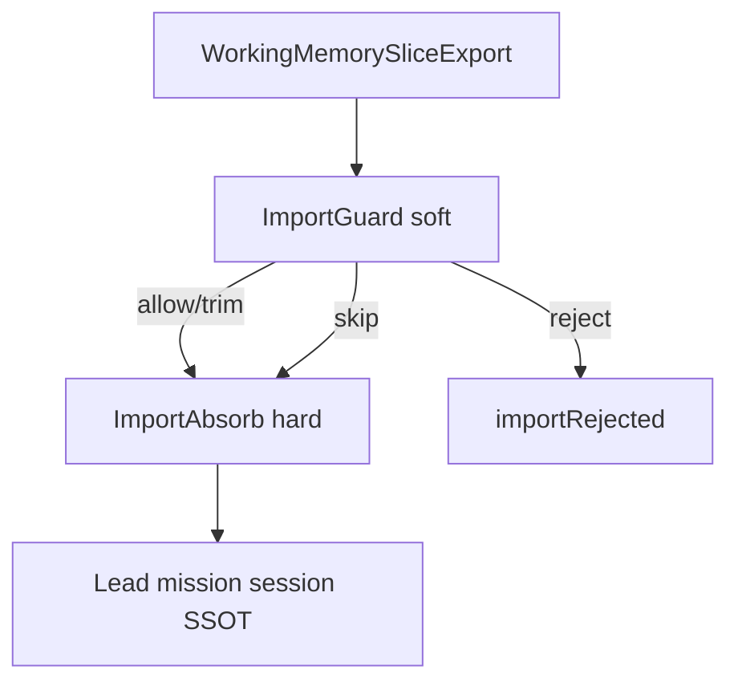

# Case study: Session import - lead imports member working memory

**Shelf:** product canon

Evidence walk against `sysml-models/models/`.  
Companion: [system-design-notes.md](system-design-notes.md), [multitask-case-study.md](multitask-case-study.md).

## 1. Metaphor (binding)

**Session import = team lead imports a team member's working memory.**  
Product types: `SessionImport*` only (no `SessionMerge*`).

| Role | MemNet locus |
|------|----------------|
| Lead (mission SSOT) | `MultitaskCoordinator` + mission session = `MissionWorkingSet` |
| Member | `MultitaskWorker` + nested `WorkingMemorySliceExport` |
| Import | Durable graph pins into lead session - **not** chat/transcript |

| Path | When | What |
|------|------|------|
| A (prefer) | Shared mission `sessionId` | Lead `pin_map` only — **no** import nest |
| B | Separate sessions | Bounded slice → optional **ImportGuard** (soft) → **ImportAbsorb** (hard) + `id_policy` |

**Disambiguation (once):**

| Term | Meaning |
|------|---------|
| Product **import** | `SessionImportReceive` / `SessionImportRequest` |
| `id_policy=keep` | MERGE-by-id upsert into lead SSOT (not append / not a second copy) |
| `id_policy=reject` | `id_conflict` — no lead mutate |
| `id_policy=remint` | NEW ids for conflicts; lead old rows stay; edges retarget |
| Micro `merge=true` | In-session node re-id — not macro path B |

## 2. Nest (deploy)

```text
MultitaskOperatingModel
├── MultitaskCoordinator
│   └── SessionImportReceive                    // path B only
│       ├── ImportGuard          gateKind=soft  // LLM MAY / host hook
│       │   ├── SoftScopeFitReview
│       │   ├── SoftJunkTrim                    // subtractive keep_ids
│       │   ├── SoftInventedIdReview
│       │   ├── SoftSizeNoiseReview
│       │   ├── SoftIdPolicyAdvice              // keep vs remint judgment
│       │   ├── SoftDecisionEmit                // allow|trim|reject
│       │   └── GuardPassthrough                // when skipped
│       └── ImportAbsorb         gateKind=hard  // engine SHALL
│           ├── DistinctSessionGate
│           ├── LawVocabExclude                 // LAW/vocab never import
│           ├── AclConsultAbsorb
│           ├── SchemaValidateImport
│           ├── IdPolicyApply
│           │   ├── IdPolicyKeep | Reject | Remint
│           ├── NodesThenEdgesCommit
│           └── GuardDecisionAtomRecord         // optional structured atom
├── WorkerPool
│   └── MultitaskWorker[1..*]
│       └── WorkingMemorySliceExport            // hard: anchors, budget, LAW skip
└── MultitaskSharedStoreBinding
```

Module cite: `memnet.import_absorb` (`export_working_memory_slice` / `absorb_working_memory_slice` / `import_slice` / `set_import_guard`).

| Concern | Model locus | Req |
|---------|-------------|-----|
| Path A pin_map only | `pathASharedRepin` — nest skipped | **12.9** |
| Path B hard absorb | `ImportAbsorb` + id policy leaves | **12.9** |
| No chat / whole-store | `WorkingMemorySliceExport` + 12.10 | **12.10** |
| Soft guard | `ImportGuard` soft leaves | **12.11** |



**Engine SHALL:** schema, ACL, slice budget, anchors required, LAW exclude, id_policy, nodes-then-edges.  
**LLM MAY:** choose anchors, trim junk (subtractive), advise keep vs remint via guard hook.  
**Never:** chat as SSOT; append/second copy; N-server federation (#47).

## 3. Fake mission

Lead session: `ses_mission_amp` - Task: `TSK_mission_amp_inventory`  
Member pins (GQL-shaped):

```text
CREATE (n:Mod {id: 'MOD_amp_note', path: 'docs/application-notes/examples/inverting-amplifier-gql-case-study.md'})
CREATE (s:Sym {id: 'SYM_Rin', kind: 'resistor', refdes: 'Rin'})
CREATE (s2:Sym {id: 'SYM_Rf', kind: 'resistor', refdes: 'Rf'})
CREATE (n)-[:mentions]->(s)
CREATE (n)-[:mentions]->(s2)
CREATE (t:Tsk {id: 'TSK_mission_amp_inventory'})-[:about]->(n)
```

---

## 4. Scenario A - Shared session (no import nest)

Lead and member already share `ses_mission_amp` via `SessionHandoffById`.

| Step | What happens | Locus | Req |
|------|----------------|-------|-----|
| A1 | Lead mints TSK; handoff session id + scope | `SessionHandoffById` | 12.1, 12.3, 01.7 |
| A2 | Member pin_map + scoped mutate | `WorkerScopedTurn` | 12.4 |
| A3 | Lead **receives** by `EvSharedSessionRepin` / `pin_map` | `pathASharedRepin` — nest skipped | **12.9 path A** |
| A4 | Lead settles TSK from session | `EvSettleMissionTask` | 12.3 |

**Verdict A:** Shared session — no `WorkingMemorySlice`, no `ImportGuard`, no `ImportAbsorb`.

---

## 5. Scenario B - Separate sessions -> import at settle

Member session `ses_member_amp`; lead `ses_mission_amp`.

| Step | What happens | Locus | Req |
|------|----------------|-------|-----|
| B1 | Lead `SessionImportRequest` (`id_policy` keep\|reject\|remint) | `EvRequestSessionImport` | **12.9** |
| B2 | `WorkingMemorySliceExport` (anchors, budget, LAW skip) | `EvExportWorkingMemorySlice` → `guard.sliceIn` | **12.10** |
| B3 | **ImportGuard** soft (or `EvGuardSkip`) | `pathBGuarding` | **12.11** |
| B4 | **ImportAbsorb** hard leaves + id policy | `pathBImporting` | **12.9** |
| B5 | Lead settles TSK | `pathBSettling` | 12.3 |

### ImportGuard examples (soft only)

**Pass (allow):**

```text
ImportGuardDecision { outcome: allow; reason: 'slice under MOD_amp_note scope; ids from pin_map' }
```

**Trim (subtractive):**

```text
ImportGuardDecision { outcome: trim; reason: 'drop off-mission SYM_scratch_*'; keepIds: 'MOD_amp_note,SYM_Rin,SYM_Rf,...' }
// ImportAbsorb imports reduced slice only; decision atoms — not guard chat as SSOT
```

**Reject:**

```text
ImportGuardDecision { outcome: reject; reason: 'invented ids not on member pin_map; refuse import' }
// -> importRejected; lead session unchanged
```

### Id policy (engine hard after allow/trim/skip)

| Policy | Effect |
|--------|--------|
| `keep` | MERGE-by-id upsert into lead SSOT |
| `reject` | `id_conflict` — no mutate |
| `remint` | NEW ids; lead old rows stay; edges retarget |

Hard gates ImportGuard MUST NOT replace: schema, ACL, slice budget, anchors, LAW exclude, id_policy.

---

## 6. Anti-patterns

| Anti-pattern | Violates |
|--------------|----------|
| Chat/transcript as import payload | 12.10 (`EvImportFromChat`) |
| Whole-store dump as slice | 12.10 / 01.8 |
| Member settles `TSK_mission_*` | 12.3 / 12.9 |
| Treat guard chat as SSOT | 12.11 |
| Confuse `keep` / micro `merge=true` with product **import** | Scope error |
| Product type named SessionMerge* | Naming — use SessionImport* |
| Path A → ImportGuard "audit" leak | Path A never enters import nest |
| N-server federation pipe | Out of scope (#47) |

## 7. Verify

| Verify | Scenario | Req |
|--------|----------|-----|
| MN-VER-12-S10 | A shared (`pin_map` only) | 12.9 path A, 12.1 |
| MN-VER-12-S11 | B ImportAbsorb + id policy leaves | 12.9, 12.10 |
| MN-VER-12-S12 | ImportGuard soft nest | 12.11 |

## 8. Validation note

**mcp-sysml-v2:** prefer Cursor SysML v2 MCP `validate` on full `config.yaml` when present. This run: brace-balance review. Nest aligns with `memnet.import_absorb` on PR #55 (`cursor/import-absorb-guard-8e84`); master `implemented=false` until that lands. CapsPolicy ACL cut shipped when session ACL is enabled (`engineAclShipped=true`).
