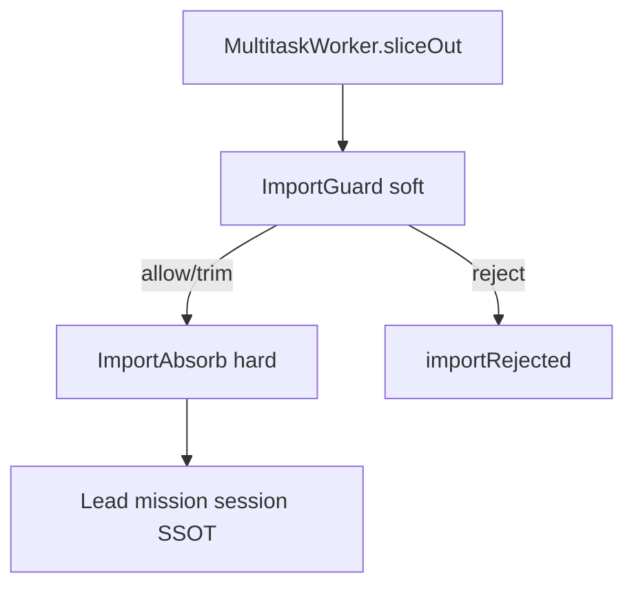

# Case study: Session import - lead receives member working memory

Evidence walk against `sysml-models/models/`.  
Companion: [system-design-notes.md](system-design-notes.md), [multitask-case-study.md](multitask-case-study.md).

## 1. Metaphor (binding)

**Colloquial "session merge" = a team lead receives the working memory of a team member** (`SessionMergeFraming`). Product verbs: **receive** / **import**.

| Role | MemNet locus |
|------|----------------|
| Lead (mission SSOT) | `MultitaskCoordinator` + mission session = `MissionWorkingSet` |
| Member | `MultitaskWorker` session **or** scoped slice (`WorkingMemorySlice`) |
| Receive | Durable graph pins into lead session - **not** chat/transcript |

| Path | When | What "receive" means |
|------|------|----------------------|
| A (prefer) | Already one shared Multitask session | Lead re-`pin_map` - **no** second store, import nest skipped |
| B | Separate sessions | Settle-time fold: bounded slice -> ImportGuard -> ImportAbsorb + id policy |

**Not this behaviour:** Cypher `MERGE` (upsert-by-id mechanics); micro in-session id re-id (`merge=true` security design). Macro = session-union receive; micro = in-session node re-id.

## 2. Nest (deploy)

```text
MultitaskOperatingModel
├── MultitaskCoordinator                 // team lead
│   └── SessionImportReceive             // path B; SessionMergeFraming
│       ├── ImportGuard                  // cheap LLM soft review
│       └── ImportAbsorb                 // hard gates + settle-time fold
├── WorkerPool
│   └── MultitaskWorker[1..*]            // handoff in + slice export
└── MultitaskSharedStoreBinding
```

| Concern | Model locus |
|---------|-------------|
| Shared LLM memory | `SharedLlmMemory` / `AgentMemory` |
| Handoff by session id | `SessionHandoff`, `SessionHandoffById`; MN-REQ-01.7 / 01.8 / 12.1 |
| Session merge framing | `SessionMergeFraming` item; behaviour `SessionImportReceive` |
| Import receive | Guard -> Absorb; MN-REQ-12.9 / 12.10 / 12.11 |
| Cheap LLM seat | `coordinator.importReceive.guard` (`costTier="cheap"`) |
| When import skipped | Path A shared session - re-`pin_map` only |



**Librarian analogy:** ImportGuard = cheap evidence librarian (soft yes/no/trim) before catalog/absorb; engine schema/caps/id policy remain hard gates.


## 3. Fake mission

Lead session: `ses_mission_amp` · Task: `TSK_mission_amp_inventory`  
Member pins (GQL-shaped):

```text
CREATE (n:Mod {id: 'MOD_amp_note', path: 'docs/application-notes/examples/inverting-amplifier-gql-case-study.md'})
CREATE (s:Sym {id: 'SYM_Rin', kind: 'resistor', refdes: 'Rin'})
CREATE (s2:Sym {id: 'SYM_Rf', kind: 'resistor', refdes: 'Rf'})
CREATE (n)-[:mentions]->(s)
CREATE (n)-[:mentions]->(s2)
CREATE (t:Tsk {id: 'TSK_mission_amp_inventory'})-[:about]->(n)
```

---

## 4. Scenario A - Shared session (no import)

Lead and member already share `ses_mission_amp` via `SessionHandoffById`.

| Step | What happens | Locus | Req |
|------|----------------|-------|-----|
| A1 | Lead mints TSK; handoff session id + scope | `SessionHandoffById` | 12.1, 12.3, 01.7 |
| A2 | Member pin_map + scoped mutate | `WorkerScopedTurn` | 12.4 |
| A3 | Lead **receives** by `EvSharedSessionRepin` / re-`pin_map` | `pathASharedRepin` - **import nest skipped** | **12.9 path A** |
| A4 | Lead settles TSK from session | `EvSettleMissionTask` | 12.3 |

**Verdict A:** Prefer shared session - no `WorkingMemorySlice`, no `ImportGuard`.

---

## 5. Scenario B - Separate sessions -> receive at settle

Member session `ses_member_amp`; lead `ses_mission_amp`.

| Step | What happens | Locus | Req |
|------|----------------|-------|-----|
| B1 | Lead `SessionImportRequest` | `EvRequestSessionImport` | **12.9** |
| B2 | Member exports bounded `WorkingMemorySlice` | `EvExportWorkingMemorySlice` -> `guard.sliceIn` | 12.10 |
| B3 | **ImportGuard** soft review | `pathBGuarding` | **12.11** |
| B4 | **ImportAbsorb** settle-time fold (after allow/trim): owner-gated id policy, nodes then edges | `pathBImporting` / `EvImportWorkingMemorySlice` | 12.9 |
| B5 | Lead settles TSK | `pathBSettling` | 12.3 |

### Guard examples

**Pass (allow):**

```text
ImportGuardDecision { outcome: allow; reason: 'slice under MOD_amp_note scope; ids from pin_map' }
```

**Trim:**

```text
ImportGuardDecision { outcome: trim; reason: 'drop off-mission SYM_scratch_* settle noise' }
// ImportAbsorb imports reduced slice only; decision atoms recorded - not guard chat as SSOT
```

**Reject:**

```text
ImportGuardDecision { outcome: reject; reason: 'invented ids not on member pin_map; refuse import' }
// -> importRejected; lead session unchanged
```

Hard gates (schema/caps/id conflict/owner) still apply after allow/trim.

---

## 6. Anti-patterns

| Anti-pattern | Violates |
|--------------|----------|
| Chat/transcript as received memory | 12.10 (`EvImportFromChat`) |
| Whole-store dump as slice | 12.10 / 01.8 |
| Member settles `TSK_mission_*` | 12.3 / 12.9 |
| Treat guard chat as SSOT | 12.11 |
| Confuse Cypher MERGE / micro `merge=true` with macro session receive | Scope error (SessionMergeFraming) |

## 7. Verify

| Verify | Scenario | Req |
|--------|----------|-----|
| MN-VER-12-S10 | A shared (no import) | 12.9 path A, 12.1 |
| MN-VER-12-S11 | B separate import | 12.9, 12.10 |
| MN-VER-12-S12 | ImportGuard nest | 12.11 |

## 8. Validation note

Prefer mcp-sysml-v2 on full `config.yaml` load. This cloud run: MemNet/mcp-sysml-v2 unavailable (`serve_down`); brace-balance review only.
