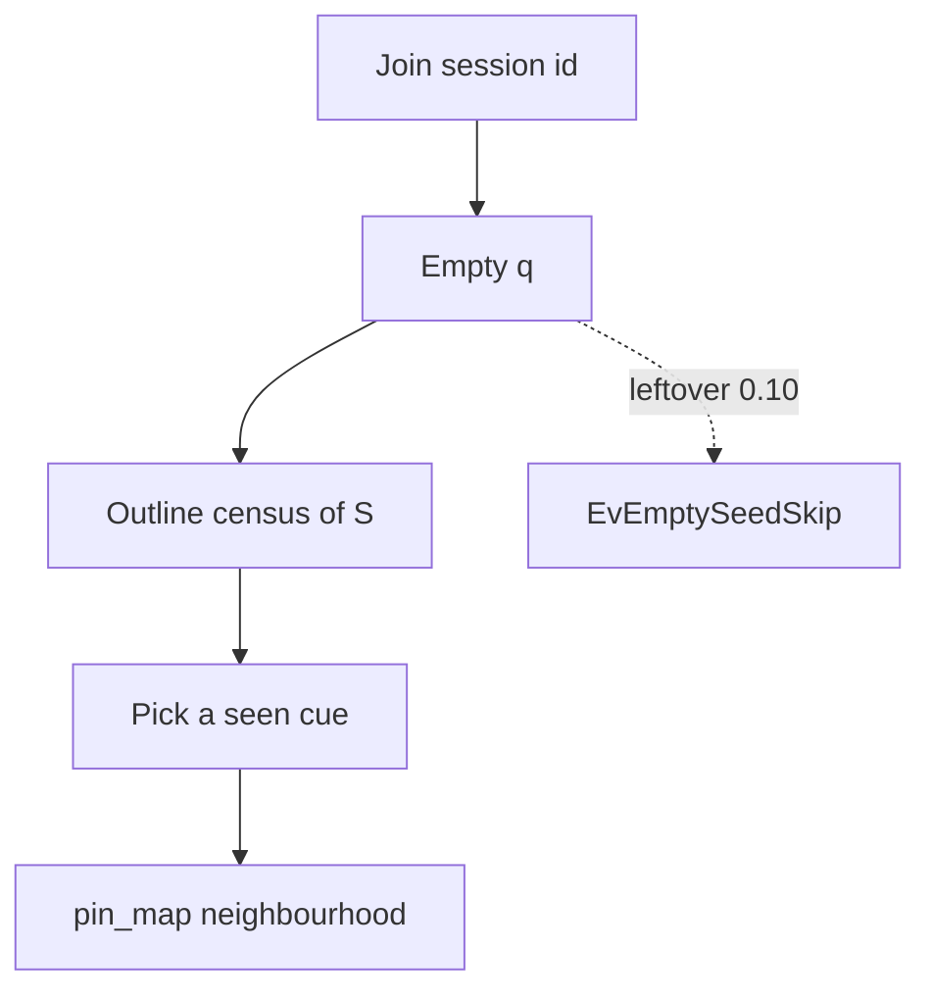

# Case study: empty-cue session outline (Recall census of S)

**Shelf:** product canon — **0.11** (engine emits outline; SysML nest `#118` remains `SessionOutline.implemented=false`). leftover 0.10 empty-seed skip is leftover, not TARGET.

Evidence walk of a dark session that needs an **outline**, not a neighbourhood and not a skip, against `sysml-models/models/`.
Companions: [goldfish-chat-desync-case-study.md](goldfish-chat-desync-case-study.md), [sysml-modeling-goldfish-case-study.md](sysml-modeling-goldfish-case-study.md).
SSOT: MN-REQ-04.9 / `SessionOutline` / `GoldfishLoop` outlining.

**Wire:** GQL only. Teach name = **outline**. Still one **Recall** operator.

## 1. Purpose

Show a worker who joins a handed **session id** with no leftover ego: empty q is Recall of S — a census of kinds that exist plus a few **real** nodes of each, with their **actual** labels and properties, under **one hard LIMIT**. Then the agent picks one seen cue and `pin_map`s.

## 2. Model locus

| Concern | SysML |
|---------|-------|
| Operator | `Recall` / `SessionOutline` (not a third operator) |
| Leftover skip | `leftover_empty_seed_skip` / `EvEmptySeedSkip` (`productCommand=false`) |
| Behaviour | `GoldfishLoop`: `EvEmptyCue` → outlining → `EvSessionOutline` |
| Neighbourhood (after cue) | `RelativeSeed` → `ShapeWalk` / `PinMapShapedRead` |
| Grain, not outline | `view=shell` on an already-seeded walk |
| Reqs | MN-REQ-04.9; MN-REQ-04.7; MN-REQ-13.1; MN-REQ-04.8 CueConflict |
| Verify | MN-VER-04-S03 |

## 3. Fake mission

**Title:** Dark session after handoff — outline, then pin one task  
**Session:** `ses_outline_demo` (handed; join this id; do not MATCH a node as seed)

### Ground truth in S (unknown to the arriving agent)

Kinds present: `TSK`, `MOD`, `SYM`. A few real nodes: `TSK_model_memnet` `{status: open}`, `MOD_deploy` `{path: models/deploy.sysml}`, `SYM_Recall` `{name: Recall}`.

### TARGET outline emit (Browser-shaped)

- Catalog of kinds that exist (`db.labels` / AGE `ag_label` style).
- LIMIT exemplars per kind with **actual** labels and properties.
- No edges dumped. No leftover `--anchor`. No invented store key. No `elementId` on the wire.

### After outline

Agent cues `TSK` / `status=open` (a seen pattern) and `pin_map`s. If two exemplars share a name cue, **CueConflict** (two roots stay two). SHALL NOT absorb on the outline.

## 4. Contrast (MUST NOT)

| Not this | Why |
|----------|-----|
| leftover empty-seed skip | 0.10 leftover; `productCommand=false` |
| Neighbourhood / ShapeWalk first | Outline is not a seeded walk |
| `view=shell` | Grain on an already-seeded walk |
| MATCH-all / dump S / dump edges | One hard LIMIT census |
| `getAllPages` / Pattern C tour / Pattern D seeded RAG | Cousin pointing; do not invert MemNetSystem |
| RAG / HostSearch | Outside `MemNetSystem` |
| SameThingAbsorb this cut | 0.12; `implemented=false` |
| Layer | Do not revive |
| Live Neo4j claim | Extra **0.14** (`liveNeo4jClaimed=true`); not this outline cut |

## 5. Honesty

Python engine emits empty-q outline (untagged 0.11; package stays 0.9.0). SysML nest remains `SessionOutline.implemented=false` until a nest sync. leftover skip is leftover only.
