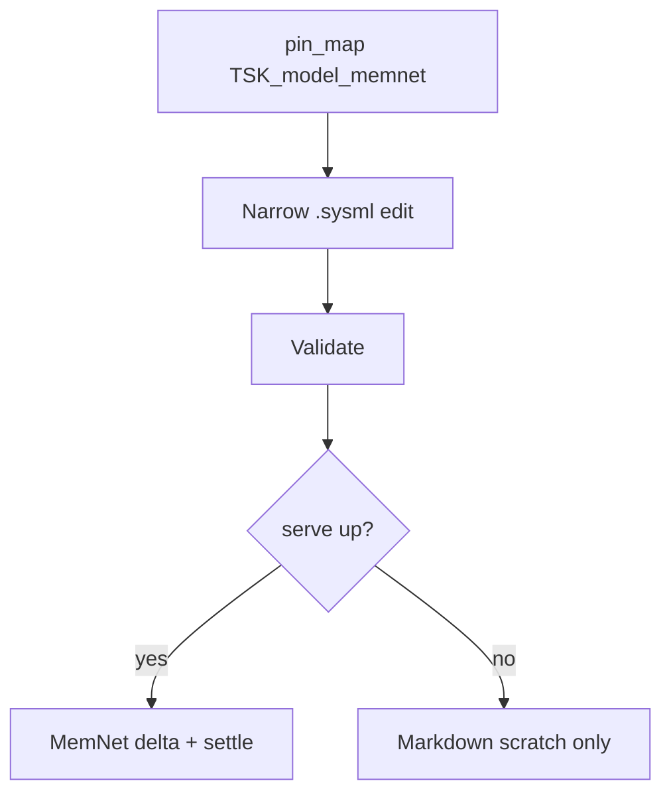

# Case study: SysML modelling goldfish (design memory)

**Shelf:** application example (on SharedLlmMemory)

Evidence walk against SysML under `sysml-models/models/`.  
Skills spirit: `sysml-modeling-session-checklist` -> workflow -> nested structure / view-doc-sync.  
Companions: [multitask-case-study.md](multitask-case-study.md), [prose-rpg-session-case-study.md](prose-rpg-session-case-study.md), [sysml-session-nest-cuts-case-study.md](sysml-session-nest-cuts-case-study.md) (model Snap stack / nest cuts).

**Wire:** GQL / shaped `pin_map` only. **Structure SSOT** for the product remains `.sysml` files; MemNet is **design memory** for MBSE agents (ids, tasks, touch edges) - not a second structure store.

## 1. Purpose

Show one agent turn loop for MemNet product SysML work: `pin_map(anchor=TSK_model_memnet)` -> narrow edit -> validate -> MemNet delta (when serve is up). When serve is down, skip graph write; plain Markdown scratch only.

## 2. Model locus

| Concern | Model element |
|---------|----------------|
| Product memory | `SharedLlmMemory` / `AgentMemory` / `SessionLifecycle` |
| Turn loop | `GoldfishLoop` (`EvPinMapRead` -> present -> mutate -> settle) |
| Task pin | `MissionTaskPin` / house `TSK_model_memnet` |
| Multitask (optional) | `MultitaskOperatingModel` when work is delegated |
| Requirements | MN-REQ-04 slice economy; MN-REQ-10.1 no chat as durable store; MN-REQ-01.7 session handle |

## 3. Scenario

**Title:** Narrow deploy nest edit under `TSK_model_memnet`

**Checklist (session start):**

- **project** - `sysml-models` / MemNet
- **anchor** - `TSK_model_memnet`
- **warm** - `warm_hit` | `warm_miss` | **serve_down**
- **pipe** - `TSK_turn_*` if serve up; else skip MemNet mutate

### Steps (serve up)

| Step | Action | Model / skill |
|------|--------|----------------|
| 1 | `serve_status` / `pin_map(anchor=TSK_model_memnet, depth=2, max_rows=50)` | `GoldfishLoop` awaitingPinMap -> presenting |
| 2 | Reason from **rendered** slice (not raw dump as SSOT) | MN-REQ-04 / 10.1 |
| 3 | Narrow `.sysml` edit (e.g. Multitask nest) | Files = structure SSOT |
| 4 | Validate (SysML MCP / brace review) | Outside MemNet |
| 5 | MemNet delta: update `TSK_*` / `MOD_*` / `SYM_*` atoms | `EvMutateGraph` / `MutateWithNew` |
| 6 | Settle finished turn task | `EvSettleRecycle` / housekeep |

### Illustrative GQL pins

```cypher
CREATE (t:Task {id: 'TSK_model_memnet', status: 'active'})
CREATE (d:Module {id: 'MOD_deploy', path: 'sysml-models/models/deploy.sysml'})
CREATE (b:Module {id: 'MOD_behaviour', path: 'sysml-models/models/behaviour.sysml'})
CREATE (t)-[:TOUCHES]->(d)
CREATE (t)-[:TOUCHES]->(b)
CREATE (s:Symbol {id: 'SYM_WorkerPool', name: 'WorkerPool'})
CREATE (d)-[:DEFINES]->(s)
```

After edit, agent updates edges (e.g. `TOUCHES` / `DEFINES`) to match the new nest - still GQL, still bounded.

### serve_down path

| Step | Action |
|------|--------|
| 1 | Note `serve_down` - no warm pin map |
| 2 | Edit `.sysml` from files + agreed plan |
| 3 | Validate as available |
| 4 | **Skip** MemNet mutate / TOON/TRON; optional plain Markdown notes |
| 5 | When serve returns: initial snap / delta - do not invent ids from chat |



## 4. Gates

| MUST | MUST NOT |
|------|----------|
| Treat `.sysml` as structure SSOT | Replace model files with chat prose |
| pin_map each substantive turn when serve up | Reason on stale chat as mission SSOT |
| Bounded ego slice | Dump whole graph into context |
| Skip graph write when serve_down | Fake pin_map success |

## 5. Related

| Study | Role |
|-------|------|
| [async-parallel-conflict-case-study.md](async-parallel-conflict-case-study.md) | When this task fans out to workers |
| [snapshot-passport-case-study.md](snapshot-passport-case-study.md) | Cold-start another host mid-modelling |
| [prose-rpg-session-case-study.md](prose-rpg-session-case-study.md) | Same goldfish shape in a narrative domain |
| [goldfish-chat-desync-case-study.md](goldfish-chat-desync-case-study.md) | When chat is trusted over the live pin map |
| [sysml-session-nest-cuts-case-study.md](sysml-session-nest-cuts-case-study.md) | Model Snap stack; nest cuts; no truncated Shape |
