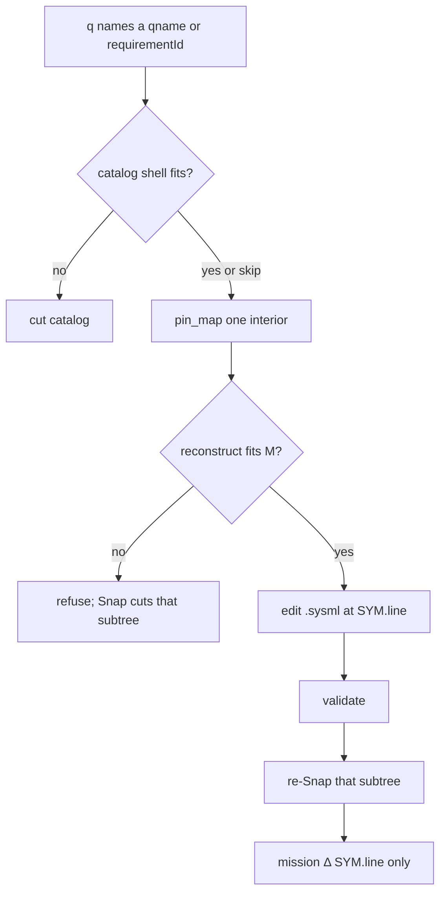

# Case study: SysML nests as session cuts

**Shelf:** application example (on SharedLlmMemory) — Catalog Snap is MN-REQ-11.17 / extra **0.15**.

Walk against `sysml-models/models/`, a PDU sketch, OMG VehicleUsages, and [elan8/sysml-examples](https://github.com/elan8/sysml-examples).  
**Loop:** [`docs/application-notes/llm-sysml-v2-modeling.md`](../../docs/application-notes/llm-sysml-v2-modeling.md).  
**Doctrine:** [`docs/grammar/memnet-session-strata.md`](../../docs/grammar/memnet-session-strata.md).  
**Mission `TSK` loop:** [sysml-modeling-goldfish-case-study.md](sysml-modeling-goldfish-case-study.md).

**Wire:** GQL / shaped `pin_map` only (ADR-001). No Layer / `layer=`.  
**SSOT:** `.sysml` holds the nest. MemNet holds cut locators and a **complete** Shape of **one** interior per generate.

## 1. Purpose

Show the two token laws on a SysML SSOT:

1. Goldfish **relatives of one cue** (complete Shape, then one brace at `SYM.line`).
2. Each over-\(M\) or **already-built** sub-unit lives in a **separate session** (parent presents `session=`; goldfish does not walk it). Look is a **session-in-session loop** (one \(S\) per generate). Sibling interiors may be **parallel tasks** once the parent shell is already in `.sysml`.

SysML can nest everything, so sessions are **budget cuts on the containment tree**, not a kind zoo. \(M\) is a **fit test**: reconstruct **fits whole** or Recall refuses. Silent `max_rows` is the same class of lie as silently picking one root.



Look loop (not drawn): if the Shape shows a child `session=` you need, drop the map and `pin_map` that child on the **next** generate. Parallel `TSK_*` only after the parent shell is already in `.sysml` (Turn I).

## 2. This product's stack

```text
ProjectMemNet                    // one model Snap
├── S_cat     session= + qname= of cuts
├── S_req     MemNetRequirements
├── S_ver     MemNetVerification
├── S_dep     MemNet               // TARGET: recurse (AgentMemory, …)
├── S_beh     MemNetBehaviour
├── S_con     MemNetConnections
└── S_mission TSK_model_* only     // not an interior of the Snap
```

| Concern | As-is vs TARGET |
|---------|-----------------|
| `snap_model` | As-is: package / kind-band / two-segment child package (`MN-VER-11-S17` `packageGrain`) |
| Recurse part / req group still over \(M\) | TARGET; not yet Snap law |
| Reuse `session=` for an already-built `qname=` | TARGET; as-is may re-project |
| `context_pack[:max_rows]` | leftover silent clip — **not** teach |
| `ingest_sysml` | Path-B 1→1; **not** this Snap |
| `Peak_L` | last-resort cue; not default goldfish |
| GoldfishLoop | one \(S\) per generate (0.13 drop prior maps) |

**Paradox.** One session + `:contains` k-hop flattens the load tree. Depth 2 from `package MemNet` mixes layers. Clipping at \(M\approx 50\) still **looks** complete. Package interiors isolate `MemNetRequirements` from `MemNet`, but `deploy.sysml` remains one fat part nest. Kind-band does nothing (almost all `PRT`). **Fit:** cut until each interior and each parent shell of **direct** children fits \(M\) whole. Cue one `session=`. Join with Absorb of a **slice**.

## 3. Turns

Mission `mn_mission` / `TSK_model_pdu`. Catalog `mn_cat` (handed `session=` locators; do not MATCH hid). Mission \(S\) holds `TSK` and `SYM` only.

| Turn | Shows |
|------|--------|
| A | Law 1 on a requirement parent |
| B | Law 2: mint a child session when the part nest will not fit |
| C | Package cut is not one session per file |
| D | Cross-cut `satisfy`: second look / slice |
| E | SysML `view def` ≠ `pin_map view=` |
| F | Already-built Wheel; `subsets` delta; nested-port `interface` |
| G | Coding SSOT: relatives of `CheckoutService` |
| H | Law 2 reuse: nested type already presents in another session |
| I | Look loop; parallel `TSK_*` on disjoint interiors when the shell is already clear |

### A — requirement in requirement

Cue `requirementId='MN-REQ-01'` on `mn_req`. Shape lists **direct** children. Edit `requirements.sysml`; add `MN-REQ-01.9`. Validate. Re-Snap **that group**. If it no longer fits \(M\), cut a **child group**, not one session per leaf.

### B — part in part

On `mn_pdu`, cue `qname:'PkgPdu::PduController'`. Shape lists `pwr_in`. Write:

```sysml
part def PduController {
  port pwr_in : PowerIn;
  part sense : SenseAmp;
  connection pwrLink : PowerFlow {
    end port source ::> pwr_in;
    end port sink ::> sense.vin;
  }
}
part def SenseAmp {
  port vin : AnalogIn;
  port vout : AnalogOut;
}
```

`sense` is `:contains` + `:typedBy`. If `SenseAmp` already presents in `mn_sense`, reuse that id (Turn H). Else if `mn_pdu` no longer fits \(M\), mint `mn_sense`. Parent keeps the usage **name**, not `vin`/`vout`. Ports, `connection`, `action`, `item` stay on the **part** cut — not `S_port`.

Mission Δ (sparse; no nest copy):

```cypher
MATCH (t:TSK {id: 'TSK_model_pdu'})
MATCH (s:SYM {name: 'PduController'})
SET s.line = 18
CREATE (t)-[:ABOUT {recycle: 'delete_on_settle'}]->(s)
```

### C — package in package

`package PkgLib { package PkgPower { … } }`. First cut is the import root. Nested package stays until over \(M\); then catalog `PkgLib::PkgPower` → `mn_power`. Not one session per `.sysml` file.

### D — satisfy across cuts

`part def PduController { satisfy PkgReq::ReqAlpha; }`  
`satisfies` is an edge. `ReqAlpha` lives in `mn_req`. **No** dangling node in `mn_pdu`. Second `pin_map` on `mn_req`, or Absorb a **slice** of `ReqAlpha` into `mn_mission`.

### E — view def

`view def` stays in the owning package interior. `pin_map view=shell` is grain **inside** that \(S\), not a SysML view and not a second session.

Catalog nicknames (shaped read):

```cypher
CREATE (:PKG {qname: 'MemNetRequirements', session: 'mn_req', grain: 'package', recycle: 'persistent'})
CREATE (:PKG {qname: 'MemNet', session: 'mn_dep', grain: 'package', recycle: 'persistent'})
CREATE (:PKG {qname: 'PkgPdu', session: 'mn_pdu', grain: 'package', recycle: 'persistent'})
```

### F — VehicleUsages (OMG)

[VehicleUsages.sysml](https://github.com/Systems-Modeling/SysML-v2-Release/blob/master/sysml/src/examples/Vehicle%20Example/VehicleUsages.sysml) + [VehicleDefinitions.sysml](https://github.com/Systems-Modeling/SysML-v2-Release/blob/master/sysml/src/examples/Vehicle%20Example/VehicleDefinitions.sysml).

**One Snap.** Catalog: `VehicleDefinitions` (def library) and `VehicleUsages` (configurations). Import `::*` is not a second Snap. **Wheel** is already built in the def interior. `narrowRimWheel: Wheel` **presents** that `session=` (`:typedBy`); `hub` is not copied. Nested `lugbolt[4..5]` is the usage **delta** — one pin.

**`vehicle_C1` shell** = `frontAxleAssembly` | `rearAxleAssembly` only. Lugbolts are depth 3. Depth-2 flatten either **misses** them or dumps the tree. Re-anchor to the assembly, then the wheel.

**`vehicle_C2 subsets vehicle_C1`.** Shape is **delta** (`redefines`, `subsets`, new `interface` connect) plus a locator to C1 — not a paste of C1.

**`vehicle_C3`.** Connection to nested port `rearAxleAssembly.rearAxle.drive`. C3 shell = `transmission` | redefined axle | `driveShaft`. Port `drive` is on `rearAxle` — second look / slice (same as D).

As-is ingest projects `part` usages; not `interface` usages, `subsets`/`redefines`, `connect`/`flow`, attributes `T1`/`T2`. Annex A in the same folder is the fat nest (\(\approx 21\,\mathrm{k}\)); the usages file is \(\approx 0.7\,\mathrm{k}\) (clear, not a budget example).

### G — elan8 webshop / drone (software SSOT)

[elan8/sysml-examples](https://github.com/elan8/sysml-examples). One Snap per example folder. First interiors = imported packages (Structure, Behavior, Requirements, Ports, Views) plus the root. `Views.sysml` is SysML `view`/`viewpoint`, not `pin_map view=`.

**Webshop.** Cue `CheckoutService`. Relatives = ports + incident `connect` (orders DB, payments, inventory, events). If that service already has an interior, `WebShopSystem` only **presents** `session=`. `satisfy checkoutLatency by webshopSystem.checkoutService` and `allocate … to commerceCluster` are cross-cut (D). Dumping `WebShopArchitecture.sysml` (\(\approx 3.2\,\mathrm{k}\)) spends goldfish before code.

**Drone.** `satisfy FailsafeReq by droneInstance.flightControl.flightController` is a nested path (C3). Shell of `droneInstance`, then re-anchor `flightControl`. Four `propulsionUnit*` stay in `Propulsion` if they fit \(M\).

These trees are teaching-small (\(\approx 1.4\,\mathrm{k}\) office … \(\approx 7\,\mathrm{k}\) drone). They prove folder = package cut and software `allocate`. Fat budget example remains `deploy.sysml`.

### H — nested part already presents in a built session

`part def Commit { part mutate : MutateGate; }` after MutateGate already has `mn_mutate`. **Do not** Snap MutateGate into Commit. Catalog already maps `qname=` → `session=`. Commit’s shell is the usage **name** + `:typedBy` + that `session=`. Goldfish of `mn_commit` lists `mutate`; it does not emit MutateGate’s ports. Look: `pin_map(session=mn_mutate)`. Join a port or `satisfy` end: Absorb a **slice** (D).

Turn B **mints** when over \(M\) and no row exists. Turn H **reuses**. Re-Snap of the same `qname=` refreshes that interior; it does not mint a twin.

### I — look loop and parallel sub-units

**Look loop.** `vehicle_C3` → `rearAxleAssembly` `session=` → `rearAxle` → port `drive` is three generates, not one depth-3 dump: catalog (or skip) → C3 shell → axle interior. Drop the prior map each time.

**Parallel.** `WebShopSystem` shell already in `.sysml` lists `checkoutService` and `inventoryService` with `session=`. Parent mints `TSK_checkout` and `TSK_inventory`, passes each interior id, ends the turn. Workers goldfish **only** their \(S_i\) (TCP/HTTP). Parent next turn `pin_map`s the catalog; does not walk either nest. `satisfy checkoutLatency by webshopSystem.checkoutService` waits until that interior exists (D).

If the parent is still inventing those usages, **do not** spawn: write the shell first (serial). Same-interior or same-brace workers need RSV or serialisation — MN-REQ-12.5.

## 4. MUST NOT

| Not this | Why |
|----------|-----|
| `ingest_sysml` path → mission | Dumps the nest into \(S\) |
| Silent `max_rows` / shell 8+12 / ingest mid-brace | Looks complete |
| Raise goldfish \(M\) | Hides the unfit nest |
| `Peak_L` as default goldfish | `:contains` parents look like peaks |
| One session per leaf / port | Explosion; MN-REQ-11.17 forbids per-REQ |
| Kind zoo `S_part` / `S_req` / `S_port` | Cuts are **fit** |
| `view=` as SysML `view def` | Grain vs model element |
| Absorb whole \(S\) / merge interiors in chat | Slice only |
| Layer / dump \(S\) / ANN of catalog ids | ADR-001; Snap-on-sessions |
| Explode `lugbolt[4..5]` / paste C1 into C2 | One pin; delta + locator |
| Depth-2 from C3 to `rearAxle.drive` | Shell, then re-anchor |
| Second Snap of a `qname=` that already has `session=` | Present the existing interior |
| \(N\) nested maps in one generate | Look loop; one \(S\) per generate |
| Parallel workers before the parent shell is in `.sysml` | Serial until children are named |
| Two workers on the same interior | Disjoint `session=` / RSV |

## 5. Honesty

| Claim | Status |
|-------|--------|
| `snap_model` catalog + package interiors | shipped 0.15 (package 0.19.0); `tests/test_catalog_snap.py` |
| Recurse part-root / requirement-group over \(M\) | TARGET; engine leftover two-segment child package |
| Reuse catalog `session=` when already built | TARGET; as-is may re-project |
| Parallel interiors once the parent shell is clear | Application of Multitask + separate \(S_i\); engine does not schedule workers |
| Ingest `max_nodes=200` on `deploy.sysml` | can hit `ingest_budget` before a recurse cut |
| Complete Shape or refuse | TARGET; as-is `context_pack` still `[:max_rows]` |
| VehicleUsages `interface` / `subsets` / `redefines` / `flow` | not in `_DEF_HEAD`; `.sysml` SSOT |
| `liveNeo4jClaimed` | extra **0.14**; not this Snap’s fence |
| Operator count | stays 2 |

## 6. Related

| Path | Role |
|------|------|
| [sysml-modeling-goldfish-case-study.md](sysml-modeling-goldfish-case-study.md) | Mission `TSK` goldfish |
| [session-import-case-study.md](session-import-case-study.md) | Absorb **slice** (Turn D) |
| [goldfish-chat-desync-case-study.md](goldfish-chat-desync-case-study.md) | Chat is not the live map |
| [session-outline-case-study.md](session-outline-case-study.md) | Empty q = census of **one** \(S\) |
| `docs/application-notes/llm-sysml-v2-modeling.md` | Agent loop |
| `docs/application-notes/llm-system-dev-multitask.md` | Parallel `TSK_*` (Turn I) |
| `docs/grammar/memnet-session-strata.md` | Sessions as strata |
