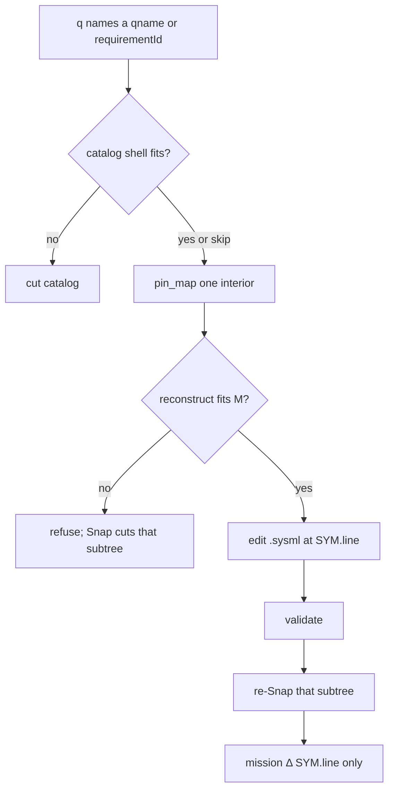

# Case study: SysML nests as session cuts (no truncated Shape)

**Shelf:** application example (on SharedLlmMemory) — Catalog Snap mechanism is MN-REQ-11.17 / extra **0.15**.

Evidence walk against `sysml-models/models/` plus a fake PDU campaign.  
Application teach: `docs/application-notes/llm-sysml-v2-modeling.md`.  
Doctrine: `docs/grammar/memnet-session-strata.md`.  
Companion: [sysml-modeling-goldfish-case-study.md](sysml-modeling-goldfish-case-study.md) (mission `TSK` loop; this study owns the **model Snap stack**).

**Wire:** GQL / shaped `pin_map` only (ADR-001). No Layer / `layer=`.  
**SSOT:** `.sysml` holds the nest. MemNet holds **cut locators** and a **complete** Shape of **one** interior per generate.

## 1. Purpose

Show **why** MemNet saves tokens on a SysML SSOT: **(1)** goldfish **relatives** of one cue; **(2)** each over-\(M\) (or already-built) **sub-unit is a separate session**. SysML can nest **everything** in everything, so sessions are **budget cuts on the containment tree**, not a kind zoo of layers. Goldfish \(M\) is a **fit test**: an interior reconstruct **fits whole** or Recall refuses. Silent `max_rows` is the same class of lie as silently picking one root.

## 2. Model locus

| Concern | SysML / engine | As-is vs TARGET |
|---------|----------------|-----------------|
| Catalog Snap | MN-REQ-11.17; `CatalogSnap`; CLI `snap model`; MCP `snap_model` | As-is: package / kind-band / two-segment child package (`MN-VER-11-S17` `packageGrain`) |
| Recurse when a part/req subtree still over \(M\) | session-strata interior grain | TARGET; not yet Snap law in engine |
| ShapeWalk cap | `PinMapComposer` / `context_pack[:max_rows]` | leftover silent clip — **not** product teach |
| Ingest 1→1 | `ingest_sysml` / `PinMapIngest_Sysml` | Path-B as-is; **not** this Snap |
| Peak on `:contains` parents | `Peak_L` \(\rho^*\) hides `contains` | last-resort cue; not default goldfish |
| Reqs | MN-REQ-04 Shape; MN-REQ-11.16 locators as properties; MN-REQ-11.17 | verify MN-VER-11-S17 |
| Loop | `GoldfishLoop` one \(S\) per generate (0.13 drop prior maps) | as-is caller contract |

```text
ProjectMemNet                    // one model Snap
├── S_cat     session= + qname= of cuts
├── S_req     MemNetRequirements   // requirement-in-requirement nest
├── S_ver     MemNetVerification
├── S_dep     MemNet               // TARGET: recurse (AgentMemory, …)
├── S_beh     MemNetBehaviour
├── S_con     MemNetConnections
└── S_mission TSK_model_* only     // not an interior of the Snap
```

## 3. Paradox

**One session + `:contains` k-hop** flattens the load tree. `pin_map` depth 2 from `package MemNet` or `MN_REQ_00` mixes layers and blows tokens. Clipping at \(M\approx 50\) still **looks** complete: nested `requirement def`, nested `part`, ports, and `satisfy` past the cut vanish.

**Package interiors only** isolate `MemNetRequirements` from `MemNet`, but `deploy.sysml` is still one fat part nest (hundreds of defs under `package MemNet`). Kind-band does nothing (almost all `PRT`).

**Fit:** cut the tree until each interior (and each parent shell of **direct** children) **fits \(M\) whole**. Cue one `session=`. Join with Absorb of a **slice**, not session merge. If a nested type **already has** an interior, the parent **presents** that `session=` — it does not Snap a second copy.



## 4. Fake mission

**Title:** Add a nested requirement, a nested part, and a cross-cut `satisfy` without dumping the model  
**Mission session:** `mn_mission` · **Task:** `TSK_model_pdu`  
**Snap catalog:** `mn_cat` (handed; list `session=` locators; do not MATCH hid)

### Ground truth (this product tree + PDU sketch)

| Cut | `qname=` / `requirementId=` | Interior (illustrative) |
|-----|-----------------------------|-------------------------|
| Requirements package | `MemNetRequirements` | `mn_req` |
| Group MN-REQ-01 | `MN-REQ-01` | stays in `mn_req` while the **direct** children fit \(M\) |
| Deploy package | `MemNet` | `mn_dep` as-is; TARGET recurse `MemNet::AgentMemory` → `mn_am` |
| PDU sketch | `PkgPdu::PduController` | `mn_pdu` (application example in the app note) |

Mission \(S\) holds `TSK_model_pdu` and `SYM` locators only.

### Turn A — requirement in requirement

Cue `requirementId='MN-REQ-01'` on `mn_req`. Complete Shape lists **direct** children (`MN-REQ-01.1` …). Edit `requirements.sysml` under that brace; add `MN-REQ-01.9`. Validate. Re-Snap **that group**. If the group no longer fits \(M\), cut a **child group**, not one session per leaf.

### Turn B — part in part (and ports / connection)

On `mn_pdu`, cue `qname:'PkgPdu::PduController'`. Shape lists direct children (`pwr_in`). Write:

```sysml
part def PduController {
  port pwr_in : PowerIn;
  part sense : SenseAmp;
  connection pwrLink : PowerFlow {
    end port source ::> pwr_in;
    end port sink ::> sense.vin;
  }
}
part def SenseAmp {
  port vin : AnalogIn;
  port vout : AnalogOut;
}
```

Re-Snap this subtree. Usage `sense` is `:contains` + `:typedBy`. If `SenseAmp` already presents in `mn_sense`, reuse that id. Else if `mn_pdu` no longer fits \(M\), cut `SenseAmp` to `mn_sense`. Parent shell keeps the usage **name**, not `vin`/`vout`. Ports, `connection`, `action`, `item` stay on the **part** cut — not `S_port`.

### Turn C — package in package

`package PkgLib { package PkgPower { … } }`. First cut is the import root. Nested package stays until over \(M\); then catalog row `PkgLib::PkgPower` → `mn_power`. Not one session per `.sysml` file.

### Turn D — satisfy across cuts

`part def PduController { satisfy PkgReq::ReqAlpha; }`  
`satisfies` is an edge. `ReqAlpha` lives in `mn_req`. **No** dangling node in `mn_pdu`. Second `pin_map` on `mn_req`, or Absorb a **slice** of `ReqAlpha` into `mn_mission`.

### Turn E — view def

`view def` stays in the owning package interior. `pin_map view=shell` is grain **inside** that \(S\) (complete **direct** children), not a SysML view and not a second session.

### Illustrative catalog pins (shaped read, nicknames only)

```cypher
CREATE (:PKG {qname: 'MemNetRequirements', session: 'mn_req', grain: 'package', recycle: 'persistent'})
CREATE (:PKG {qname: 'MemNet', session: 'mn_dep', grain: 'package', recycle: 'persistent'})
CREATE (:PKG {qname: 'PkgPdu', session: 'mn_pdu', grain: 'package', recycle: 'persistent'})
```

Mission Δ after Turn B (sparse; no nest copy):

```cypher
MATCH (t:TSK {id: 'TSK_model_pdu'})
MATCH (s:SYM {name: 'PduController'})
SET s.line = 18
CREATE (t)-[:ABOUT {recycle: 'delete_on_settle'}]->(s)
```

### Turn F — official VehicleUsages (OMG example)

Source: [VehicleUsages.sysml](https://github.com/Systems-Modeling/SysML-v2-Release/blob/master/sysml/src/examples/Vehicle%20Example/VehicleUsages.sysml) with [VehicleDefinitions.sysml](https://github.com/Systems-Modeling/SysML-v2-Release/blob/master/sysml/src/examples/Vehicle%20Example/VehicleDefinitions.sysml).

**One Snap.** Catalog rows: `VehicleDefinitions` (def library) and `VehicleUsages` (configurations). Import `::*` is not a second Snap. The **Wheel** session is **already built** in the def interior. `narrowRimWheel: Wheel` **presents** that `session=` (`:typedBy`); `hub` is not copied. Nested `lugbolt[4..5]` is the usage delta — **one** pin, multiplicity a property.

**`vehicle_C1` shell** = `frontAxleAssembly` | `rearAxleAssembly` only. Lugbolts are depth 3. Depth-2 flatten either **misses** them or dumps the tree; clipping `max_rows` is the lie. Re-anchor to the assembly, then the wheel.

**`vehicle_C2 subsets vehicle_C1`.** Shape is **delta**: `redefines frontAxleAssembly`, `leftFrontWheel subsets frontWheel`, `interface leftFrontMount: Mounting connect …`. Locator to C1. Not a paste of C1’s nest.

**`vehicle_C3`.** File comment: connection to a **deeply nested port** `rearAxleAssembly.rearAxle.drive`. C3 shell = `transmission` | redefined `rearAxleAssembly` | `driveShaft`. Port `drive` is on `rearAxle`. Second look / Absorb slice if the axle was cut — same as Turn D `satisfy`.

**As-is ingest.** `part` usages project; `interface` usages, `subsets`/`redefines`, `connect`/`flow`, attributes `T1`/`T2` do **not**. `.sysml` remains SSOT for those. Annex A `SimpleVehicleModel.sysml` in the same folder is the fat nest; this usages file is the **clear** configuration example.

### Turn G — elan8 webshop / drone (software SSOT)

Source: [elan8/sysml-examples](https://github.com/elan8/sysml-examples). One Snap per example folder. Catalog interiors = imported packages (Structure, Behavior, Requirements, Ports, Views) plus the root aggregator.

**Webshop.** Cue `CheckoutService` in the architecture interior. Relatives = ports + incident `connect` (orders DB, payments, inventory, events). If that service already has its own interior, `WebShopSystem` only **presents** `session=` — no second Snap of the service nest. `satisfy checkoutLatency by webshopSystem.checkoutService` and `allocate … to commerceCluster` are cross-cut — second look / Absorb slice. Dumping `WebShopArchitecture.sysml` (\(\approx 3.2\,\mathrm{k}\) tokens) spends the goldfish bound before code.

**Drone.** `satisfy FailsafeReq by droneInstance.flightControl.flightController` is a nested path (Vehicle C3). Shell of `droneInstance`, then re-anchor `flightControl`. Four `propulsionUnit*` stay in the `Propulsion` interior if they fit \(M\).

### Turn H — nested part already presents in a built session

`part def Commit { part mutate : MutateGate; }` after MutateGate already has `mn_mutate`. **Do not** Snap MutateGate again into Commit’s interior. Catalog already lists `qname=` → `session=`. Commit’s shell row is the usage **name** + `:typedBy` + that `session=`. Goldfish of `mn_commit` lists `mutate`; it does not emit MutateGate’s ports. To see the sub-part: `pin_map(session=mn_mutate)`. To join a port or `satisfy` end: Absorb a **slice**, same as Turn D.

First-time cut (Turn B when over \(M\)) **mints** the child session. Turn H **reuses** it. Re-Snap of the **same** `qname=` refreshes that interior; it does not mint a twin. As-is leftover: `snap_model` may re-project; TARGET is reuse by `qname=`.

## 5. Contrast (MUST NOT)

| Not this | Why |
|----------|-----|
| `ingest_sysml` path → mission | 1→1 Path-B; dumps the nest into \(S\) |
| Silent `max_rows` / shell 8+12 / ingest mid-brace | Looks complete; children and `satisfy` vanish |
| Raise goldfish \(M\) | Hides the unfit nest |
| `Peak_L` as default goldfish | `:contains` parents look like peaks |
| One session per `requirement def` / nested `part` / port | Explosion; MN-REQ-11.17 forbids per-REQ |
| Kind zoo `S_part` / `S_req` / `S_port` | Cuts are **fit**, not construct names |
| `view=` as SysML `view def` | Different words; grain vs model element |
| Absorb whole \(S\) / merge interiors in chat | Slice only |
| Layer / `layer=` / dump \(S\) | ADR-001; MN-REQ-01.8 |
| ANN of catalog session ids | Snap-on-sessions |
| leftover `id:'NEW'` as law | GraphElement create; leftover 0.9 |
| Explode `lugbolt[4..5]` | One usage pin; multiplicity property |
| Paste `vehicle_C1` into `vehicle_C2` | `subsets`/`redefines` = delta + locator |
| Depth-2 from `vehicle_C3` to `rearAxle.drive` | C3 shell, then re-anchor the axle |
| Second Snap of a `qname=` that already has `session=` | Present the existing interior; look = `pin_map` that \(S\) |

## 6. Honesty

| Claim | Status |
|-------|--------|
| `snap_model` catalog + package interiors | shipped 0.15 (untagged; package 0.9.0); pytest `tests/test_catalog_snap.py` |
| Recurse part-root / requirement-group when still over \(M\) | TARGET teach; engine leftover still two-segment child package after a successful project |
| Reuse catalog `session=` when a nested type is already built | TARGET teach; as-is Snap may re-project the same `qname=` |
| Ingest `max_nodes=200` on `deploy.sysml` | fat nest can hit `ingest_budget` **before** a recurse cut |
| Complete Shape or refuse | TARGET; as-is `context_pack` still slices `[:max_rows]` |
| VehicleUsages `interface` / `subsets` / `redefines` / `flow` | not in as-is `_DEF_HEAD`; `.sysml` SSOT |
| `liveNeo4jClaimed` | extra **0.14**; not this Snap cut’s fence |
| Operator count | stays 2 (Snap is Commit of locators; Absorb stays Path-B) |

## 7. Related

| Path | Role |
|------|------|
| [sysml-modeling-goldfish-case-study.md](sysml-modeling-goldfish-case-study.md) | Mission `TSK` goldfish; this study is the Snap stack |
| [session-outline-case-study.md](session-outline-case-study.md) | Empty q = census of **one** \(S\), not a nest dump |
| [session-import-case-study.md](session-import-case-study.md) | Absorb **slice** across cuts (Turn D) |
| [goldfish-chat-desync-case-study.md](goldfish-chat-desync-case-study.md) | Chat must not replace the live interior map |
| `docs/application-notes/llm-sysml-v2-modeling.md` | Application loop + already-built interiors |
| [VehicleUsages.sysml](https://github.com/Systems-Modeling/SysML-v2-Release/blob/master/sysml/src/examples/Vehicle%20Example/VehicleUsages.sysml) | OMG example: usages, subsets, nested-port `interface` |
| [elan8/sysml-examples](https://github.com/elan8/sysml-examples) | Teaching trees; webshop software SSOT; nested `satisfy by` |
| `docs/grammar/memnet-session-strata.md` | Sessions as strata (not Layer) |
