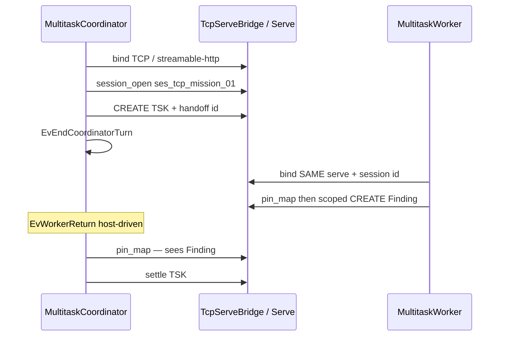

# Case study: TCP / streamable-http shared Multitask store

**Shelf:** product canon

Evidence walk focused on **MN-REQ-12.2 transport** against `sysml-models/models/`.  
Companions: [multitask-case-study.md](multitask-case-study.md) (full mission), [async-parallel-conflict-case-study.md](async-parallel-conflict-case-study.md) (dispatch).  
Doctrine: `docs/multi-agent-sessions.md`. Application: `docs/application-notes/llm-system-dev-multitask.md`.

**Wire:** GQL / shaped `pin_map` only. This study isolates the **shared-store binding** — not worker-scope conflict detail.

## 1. Purpose

Show a parent + one worker (or N) on a **single shared graph** via TCP serve or streamable-http MCP. Contrast the fatal anti-pattern: default **in-process** MCP (isolated graph per process). Trace to `TcpServeBridge` / `ServeBridge` / `MultitaskSharedStoreBinding` and verify **MN-VER-12-S02**.

## 2. Model locus

| Concern | SysML element |
|---------|---------------|
| Requirement | **MN-REQ-12.2** shared store transport |
| Verify | **MN-VER-12-S02** |
| Nest | `TransportBoundary` → `TcpServeBridge` (+ `ServeBridge` / streamable-http doc stand-in); `MultitaskSharedStoreBinding` |
| Multitask spine | `MultitaskCoordinator` → `SessionHandoffEmit` + `AsyncTaskDispatch`; `WorkerPool` / `MultitaskWorker` |
| Behaviour | `MultitaskMissionCycle.parentPreparing`; `SessionHandoffById`; `WorkerScopedTurn` |
| Contrast | `InProcessEngine` — **MN-REQ-06.1** primary for **single-agent** only |

```text
MemNetSystem
├── MemNetCoreLibrary
│   └── TransportBoundary
│       ├── InProcessEngine          // single-agent OK; Multitask anti-pattern
│       ├── LocalIpcGateway          // AF_UNIX; MEMNET_IPC_SOCKET (MN-REQ-06.2)
│       └── TcpServeBridge           // Multitask shared store (as-is wired)
├── MemNetMcpServer                  // streamable-http opt-in same idea
└── MultitaskOperatingModel
    ├── MultitaskCoordinator
    │   ├── SessionHandoffEmit
    │   └── AsyncTaskDispatch
    ├── WorkerPool / MultitaskWorker
    └── MultitaskSharedStoreBinding  // satisfies 12.2
```

## 3. Fake mission

**Title:** Parent delegates behaviour-state inventory; worker must see the same `TSK_*`  
**Session id (SSOT handle):** `ses_tcp_mission_01`  
**Task:** `TSK_tcp_behav_inventory`

### Transport bind (happy)

| Actor | Binding | Env / note |
|-------|---------|------------|
| Parent | TCP MCP or streamable-http to one serve | e.g. `MEMNET_MCP_TRANSPORT=tcp` → host `:18765` / MCP policy |
| Worker | **Same** transport + **same** session id | Handed via `SessionHandoff` — not chat dump |
| Store | One process `GraphStore` behind serve | `MultitaskSharedStoreBinding` |

### Steps

| Step | What happens | Model / verify |
|------|----------------|----------------|
| 1 | Relevance: multi-step delegate → Multitask on | MN-REQ-12.8; not `EvTrivialSingleAgent` |
| 2 | **Bind shared store** before open | MN-REQ-12.2; **MN-VER-12-S02**; `TcpServeBridge` |
| 3 | `session_open` / load `ses_tcp_mission_01`; parent `pin_map` | MN-REQ-12.1; `SessionLifecycle` |
| 4 | Mint `TSK_tcp_behav_inventory`; set `WorkerWriteScope` | MN-REQ-12.3 / 12.4 |
| 5 | `SessionHandoffEmit` (session id only) + `AsyncTaskDispatch`; **end turn** | MN-REQ-12.6 / 12.12 |
| 6 | Worker connects to **same** serve; `pin_map` first; scoped mutate | `WorkerScopedTurn` |
| 7 | Host `EvWorkerReturn`; parent re-`pin_map` same session; settle | Path A — no import nest |

### Illustrative GQL (shared session — visible to both)

```cypher
CREATE (t:Tsk {id: 'TSK_tcp_behav_inventory', status: 'active'})
CREATE (m:Mod {id: 'MOD_behaviour_sysml', path: 'sysml-models/models/behaviour.sysml'})
CREATE (t)-[:about]->(m)
```

Worker (same session, same TCP graph):

```cypher
MATCH (t:Tsk {id: 'TSK_tcp_behav_inventory'})
CREATE (f:Finding {
  id: 'FND_states_listed',
  note: 'ParentTaskLifecycle arcs inventoried'
})
CREATE (t)-[:has_finding]->(f)
```

Parent next turn: `pin_map(anchor=TSK_tcp_behav_inventory)` — finding **must** appear. If it does not, transport was isolated (anti-pattern).



## 4. Anti-pattern — in-process Multitask

| Mistake | What actually happens | Violates |
|---------|----------------------|----------|
| Parent on TCP, worker on default in-process stdio | Worker writes a **private** graph; parent never sees pins | MN-REQ-12.1, **12.2** |
| Both in-process in **separate** agent processes | Two isolated stores | MN-REQ-12.2 |
| Pass graph dump in chat instead of session id | Chat becomes false SSOT | MN-REQ-12.1 / 10.1; `SessionHandoffById` |
| Assume LocalIpc / RSV without a shared store | LocalIpc is **shipped**; RSV is **shipped**; neither replaces TCP/HTTP shared serve for Multitask |

**Single-agent exception:** trivial goldfish MAY use in-process (**MN-REQ-06.1**) when Multitask is off (`EvTrivialSingleAgent`).

## 5. Verify coverage

| Verify id | This study |
|-----------|------------|
| **MN-VER-12-S02** | Primary — shared store via TcpServeBridge / ServeBridge |
| MN-VER-12-S03 | Session id + pin_map after bind |
| MN-VER-12-S05 / S06 | Handoff + worker turn (pointer; detail in multitask / async studies) |

## 6. Related

| Study | Role |
|-------|------|
| [multitask-case-study.md](multitask-case-study.md) | Full S01…S09 mission |
| [async-parallel-conflict-case-study.md](async-parallel-conflict-case-study.md) | N workers + end-turn |
| [session-import-case-study.md](session-import-case-study.md) | Path B when sessions were **not** shared |
| [goldfish-chat-desync-case-study.md](goldfish-chat-desync-case-study.md) | Chat vs pin_map after handoff |

## 7. Validation note

Scenario inspection against `MemNetVerification` S02 and deploy `TcpServeBridge` / `MultitaskSharedStoreBinding`. Engine does not auto-reject in-process Multitask — doctrineAsIs; hosts MUST configure transport.
