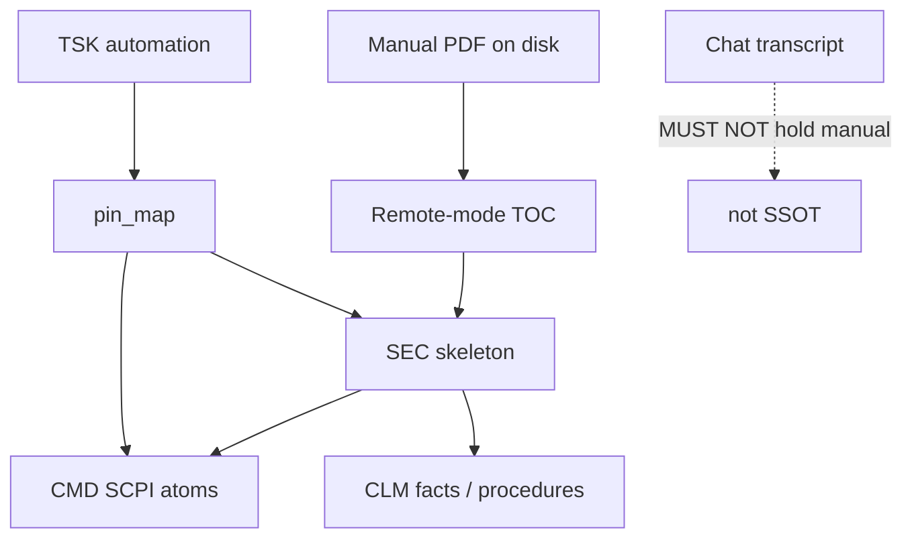

# Case study: technical docs / SCPI atomisation (SharedLlmMemory)

**Shelf:** application example (on SharedLlmMemory)

Evidence walk for **instrument-manual working set** against `sysml-models/models/`.  
Application patterns: `docs/application-notes/llm-tech-docs-decomposition.md`.  
Companion: [system-design-notes.md](system-design-notes.md), [company-memory-case-study.md](company-memory-case-study.md).

**Wire:** GQL / shaped `pin_map` only (ADR-001). Historical Layer / `@TAG` pipe seeds are quarantine — translate to GQL below.

## 1. Purpose

Atomise a long SCPI remote-mode manual into NODEs and relation EDGEs so an agent can **`pin_map` one subsection** (handshake or capture) without holding the PDF in chat. MemNet = **doc working set** (`SharedLlmMemory`); the PDF stays on disk.

## 2. Model locus

| Concern | SysML |
|---------|-------|
| Product memory | `SharedLlmMemory` / `AgentMemory` / `SessionLifecycle` / `GraphStore` |
| Wire | `GqlCodec`, `MutateGate`, `PinMapShapedRead` |
| Loop | `GoldfishLoop` (pin_map → mutate → settle) |
| Caps | `CapsPolicy` / MN-REQ-04 / MN-REQ-05 |
| Chat never SSOT | MN-REQ-10.1 |
| Application pattern | Same spirit as `CompanyAnalyticalSsot` — domain labels on SharedLlmMemory, **not** a second nest |



## 3. Fake mission

**Title:** Automate RTO CH1 capture + Vpp measure over SCPI LAN  
**Session:** `ses_rto_remote_v29` · **Task:** `TSK_rto_capture_ch1` · **Ego:** subsection under `SEC_hello` then `SEC_setup`

Corpus locator (illustrative): R&S RTO User Manual en rev 29 — remote mode. Seed extract may live at `parts/common/memnet/memnet/examples/workflow.rto-remote.example.txt` (legacy pipe accept-on-load only).

### Schema labels (GQL-shaped)

| Label | Role | Key properties |
|-------|------|----------------|
| `Art` | Manual root | `id`, `title`, `source`, `kind` |
| `Sec` | Chapter / subsection | `id`, `art`, `heading`, `order` |
| `Cmd` | One SCPI command | `id`, `sec`, `scpi`, `role` |
| `Clm` | Atomic fact / procedure step | `id`, `sec`, `type`, `code` |
| `Tsk` | Automation goal | `id`, `goal`, `anchor`, `status` |

### Seed (structure + handshake — GQL)

```cypher
CREATE (art:Art {
  id: 'ART_rto_um',
  title: 'R&S RTO User Manual',
  source: '1332_9725_01/RTO_UserManual_en_29.pdf',
  kind: 'instrument_manual',
  status: 'active'
})
CREATE (sHello:Sec {id: 'SEC_hello', art: 'ART_rto_um', heading: 'Hello / connect', order: 1})
CREATE (sSetup:Sec {id: 'SEC_setup', art: 'ART_rto_um', heading: 'Channel + trigger setup', order: 2})
CREATE (sMeas:Sec {id: 'SEC_meas', art: 'ART_rto_um', heading: 'Measure', order: 3})
CREATE (art)-[:has_section]->(sHello)
CREATE (art)-[:has_section]->(sSetup)
CREATE (art)-[:has_section]->(sMeas)

CREATE (c1:Cmd {id: 'CMD_cls', sec: 'SEC_hello', scpi: '*CLS', role: 'clear'})
CREATE (c2:Cmd {id: 'CMD_idn', sec: 'SEC_hello', scpi: '*IDN?', role: 'identify'})
CREATE (c3:Cmd {id: 'CMD_rst', sec: 'SEC_hello', scpi: '*RST', role: 'reset'})
CREATE (c4:Cmd {id: 'CMD_opc', sec: 'SEC_hello', scpi: '*OPC?', role: 'wait'})
CREATE (c5:Cmd {id: 'CMD_err', sec: 'SEC_hello', scpi: 'SYST:ERR?', role: 'error_queue'})
CREATE (sHello)-[:contains]->(c1)
CREATE (sHello)-[:contains]->(c2)
CREATE (sHello)-[:contains]->(c3)
CREATE (sHello)-[:contains]->(c4)
CREATE (sHello)-[:contains]->(c5)

CREATE (c1)-[:precedes]->(c2)
CREATE (c2)-[:precedes]->(c3)
CREATE (c3)-[:precedes]->(c4)
CREATE (c4)-[:precedes]->(c5)

CREATE (clHello:Clm {id: 'CLM_hello_seq', sec: 'SEC_hello', type: 'procedure', code: 'handshake_before_setup'})
CREATE (clSetup:Clm {id: 'CLM_setup_seq', sec: 'SEC_setup', type: 'procedure', code: 'chan_tbase_trig'})
CREATE (clSetup)-[:requires]->(clHello)

CREATE (tsk:Tsk {
  id: 'TSK_rto_capture_ch1',
  goal: 'Capture CH1 then read Vpp',
  anchor: 'SEC_hello',
  status: 'active'
})
CREATE (tsk)-[:about]->(sHello)
```

Setup / measure sketch (same session — relation grain only):

```cypher
CREATE (cs1:Cmd {id: 'CMD_chan_scal', sec: 'SEC_setup', scpi: 'CHAN1:SCAL 1', role: 'setup'})
CREATE (cs2:Cmd {id: 'CMD_tbase_scal', sec: 'SEC_setup', scpi: 'TIM:SCAL 1e-6', role: 'setup'})
CREATE (cs3:Cmd {id: 'CMD_trig_sour', sec: 'SEC_setup', scpi: 'TRIG:SOUR CHAN1', role: 'setup'})
CREATE (cs1)-[:precedes]->(cs2)
CREATE (cs2)-[:precedes]->(cs3)
CREATE (cm1:Cmd {id: 'CMD_meas_enab', sec: 'SEC_meas', scpi: 'MEAS1:ENAB ON', role: 'measure'})
CREATE (cm2:Cmd {id: 'CMD_meas_res', sec: 'SEC_meas', scpi: 'MEAS1:RES?', role: 'measure'})
CREATE (cm1)-[:precedes]->(cm2)
```

### Agent turn (one subsection)

| Step | Action | Model |
|------|--------|-------|
| 1 | `pin_map(anchor='TSK_rto_capture_ch1', depth=3)` or ego `SEC_hello` | `PinMapShapedRead` |
| 2 | Drive instrument from **CMD** rows + `:precedes` order | Goldfish present |
| 3 | Write constraint atom if needed (locator, not prose dump) | `MutateGate` |
| 4 | Advance task anchor / settle when done | MN-REQ-03 / housekeep |

Example write-back (locator fact — not a manual paragraph):

```cypher
MATCH (s:Sec {id: 'SEC_setup'})
CREATE (cl:Clm {
  id: 'CLM_ch1_1v_div',
  sec: 'SEC_setup',
  type: 'constraint',
  code: 'ch1_scale_1v_div',
  status: 'active'
})
CREATE (s)-[:contains]->(cl)
```

## 4. Hard rules (domain)

| Id | Rule |
|----|------|
| DOC01 | Manual body stays in PDF — graph holds locators / codes / SCPI trees |
| SCPI01 | One command per `Cmd` row |
| SCPI02 | Awkward SCPI characters via stdin / quoted STRING — not bare pipe wire |
| SCPI03 | Handshake before setup; setup/trig before acquire before measure |
| DOC02 | `pin_map` each turn — never dump the whole corpus into chat |

## 5. Anti-patterns

| Anti-pattern | Why |
|--------------|-----|
| Paste manual chapters into chat as SSOT | MN-REQ-10.1; SharedLlmMemory is the working set |
| Store paragraph blobs in node properties | DOC01 — locators and distilled atoms only |
| Teach Layer `SCHEMA` / pipe `@CMD:` as agent surface | ADR-001 — GQL only (legacy accept-on-load only) |
| Unbounded warm of entire `ART_rto_um` | MN-REQ-04 — ego one `Sec` / `Tsk` |
| Skip `:precedes` / `:requires` and invent order in chat | Procedure order must live as relation edges |

## 6. Nest visibility

Tech-docs SCPI is **not** a new part under `MemNetSystem`. It is SharedLlmMemory hosting `Art`/`Sec`/`Cmd`/`Clm`/`Tsk` labels — parallel to company `COM_*` ([company-memory-case-study.md](company-memory-case-study.md)).

## 7. Related

| Path | Role |
|------|------|
| `docs/application-notes/llm-tech-docs-decomposition.md` | Application doctrine |
| [goldfish-chat-desync-case-study.md](goldfish-chat-desync-case-study.md) | When chat drifts from the manual graph |
| [`docs/grammar/gql-wire-profile.md`](../../docs/grammar/gql-wire-profile.md) | Relation grain / Write=display |

## 8. Validation note

Application-pattern study. No new MN-VER leaf — product satisfy remains MN-REQ-02/04/10 on SharedLlmMemory.
